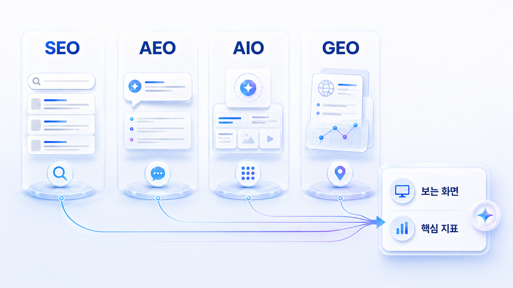

## GEO/SEO/AEO/AIO/LLMO 차이

GEO, SEO, AEO, AIO, LLMO는 모두 검색 최적화와 연결되지만 같은 말은 아닙니다. SEO는 검색 결과 페이지에서 노출과 클릭을 높이는 일이고, AEO는 질문형 답변에 선택되도록 콘텐츠를 정리하는 일입니다. AIO는 Google AI Overviews처럼 검색 결과 안의 AI 요약 영역을 봅니다. LLMO와 LLM SEO는 대형 언어모델 기반 답변 환경을 강조합니다. GEO는 이 흐름을 묶어 AI 검색에서 브랜드가 언급/인용/추천/비교되는 전체 과정을 관리합니다.

실무에서는 용어보다 `무엇을 측정하고 무엇을 고칠 것인가`가 더 중요합니다. 같은 schema 작업이라도 SEO에서는 검색 노출을 돕는 구조화 데이터이고, AIO에서는 AI Overviews 인용 가능성을 높이는 단서이며, GEO에서는 AI가 브랜드와 콘텐츠를 일관되게 이해하게 만드는 신호가 됩니다.

HaloX의 [GEO vs SEO vs AEO 비교 글](https://haloxlabs.ai/ko/blog/geo-vs-seo-vs-aeo)을 함께 보면 개념 경계를 빠르게 잡을 수 있습니다.

## 한눈에 비교하기

| 구분 | 주로 보는 화면 | 핵심 질문 | 주로 보는 지표 |
|---|---|---|---|
| SEO | SERP/검색 결과 페이지 | 검색 결과에서 잘 보이고 클릭되는가 | 순위, 클릭률, 유입, 전환 |
| AEO | 답변 박스/추천 스니펫/FAQ | 질문에 대한 직접 답으로 선택되는가 | 답변 채택, 스니펫, FAQ 구조 |
| AIO | Google AI Overviews 같은 SERP 내 AI 요약 | AI 요약 영역에 포함되고 인용되는가 | AI Overviews 노출, 화면 인용 링크, 검색 TOP10 교차율 |
| GEO | ChatGPT/Perplexity/Gemini 등 답변형 환경 | AI 답변에서 브랜드가 어떻게 검토되는가 | mention, 답변 근거(source), 화면 인용(citation), 비교 문맥, 추천 이유 |
| LLMO/LLM SEO | LLM 기반 답변 시스템 전반 | LLM이 브랜드와 콘텐츠를 일관되게 읽는가 | LLM 인용, 브랜드 언급, 출처 신뢰도, 엔터티 일관성 |

## 흐름으로 이해하기

검색 최적화의 흐름은 `SEO = 검색 결과에서 발견되는 문제` → `AEO = 질문에 대한 직접 답으로 선택되는 문제` → `AIO = 검색 결과 안의 AI 요약에 포함되는 문제` → `GEO = AI 답변 시장에서 브랜드가 선택되는 문제`로 확장됩니다.

이 책에서는 실무자가 이해하기 쉬운 기준으로 GEO를 중심 용어로 사용합니다. 다만 사용자가 실제로 검색하는 표현에는 AI 검색 최적화, LLM SEO, LLMO, AIO도 포함되기 때문에 필요한 곳에서는 함께 설명합니다.

## 왜 구분이 필요한가

용어를 구분하지 않으면 실행 과제가 섞입니다. 예를 들어 `FAQ를 넣자`는 말은 SEO/AEO/AIO/GEO 모두에서 나올 수 있습니다. 하지만 목적은 다릅니다.

- SEO 관점: 검색 결과에서 문서 이해와 노출을 돕습니다.
- AEO 관점: 질문에 대한 짧은 답으로 선택될 가능성을 높입니다.
- AIO 관점: Google AI Overviews의 요약과 인용에 포함될 가능성을 봅니다.
- GEO 관점: ChatGPT/Perplexity/Gemini 답변에서 브랜드 설명과 비교 문맥이 좋아지는지 봅니다.

AI Overviews 관련 구조화와 출처 이해는 Google의 [구조화 데이터 소개](https://developers.google.com/search/docs/appearance/structured-data/intro-structured-data)를 함께 참고하면 좋습니다.

## 같은 콘텐츠를 네 관점으로 다시 보면

예를 들어 `GEO 분석 도구`라는 주제를 다룬다고 해보겠습니다. SEO 관점에서는 이 키워드에서 검색 결과에 잘 노출되는지 봅니다. AEO 관점에서는 `GEO 분석 도구란 무엇인가?`라는 질문에 짧고 정확한 답이 선택될 수 있는지 봅니다. AIO 관점에서는 Google AI Overviews 같은 AI 요약 영역에 글이 인용될 가능성을 봅니다.

GEO 관점은 한 단계 더 넓습니다. `B2B SaaS 팀이 쓸 만한 GEO 도구는?`, `SEO 도구와 GEO 도구는 무엇이 다른가?`, `AI 검색 모니터링 리포트는 어떻게 검증하나?`처럼 비교/추천/검증 질문에서 브랜드가 후보로 등장하고, 그 이유가 신뢰할 만한 답변 근거와 화면 인용으로 설명되는지를 함께 봅니다.

## 실습 워크시트

| 입력 항목 | 작성 기준 |
|---|---|
| 용어 | SEO/AEO/AIO/GEO 중 하나 |
| 보는 화면 | 검색 결과/답변 박스/AI Overviews/AI 답변 환경 |
| 핵심 지표 | 순위/답변 채택/citation/mention 등 |
| 우리 과제 | 현재 팀이 해야 할 실행 과제 |
| 주의점 | 다른 용어와 섞기 쉬운 부분 |

## 작성 예시

| 입력 항목 | 작성 예시 |
|---|---|
| SEO | 검색 결과에서 AcmeGEO 블로그가 노출되고 클릭되는지 본다 |
| AEO | GEO란 무엇인가 질문에 짧은 답변 블록으로 선택되는지 본다 |
| AIO | Google AI Overviews에 AcmeGEO 콘텐츠가 인용되는지 본다 |
| GEO | ChatGPT/Perplexity/Gemini 답변에서 AcmeGEO가 추천/비교/인용되는지 본다 |
| 우선 과제 | GEO와 AIO를 분리해 AI 답변 질문셋을 먼저 만든다 |

## 완료 기준

- SEO/AEO/AIO/GEO를 같은 표에서 구분할 수 있습니다.
- 지금 해야 할 일이 콘텐츠 구조화인지, 출처 보강인지, 측정 리포트인지 나눌 수 있습니다.
- 다음 페이지에서 기존 검색과 AI 검색의 차이를 설명할 기준이 생깁니다.

## 다음에 읽을 글

다음은 [00-03. AI 검색은 기존 검색과 무엇이 다른가](https://wikidocs.net/346310)입니다.
