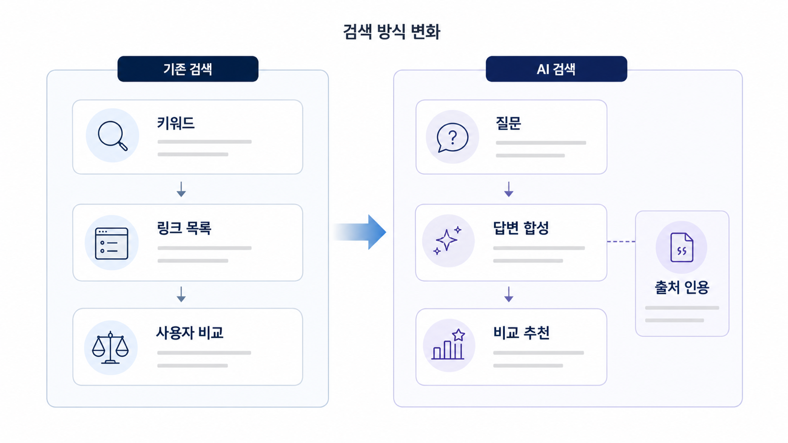

## AI 검색 최적화가 기존 SEO와 달라지는 지점

AI 검색에서는 검색 결과 페이지보다 답변 안에서 어떤 브랜드가 언급되고, 어떤 출처가 근거로 쓰이고, 어떤 링크가 화면 인용으로 드러나는지를 봐야 합니다. 사용자가 링크 목록을 직접 비교하기 전에 AI가 먼저 후보를 좁히고 이유를 설명하기 때문입니다.

이 변화 때문에 브랜드는 특정 키워드에서 1위를 차지하는 것만으로 충분하지 않습니다. 사용자가 `어떤 도구가 좋을까`, `A와 B를 비교해줘`, `우리 회사에 맞는 선택지를 추천해줘`라고 물을 때 답변 안에 들어가야 합니다. 이 차이는 뒤에서 [02장 AI 검색 모니터링](https://wikidocs.net/346342)으로 다시 측정합니다.

[TOC]

## 검색 결과 목록에서 답변 합성으로

기존 검색에서는 사용자가 키워드를 입력하고, 검색엔진이 링크 목록을 보여주며, 사용자가 직접 여러 페이지를 열어 비교했습니다. 그래서 SEO는 순위, 클릭률, 랜딩 페이지 전환을 중심으로 성과를 봤습니다.

AI 검색에서는 사용자가 조건이 들어간 질문을 던지고, AI가 여러 답변 근거를 읽어 하나의 답변으로 합성합니다. 사용자는 링크를 누르기 전에 이미 추천 후보, 제외 이유, 비교 기준을 보게 됩니다. 클릭이 줄어도 브랜드 판단은 답변 안에서 먼저 일어날 수 있습니다.

그래서 GEO에서는 `상위 노출되었는가`뿐 아니라 `어떤 질문에서 언급되었는가`, `추천 이유가 무엇인가`, `화면 인용이 붙었는가`, `경쟁사와 어떤 맥락에서 비교되었는가`를 함께 봐야 합니다.

## AI 답변은 대략 어떤 흐름으로 만들어진다고 봐야 하나

플랫폼마다 내부 구현은 다르지만, 콘텐츠 설계 관점에서는 아래 흐름으로 이해하면 실무 판단이 쉬워집니다.

| 단계 | AI 검색에서 일어나는 일 | 브랜드가 준비해야 할 것 |
|---|---|---|
| 질문 해석 | 사용자의 짧은 질문을 비교/추천/검증/구매 의도로 나눔 | 키워드가 아니라 질문셋과 의도 유형을 준비 |
| 후보 탐색 | 웹 문서, 공식 사이트, 외부 출처, 기존 지식에서 후보를 찾음 | 공식 페이지, 블로그, 뉴스룸, 디렉터리, 리뷰의 일관된 설명 |
| 근거 판단 | 어떤 문서가 답변 근거(source)가 될 만한지 평가 | 정의, 표, FAQ, 비교 기준, 최신성, 저자/조직 정보 |
| 답변 합성 | 여러 근거를 하나의 답변으로 압축 | answer-first 구조와 명확한 카테고리/차별점 |
| 화면 인용 | 일부 출처가 사용자 화면에 링크로 노출 | 대표 URL, canonical, 인용 가능한 문단/표/FAQ |
| 비교/추천 | 브랜드가 후보로 들어가거나 제외됨 | 경쟁사 대비 포지션, 사용 대상, 가격/기능/리스크 설명 |

이 흐름은 “AI 내부가 반드시 이렇게 작동한다”는 단정이 아닙니다. 실무자가 콘텐츠/출처/기술 점검을 할 때 놓치기 쉬운 지점을 나누는 작업 모델입니다.

## AI 검색에서 새로 중요해지는 것

| 새 기준 | 의미 | 나중에 연결되는 장 |
|---|---|---|
| 질문/프롬프트 단위 노출 | 키워드가 아니라 사용자의 실제 질문에서 보이는가 | [01장](https://wikidocs.net/346312) |
| 브랜드와 경쟁사의 동시 언급 | 비교/추천 문맥에 들어가는가 | [02장](https://wikidocs.net/346342) |
| 선택 이유와 제외 이유 | 왜 추천되거나 빠지는지 설명되는가 | [03장](https://wikidocs.net/346343) |
| 답변 근거(source) | AI가 어떤 정보를 근거로 삼는가 | [05장](https://wikidocs.net/346333) |
| 화면 인용(citation) | 사용자가 볼 수 있는 출처 링크가 붙는가 | [05-01](https://wikidocs.net/346350) |
| 엔티티 일관성 | 브랜드/제품/카테고리 설명이 흔들리지 않는가 | [05-02](https://wikidocs.net/346351) |

## 왜 검색 방식이 달라졌나

기존 검색은 사용자가 여러 문서를 직접 비교하도록 목록을 보여줍니다. 반면 AI 검색은 여러 출처를 읽은 뒤 하나의 답변으로 압축합니다. 그래서 브랜드는 `상위 노출`뿐 아니라 답변 안에서 어떤 역할로 등장하는지 봐야 합니다.

이 차이 때문에 GEO에서는 세 가지가 중요해집니다. 첫째, AI가 답변을 만들 때 이해하기 쉬운 구조가 필요합니다. 둘째, 한 문서가 아니라 여러 출처가 같은 설명을 반복해야 합니다. 셋째, 사용자가 클릭하기 전에도 브랜드가 비교/추천/검증 문맥에 들어가야 합니다.

검색 엔진이 문서를 발견하고 이해하는 기본 방식은 Google Search Central의 [검색 작동 방식](https://developers.google.com/search/docs/fundamentals/how-search-works)에서 확인할 수 있습니다. GEO는 이 기반 위에 AI 답변의 요약/선택/출처 결합 문제를 더해 보는 관점입니다.

## 실습 워크시트

| 입력 항목 | 작성 기준 |
|---|---|
| 기존 검색 행동 | 사용자가 검색창에 넣던 짧은 키워드 |
| AI 검색 질문 | 조건과 맥락이 붙은 질문 |
| AI 답변에 필요한 정보 | 정의/비교/근거/실행 절차 |
| 브랜드 위험 | 답변에서 빠지거나 잘못 설명될 지점 |
| 측정 액션 | 02장에서 확인할 지표 |

## 적용 예시

| 입력 항목 | 적용 예시 |
|---|---|
| 기존 검색 행동 | GEO 도구 |
| AI 검색 질문 | B2B SaaS 마케팅팀이 쓸 만한 GEO 모니터링 도구를 추천해줘 |
| AI 답변에 필요한 정보 | 지원 모델, 화면 인용 측정, 경쟁사 비교, 리포트 예시 |
| 브랜드 위험 | AcmeGEO가 후보군에 없거나 SEO 도구로만 설명될 수 있음 |
| 측정 액션 | 추천형 질문 10개에서 mention, 답변 근거(source), 화면 인용(citation)을 확인한다 |

## 완료 기준

- 기존 검색과 AI 답변의 차이를 설명할 수 있습니다.
- 키워드를 AI 질문으로 바꿔야 하는 이유를 이해합니다.
- 02장에서 확인할 대표 질문과 위험 가설이 남습니다.

## HaloX로 이어지는 지점

AI 검색 차이를 더 넓게 보고 싶다면 HaloX의 [GEO/SEO/AEO 비교 글](https://haloxlabs.ai/ko/blog/geo-vs-seo-vs-aeo)을 함께 읽으면 좋습니다. 브랜드 가시성을 점수와 리포트로 보고 싶다면 [AVI 점수 가이드](https://haloxlabs.ai/ko/blog/avi-score-explained)도 연결됩니다.

## 다음에 읽을 글

다음은 [00-04. 이 책을 읽고 실무에 적용하는 법](https://wikidocs.net/346311)입니다.
