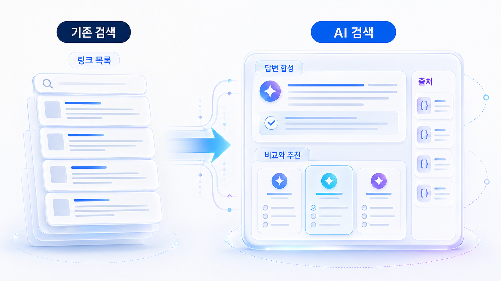

## AI 검색은 기존 검색과 무엇이 다른가



AI 검색에서는 검색 결과 페이지보다 답변 안에서 어떤 브랜드가 언급되고 인용되는지가 중요합니다. 이 차이는 뒤에서 [AI 검색 모니터링: 브랜드 언급률, 답변 근거, 화면 인용 읽는 법](https://wikidocs.net/346342)으로 다시 측정합니다.

이 변화 때문에 브랜드는 단순히 특정 키워드에서 1위를 차지하는 것만으로 충분하지 않습니다. 사용자가 “어떤 도구가 좋을까”, “A와 B를 비교해줘”, “우리 회사에 맞는 선택지를 추천해줘”라고 물을 때 답변 안에 들어가야 합니다.

## AI 검색에서 새로 중요해지는 것

- 질문/프롬프트 단위의 노출
- 브랜드와 경쟁사의 동시 언급
- 선택 이유와 제외 이유
- 답변의 근거가 된 source
- 사용자가 볼 수 있는 citation
- 카테고리와 브랜드 설명의 일관성

## 운영 관점의 변화

SEO에서는 키워드 목록이 출발점이었습니다. GEO에서는 키워드를 독자/고객 질문, 비교 질문, 추천 질문, 검증 질문으로 바꾸는 일이 출발점입니다. 이 전환이 1장의 핵심입니다.

## 사례로 이해하기

기존 검색에서는 사용자가 링크 목록을 보고 직접 비교했습니다. AI 검색에서는 답변이 이미 후보를 좁히고 추천 이유까지 말하기 때문에 브랜드가 답변 안에 들어가는지가 중요합니다.

## 왜 검색 방식이 달라졌나

기존 검색은 사용자가 여러 문서를 직접 비교하도록 목록을 보여줍니다. 반면 AI 검색은 여러 출처를 읽은 뒤 하나의 답변으로 압축합니다. 그래서 브랜드는 “상위 노출”뿐 아니라 답변 안에서 어떤 역할로 등장하는지 봐야 합니다.

이 차이 때문에 GEO에서는 세 가지가 중요해집니다. 첫째, AI가 답변을 만들 때 이해하기 쉬운 구조가 필요합니다. 둘째, 한 문서가 아니라 여러 출처가 같은 설명을 반복해야 합니다. 셋째, 사용자가 클릭하기 전에도 브랜드가 비교/추천/검증 문맥에 들어가야 합니다.

참고로 검색 엔진이 문서를 발견하고 이해하는 기본 방식은 Google Search Central의 [검색 작동 방식](https://developers.google.com/search/docs/fundamentals/how-search-works)에서 확인할 수 있습니다. GEO는 이 기반 위에 AI 답변의 요약/선택/출처 결합 문제를 더해 보는 관점입니다.

## 검색 결과 목록에서 답변 합성으로

기존 검색에서는 사용자가 키워드를 입력하고, 검색엔진이 링크 목록을 보여주며, 사용자가 직접 여러 페이지를 열어 비교했습니다. 그래서 SEO는 순위, 클릭률, 랜딩 페이지 전환을 중심으로 성과를 봤습니다.

AI 검색에서는 사용자가 조건이 들어간 질문을 던지고, AI가 여러 답변 근거를 읽어 하나의 답변으로 합성합니다. 사용자는 링크를 누르기 전에 이미 추천 후보, 제외 이유, 비교 기준을 보게 됩니다. 클릭이 줄어도 브랜드 판단은 답변 안에서 먼저 일어날 수 있습니다.

그래서 GEO에서는 `상위 노출되었는가`뿐 아니라 `어떤 질문에서 언급되었는가`, `추천 이유가 무엇인가`, `화면 인용이 붙었는가`, `경쟁사와 어떤 맥락에서 비교되었는가`를 함께 봐야 합니다.

## 실습 워크시트

| 입력 항목 | 작성 기준 |
|---|---|
| 기존 검색 행동 | 사용자가 검색창에 넣던 짧은 키워드 |
| AI 검색 질문 | 조건과 맥락이 붙은 질문 |
| AI 답변에 필요한 정보 | 정의/비교/근거/실행 절차 |
| 브랜드 위험 | 답변에서 빠지거나 잘못 설명될 지점 |
| 측정 액션 | 02장에서 확인할 지표 |

## 정리 양식

```text
기존 검색 키워드 5개 / AI 질문 5개 / 답변에 필요한 정보 / 브랜드 위험 / 측정 액션
```

## 작성 예시

이 예시는 개념을 실제 운영 언어로 바꿔 보는 용도입니다. 그대로 베끼기보다 자기 브랜드의 질문, 페이지, 출처 후보로 바꿔 적습니다.

| 입력 항목 | 작성 예시 |
|---|---|
| 기존 검색 행동 | GEO 도구 |
| AI 검색 질문 | B2B SaaS 마케팅팀이 쓸 만한 GEO 모니터링 도구를 추천해줘 |
| AI 답변에 필요한 정보 | 지원 모델, 화면 인용 측정, 경쟁사 비교, 리포트 예시 |
| 브랜드 위험 | AcmeGEO가 후보군에 없거나 SEO 도구로만 설명될 수 있음 |
| 측정 액션 | 추천형 질문 10개에서 mention, 답변 근거(source), 화면 인용(citation)을 확인한다 |

## 완료 기준

- 기존 검색과 AI 답변의 차이를 설명할 수 있습니다.
- 클릭 전환이 아니라 답변 안의 선택/비교/인용을 볼 수 있습니다.
- AI 검색에서 확인할 대표 질문이 남습니다.

## HaloX로 이어지는 지점

AI 검색 차이를 더 넓게 보고 싶다면 HaloX의 [GEO/SEO/AEO 비교 글](https://haloxlabs.ai/ko/blog/geo-vs-seo-vs-aeo)을 함께 읽으면 좋습니다. 이 페이지가 개념 차이를 짚는다면, HaloX 글은 그 차이가 실제 검색 최적화 전략으로 어떻게 바뀌는지 보여줍니다.

## 다음에 읽을 글

다음은 [이 책을 읽고 실무에 적용하는 법](https://wikidocs.net/346311)입니다.
