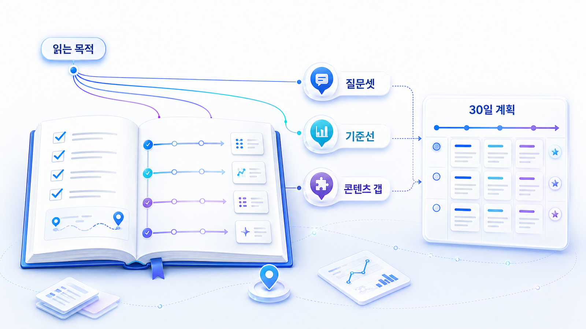

## GEO 워크플로우: 이 책을 실무에 적용하는 법

이 책은 GEO를 처음 이해하는 독자가 자기 브랜드의 AI 검색 상태를 진단하고, 콘텐츠/출처/기술 개선 과제로 옮길 수 있도록 만든 실전 교과서입니다. 처음부터 모든 장을 순서대로 읽기보다, GEO 워크플로우를 먼저 보고 지금 단계에서 남겨야 할 산출물을 고르는 방식이 좋습니다.

가장 기본 흐름은 `개념 이해 → 질문셋 만들기 → 기준선 측정 → 콘텐츠/출처/기술 개선 → 4주 실행 리포트`입니다. 이 순서를 따라가면 GEO가 막연한 유행어가 아니라 실제 운영 프로세스로 바뀝니다.

실무자는 먼저 [02장 AI 검색 모니터링](https://wikidocs.net/346342)에서 기준선을 잡고, 4주 흐름으로 따라가고 싶다면 [10장 GEO 워크플로우: 4주 실행 로드맵과 리포트](https://wikidocs.net/346338)를 읽으면 됩니다.

[TOC]

## GEO 워크플로우 한눈에 보기

GEO는 “좋은 글을 더 쓰는 일” 하나로 끝나지 않습니다. 질문을 만들고, 현재 답변 상태를 측정하고, AI가 답변을 만들 때 필요한 재료를 보강한 뒤, 같은 질문으로 다시 확인하는 반복 절차입니다.

| 단계 | 핵심 질문 | 연결 장 | 남길 산출물 |
|---|---|---|---|
| 1. 질문셋 설계 | 사용자는 AI에게 어떤 조건으로 물어보는가? | [01장](https://wikidocs.net/346312) | SEO 키워드 10개, AI 질문 30개 |
| 2. 기준선 측정 | 지금 우리 브랜드는 어떤 질문에서 언급/인용되는가? | [02장](https://wikidocs.net/346342) | mention/source/citation 기록표 |
| 3. Fan-out 진단 | AI는 한 질문을 어떤 하위 판단으로 쪼개는가? | [03장](https://wikidocs.net/346343) | Fan-out 질문맵, 콘텐츠 갭 목록 |
| 4. 콘텐츠 개선 | 어떤 페이지를 어떤 답변 구조로 고쳐야 하는가? | [04장](https://wikidocs.net/346332) | Answer-first 리라이트 후보, FAQ/표/schema 점검 |
| 5. 출처/엔터티 보강 | AI가 믿을 만한 근거와 브랜드 합의 신호는 충분한가? | [05장](https://wikidocs.net/346333) | source 후보 맵, 엔터티/오프사이트 운영표 |
| 6. 기술 점검 | 크롤러가 페이지를 발견하고 읽고 해석할 수 있는가? | [06장](https://wikidocs.net/346334) | robots/sitemap/schema/canonical 점검표 |
| 7. 실행 리포트 | 무엇을 고쳤고 다음 30일에 무엇을 다시 볼 것인가? | [09장](https://wikidocs.net/346337) / [10장](https://wikidocs.net/346338) | GEO 리포트, 30일 액션 플랜, 재측정 기준 |

각 장은 이 순서의 한 칸을 맡습니다. 그래서 독자가 “GEO 워크플로우는 어떻게 하느냐”고 물으면, 이 책의 답은 `질문셋 → 기준선 → Fan-out/갭 → 콘텐츠/source/기술 개선 → 리포트/재측정`입니다.

## 계속 나오는 핵심 용어

이 책은 SEO 독자가 GEO를 따라올 수 있도록 몇 가지 용어를 반복해서 씁니다. 처음에는 아래 기준만 잡고 읽어도 충분합니다. 다만 용어를 외우는 것보다 `이 용어가 어떤 의사결정을 돕는가`를 함께 봐야 합니다.

| 용어 | 이 책에서의 의미 | 왜 중요한가 |
|---|---|---|
| GEO | AI 답변 환경에서 브랜드가 언급/인용/추천/비교되도록 만드는 최적화 | 검색 결과 순위가 아니라 답변 안의 판단을 봅니다 |
| Mention | AI 답변 안에서 브랜드나 제품이 언급되는 상태 | 보이기 시작했는지 확인하는 첫 지표입니다 |
| 답변 근거(source) | AI가 답변을 만들 때 참고할 수 있는 정보 재료 | 공식 문서, 블로그, 리뷰, 뉴스룸이 여기에 들어갑니다 |
| 화면 인용(citation) | 사용자 화면에 링크나 출처로 드러나는 인용 | 답변 신뢰와 유입 경로를 함께 보여줍니다 |
| 엔터티(entity) | AI가 이해하는 브랜드/조직/제품의 정체성 | 카테고리, 기능, 고객, 비교 대상이 흔들리지 않아야 합니다 |
| Fan-out | 하나의 질문이 여러 하위 질문으로 펼쳐지는 현상 | 실제 AI 답변은 정의, 비교, 추천, 검증을 함께 봅니다 |
| 기준선 | 개선 전 현재 상태를 같은 기준으로 기록한 값 | 4주 뒤 변화가 개선인지 우연인지 판단하게 해줍니다 |

## 먼저 골라야 할 진단 모드

처음부터 모든 장을 읽기보다 지금 문제를 하나 고르는 편이 좋습니다. 문제 유형이 달라지면 먼저 봐야 할 장도 달라집니다.

| 현재 증상 | 먼저 의심할 원인 | 먼저 볼 장 |
|---|---|---|
| 검색 유입은 있는데 AI 답변에 브랜드가 안 나옴 | 질문셋/비교 문맥/외부 출처 부족 | 01장/02장/05장 |
| 브랜드는 언급되지만 링크가 안 붙음 | 답변 근거(source)와 화면 인용(citation) 후보 부족 | 02장/05장 |
| AI가 브랜드를 잘못 설명함 | 엔터티 합의 신호와 공식 설명 불일치 | 05장/06장 |
| 콘텐츠는 많은데 어떤 글을 고쳐야 할지 모름 | 질문 유형별 콘텐츠 갭 미정리 | 03장/04장 |
| 개발팀에 무엇을 요청할지 모르겠음 | robots/sitemap/schema/렌더링/canonical 점검 미분리 | 06장 |
| 대행사나 도구 제안이 맞는지 판단이 어려움 | 리포트 기준과 실행 범위가 불명확 | 09장/10장 |

## 읽는 목적별 추천 흐름

| 목적 | 먼저 읽을 장 | 남길 산출물 |
|---|---|---|
| GEO 개념 이해 | 00장 → 01장 → 02장 | GEO/SEO/AEO/AIO/LLMO 차이, 측정 지표 메모 |
| 브랜드 진단 | 01장 → 02장 → 03장 | 질문셋, 기준선 진단표, 콘텐츠 갭 목록 |
| 콘텐츠 개선 | 03장 → 04장 → 05장 | 리라이트 후보, 답변 근거(source)와 화면 인용(citation) 보강 목록 |
| 사이트 점검 | 06장 중심 | robots/sitemap/schema/llms.txt 점검표 |
| 리포트/도구/파트너 검증 | 09장 중심 | GEO 리포트와 실행 검증표 |
| GEO 워크플로우 전체 실행 | 10장 중심 | 주차별 산출물, GEO 리포트, 30일 액션 플랜 |
| 산업별 적용 | 07장/11장/12장/90장 | 업종별 질문셋과 사례 적용표 |

## 4주 강의/워크숍으로 쓰는 법

이 책을 강의나 내부 워크숍으로 활용한다면 10장을 중심축으로 두고 앞 장을 필요한 만큼 끌어오면 됩니다.

| 주차 | 학습 목표 | 연결 장 | 산출물 |
|---|---|---|---|
| 1주차 | GEO 개념과 기준선 진단 | 00장/01장/02장 | 대표 질문셋, mention/source/citation 기준선 |
| 2주차 | Fan-out 질문맵과 콘텐츠 갭 찾기 | 03장/04장 | 질문 유형 포트폴리오, 리라이트 후보 |
| 3주차 | 콘텐츠 리라이트와 출처 설계 | 04장/05장/06장 | Answer-first 본문, 출처 후보 맵, 기술 점검표 |
| 4주차 | 리포트와 30일 액션 플랜 | 09장/10장/91장 | GEO 실행 리포트, 다음 30일 실행안 |

이 구조를 쓰면 책은 읽을거리에서 끝나지 않고, 실제 브랜드 진단과 콘텐츠 실행을 위한 수업 자료가 됩니다.

## 모든 표를 다 채우지 않아도 됩니다

이 책의 표와 양식은 독자가 자기 상황을 정리하기 위한 도구입니다. 개념을 이해하는 단계라면 표를 모두 채우지 않아도 됩니다. 반대로 실제 브랜드 진단을 해야 한다면 질문셋, 기준선, 콘텐츠 갭, 답변 근거 맵처럼 다음 행동을 정하는 표를 우선 채우는 편이 좋습니다.

중요한 것은 표의 완성이 아니라 판단의 선명함입니다. `무엇이 부족한가`, `어떤 질문에서 빠지는가`, `어떤 출처가 약한가`, `다음 30일 동안 무엇을 고칠 것인가`를 설명할 수 있으면 충분합니다.

## HaloX 자료를 함께 보는 법

이 WikiDocs는 GEO 개념과 실행 순서를 정리하고, HaloX는 AI 검색 모니터링과 브랜드 가시성 분석을 실제로 확인하는 흐름을 제공합니다. 개념을 더 읽고 싶다면 [HaloX GEO 블로그](https://haloxlabs.ai/ko/blog)를, 용어가 헷갈리면 [HaloX 용어집](https://haloxlabs.ai/ko/glossary)을 함께 보면 좋습니다.

특히 실습표가 단순 체크리스트로 느껴질 때는 Google의 [유용한 콘텐츠 만들기](https://developers.google.com/search/docs/fundamentals/creating-helpful-content)를 함께 참고합니다. 독자에게 실제 도움이 되는 정보인지 확인하는 기준이 됩니다.

## 다음에 읽을 글

다음 장은 [01. SEO 기본기와 GEO 확장 전략](https://wikidocs.net/346312)입니다. 바로 실행 흐름으로 가고 싶다면 [10장 GEO 워크플로우: 4주 실행 로드맵과 리포트](https://wikidocs.net/346338)로 이동해도 됩니다.
