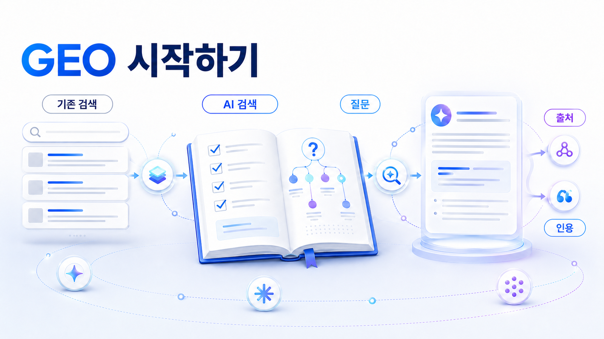

## GEO를 처음 이해하는 사람을 위한 시작

생성형 엔진 최적화(GEO)는 ChatGPT, Perplexity, Gemini, Google AI Overviews 같은 AI 검색에서 브랜드와 콘텐츠가 답변 안에 어떻게 발견되고, 설명되고, 인용되는지를 다루는 전략입니다. SEO가 검색 결과 페이지의 노출과 클릭을 다뤘다면, GEO는 AI가 답변을 만들 때 어떤 브랜드를 선택지로 올리고 어떤 출처를 근거로 삼는지까지 봅니다.

00장은 GEO를 처음 접하는 독자가 개념의 경계를 잡고, 이후 장의 실습을 따라갈 수 있게 만드는 입구입니다. 단순히 용어를 외우는 장이 아니라 `우리 브랜드가 AI 답변에서 어떻게 보이는가`라는 질문으로 넘어가기 위한 준비 단계입니다.

GEO 개념을 더 넓게 보고 싶다면 HaloX의 [GEO란? AI 검색 시대의 콘텐츠 전략 완전 가이드](https://haloxlabs.ai/ko/blog/what-is-geo-optimization)를 함께 읽으면 좋습니다. 이 책은 그 개념을 질문셋, 기준선 진단, 콘텐츠 구조, 답변 근거(source), 화면 인용(citation), 4주 실행 로드맵으로 풀어갑니다.

## 이 장이 맡는 역할

처음 GEO를 배우는 사람에게 가장 위험한 오해는 `AI에게 인용되는 글을 쓰면 된다`로 좁게 이해하는 것입니다. 실제 GEO 운영은 글쓰기보다 넓습니다. 질문 설계, 브랜드 엔터티, 답변 근거, 화면 인용, 경쟁사 비교 문맥, 기술 접근성, 외부 출처 신뢰도를 함께 봐야 합니다.

이 장에서는 GEO를 `검색 순위의 대체재`가 아니라 `AI 답변 시장에서 브랜드가 어떻게 검토되는지 관리하는 일`로 잡습니다. 검색 결과 1위가 되더라도 AI 답변에서 빠질 수 있고, 반대로 검색 유입은 적어도 특정 비교/추천 질문에서 강하게 언급될 수 있습니다. 그래서 00장의 목표는 용어 암기가 아니라, 이후 장에서 쓸 공통 판단 언어를 만드는 것입니다.

## AI 검색 환경을 먼저 구분하기

GEO를 제대로 이해하려면 “AI 검색”을 하나로 뭉뚱그리지 않아야 합니다. 화면과 답변 방식이 다르면 측정해야 할 지표도 달라집니다.

| 환경 | 사용자가 보는 것 | GEO에서 먼저 볼 질문 |
|---|---|---|
| Google 검색/SERP | 링크 목록, 스니펫, 리치 리절트 | 검색엔진이 우리 페이지를 발견/색인/이해하는가 |
| Google AI Overviews/AI 기능 | 검색 결과 안의 AI 요약과 인용 링크 | AI 요약에 포함될 만한 신뢰 가능한 답변 근거가 있는가 |
| Perplexity | 답변과 출처 링크가 함께 보이는 검색형 답변 | 어떤 페이지가 화면 인용(citation)으로 드러나는가 |
| ChatGPT/Gemini 같은 대화형 AI | 링크보다 답변/비교/추천 문장이 먼저 보임 | 브랜드가 어떤 이유로 언급/제외/추천되는가 |
| AI 브리핑/리포트 | 여러 질문의 결과를 모아 보는 분석 화면 | 단발 언급이 아니라 반복적으로 보이는가 |

Google Search Central은 검색이 크롤링, 색인 생성, 검색 결과 제공의 과정을 거친다고 설명합니다. GEO는 이 기본 검색 구조 위에 `답변 합성`, `브랜드 후보 선택`, `출처 결합`, `화면 인용`이라는 층을 더해서 봅니다.

그래서 00장은 다음 네 가지 질문에 답합니다.

| 질문 | 연결 페이지 | 남길 산출물 |
|---|---|---|
| GEO란 무엇인가? | [00-01](https://wikidocs.net/346308) | GEO 한 문장 정의 |
| SEO/AEO/AIO/LLMO와 무엇이 다른가? | [00-02](https://wikidocs.net/346309) | 용어 비교표 |
| AI 검색은 기존 검색과 무엇이 다른가? | [00-03](https://wikidocs.net/346310) | 기존 키워드와 AI 질문의 차이 |
| 이 책을 어떻게 실무에 적용할까? | [00-04](https://wikidocs.net/346311) | 읽는 목적별 실행 순서 |

## 00장에서 먼저 남길 판단 질문

4주 흐름으로 이 책을 활용한다면 00장은 오리엔테이션에 해당합니다. 여기서 개념을 완벽하게 끝내기보다, 이후 실습에 필요한 최소 언어를 맞추는 것이 중요합니다.

1. GEO를 한 문장으로 설명합니다.
2. SEO/AEO/AIO/LLMO와의 차이를 표로 구분합니다.
3. 기존 검색 키워드 3개를 AI 질문 3개로 바꿔 봅니다.
4. 검색에서는 보이는데 AI 답변에는 빠질 수 있는 상황을 적습니다.
5. 01장과 02장에서 질문셋과 기준선 진단으로 이어갑니다.

예를 들어 `GEO 도구` 검색 결과에는 노출되지만, `B2B SaaS 팀이 쓸 만한 GEO 도구를 비교해줘`라는 AI 질문에서는 빠질 수 있습니다. 이때 문제는 단순 순위가 아니라 카테고리 설명, 비교 기준, 외부 출처, 리뷰/사례, schema/사이트 구조가 함께 부족한 것일 수 있습니다.

이 흐름을 따라가면 00장은 개념 학습이 아니라 `진단을 시작하기 위한 공통 언어 맞추기`가 됩니다.

## 이 장에서 얻을 것

- GEO 뜻과 생성형 엔진 최적화의 범위를 설명할 수 있습니다.
- GEO/SEO/AEO/AIO/LLMO를 같은 말로 섞지 않고 구분할 수 있습니다.
- 기존 검색의 `순위/클릭`과 AI 검색의 `언급/근거/인용/비교` 차이를 이해할 수 있습니다.
- 1장부터 SEO 키워드를 AI 질문셋으로 바꾸고, 2장에서 브랜드 언급률과 답변 근거를 측정할 준비를 할 수 있습니다.

## HaloX로 이어지는 지점

이 WikiDocs는 GEO를 배우고 정리하는 외부 지식 베이스입니다. HaloX 공식 사이트는 실제 AI 검색 모니터링, 브랜드 가시성 분석, 콘텐츠 실행 흐름으로 이어지는 채널입니다.

개념이 처음이라면 [HaloX GEO 블로그](https://haloxlabs.ai/ko/blog)에서 기본 글을 함께 읽고, 용어가 헷갈리면 [HaloX GEO 용어집](https://haloxlabs.ai/ko/glossary)을 확인합니다. 브랜드 가시성 측정까지 연결하고 싶다면 [AVI 점수 가이드](https://haloxlabs.ai/ko/blog/avi-score-explained)를 같이 보면 좋습니다.

## 다음에 읽을 글

먼저 [00-01. GEO 뜻: 생성형 엔진 최적화란 무엇인가](https://wikidocs.net/346308)로 이동해 GEO를 한 문장으로 설명하는 기준을 잡습니다. 검색 최적화의 기본기를 확인하고 싶다면 Google Search Central의 [SEO 시작 가이드](https://developers.google.com/search/docs/fundamentals/seo-starter-guide)도 함께 참고합니다.
