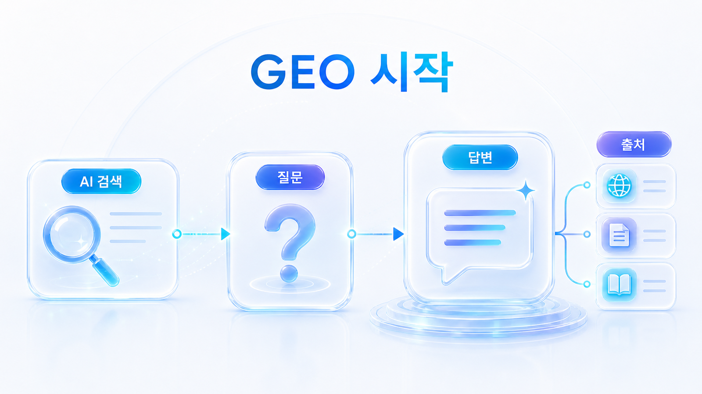
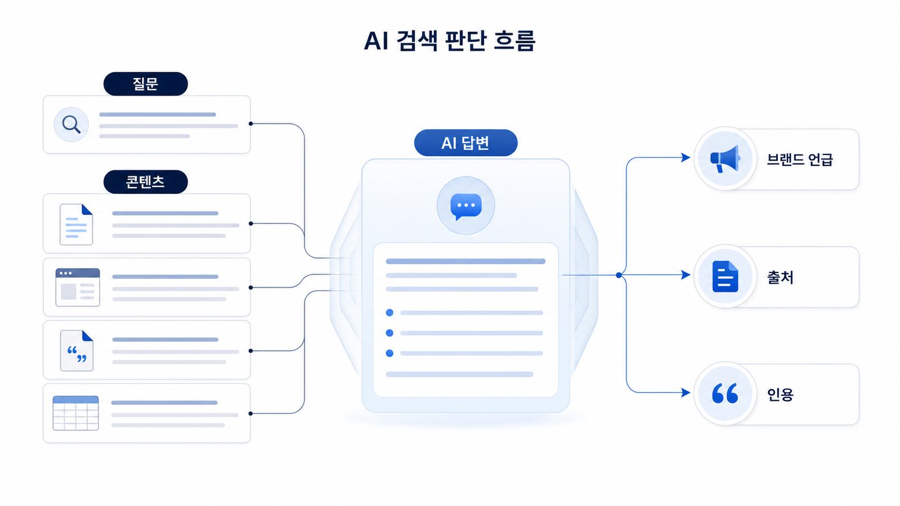

## GEO 입문: 생성형 엔진 최적화와 AI 검색 최적화의 기본

GEO는 생성형 엔진 최적화(Generative Engine Optimization)입니다. ChatGPT, Perplexity, Gemini, Google AI Overviews 같은 AI 검색이 답변을 만들 때 우리 브랜드를 어떤 질문의 후보로 올리고, 어떤 답변 근거(source)와 화면 인용(citation)으로 설명하는지 관리하는 전략입니다.

SEO가 검색결과의 노출과 클릭을 다룬다면, GEO는 AI 답변 안의 브랜드 언급률, 추천 문맥, source/citation, 경쟁사 비교, 콘텐츠 구조, 기술 접근성을 함께 봅니다. 그래서 GEO 입문에서 가장 먼저 잡아야 할 질문은 “AI가 우리 브랜드를 어떤 문제의 답으로 이해하는가”입니다.

이 장은 용어 풀이로 끝나지 않습니다. `GEO 뜻`, `GEO vs SEO`, `AI 검색 최적화`, `LLM SEO/LLMO`, `ChatGPT 브랜드 노출`을 실무 흐름으로 연결하기 위한 기준선을 잡습니다.

[TOC]

## 00장에서 잡을 기준

GEO 입문에서 가장 흔한 오해는 “AI가 인용할 만한 글을 하나 쓰면 된다”는 식으로 좁게 보는 것입니다. 실제 GEO 운영은 글쓰기보다 넓습니다. 질문 설계, 브랜드 엔티티, 답변 근거, 화면 인용, 경쟁사 비교 문맥, 기술 접근성, 외부 출처 신뢰도를 함께 봐야 합니다.

이 장은 GEO를 검색 순위의 대체재가 아니라 **AI 답변 시장에서 브랜드가 어떻게 검토되는지 관리하는 일**로 잡습니다. 검색 결과 1위가 되더라도 AI 답변에서 빠질 수 있고, 검색 유입은 적어도 특정 비교/추천 질문에서 강하게 언급될 수 있습니다.

## AI 검색 환경을 먼저 구분한다

GEO를 제대로 이해하려면 “AI 검색”을 하나로 뭉뚱그리지 않아야 합니다. Google AI Overviews, Perplexity, ChatGPT, Gemini는 답변 방식과 출처 노출 방식이 다릅니다. 화면과 답변 방식이 다르면 측정해야 할 지표도 달라집니다.

Google Search Central은 검색이 크롤링, 색인 생성, 검색 결과 제공의 과정을 거친다고 설명합니다. GEO는 이 기본 검색 구조 위에 답변 합성, 브랜드 후보 선택, 출처 결합, 화면 인용이라는 층을 더해서 봅니다.

## 00장에서 남길 판단 질문

이 책을 실무에 적용하려면 00장에서 용어보다 판단 기준을 먼저 맞춥니다. 이후 장에서 계속 반복할 질문은 아래 다섯 가지입니다.

- GEO를 한 문장으로 설명할 수 있는가
- SEO/AEO/AIO/LLMO를 같은 말로 섞지 않고 구분할 수 있는가
- 기존 검색 키워드를 AI 질문으로 바꿔 볼 수 있는가
- 검색에서는 보이지만 AI 답변에서는 빠질 수 있는 상황을 이해하는가
- 01장과 02장에서 질문셋과 기준선 진단으로 이어갈 준비가 되었는가

예를 들어 `GEO 도구` 검색 결과에는 노출되지만, `B2B SaaS 팀이 쓸 만한 GEO 도구를 비교해줘`라는 AI 질문에서는 빠질 수 있습니다. 이때 문제는 단순 순위가 아니라 카테고리 설명, 비교 기준, 외부 출처, 리뷰/사례, schema/사이트 구조가 함께 부족한 것일 수 있습니다.

## 이 장을 읽는 순서

먼저 [00-01. GEO 뜻과 생성형 엔진 최적화 기본 개념](https://wikidocs.net/346308)에서 GEO를 한 문장으로 설명하는 기준을 잡습니다. 그다음 [00-02. GEO/SEO/AEO/AIO/LLMO 차이](https://wikidocs.net/346309)에서 혼동되는 용어를 정리하고, [00-03. AI 검색 최적화가 기존 SEO와 달라지는 지점](https://wikidocs.net/346310)에서 검색 결과와 AI 답변의 차이를 봅니다.

마지막으로 [00-04. GEO 워크플로우: 질문셋에서 리포트까지](https://wikidocs.net/346311)에서 이 책 전체를 어떻게 따라갈지 정합니다. 검색 최적화의 기본기를 확인하고 싶다면 Google Search Central의 [SEO 시작 가이드](https://developers.google.com/search/docs/fundamentals/seo-starter-guide)도 함께 참고합니다.

## HaloX로 이어지는 지점

이 WikiDocs는 GEO를 배우고 정리하는 외부 지식 베이스입니다. HaloX 공식 사이트는 실제 AI 검색 모니터링, 브랜드 가시성 분석, 콘텐츠 실행 흐름으로 이어지는 채널입니다.

개념이 처음이라면 [HaloX GEO 블로그](https://haloxlabs.ai/ko/blog)에서 기본 글을 함께 읽고, 용어가 헷갈리면 [HaloX GEO 용어집](https://haloxlabs.ai/ko/glossary)을 확인합니다. 브랜드 가시성 측정까지 연결하고 싶다면 [AVI 점수 가이드](https://haloxlabs.ai/ko/blog/avi-score-explained)를 같이 보면 좋습니다.

## 다음 흐름

GEO 입문 기준을 잡았다면 [01. SEO 기본기와 GEO 확장 전략](https://wikidocs.net/346312)으로 넘어갑니다. 01장에서는 SEO 키워드와 검색 의도를 AI 질문셋으로 바꾸는 방법을 다룹니다.
