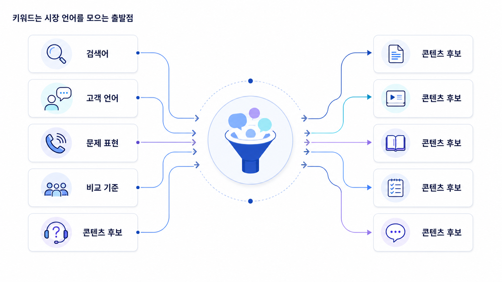

## 키워드 리서치: 검색량이 아니라 시장 언어를 수집하는 일


키워드 리서치는 SEO의 첫 단계입니다. 하지만 키워드 리서치를 `검색량이 높은 단어를 찾는 일`로만 이해하면 이후 모든 단계가 얕아집니다. 실무에서 키워드 리서치는 시장이 어떤 말로 문제를 표현하는지 수집하고, 그 말 속에 담긴 의도와 우선순위를 분류하는 작업입니다.

GEO에서도 키워드 리서치는 여전히 중요합니다. AI 검색에서는 사용자가 긴 문장으로 질문하지만, 그 긴 질문의 출발점은 여전히 짧은 검색어와 시장 언어입니다. `GEO 도구`, `AI 검색 모니터링`, `ChatGPT 브랜드 노출`, `GEO 대행사`, `AI 검색 최적화` 같은 표현을 모아야 나중에 어떤 질문셋을 측정할지 정할 수 있습니다.

[TOC]

## 키워드가 하는 일

키워드는 사용자가 문제를 부르는 이름입니다. 같은 문제라도 사용자는 각자 다른 표현을 씁니다. 전문가는 `생성형 엔진 최적화`라고 말하지만, 실무자는 `ChatGPT에 우리 회사가 나오게 하는 법`이라고 검색할 수 있습니다. 대표는 `AI 검색에서 브랜드가 안 보이는 이유`라고 물을 수 있고, 마케터는 `GEO 리포트 지표`를 찾을 수 있습니다.

이 차이를 모르면 콘텐츠가 내부자 언어에 갇힙니다. 내부자는 멋진 용어를 쓰지만, 시장은 더 불완전하고 구체적인 표현을 씁니다. 키워드 리서치는 이 간극을 줄이는 작업입니다.

SEO에서는 키워드가 페이지 주제, title, heading, 내부 링크, 콘텐츠 우선순위를 정하는 기준이 됩니다. GEO에서는 키워드가 AI 질문셋, fan-out 질문, source/citation 후보, 측정 리포트의 기준 질문으로 확장됩니다.

## 검색량만 보면 왜 위험한가

검색량이 높은 키워드는 매력적으로 보입니다. 하지만 검색량이 높은 키워드가 항상 좋은 출발점은 아닙니다. 너무 넓은 키워드는 의도가 섞여 있고, 경쟁이 높고, 전환과 멀 수 있습니다.

예를 들어 `SEO`라는 키워드는 검색량이 크지만, 이 키워드 하나로는 사용자가 초보자인지, 대행사를 찾는지, 도구를 비교하는지, 기술 문제를 해결하려는지 알 수 없습니다. 반면 `Google Search Console 노출은 높은데 클릭이 낮은 이유` 같은 긴 검색어는 검색량은 작아도 문제 상황이 분명합니다. 이런 롱테일 키워드는 콘텐츠 구조와 실무 액션을 만들기 좋습니다.

좋은 키워드 리서치는 검색량, 난이도, 의도, 전환 가능성, 브랜드 전략을 함께 봅니다. 특히 GEO로 확장하려면 `검색량이 큰 단어`보다 `AI가 답해야 할 질문으로 바꿀 수 있는 단어`가 중요합니다.

## 키워드의 기본 유형

키워드를 모을 때는 처음부터 완벽하게 분류하려고 하지 않아도 됩니다. 다만 최소한 아래 구분은 필요합니다.

| 유형 | 의미 | 예시 | 실무 판단 |
|---|---|---|---|
| 브랜드 키워드 | 우리 브랜드를 이미 아는 검색 | HaloX, AcmeGEO 가격 | 설명 오류와 전환 흐름 점검 |
| 비브랜드 키워드 | 카테고리나 문제 중심 검색 | GEO 도구, AI 검색 최적화 | 신규 수요와 경쟁 문맥 확인 |
| 헤드 키워드 | 짧고 넓은 검색 | GEO, SEO | 개념 허브와 용어 정의에 적합 |
| 롱테일 키워드 | 길고 구체적인 검색 | ChatGPT 브랜드 노출 확인 방법 | 실무 글, FAQ, 체크리스트에 적합 |
| 비교 키워드 | 선택을 앞둔 검색 | GEO 도구 비교, Semrush 대안 | 비교표와 선택 기준 필요 |
| 문제 키워드 | 증상이나 고민 중심 검색 | 검색 노출은 있는데 문의가 없음 | 진단형 콘텐츠 필요 |

이 표는 시작점일 뿐입니다. 중요한 것은 키워드를 수집한 뒤 `이 키워드는 어떤 질문으로 바뀔 수 있는가?`를 계속 묻는 것입니다.

## 키워드 리서치의 입력 소스

키워드는 도구에서만 나오지 않습니다. 실제 실무에서는 검색 도구, 내부 데이터, 고객 대화, 경쟁사 콘텐츠를 함께 봐야 합니다.

Google Search Console은 이미 우리 사이트가 어떤 query에서 노출되고 클릭되는지 보여줍니다. 네이버 서치어드바이저와 네이버 검색결과는 한국어 사용자가 어떤 표현을 쓰는지 확인하는 데 중요합니다. 고객 상담과 영업 미팅은 검색 도구에 아직 잘 잡히지 않는 실제 표현을 알려줍니다. 경쟁사 사이트와 SERP는 시장이 이미 어떤 콘텐츠 구조를 기대하는지 보여줍니다.

콘텐츠팀은 고객이 이해하기 쉬운 표현을 모읍니다. SEO 담당자는 검색량, 노출, 클릭, 경쟁 강도를 봅니다. 세일즈팀은 구매 전 질문과 반박을 제공합니다. 고객지원팀은 사용 중 막히는 표현을 제공합니다. 브랜드팀은 반드시 지켜야 할 공식 용어와 피해야 할 표현을 정리합니다.



## 실무 워크플로우

키워드 리서치는 아래 순서로 진행하면 과하게 복잡해지지 않습니다.

1. 핵심 카테고리 키워드 5~10개를 정합니다.
2. GSC에서 최근 3개월 query를 export합니다.
3. 네이버와 Google에서 자동완성, 관련 검색어, 상위 SERP 표현을 확인합니다.
4. 고객 문의, 영업 상담, 제안서 질문에서 반복 표현을 모읍니다.
5. 경쟁사 페이지의 title, H2, FAQ에서 반복되는 표현을 수집합니다.
6. 키워드를 브랜드/비브랜드, 정보/비교/추천/검증/실행으로 1차 분류합니다.
7. 검색량은 작지만 전환이나 리포트 검증에 중요한 키워드를 따로 표시합니다.
8. 각 키워드를 AI 질문 후보로 바꿉니다.

이때 바로 콘텐츠를 쓰지 않습니다. 키워드는 아직 재료입니다. 다음 단계인 SERP 분석과 검색 의도 분석을 거쳐야 어떤 콘텐츠가 필요한지 판단할 수 있습니다.

## AcmeGEO 예시

AcmeGEO 팀이 처음 모은 키워드는 `GEO 도구` 하나였습니다. 하지만 이 키워드만으로는 콘텐츠를 설계할 수 없습니다. 팀은 GSC, 네이버, 영업 상담, 경쟁사 페이지를 보며 아래 표현을 추가로 모았습니다.

```text
GEO 도구 / AI 검색 모니터링 / ChatGPT 브랜드 노출 / GEO 리포트 / AI visibility / Perplexity SEO / Google AI Overviews 최적화 / GEO 대행사 / GEO 솔루션 / LLM SEO / 브랜드 언급률 / citation 추적 / source 분석
```

이 목록을 보면 단순히 도구를 찾는 사람만 있는 것이 아닙니다. 개념을 알고 싶은 사람, 브랜드 노출을 확인하고 싶은 사람, 리포트를 검증하고 싶은 사람, 대행사를 비교하는 사람, 기술 지표를 이해하려는 사람이 섞여 있습니다.

그래서 AcmeGEO는 키워드를 바로 글 제목으로 바꾸지 않고, 질문으로 확장했습니다.

- `GEO 도구` → B2B SaaS 팀이 GEO 도구를 고를 때 어떤 지표를 봐야 할까?
- `ChatGPT 브랜드 노출` → 우리 브랜드가 ChatGPT 답변에 나오는지 어떻게 확인할까?
- `GEO 리포트` → GEO 리포트에서 mention/source/citation은 어떻게 해석할까?
- `Perplexity SEO` → Perplexity와 Google AI Overviews의 citation은 어떻게 다를까?
- `GEO 대행사` → 대행사 제안서에서 과장된 약속은 어떻게 걸러낼까?

이렇게 바꾸면 키워드 리서치가 단어 목록에서 끝나지 않고, 2장 이후의 AI 검색 모니터링 질문셋으로 이어집니다.

## 키워드 리서치 산출물

최종 산출물은 예쁜 키워드 표가 아니라 다음 단계에서 바로 쓸 수 있는 입력값이어야 합니다.

| 항목 | 작성 내용 |
|---|---|
| 핵심 카테고리 키워드 | 시장을 대표하는 넓은 키워드 |
| 롱테일 키워드 | 실제 문제와 상황이 드러나는 긴 표현 |
| 브랜드/비브랜드 구분 | 이미 아는 사람과 새로 찾는 사람 분리 |
| 의도 추정 | 정보/비교/추천/검증/실행 중 1차 판단 |
| AI 질문 후보 | 키워드를 실제 질문 문장으로 변환 |
| 우선순위 | 검색 수요, 사업 중요도, 콘텐츠 가능성 기준 |
| 담당 팀 | 콘텐츠/SEO/세일즈/브랜드 중 입력 제공자 |

## 흔한 실수

가장 흔한 실수는 검색량 높은 키워드만 보고 콘텐츠를 시작하는 것입니다. 검색량은 중요하지만, 검색량만으로는 사용자의 상황을 설명하지 못합니다. 두 번째 실수는 내부 용어만 모으는 것입니다. 내부에서 쓰는 용어와 고객이 검색하는 말은 다를 수 있습니다. 세 번째 실수는 키워드를 질문으로 바꾸지 않는 것입니다. GEO에서는 키워드가 그대로 답변에 들어가는 것이 아니라 질문과 답변 문맥으로 확장됩니다.

## SEO 핵심 개념 더 깊게 보기

키워드 리서치를 실무 수준으로 하려면 몇 가지 기본 개념을 구분해야 합니다. 먼저 `seed keyword`는 조사의 출발점이 되는 넓은 단어입니다. `GEO`, `SEO`, `AI 검색`, `브랜드 노출` 같은 단어가 여기에 해당합니다. seed keyword는 그대로 콘텐츠 제목이 되기보다, 관련 query와 롱테일 질문을 확장하는 출발점입니다.

`search volume`은 검색량입니다. 검색량이 높다는 것은 시장 관심이 있다는 뜻이지만, 반드시 좋은 타깃이라는 뜻은 아닙니다. 검색량이 높은 키워드는 의도가 넓고 경쟁이 강할 수 있습니다. `keyword difficulty`는 그 키워드에서 상위 노출을 만들기 어려운 정도를 뜻합니다. 난이도는 도구마다 계산 방식이 다르기 때문에 절대값보다 상대 비교로 봐야 합니다.

`commercial intent`는 사용자가 구매나 도입 의사결정에 가까운지를 보는 개념입니다. `GEO 뜻`은 정보형에 가깝지만 `GEO 도구 가격`, `GEO 대행사 비교`, `AI 검색 모니터링 솔루션`은 상업 조사형에 가깝습니다. 이런 키워드는 검색량이 작아도 사업 기여도가 클 수 있습니다.

`keyword clustering`은 비슷한 의도와 주제를 가진 키워드를 묶는 작업입니다. `ChatGPT 브랜드 노출`, `AI 검색 브랜드 언급`, `AI visibility monitoring`은 서로 다른 표현이지만 같은 콘텐츠 묶음으로 다룰 수 있습니다. 반대로 `GEO 뜻`과 `GEO 대행사 제안서 검토`는 같은 GEO 키워드를 포함해도 의도가 다르므로 다른 콘텐츠가 필요합니다.

`keyword cannibalization`은 여러 페이지가 같은 키워드와 의도를 두고 서로 경쟁하는 문제입니다. 같은 사이트 안에 `GEO 도구 비교`, `GEO 솔루션 추천`, `AI 검색 모니터링 도구` 글이 각각 비슷한 내용을 반복하면 검색엔진은 어떤 페이지를 대표로 보여줘야 할지 혼란스러울 수 있습니다. 이때는 허브/클러스터 구조와 canonical, 내부 링크를 함께 정리해야 합니다.

## 키워드 리서치 템플릿

실무에서는 아래 항목을 한 시트에 남기면 좋습니다.

| 항목 | 작성 예시 | 판단 기준 |
|---|---|---|
| seed keyword | GEO 도구 | 조사의 출발점 |
| 확장 keyword | AI 검색 모니터링, ChatGPT 브랜드 노출 | 자동완성/GSC/상담에서 수집 |
| 검색량 | 높음/중간/낮음 또는 도구 수치 | 수요 크기 판단 |
| 난이도 | 높음/중간/낮음 | 빠르게 이길 수 있는지 판단 |
| 의도 | 정보형/비교형/상업 조사형/거래형 | 콘텐츠 형식 결정 |
| 퍼널 | TOFU/MOFU/BOFU | CTA 강도 결정 |
| 클러스터 | AI 검색 모니터링 묶음 | 허브/클러스터 설계 |
| 기존 URL | 있으면 URL 기록 | 신규 작성/리라이트 판단 |
| 우선순위 | A/B/C | 사업 중요도와 실행 난이도 반영 |

## AcmeGEO 연속 케이스: 키워드 50개에서 시작하기

AcmeGEO 팀은 처음에 `GEO 도구`라는 seed keyword 하나로 시작했습니다. 하지만 실제 조사에서는 이 단어를 그대로 콘텐츠로 쓰지 않았습니다. 먼저 GSC에서 이미 노출되고 있는 query를 뽑고, 네이버 자동완성에서 한국어 표현을 확인하고, 영업팀이 받은 질문을 모았습니다.

그 결과 키워드는 세 묶음으로 나뉘었습니다. 첫째는 `GEO 뜻`, `AI 검색 최적화`, `LLM SEO` 같은 개념형 키워드입니다. 둘째는 `GEO 도구 비교`, `AI 검색 모니터링 솔루션`, `ChatGPT 브랜드 노출 확인` 같은 상업 조사형 키워드입니다. 셋째는 `GEO 리포트 지표`, `mention source citation 차이`, `GEO 대행사 제안서 검토` 같은 검증/실행형 키워드입니다.

팀은 검색량만 보지 않고 사업 영향도를 함께 봤습니다. `GEO 뜻`은 상단 퍼널을 넓히는 허브 콘텐츠로 두고, `GEO 도구 비교`는 전환 가능성이 높은 MOFU 콘텐츠로 잡았습니다. `GEO 리포트 지표`는 세일즈와 리포트 신뢰를 높이는 BOFU 콘텐츠로 분류했습니다. 이 구분 덕분에 다음 SERP 분석에서 어떤 페이지 유형을 만들어야 하는지 명확해졌습니다.

## 참고 링크

- Google Search Central의 [SEO 시작 가이드](https://developers.google.com/search/docs/fundamentals/seo-starter-guide)는 SEO 기본 구조를 이해하는 출발점입니다.
- Google Search Console의 [실적 보고서 도움말](https://support.google.com/webmasters/answer/7576553?hl=ko)은 실제 query 데이터를 보는 기준으로 활용합니다.
- HaloX의 [SEO/GEO 키워드 전략 프레임워크](https://haloxlabs.ai/ko/blog/seo-geo-keyword-strategy-framework)는 키워드를 GEO 질문셋으로 확장하는 관점을 보강합니다.

다음은 [SERP 분석: 검색결과를 의도 지도로 읽는 법](https://wikidocs.net/346314)입니다.
