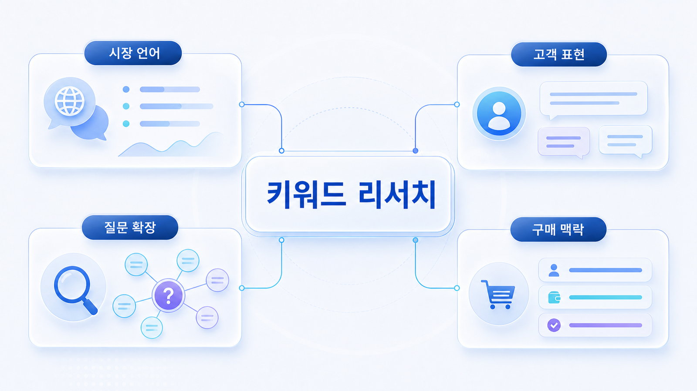

## SEO 키워드는 왜 여전히 중요한가



AI 검색 시대에도 SEO 키워드는 사라지지 않습니다. 키워드는 사람들이 어떤 문제를 어떤 단어로 부르는지, 어떤 카테고리를 인식하는지, 어떤 비교와 구매 의도를 갖고 있는지 보여주는 출발점입니다. GEO는 이 키워드를 버리는 것이 아니라 질문/프롬프트 시장으로 확장합니다.

예를 들어 `GEO 최적화`는 단일 검색어처럼 보이지만, 실제로는 `GEO 최적화 방법`, `GEO 최적화 전략`, `GEO 최적화 업체`, `GEO 검색 최적화`, `GEO AI 최적화`, `SEO GEO 최적화`처럼 여러 표현으로 갈라집니다. 이 표현들은 사용자가 아직 정확한 용어를 모르는 상태에서 어떤 문제를 해결하려는지 보여줍니다.

[TOC]

## 키워드가 해주는 일

| 역할 | 설명 | GEO에서의 사용법 |
|---|---|---|
| 시장 언어 확인 | 고객이 실제로 쓰는 단어를 보여줍니다 | AI 질문셋의 출발어로 씁니다 |
| 카테고리 구분 | 제품/서비스가 어느 문제군에 속하는지 보여줍니다 | AI가 브랜드를 어느 후보군에 넣어야 하는지 확인합니다 |
| 비교 구도 발견 | 함께 검색되는 경쟁사/대체재를 보여줍니다 | 비교형/추천형 질문을 만듭니다 |
| 콘텐츠 우선순위 | 어떤 주제부터 보강할지 정합니다 | 질문군별 콘텐츠 갭으로 연결합니다 |
| 기준선 측정 | 같은 질문을 반복 측정할 기준을 만듭니다 | 02장에서 mention/source/citation 변화를 봅니다 |

Google의 [SEO 시작 가이드](https://developers.google.com/search/docs/fundamentals/seo-starter-guide)는 기본 SEO가 검색 성과에 영향을 줄 수 있다고 설명합니다. GEO에서도 이 기반은 중요합니다. AI가 답변을 만들 때 참고할 수 있는 공개 페이지, 제목, 설명, 본문 구조, 출처 신호가 먼저 있어야 하기 때문입니다.

## 키워드를 모으는 5가지 소스

키워드는 검색량 도구 하나에서만 뽑지 않습니다. 실무에서는 아래 소스를 함께 봐야 AI 질문으로 바꿀 재료가 생깁니다.

| 소스 | 무엇을 알려주는가 | 예시 | 질문으로 바꾸는 방식 |
|---|---|---|---|
| Search Console | 이미 노출/클릭이 있는 검색어 | AI 검색 최적화, GEO 뜻 | 기존 수요를 기준선 질문으로 전환 |
| 고객 VOC/영업 질문 | 실제 상담에서 반복되는 표현 | ChatGPT에 우리 브랜드가 안 나와요 | 실행형/진단형 질문으로 전환 |
| Google Suggest | 사람들이 이어서 찾는 표현 | GEO 최적화 방법, GEO 최적화 업체 | 롱테일 질문 후보로 전환 |
| 경쟁사 제목/메뉴 | 시장이 카테고리를 나누는 방식 | AI visibility, brand monitoring | 비교형/카테고리형 질문으로 전환 |
| 내부 제품/리포트 용어 | 우리만 설명할 수 있는 기준 | mention, source, citation, AVI | 검증형/리포트 해석 질문으로 전환 |

Search Console의 성과 보고서는 검색어, 페이지, 클릭, 노출을 확인할 수 있는 기본 자료입니다. Google의 [Search Console 성과 보고서 도움말](https://support.google.com/webmasters/answer/7576553?hl=ko)을 함께 보면 기존 SEO 데이터와 GEO 질문셋을 연결하는 기준을 잡기 좋습니다.

## SEO 키워드와 GEO 질문의 차이

SEO 키워드는 짧고 압축된 표현입니다. GEO 질문은 상황, 목적, 조건, 비교 기준이 붙습니다. 그래서 키워드를 그대로 제목에 넣는 것보다, 그 키워드 뒤에 숨어 있는 질문과 판단 기준을 읽는 것이 중요합니다.

| SEO 키워드 | 숨어 있는 문제 | AI 질문 예시 |
|---|---|---|
| GEO 도구 | 어떤 도구를 선택해야 할지 모름 | B2B SaaS 팀이 쓸 GEO 분석 도구를 추천해줘 |
| AI 검색 모니터링 | 우리 브랜드가 보이는지 확인하고 싶음 | 우리 브랜드가 ChatGPT/Perplexity 답변에 나오는지 확인하는 방법은? |
| GEO 대행사 | 파트너 선택 기준이 필요함 | GEO 대행사를 고를 때 어떤 리포트와 지표를 요구해야 하나? |
| Perplexity SEO | 플랫폼별 인용 조건이 궁금함 | Perplexity에서 브랜드가 인용되려면 어떤 콘텐츠와 출처가 필요한가? |
| 로컬 GEO | 지역/지점 단위 적용법이 필요함 | 병원 지점별 AI 검색 노출을 높이려면 어떤 질문셋을 봐야 하나? |

## 실무 예시: SEO 복구가 GEO로 이어지는 경우

오래된 콘텐츠가 많은 CRM SaaS를 예로 들어 보겠습니다. 기존 SEO에서는 하락한 키워드, 오래된 글, 약한 제목/디스크립션을 먼저 봅니다. 하지만 GEO에서는 여기서 멈추면 부족합니다.

| 발견한 SEO 문제 | GEO로 확장할 질문 |
|---|---|
| `CRM 마케팅` 글이 오래됐다 | AI가 CRM 마케팅 방법을 설명할 때 어떤 최신 사례와 기준을 요구하는가? |
| 콘텐츠가 제품 기능 중심이다 | 사용자가 비교/추천을 요청할 때 답변에 들어갈 선택 기준이 있는가? |
| 카테고리 구조가 흐리다 | AI가 브랜드를 CRM, 마케팅 자동화, 리텐션 도구 중 어디로 이해하는가? |
| 비브랜드 키워드가 약하다 | 브랜드를 모르는 사용자의 추천형 질문에서 후보로 들어가는가? |

이처럼 SEO 키워드는 복구할 페이지 목록이면서 동시에 AI 질문 시장을 발견하는 지도입니다.

## 키워드 리서치 워크플로우

키워드 리서치는 단어를 많이 모으는 일이 아니라 `시장 언어를 실행 단위로 정리하는 일`입니다. 아래 순서로 진행하면 검색 유입과 GEO 질문 확장을 함께 만들 수 있습니다.

| 순서 | 할 일 | 확인할 질문 | 예시 |
|---|---|---|---|
| 1. seed keyword 수집 | 제품/서비스/문제/고객 표현을 모음 | 고객은 이 문제를 어떤 단어로 부르는가? | GEO, AI 검색 최적화, 브랜드 가시성 분석 |
| 2. 확장어 수집 | Suggest, Search Console, 영업 질문, 경쟁사 메뉴를 봄 | 함께 붙는 수식어는 무엇인가? | GEO 도구, GEO 대행사, ChatGPT 브랜드 노출 |
| 3. 의도 분류 | 정보형/비교형/추천형/구매형/문제해결형으로 나눔 | 사용자는 알고 싶은가, 고르고 싶은가, 실행하고 싶은가? | GEO 뜻=정보형, GEO 도구=비교/추천형 |
| 4. 우선순위 선정 | 검색량, 사업 관련성, 전환 가능성, 콘텐츠 보유 여부를 봄 | 지금 만들면 실제 액션으로 이어지는가? | 1순위: GEO 리포트, 2순위: LLMO |
| 5. 질문 변환 | 키워드를 AI 질문으로 바꿈 | AI에게 물으면 어떤 조건이 붙는가? | B2B SaaS 팀이 쓸 GEO 도구를 추천해줘 |

### AcmeGEO 예시

| 항목 | 작성 예시 |
|---|---|
| seed keyword | GEO 도구 |
| 확장어 | GEO 솔루션, AI 검색 모니터링, 브랜드 가시성 분석 도구 |
| 검색 의도 | 비교/추천/구매 검토 |
| 우선순위 이유 | 리포트/도구 구매 의도가 있고 HaloX 기능 설명과 연결됨 |
| AI 질문 | B2B SaaS 마케팅팀이 월간 리포트용으로 쓸 GEO 분석 도구를 비교해줘 |
| 콘텐츠 액션 | GEO 도구 선택 기준, SEO 도구와 GEO 도구 비교, 리포트 예시 페이지 보강 |

이 예시처럼 키워드는 마지막에 반드시 `질문/콘텐츠/측정`으로 바뀌어야 합니다. 검색량이 높아도 질문과 실행으로 바뀌지 않으면 GEO 워크플로우에서는 우선순위가 낮습니다.

## 실습 워크시트

| 입력 항목 | 작성 기준 |
|---|---|
| 핵심 키워드 | 검색량/노출/영업 질문/고객 언어에서 고른 키워드 |
| 키워드 소스 | Search Console, VOC, Suggest, 경쟁사, 내부 리포트 중 어디서 왔는지 |
| 카테고리 의미 | 이 키워드가 가리키는 시장/문제 |
| 질문 확장 방향 | 정보/비교/추천/검증/실행 중 어디로 넓힐지 |
| 현재 자산 | 이미 있는 글/제품/문서/출처 후보 |
| 다음 액션 | 질문 변환 또는 콘텐츠 보강 |

```text
핵심 키워드 10개 / 키워드 소스 / 카테고리 의미 / 질문 확장 방향 / 현재 자산 / 다음 액션
```

## 완료 기준

- 기존 SEO 키워드를 버리지 않고 질문 재료로 바꿀 수 있습니다.
- 키워드별 검색 의도와 AI 질문 후보가 연결됩니다.
- 브랜드 질문과 비브랜드 질문을 구분할 수 있습니다.
- 다음 페이지에서 프롬프트로 확장할 입력값이 남습니다.

## HaloX로 이어지는 지점

키워드와 질문의 연결을 더 깊게 보려면 HaloX의 [SEO/GEO 키워드 전략 글](https://haloxlabs.ai/ko/blog/seo-geo-keyword-strategy-framework)을 함께 읽습니다. 검색 의도와 AI 답변 환경의 차이는 [GEO/SEO/AEO 비교 글](https://haloxlabs.ai/ko/blog/geo-vs-seo-vs-aeo)에서도 이어서 볼 수 있습니다.

다음은 [SEO 키워드를 질문/프롬프트로 바꾸는 법](https://wikidocs.net/346314)입니다.
