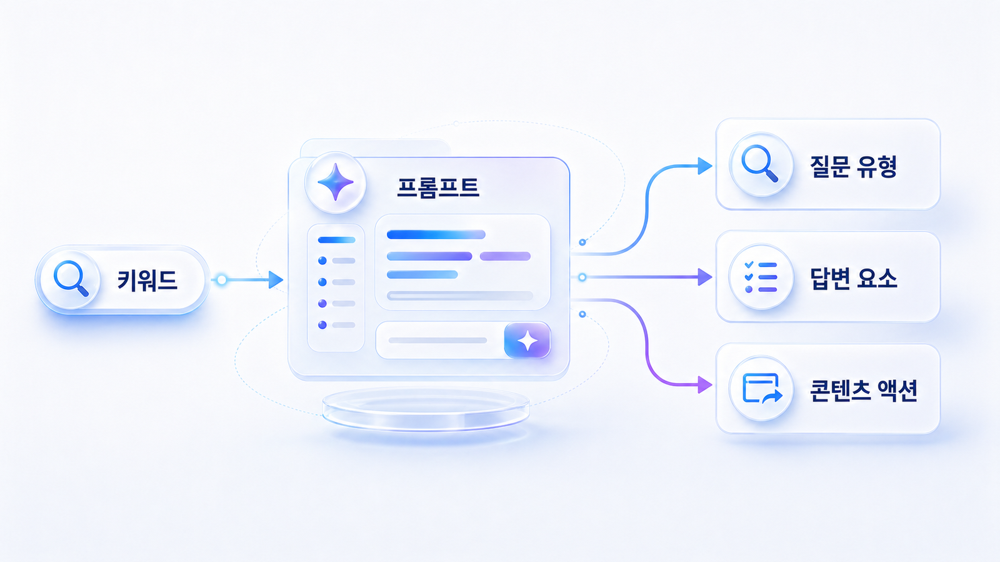

## SEO 키워드를 질문/프롬프트로 바꾸는 법



키워드를 질문과 프롬프트로 바꾸면 AI 검색에서 브랜드가 어떤 맥락에 등장해야 하는지 더 선명해집니다. 이 질문은 [Fan-out 질문맵](https://wikidocs.net/346344)으로 확장할 수 있습니다.

## 기본 변환 공식

| 키워드 | 질문 유형 | 프롬프트 예시 |
|---|---|---|
| GEO 도구 | 추천형 | B2B SaaS 팀이 쓸 만한 GEO 분석 도구를 추천해줘 |
| AI 검색 모니터링 | 방법형 | 우리 브랜드가 AI 검색에서 보이는지 확인하는 방법을 알려줘 |
| GEO 대행사 | 검증형 | GEO 대행사를 고를 때 어떤 리포트를 요구해야 하나? |
| Perplexity SEO | 플랫폼형 | Perplexity에서 브랜드가 인용되려면 어떤 콘텐츠가 필요한가? |

## 질문 유형

- 정보 탐색형: 개념과 원리를 묻습니다.
- 비교형: 여러 선택지를 나란히 놓고 비교합니다.
- 추천형: 조건에 맞는 후보를 요청합니다.
- 검증형: 신뢰도와 근거를 확인합니다.
- 실행형: 바로 할 수 있는 절차를 요청합니다.

## 실무 팁

처음에는 키워드 10개를 고르고, 각 키워드마다 질문 3개씩 만듭니다. 그러면 1주차 실습의 기본 산출물인 AI 질문 30개가 만들어집니다.

## 사례로 이해하기

키워드를 프롬프트로 바꾸면 사용자의 조건이 드러납니다. “GEO 도구”보다 “B2B SaaS 팀이 쓸 GEO 분석 도구 추천”이 콘텐츠 과제를 더 분명하게 보여줍니다.

## 키워드가 질문으로 바뀌는 과정

키워드는 짧고 압축된 표현입니다. 반면 AI에게 던지는 질문은 상황, 목적, 조건, 비교 대상을 포함합니다. 그래서 키워드를 프롬프트로 바꾼다는 것은 단어를 길게 늘리는 일이 아니라, 사용자가 실제로 판단하려는 맥락을 복원하는 일입니다.

좋은 질문은 세 가지를 포함합니다. 누가 묻는지, 무엇을 비교하려는지, 어떤 기준으로 판단하려는지입니다. 이 기준이 없으면 AI 답변은 일반론에 머물고, 브랜드가 들어갈 수 있는 구체적인 문맥도 만들어지지 않습니다.

## 키워드 하나가 실행 과제로 바뀌는 예

`GEO 도구`라는 키워드는 처음에는 검색량을 볼 수 있는 단어처럼 보입니다. 하지만 AI 검색에서는 이 단어를 그대로 두면 실행 과제로 이어지지 않습니다. 아래처럼 질문, 필요한 답변 요소, 콘텐츠 액션으로 풀어야 합니다.

| 단계 | 예시 | 확인할 것 |
|---|---|---|
| 키워드 | GEO 도구 | 사람들이 어떤 문제를 해결하려는지 아직 모호합니다 |
| 질문 | B2B SaaS 팀이 GEO 도구를 고를 때 무엇을 봐야 하나? | 독자의 조건과 의사결정 상황이 드러납니다 |
| 프롬프트 | 우리 브랜드의 AI 검색 노출, 답변 근거, 화면 인용을 추적할 도구를 비교해줘 | AI가 비교 기준을 만들어야 합니다 |
| 필요한 답변 요소 | 측정 지표, 질문셋 관리, 경쟁사 비교, 리포트 신뢰도, 재측정 방식 | 콘텐츠에 반드시 있어야 할 정보가 보입니다 |
| 콘텐츠 액션 | 도구 평가 기준 글, 리포트 읽는 법, 기준선 진단표 작성 | 다음 작성/리라이트 과제가 됩니다 |

이 과정을 거치면 키워드는 단순한 유입 단어가 아니라 질문셋, 콘텐츠 갭, 답변 근거 설계로 이어집니다.

## 실습 워크시트

| 입력 항목 | 작성 기준 |
|---|---|
| 키워드 | 출발점이 되는 검색어 |
| 질문 유형 | 정보/비교/추천/검증/실행 |
| 프롬프트 | AI에게 실제로 던질 문장 |
| 필요 답변 요소 | AI가 답하려면 필요한 정보 |
| 연결 콘텐츠 | 기존 글 또는 새로 만들 글 |

## 정리 양식

```text
키워드 10개 / 질문 유형 / 프롬프트 30개 / 필요 답변 요소 / 연결 콘텐츠
```

## 작성 예시

이 예시는 개념을 실제 운영 언어로 바꿔 보는 용도입니다. 그대로 베끼기보다 자기 브랜드의 질문, 페이지, 출처 후보로 바꿔 적습니다.

| 입력 항목 | 작성 예시 |
|---|---|
| 키워드 | AI 검색 모니터링 |
| 질문 유형 | 실행형 |
| 프롬프트 | 우리 브랜드가 ChatGPT와 Perplexity 답변에 나오는지 확인하는 방법을 알려줘 |
| 필요 답변 요소 | 질문셋, 측정 모델, mention, 답변 근거(source), 화면 인용(citation) 기록표 |
| 연결 콘텐츠 | 02장 기준선 진단표와 HaloX AVI 점수 가이드 |

## 완료 기준

- 키워드가 실제 사용자가 물어볼 프롬프트로 바뀌었습니다.
- 정의형/비교형/추천형 질문을 구분할 수 있습니다.
- 질문셋 구성 비중을 나눌 준비가 됩니다.

## HaloX로 이어지는 지점

키워드 확장 예시는 HaloX의 [SEO/GEO 키워드 전략 프레임워크](https://haloxlabs.ai/ko/blog/seo-geo-keyword-strategy-framework)와 함께 보면 더 선명합니다. 이 페이지에서 질문 변환표를 만들고, HaloX 글에서 키워드와 질문 시장의 연결 방식을 보완합니다. Google의 [유용한 콘텐츠 만들기](https://developers.google.com/search/docs/fundamentals/creating-helpful-content)를 함께 보면 키워드를 질문으로 바꿀 때도 “검색량”보다 실제 독자 문제 해결이 우선이라는 기준을 잡을 수 있습니다.

## 다음에 읽을 글

다음은 [검색 의도와 AI 질문 의도의 차이](https://wikidocs.net/346339)입니다.

## 프롬프트 품질을 높이는 기준

좋은 GEO 질문은 짧은 키워드보다 조건이 분명합니다. `GEO 도구`보다 `B2B SaaS 마케팅팀이 월간 리포트용으로 쓸 GEO 모니터링 도구를 추천해줘`가 더 좋은 측정 질문입니다.

| 약한 질문 | 좋은 질문 |
|---|---|
| GEO 도구 추천 | B2B SaaS 마케팅팀이 ChatGPT/Perplexity 브랜드 노출을 같이 볼 GEO 도구를 추천해줘 |
| AI 검색 노출 방법 | 우리 브랜드가 AI 답변에서 빠지는 이유를 mention/source/citation 기준으로 진단하는 방법은? |
| GEO 대행사 비교 | GEO 제안서를 볼 때 과장된 약속과 검증 가능한 리포트를 어떻게 구분하나? |

## 다음 장으로 넘길 산출물

이 페이지를 끝내면 질문 30개가 남아야 합니다. 이후 [02장 AI 검색 모니터링](https://wikidocs.net/346342)에서 이 질문을 그대로 사용해 기준선을 측정합니다.
