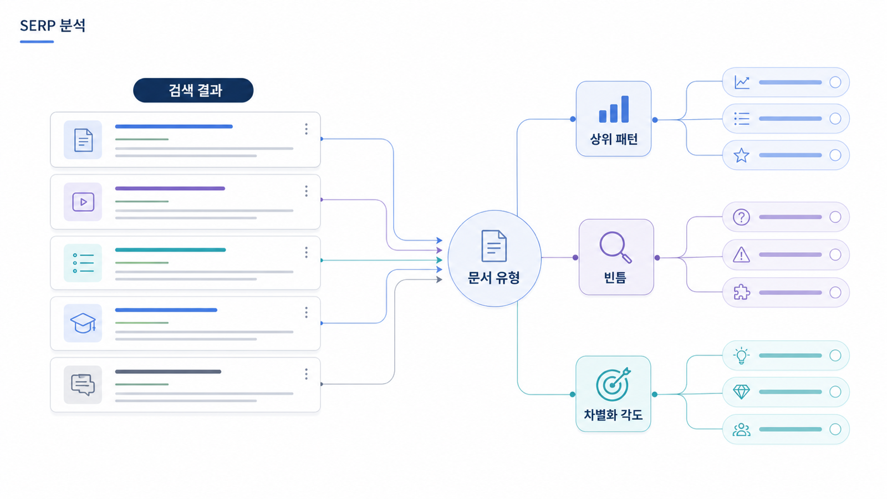

## SERP 분석과 SEO 콘텐츠 갭: 검색결과를 의도 지도로 읽기

SERP 분석은 상위 글을 따라 쓰기 위한 작업이 아닙니다. 검색결과 페이지는 Google과 네이버가 특정 query를 어떤 의도로 해석하고 있는지 보여주는 지도입니다. 어떤 유형의 문서가 상위에 있는지, 어떤 제목과 소제목이 반복되는지, 어떤 질문이 보이는지, 어떤 출처가 신뢰를 얻고 있는지를 보면 사용자가 기대하는 답변의 윤곽이 보입니다.

키워드 리서치가 시장 언어를 모으는 단계라면, SERP 분석은 그 언어가 실제 검색결과에서 어떤 답변 형식으로 처리되고 있는지 확인하는 단계입니다. 이 과정을 건너뛰면 콘텐츠는 내부 추측으로 만들어집니다.

[TOC]

## SERP를 왜 봐야 하나

검색엔진은 query마다 다른 결과 구성을 보여줍니다. 어떤 query는 정의형 글이 많고, 어떤 query는 비교 글이 많고, 어떤 query는 지도, 영상, 뉴스, 커뮤니티가 섞입니다. 이 차이는 사용자의 의도와 기대 답변 형식이 다르다는 신호입니다.

예를 들어 `GEO 뜻`을 검색했을 때 용어 설명과 비교 글이 많다면 사용자는 개념을 이해하려는 상태입니다. 반면 `GEO 도구 비교`를 검색했을 때 도구 목록, 가격, 기능 비교, 리뷰가 많다면 사용자는 선택을 앞둔 상태입니다. 같은 GEO 주제라도 필요한 콘텐츠 구조는 완전히 달라집니다.

SERP 분석은 `상위 글에 무엇이 있나`를 보는 일이 아니라 `사용자가 어떤 답을 기대하기 때문에 이런 결과가 나왔나`를 해석하는 일입니다.

## SERP에서 봐야 할 요소

상위 10개 결과를 볼 때는 제목만 보면 안 됩니다. 페이지 유형, title, meta, H2, FAQ, 표, 이미지, 영상, 작성자, 업데이트 날짜, 내부 링크, 외부 출처, CTA까지 봐야 합니다.

특히 GEO 관점에서는 어떤 페이지가 AI 답변의 source나 citation 후보가 될 수 있는지 봐야 합니다. 공식 문서, 잘 구조화된 가이드, 비교 기준이 분명한 글, 최신성이 보이는 페이지는 AI 답변 재료로 쓰일 가능성이 높습니다. 반대로 얕은 목록형 글이나 출처 없는 주장만 있는 글은 상위에 있더라도 장기적으로 신뢰 신호가 약할 수 있습니다.

## SERP 분석 실무 순서

1. 키워드 리서치에서 고른 핵심 query 10개를 선택합니다.
2. 각 query를 시크릿 창이나 동일한 조건에서 검색합니다.
3. 상위 10개 결과의 URL, title, 문서 유형을 기록합니다.
4. 각 페이지의 첫 문단, H2, 표, FAQ, CTA를 확인합니다.
5. 검색결과에 People Also Ask, featured snippet, 영상, 이미지, 지도, 뉴스가 있는지 확인합니다.
6. 반복되는 질문과 빠진 질문을 분리합니다.
7. 상위 결과가 해결하는 의도와 해결하지 못하는 의도를 적습니다.
8. 우리 페이지가 이 query에서 맡아야 할 답변 역할을 정합니다.

처음부터 모든 키워드를 다 보려고 하면 지칩니다. 우선 핵심 키워드 5~10개만 제대로 분석하는 것이 좋습니다.

## 문서 유형을 분류하는 법

SERP에서 가장 먼저 볼 것은 `누가 상위에 있는가`입니다. 공식 문서가 많은지, 블로그가 많은지, 도구 페이지가 많은지, 커뮤니티가 많은지에 따라 사용자가 기대하는 신뢰 수준과 콘텐츠 형식이 달라집니다.

| 문서 유형 | 의미 | 콘텐츠 전략 |
|---|---|---|
| 공식 문서 | 정확한 정의와 기준이 중요 | 용어, 정책, 기술 기준을 명확히 정리 |
| 블로그 가이드 | 실무 설명 수요가 큼 | 단계별 설명과 예시 제공 |
| 비교 글 | 선택 기준이 중요 | 비교표, 장단점, 제외 기준 작성 |
| 도구 페이지 | 구매/도입 의도가 있음 | 기능, 가격, 리포트 예시, CTA 정리 |
| 커뮤니티/후기 | 실제 경험과 문제 해결이 중요 | 장단점, 실패 사례, FAQ 보강 |
| 뉴스/PR | 최신성, 권위, 발표 맥락이 중요 | 뉴스룸과 공식 업데이트 정리 |
| 영상/이미지 | 시각적 설명이 필요 | 캡처, 다이어그램, 단계 이미지 추가 |

이 분류는 단순 태깅이 아닙니다. 어떤 콘텐츠를 만들어야 하는지 알려주는 신호입니다.

## 상위 글을 베끼지 않고 갭을 찾는 법

SERP 분석에서 가장 위험한 방식은 상위 글의 제목과 소제목을 비슷하게 따라 쓰는 것입니다. 그렇게 하면 이미 있는 글의 요약본이 하나 더 생길 뿐입니다. 우리가 찾아야 하는 것은 상위 글들이 반복해서 다루는 필수 요소와, 반복적으로 놓치는 빈틈입니다.

예를 들어 `GEO 도구 비교` SERP에서 대부분의 글이 기능 목록만 보여준다면, 갭은 기능이 아닙니다. 실제 구매자가 궁금한 것은 `어떤 질문셋을 관리할 수 있는가`, `mention/source/citation을 어떤 기준으로 나눠 보여주는가`, `경쟁사와 같은 질문에서 비교할 수 있는가`, `월간 리포트로 재측정할 수 있는가`입니다. 이 질문에 답하면 단순 목록 글보다 실무적인 콘텐츠가 됩니다.

## 가상 기업 AcmeGEO SERP 분석 예시

AcmeGEO 팀이 `AI 검색 모니터링 도구`를 검색했다고 가정해 봅니다. 상위 결과에는 SEO 도구 비교 글, AI visibility 도구 목록, 일부 제품 페이지, 마케팅 블로그가 섞여 있습니다. 팀은 처음에 “우리도 도구 목록 글을 써야 하나?”라고 생각할 수 있습니다.

하지만 SERP를 자세히 보면 다른 결론이 나옵니다. 상위 글은 도구 이름은 나열하지만, 실제로 어떤 지표를 봐야 하는지 설명하지 않습니다. mention과 citation의 차이를 설명하지 않고, 질문셋을 어떻게 구성해야 하는지도 다루지 않습니다. 리포트 예시도 부족합니다.

이때 AcmeGEO의 콘텐츠 전략은 `AI 검색 모니터링 도구 10선`이 아니라 `AI 검색 모니터링 도구를 고를 때 봐야 할 7가지 기준`이 됩니다. 이 글은 기능 목록보다 질문셋, mention/source/citation, 경쟁사 비교, 리포트 재측정, 기술/출처 액션 연결을 설명해야 합니다.

## SERP 분석 산출물

SERP 분석의 결과는 아래처럼 다음 단계에서 쓸 수 있어야 합니다.

| 항목 | 기록 내용 |
|---|---|
| query | 분석한 검색어 |
| 상위 결과 유형 | 공식/블로그/비교/도구/커뮤니티/뉴스 |
| 반복 H2 | 상위 글에서 반복되는 질문과 구조 |
| 빠진 질문 | 사용자는 궁금하지만 상위 글이 약한 부분 |
| 필요한 콘텐츠 형식 | 정의/비교/절차/FAQ/사례/체크리스트 |
| source 후보 | AI 답변 근거가 될 만한 공식/외부 페이지 |
| 우리 액션 | 신규 글/리라이트/내부 링크/외부 출처 보강 |

## 팀별 역할

SEO 담당자는 query 선정과 상위 결과 분석을 맡습니다. 콘텐츠팀은 반복 구조와 빠진 질문을 콘텐츠 목차로 바꿉니다. 브랜드팀은 SERP에서 우리 브랜드가 어떤 표현으로 보이는지 확인합니다. PR팀은 뉴스, 디렉터리, 외부 블로그가 필요한 query를 표시합니다. 개발팀은 SERP 분석 단계에서 바로 움직이지 않을 수도 있지만, 나중에 기술 SEO와 schema 작업이 필요한 페이지를 미리 확인할 수 있습니다.

## SEO 핵심 개념 더 깊게 보기

SERP 분석에서는 단순히 순위를 보는 것이 아니라 `page type`, `domain type`, `SERP feature`, `freshness`, `content depth`를 함께 봐야 합니다. page type은 검색결과에 어떤 종류의 페이지가 많은지를 뜻합니다. 블로그 글이 많은지, 제품 페이지가 많은지, 카테고리 페이지가 많은지, 비교/리뷰 글이 많은지에 따라 우리가 만들어야 할 페이지도 달라집니다.

SERP feature는 일반 파란 링크 외에 검색결과에 보이는 요소입니다. Google에서는 featured snippet, People Also Ask, 이미지, 영상, local pack, shopping result 등이 있습니다. 네이버에서는 블로그, 카페, 지식iN, 뉴스, 플레이스, 쇼핑 영역을 봐야 합니다. 같은 키워드라도 Google과 네이버의 SERP 구조가 다르면 콘텐츠와 채널 전략도 달라져야 합니다.

freshness는 최신성이 얼마나 중요한지 보는 기준입니다. `2026 GEO 트렌드`, `Google AI Overviews 업데이트`처럼 최신 정보가 중요한 query는 오래된 글이 밀릴 수 있습니다. 반대로 `검색 의도란` 같은 개념형 query는 안정적인 정의와 구조가 더 중요할 수 있습니다.

content depth는 상위 글이 얼마나 깊게 답하고 있는지를 봅니다. 글자 수만 보는 것이 아니라 정의, 근거, 예시, 절차, FAQ, 내부 링크, 외부 출처가 충분한지 확인합니다. GEO 관점에서는 AI가 답변에 가져갈 수 있는 문장과 구조가 있는지도 함께 봅니다.

## SERP 분석 템플릿

| 항목 | 기록 내용 | 판단 질문 |
|---|---|---|
| query | GEO 도구 비교 | 어떤 검색어를 분석했는가? |
| 상위 page type | 비교 글/제품 페이지/블로그 | 어떤 유형이 이기고 있는가? |
| SERP feature | PAA, 영상, 이미지, 네이버 블로그 | 어떤 형식의 답을 요구하는가? |
| 반복 title 패턴 | `추천`, `비교`, `선택 기준` | 사용자가 어떤 답을 기대하는가? |
| 반복 H2 | 가격, 기능, 리포트, 지표 | 필수 정보 단위는 무엇인가? |
| 빠진 질문 | mention/source/citation 차이 | 우리가 이길 갭은 무엇인가? |
| 최신성 | 최근 6개월 글 우세 | 업데이트 주기가 중요한가? |
| 우리 페이지 유형 | 비교 기준 가이드 | 어떤 페이지를 만들어야 하는가? |

## 가상 기업 AcmeGEO 연속 케이스: SERP에서 이길 각도 찾기

AcmeGEO는 `GEO 도구 비교` SERP를 분석하면서 상위 글 대부분이 `AI 마케팅 도구 목록`이나 `SEO 도구 비교`에 가까운 것을 발견했습니다. 표면적으로는 도구 목록이 많았지만, 실제로는 GEO 리포트 지표를 깊게 설명하는 글이 거의 없었습니다.

팀은 이 SERP를 보고 `우리도 목록 글을 쓰자`가 아니라 `도구 선택 기준을 재정의하자`고 판단했습니다. 상위 글이 놓친 갭은 질문셋 관리, mention/source/citation 분리, 경쟁사 동시 측정, 월간 리포트 재측정, source 보강 액션이었습니다.

그래서 AcmeGEO의 페이지 유형은 단순 제품 소개가 아니라 `비교 기준 가이드`로 정해졌습니다. 이 결정은 다음 단계인 검색 의도 분석과 콘텐츠 구조 설계의 기준이 됩니다.

## 참고 링크

- Google의 [유용한 콘텐츠 만들기](https://developers.google.com/search/docs/fundamentals/creating-helpful-content)는 SERP 갭을 판단할 때 기준으로 삼을 수 있습니다.
- Google Search Central의 [SEO 시작 가이드](https://developers.google.com/search/docs/fundamentals/seo-starter-guide)는 검색결과에 맞는 페이지 기본 구조를 이해하는 데 판단 기준이 됩니다.

다음은 [검색 의도: 키워드 뒤의 목적을 읽는 법](https://wikidocs.net/346339)입니다.
