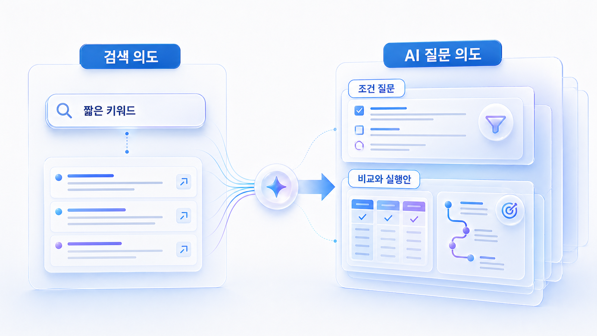

## 검색 의도와 AI 질문 의도의 차이



검색 의도와 AI 질문 의도는 비슷해 보이지만 실제로는 다릅니다. 검색 의도는 사용자가 무엇을 찾는지에 가깝고, AI 질문 의도는 사용자가 어떤 판단을 대신 정리받고 싶은지에 가깝습니다.

기존 검색에서 `GEO란`은 정의형 검색 의도입니다. AI 검색에서는 같은 의도가 `GEO를 SEO팀에게 설명해야 하는데 핵심 차이를 표로 정리해줘`처럼 바뀔 수 있습니다. 이 경우 AI는 정의뿐 아니라 비교표, 실무 적용, 팀 설득 문장까지 만들어야 합니다.

[TOC]

## 차이를 보는 기준

| 구분 | 검색 의도 | AI 질문 의도 |
|---|---|---|
| 입력 | 짧은 키워드 | 조건이 붙은 질문 |
| 기대 결과 | 링크/문서 목록 | 요약/비교/추천/실행안 |
| 최적화 단위 | 페이지 | 답변에 필요한 정보 묶음 |
| 판단 기준 | 순위/클릭/체류 | mention, 답변 근거(source), 화면 인용(citation), 비교 문맥 |
| 콘텐츠 과제 | 키워드에 맞는 페이지 작성 | 답변에 들어갈 정의/기준/표/사례/출처 설계 |

## 검색 의도는 출발점이고 AI 질문 의도는 답변 역할이다

검색 의도는 보통 정보 탐색, 비교, 구매, 방문처럼 분류합니다. AI 질문 의도는 여기에 `정리해 달라`, `추천해 달라`, `검증해 달라`, `실행 순서를 알려 달라`는 요구가 붙습니다.

그래서 GEO에서는 질문 하나를 볼 때도 답변의 역할을 함께 봐야 합니다. 정의를 원하는 질문인지, 추천을 원하는 질문인지, 기존 선택을 검증하려는 질문인지에 따라 필요한 콘텐츠와 출처가 달라집니다.

## 검색 의도와 AI 답변 역할 매핑

| 기존 검색 의도 | 사용자가 검색에서 기대한 것 | AI 질문에서 기대하는 것 | 필요한 콘텐츠 재료 |
|---|---|---|---|
| 정보형 | 개념/정의 확인 | 이해하기 쉬운 설명과 비교표 | 한 문장 정의, 용어 차이, FAQ |
| 비교형 | 여러 문서 비교 | 후보군을 나란히 놓고 장단점 정리 | 비교 기준, 표, 사용 조건, 제외 기준 |
| 상업 조사형 | 구매 전 탐색 | 상황에 맞는 추천과 검증 포인트 | 추천 이유, 가격/운영 기준, 리포트 예시 |
| 거래형 | 구매/상담/신청 | 바로 실행할 다음 단계 | 체크리스트, 상담 전 질문, 도입 순서 |
| 방문/로컬형 | 위치/업체 확인 | 지역/리뷰/전문성 기준으로 선택 도움 | NAP, 리뷰, 위치, 서비스 범위, 사진 |
| 리스크 검증형 | 신뢰도 확인 | 위험 신호와 확인 방법 | 공식 출처, 정책, 인증, 오류 정정 페이지 |

## 실무에서 자주 생기는 차이

| SEO 검색어 | AI 질문 의도 | 필요한 콘텐츠 재료 |
|---|---|---|
| GEO 뜻 | 팀에 설명할 수 있는 쉬운 정의 | 한 문장 정의, SEO/AEO/AIO 비교표, 오해 정리 |
| GEO 도구 | 상황에 맞는 후보 추천 | 대상 고객, 기능, 리포트 예시, 비교 기준 |
| GEO 대행사 | 제안서와 리포트 검증 | 성과 지표, 위험 신호, 질문 리스트 |
| 로컬 GEO | 업종별 적용 방법 | 지역 질문셋, 리뷰/지도/NAP 체크리스트 |
| ChatGPT 브랜드 노출 | 빠지는 이유 진단 | mention/source/citation 기록표, 콘텐츠/출처 액션 |

## 실무 예시: 금융/거래소 키워드

금융이나 거래소 같은 산업에서는 `거래소 추천`, `수수료 비교`, `보안 좋은 거래소` 같은 검색어가 있습니다. SEO에서는 각 키워드별 콘텐츠를 만들 수 있지만, AI 질문에서는 신뢰와 리스크 검증이 더 중요해집니다.

| 키워드 | 단순 검색 의도 | AI 질문 의도 |
|---|---|---|
| 거래소 수수료 | 수수료 정보 확인 | 수수료 외에 유동성, 보안, 고객지원, 규제 리스크까지 비교 |
| 안전한 거래소 | 신뢰도 확인 | 어떤 공식 근거와 외부 출처를 봐야 하는지 검증 |
| 코인 거래소 추천 | 후보 탐색 | 사용자 조건별 추천과 제외 기준 요청 |

이런 산업에서는 추천형 질문만 늘리면 위험합니다. 검증형/리스크형 질문 비중을 함께 높여야 합니다.

## 검색 의도 분석을 실행 과제로 바꾸기

검색 의도는 보통 정보형, 탐색형, 비교형, 거래형으로 나눕니다. GEO에서는 여기에 `답변 역할`을 한 번 더 붙입니다.

| 검색 의도 | 사용자의 상태 | AI 답변 역할 | 콘텐츠 실행 과제 |
|---|---|---|---|
| 정보형 | 개념을 처음 이해하려 함 | 정의/차이/예시를 짧게 설명 | 첫 문단 정의, 비교표, FAQ 보강 |
| 비교형 | 여러 대안을 고르려 함 | 기준을 만들고 후보를 나눔 | 비교표, 선택 기준, 장단점 정리 |
| 추천형 | 상황에 맞는 선택을 원함 | 조건별 추천과 제외 기준 제시 | 업종별/상황별 추천 기준 작성 |
| 검증형 | 주장이나 도구를 의심함 | 리포트/근거/측정법 확인 | 체크리스트, 증거, 실패 신호 정리 |
| 실행형 | 바로 따라 할 절차가 필요함 | 순서와 산출물을 제시 | 워크시트, 템플릿, 30일 액션 플랜 작성 |

예를 들어 `GEO 최적화 방법`은 정보형처럼 보이지만 실제로는 실행형 의도가 섞여 있습니다. 그래서 단순 정의 글보다 `질문셋 만들기 → 기준선 측정 → 콘텐츠 갭 → source/citation 보강 → 재측정` 같은 절차가 있어야 합니다.

## 실무 분석 절차: 키워드 하나를 질문 의도로 쪼개기

검색 의도 분석은 감으로 분류하면 얕아집니다. 먼저 검색어가 어떤 상황에서 나왔는지 보고, 그다음 AI가 맡아야 할 답변 역할을 붙여야 합니다.

1. Google Search Console이나 네이버 검색어에서 실제 query를 뽑습니다.
2. query를 브랜드/비브랜드, 정보/비교/추천/검증/실행으로 1차 분류합니다.
3. 같은 query를 `누가`, `어떤 상황에서`, `무엇을 결정하려고` 묻는지 문장으로 바꿉니다.
4. AI 답변이 해야 할 일을 정의/비교/추천/검증/실행안 중 하나로 붙입니다.
5. 답변에 반드시 들어가야 할 근거를 내부 페이지, 외부 출처, 표, FAQ, 사례로 나눕니다.
6. 현재 사이트에 그 답변 재료가 있는지 확인하고, 없으면 콘텐츠 갭으로 넘깁니다.

| 단계 | 질문 | 산출물 |
|---|---|---|
| query 확인 | 실제 사용자가 어떤 표현을 쓰는가? | 검색어 목록 |
| 상황 해석 | 사용자가 어떤 결정을 앞두고 있는가? | 의도 메모 |
| 답변 역할 지정 | AI가 무엇을 대신 정리해야 하는가? | 정의/비교/추천/검증/실행 분류 |
| 근거 지정 | 답변에 어떤 출처와 데이터가 필요한가? | 콘텐츠 재료 목록 |
| 실행 연결 | 지금 무엇을 새로 쓰거나 고쳐야 하는가? | 리라이트/신규 글/외부 출처 액션 |

## B2B SaaS 예시: 같은 키워드가 다른 AI 질문이 되는 경우

`AI 검색 모니터링`이라는 키워드는 하나지만, 실제 질문 의도는 여러 갈래로 나뉩니다.

| AI 질문 | 답변 역할 | 필요한 페이지/근거 | 실무 액션 |
|---|---|---|---|
| AI 검색 모니터링이 뭐야? | 정의 | 개념 설명, SEO/GEO 차이 | 첫 문단 정의와 비교표 보강 |
| 우리 브랜드가 ChatGPT에 나오는지 어떻게 확인해? | 실행 | 측정 절차, 기록표 | 기준선 진단 워크시트 제공 |
| GEO 도구를 고를 때 뭘 봐야 해? | 비교/추천 | 기능 비교, 리포트 예시 | 도구 선택 기준표 작성 |
| 대행사가 준 GEO 리포트가 믿을 만한지 어떻게 봐? | 검증 | 지표 정의, 위험 신호 | 리포트 검증 체크리스트 작성 |
| AI 답변에 경쟁사는 나오는데 우리는 왜 빠져? | 진단 | 콘텐츠 갭, source/citation 분석 | SERP 갭과 외부 출처 맵 연결 |

이 표를 만들면 `키워드 하나당 페이지 하나`가 아니라 `질문 역할별 콘텐츠 묶음`이 필요하다는 점이 보입니다. 1장에서는 이 묶음을 먼저 만들고, 2장부터 실제 측정으로 넘어갑니다.

## 참고 링크

- Google Search Central의 [SEO 시작 가이드](https://developers.google.com/search/docs/fundamentals/seo-starter-guide)는 검색 의도와 페이지 기본 품질을 이해하는 출발점입니다.
- Google의 [유용한 콘텐츠 만들기](https://developers.google.com/search/docs/fundamentals/creating-helpful-content)는 질문에 직접 도움이 되는 콘텐츠인지 점검할 때 참고합니다.
- HaloX의 [GEO/SEO/AEO 비교 글](https://haloxlabs.ai/ko/blog/geo-vs-seo-vs-aeo)은 검색 의도와 AI 답변 의도를 구분하는 배경 자료로 활용합니다.

## 실습 워크시트

| 입력 항목 | 작성 기준 |
|---|---|
| 검색 키워드 | 짧은 검색어 |
| 검색 의도 | 정보/비교/구매/방문/검증 |
| AI 질문 | 조건이 붙은 실제 질문 |
| 기대 답변 | 요약/비교/추천/절차/검증 |
| 콘텐츠 과제 | 답변에 들어갈 정보 단위 |
| 출처 과제 | 공식 문서, 외부 인용, 리뷰, 사례 중 필요한 근거 |

```text
검색 키워드 / 검색 의도 / AI 질문 / 기대 답변 / 콘텐츠 과제 / 출처 과제
```

## 완료 기준

- 검색 의도와 AI 질문 의도를 따로 읽을 수 있습니다.
- 사용자가 기대하는 답변 역할을 분류할 수 있습니다.
- 질문별로 필요한 콘텐츠 재료와 출처 재료를 나눌 수 있습니다.
- 기준선 진단에 넣을 질문 우선순위가 보입니다.

## HaloX로 이어지는 지점

검색 의도와 AI 질문 의도를 비교할 때는 HaloX의 [GEO/SEO/AEO 비교 글](https://haloxlabs.ai/ko/blog/geo-vs-seo-vs-aeo)을 같이 참고하면 좋습니다. 검색 의도를 기본 구조로 이해하려면 Google의 [SEO 시작 가이드](https://developers.google.com/search/docs/fundamentals/seo-starter-guide)를 참고합니다.

검색 의도와 AI 질문 의도를 구분했다면 [01-04 질문셋 구성 비중](https://wikidocs.net/346340)에서 질문군이 한쪽으로 쏠리지 않았는지 확인합니다.
