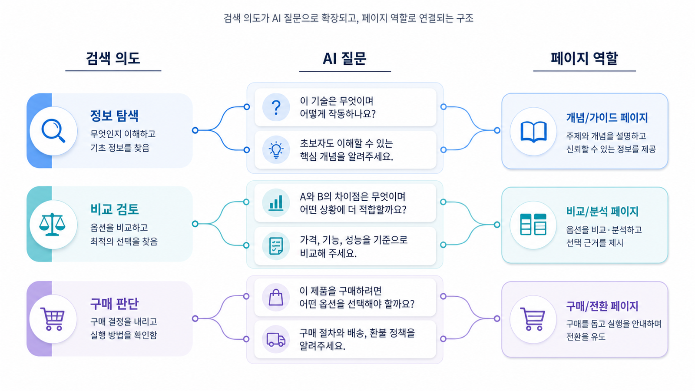

## SEO 검색 의도 분석: 키워드 뒤의 목적과 AI 질문


검색 의도는 사용자가 검색어를 입력한 이유입니다. 같은 키워드라도 사용자의 목적은 다를 수 있습니다. 누군가는 개념을 알고 싶고, 누군가는 도구를 비교하고 싶고, 누군가는 이미 구매 직전 단계에서 마지막 검증을 하고 싶습니다. 검색 의도 분석은 이 목적을 읽어 콘텐츠 형식을 결정하는 작업입니다.

GEO에서는 검색 의도를 AI 질문 의도로 확장해야 합니다. 사용자가 검색창에 `GEO 도구`라고 입력할 때는 짧은 키워드지만, AI에게는 `B2B SaaS 마케팅팀이 쓸 GEO 도구를 고를 때 어떤 지표를 봐야 하는지 비교해줘`처럼 묻습니다. SEO 검색 의도와 AI 질문 의도는 연결되어 있지만 동일하지 않습니다.

[TOC]

## 검색 의도의 기본 유형

SEO에서 자주 쓰는 검색 의도는 정보형, 탐색형, 상업 조사형, 거래형입니다. 여기에 GEO 실무에서는 비교형, 추천형, 검증형, 실행형을 더 세밀하게 봐야 합니다.

정보형 의도는 개념을 이해하려는 검색입니다. `GEO란`, `AI 검색 최적화 뜻` 같은 검색이 여기에 가깝습니다. 비교형 의도는 여러 대안을 나란히 놓고 판단하려는 검색입니다. `GEO 도구 비교`, `SEO와 GEO 차이`가 예입니다. 추천형 의도는 조건에 맞는 후보를 고르려는 검색입니다. 검증형 의도는 주장, 리포트, 업체, 도구가 믿을 만한지 확인하려는 검색입니다. 실행형 의도는 바로 따라 할 절차를 찾는 검색입니다.

검색 의도를 잘못 읽으면 콘텐츠가 빗나갑니다. 정보형 의도에 구매 CTA만 밀어붙이면 독자는 떠납니다. 비교형 의도에 정의만 길게 쓰면 부족합니다. 검증형 의도에 장점만 나열하면 신뢰를 잃습니다.

## 검색 의도와 구매 여정

검색 의도는 구매 여정과 연결됩니다. 모든 검색이 바로 구매로 이어지지는 않습니다. 어떤 검색은 문제 인식 단계이고, 어떤 검색은 대안 비교 단계이며, 어떤 검색은 최종 의사결정 단계입니다.

초기 단계의 사용자는 용어를 이해하려고 합니다. 이때는 쉬운 정의, 비교표, 오해 정리가 필요합니다. 중간 단계의 사용자는 여러 대안을 비교합니다. 이때는 기준, 장단점, 제외 조건이 필요합니다. 후반 단계의 사용자는 실제 도입 가능성을 봅니다. 이때는 가격, 사례, 리포트 예시, 체크리스트, 상담 전 질문이 필요합니다.

GEO에서는 이 여정이 AI 답변 안에서 압축됩니다. 사용자는 한 번의 질문으로 정의, 비교, 추천, 실행 순서를 함께 요구할 수 있습니다. 그래서 콘텐츠는 개별 키워드만 대응하는 것이 아니라 답변에 필요한 정보 묶음으로 설계해야 합니다.

## 같은 키워드, 다른 의도

`GEO 도구`라는 키워드를 보겠습니다. 이 키워드는 정보형일 수도 있고, 비교형일 수도 있고, 추천형일 수도 있습니다. 사용자가 막 GEO를 처음 들었다면 `GEO 도구가 무엇인지` 알고 싶을 수 있습니다. 이미 문제를 아는 마케터라면 `어떤 도구를 써야 하는지` 비교하고 싶을 수 있습니다. 대표라면 `이 도구가 비용을 쓸 가치가 있는지` 검증하고 싶을 수 있습니다.

따라서 하나의 키워드를 하나의 글로만 대응하면 부족합니다. 같은 키워드라도 의도별로 다른 콘텐츠 블록이 필요합니다.

```text
GEO 도구
→ GEO 도구란 무엇인가?
→ GEO 도구는 SEO 도구와 어디가 달라지는가?
→ B2B SaaS 팀은 어떤 GEO 도구를 골라야 하나?
→ GEO 도구 리포트에서 mention/source/citation은 어떻게 해석하나?
→ GEO 도구 도입 전에 어떤 데이터를 준비해야 하나?
```

이렇게 풀면 검색 의도 분석이 콘텐츠 구조 설계로 이어집니다.



## AI 질문 의도로 확장하기

AI 질문 의도는 검색 의도보다 더 구체적입니다. 검색 의도는 사용자가 무엇을 찾는지 보여주고, AI 질문 의도는 사용자가 어떤 판단을 대신 정리받고 싶은지 보여줍니다.

검색어가 `GEO 대행사`라면 검색 의도는 업체 탐색일 수 있습니다. 하지만 AI 질문은 `GEO 대행사 제안서를 받았는데 검증되지 않은 약속인지 검토할 체크리스트를 만들어줘`가 될 수 있습니다. 이 경우 콘텐츠에는 업체 소개보다 지표 정의, 리포트 샘플, 위험 신호, 질문 리스트가 필요합니다.

AI 질문 의도로 바꾸는 공식은 단순합니다.

```text
키워드 + 사용자 상황 + 판단 목적 + 원하는 출력 형식
```

예를 들어 `AI 검색 모니터링`은 `B2B SaaS 마케팅팀이 AI 검색 모니터링을 시작하려고 할 때 첫 30일 동안 어떤 질문셋과 지표를 봐야 하는지 표로 정리해줘`가 됩니다.

## 의도 판단 실무 절차

1. 키워드 리서치에서 고른 query를 가져옵니다.
2. SERP 상위 결과 유형을 확인합니다.
3. 사용자가 현재 어떤 단계에 있는지 추정합니다.
4. 필요한 답변 형식을 정합니다.
5. AI 질문 문장으로 바꿉니다.
6. 콘텐츠에 들어가야 할 정보 단위를 적습니다.
7. 현재 사이트에 없는 정보는 콘텐츠 갭으로 표시합니다.

이 과정에서 감으로만 판단하지 않아야 합니다. SERP가 정의형 결과로 채워져 있는지, 비교 글이 많은지, 도구 페이지가 많은지, 커뮤니티가 많은지 함께 봐야 합니다.

## 의도별 콘텐츠 형식

| 의도 | 필요한 콘텐츠 형식 | GEO 확장 |
|---|---|---|
| 정보형 | 정의, 비교표, 용어 설명, FAQ | AI가 짧게 설명할 수 있는 개념 블록 |
| 비교형 | 기준표, 장단점, 사용 조건, 제외 기준 | 추천 답변의 판단 기준 |
| 추천형 | 상황별 후보, 선택 이유, 리스크 | 브랜드 mention 후보 |
| 검증형 | 체크리스트, 지표 정의, 위험 신호 | 리포트/source 신뢰 판단 |
| 실행형 | 단계별 절차, 워크시트, 예시 | AI가 바로 실행안으로 요약할 재료 |

## 실제 query로 보는 의도와 페이지 유형

검색 의도는 추상 분류로 끝나면 쓸모가 약합니다. 실무에서는 query를 보고 어떤 페이지 유형이 필요한지, 어떤 CTA가 자연스러운지까지 판단해야 합니다.

| 실제 query | 의도 | 필요한 페이지 유형 | 자연스러운 CTA |
|---|---|---|---|
| GEO 뜻 | 정보형/TOFU | 용어 정의와 SEO/AEO/AIO 비교 글 | 관련 개념 더 보기 |
| AI 검색 최적화 방법 | 실행형/TOFU~MOFU | 단계별 실무 가이드 | 체크리스트 다운로드 |
| GEO 도구 비교 | 상업 조사형/MOFU | 비교 기준과 리포트 예시 글 | 리포트 샘플 보기 |
| ChatGPT 브랜드 노출 확인 | 실행형/MOFU | 기준선 측정 워크시트 | 내 브랜드 기준선 점검 |
| GEO 대행사 비용 | 상업 조사형/BOFU | 비용 범위와 제안서 검증 글 | 상담 전 질문 리스트 |
| GEO 리포트 지표 | 검증형/BOFU | mention/source/citation 해석 글 | 월간 리포트 예시 확인 |

이 표에서 중요한 것은 query 하나가 곧바로 글 제목이 되지 않는다는 점입니다. 먼저 의도와 퍼널을 판단하고, 그 의도에 맞는 페이지 유형을 정한 뒤, 독자가 다음에 취할 행동을 설계해야 합니다.

## 팀별 역할

SEO 담당자는 의도 분류 기준을 만들고 SERP와 query 데이터를 제공합니다. 콘텐츠팀은 의도별로 필요한 형식을 목차로 바꿉니다. 세일즈팀은 실제 구매 전 질문을 알려줍니다. 고객지원팀은 사용자가 자주 오해하는 표현을 제공합니다. 브랜드팀은 민감한 주장이나 피해야 할 표현을 검토합니다.

## AcmeGEO 예시

AcmeGEO는 `ChatGPT 브랜드 노출`이라는 키워드를 발견했습니다. 처음에는 정보형 글을 쓰려고 했습니다. 하지만 SERP와 고객 문의를 보니 사용자는 단순 정의가 아니라 `우리 브랜드가 나오는지 확인하는 방법`, `안 나올 때 무엇을 고칠지`, `대행사 리포트가 믿을 만한지`를 알고 싶어 했습니다.

그래서 팀은 이 키워드를 실행형과 검증형으로 분류했습니다. 콘텐츠 구조는 `정의 → 확인 방법 → 기록표 → 안 나오는 이유 → 콘텐츠/기술/source 개선 → 재측정`으로 잡았습니다. 이 구조는 SEO 글이면서 동시에 AI 질문에 답할 수 있는 GEO 콘텐츠가 됩니다.

## SEO 핵심 개념 더 깊게 보기

검색 의도는 전통적으로 informational, navigational, commercial, transactional로 나눕니다. informational은 정보를 알고 싶은 검색입니다. navigational은 특정 사이트나 브랜드로 가려는 검색입니다. commercial은 구매 전 비교와 조사를 하는 검색입니다. transactional은 구매, 상담, 가입, 다운로드처럼 행동에 가까운 검색입니다.

실무에서는 여기에 퍼널 관점을 함께 붙입니다. TOFU는 문제를 처음 인식하는 단계입니다. MOFU는 해결책과 대안을 비교하는 단계입니다. BOFU는 구매나 도입 직전 단계입니다. 같은 키워드라도 퍼널 단계가 다르면 콘텐츠의 깊이와 CTA가 달라집니다.

또 하나 중요한 개념은 `mixed intent`입니다. 하나의 SERP 안에 정보형 글, 제품 페이지, 비교 글이 섞여 있다면 검색 의도가 하나로 고정되지 않았다는 뜻입니다. 이런 경우 콘텐츠는 한 가지 답만 제공하기보다 정의, 비교 기준, 실행 방법을 계층적으로 담아야 합니다.

`intent mismatch`도 자주 생깁니다. 사용자는 비교를 원하지만 페이지가 정의만 제공하거나, 사용자는 실행 순서를 원하는데 페이지가 장점만 나열하면 의도 불일치가 발생합니다. 이 문제는 CTR, engagement, conversion 저하로 이어질 수 있습니다.

## 검색 의도 판단 템플릿

| 항목 | 적용 예시 | 판단 기준 |
|---|---|---|
| query | GEO 도구 비교 | 분석 대상 검색어 |
| SERP 유형 | 비교 글/도구 페이지 혼합 | mixed intent 여부 |
| 기본 의도 | commercial investigation | 구매 전 비교인가? |
| 퍼널 | MOFU | 비교/검토 단계인가? |
| 사용자의 질문 | 어떤 GEO 도구를 골라야 하나? | 실제 판단 문장 |
| 필요한 콘텐츠 | 기준표, 리포트 예시, FAQ | 의도에 맞는 형식 |
| CTA | 리포트 샘플 보기/상담 전 체크리스트 | 단계에 맞는 다음 행동 |
| GEO 질문 | B2B SaaS에 맞는 GEO 도구를 비교해줘 | AI 측정용 프롬프트 |

## AcmeGEO 연속 케이스: 의도별 페이지 역할 나누기

AcmeGEO는 `GEO 도구`를 하나의 의도로 보지 않았습니다. `GEO란`은 TOFU 정보형으로, `GEO 도구 비교`는 MOFU 상업 조사형으로, `AcmeGEO 가격`은 BOFU 거래형으로 분리했습니다. `GEO 리포트 지표`는 검증형 의도로 따로 분리했습니다.

이 구분 덕분에 CTA도 달라졌습니다. 정보형 글에서는 바로 상담 CTA를 강하게 넣지 않고 관련 개념과 비교 글로 연결했습니다. 비교형 글에서는 리포트 샘플과 도구 선택 체크리스트를 제공했습니다. BOFU 페이지에서는 상담, 데모, 도입 전 질문 리스트를 제시했습니다.

검색 의도를 이렇게 나누면 콘텐츠가 무리하게 모든 목적을 해결하려 하지 않습니다. 각 페이지가 맡을 역할이 분명해지고, 내부 링크로 다음 단계로 이동하게 만들 수 있습니다.

## 참고 링크

- Google의 [유용한 콘텐츠 만들기](https://developers.google.com/search/docs/fundamentals/creating-helpful-content)는 의도에 맞는 콘텐츠인지 점검하는 기준입니다.
- HaloX의 [GEO/SEO/AEO 비교 글](https://haloxlabs.ai/ko/blog/geo-vs-seo-vs-aeo)은 검색 의도와 AI 답변 의도의 차이를 이해하는 데 판단 기준이 됩니다.

다음은 [콘텐츠 구조: 검색 의도를 답변 구조로 바꾸는 법](https://wikidocs.net/346340)입니다.
