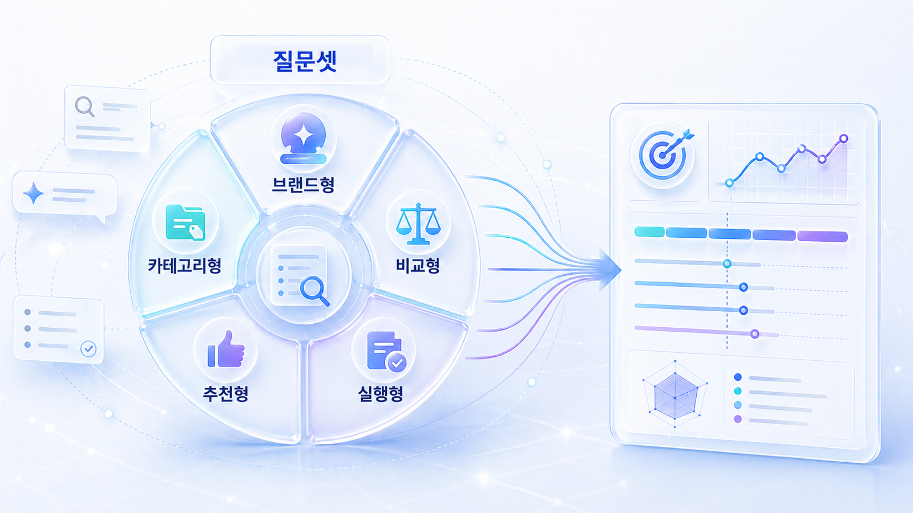

## 질문셋 구성 비중이 중요한 이유



질문셋 구성 비중은 GEO 측정의 품질을 좌우합니다. 포션을 정한 뒤에는 [질문셋에서 콘텐츠 갭을 찾는 법](https://wikidocs.net/346346)으로 실행 과제를 나눕니다.

질문셋 구성 비중은 우리가 측정하는 질문 묶음이 전체 시장 질문 중 어떤 영역을 대표하는지 보는 개념입니다. 브랜드 질문만 측정하면 비브랜드 추천 문맥을 놓칠 수 있고, 정보형 질문만 측정하면 비교/구매 문맥을 놓칠 수 있습니다.

## 질문셋을 나누는 방식

| 질문군 | 예시 | 의미 |
|---|---|---|
| 브랜드형 | HaloX는 어떤 도구야? | 이미 브랜드를 아는 사람의 질문 |
| 카테고리형 | GEO 분석 도구는 무엇이 있나? | 시장 탐색 질문 |
| 비교형 | HaloX와 Semrush를 비교해줘 | 검토 단계 질문 |
| 추천형 | B2B SaaS에 맞는 AI 검색 모니터링 도구 추천해줘 | 후보 선정 질문 |
| 실행형 | AI 검색 노출을 높이려면 무엇부터 해야 하나? | 실행 전환 질문 |

## HaloX 분석과 연결되는 지점

질문셋 구성 비중을 정하면 HaloX 리포트에서 어떤 질문군을 우선 볼지 결정할 수 있습니다. 단순 언급률보다 질문군별 언급률, 경쟁사 동시 언급률, 선택 이유, 답변 근거(source)/화면 인용(citation) 패턴을 함께 보는 것이 중요합니다.

## 사례로 이해하기

질문셋 구성 비중은 측정의 표본 설계입니다. 브랜드형 질문만 넣으면 좋아 보일 수 있지만, 비브랜드 추천형 질문에서 빠지는 문제는 놓칩니다.

## 질문셋 구성 비중이 필요한 이유

질문셋은 많이 만들수록 좋은 목록이 아닙니다. 정의형 질문만 많으면 브랜드 인지도는 설명할 수 있지만 구매/상담 전환으로 이어지기 어렵습니다. 반대로 추천형 질문만 많으면 근거가 약한 상태에서 무리하게 노출을 기대하게 됩니다.

포션을 나눈다는 것은 질문의 균형을 보는 일입니다. 정의형은 개념 이해, 비교형은 경쟁 구도, 추천형은 선택 후보, 검증형은 신뢰, 실행형은 다음 행동과 연결됩니다. 이 비중을 알아야 콘텐츠 우선순위도 정할 수 있습니다.

## 실습 워크시트

| 입력 항목 | 작성 기준 |
|---|---|
| 질문군 | 브랜드형/카테고리형/비교형/추천형/실행형 |
| 질문 수 | 전체 질문셋에서 몇 개를 넣을지 |
| 사업 의미 | 인지/검토/구매/실행 중 어떤 단계인지 |
| 우선순위 | 이번 기준선에서 반드시 봐야 하는지 |
| 다음 액션 | 질문 추가/삭제/재분류 |

## 정리 양식

```text
질문군별 포션표 / 우선 질문군 / 제외할 질문 / 다음 측정 기준
```

## 작성 예시

이 예시는 개념을 실제 운영 언어로 바꿔 보는 용도입니다. 그대로 베끼기보다 자기 브랜드의 질문, 페이지, 출처 후보로 바꿔 적습니다.

| 입력 항목 | 작성 예시 |
|---|---|
| 브랜드형 | 5개, AcmeGEO를 이미 아는 사용자의 질문 |
| 카테고리형 | 8개, GEO 분석 도구 시장 탐색 |
| 비교형 | 7개, AcmeGEO와 경쟁사 비교 |
| 추천형 | 7개, B2B SaaS 조건 추천 |
| 실행형 | 3개, 도입 후 측정 절차 확인 |

## 완료 기준

- 질문셋 안에서 정의/비교/추천/검증 비중을 조절할 수 있습니다.
- 특정 유형에 치우친 질문 목록을 고칠 수 있습니다.
- 1주차 기준선 진단에 쓸 질문 구성이 완성됩니다.

## HaloX로 이어지는 지점

질문셋 구성 비중을 잡은 뒤에는 HaloX의 [AI 검색 콘텐츠 구조 가이드](https://haloxlabs.ai/ko/blog/geo-content-structure)를 참고해 어떤 질문을 콘텐츠로 먼저 만들지 정리할 수 있습니다. 질문셋 구성 비중을 나눌 때도 Google의 [유용한 콘텐츠 만들기](https://developers.google.com/search/docs/fundamentals/creating-helpful-content)를 보조 기준으로 삼습니다. 질문 수보다 각 질문이 실제 의사결정에 도움이 되는지가 더 중요합니다.

## 다음에 읽을 글

다음은 [1주차 실습: 내 브랜드 GEO 기준선 진단](https://wikidocs.net/346341)입니다.

## 권장 비중 예시

처음 기준선을 잡을 때는 브랜드 질문에만 치우치지 않는 것이 중요합니다. 아래 비중은 출발점으로 쓰고, 업종에 따라 조정합니다.

| 질문군 | 권장 비중 | 이유 |
|---|---|---|
| 브랜드형 | 20% | 이미 브랜드를 아는 사용자의 답변 품질 확인 |
| 카테고리형 | 25% | 비브랜드 탐색 질문에서 후보로 들어가는지 확인 |
| 비교형 | 20% | 경쟁사와 어떤 기준으로 묶이는지 확인 |
| 추천형 | 20% | 실제 선택 문맥에서 등장하는지 확인 |
| 실행형/검증형 | 15% | 신뢰와 다음 행동으로 이어지는지 확인 |

## 체크포인트

질문셋을 만든 뒤 `우리 브랜드명을 뺀 질문이 절반 이상인가`를 확인합니다. GEO에서 중요한 기회는 브랜드를 모르는 사용자의 카테고리/비교/추천 질문에 숨어 있습니다.
