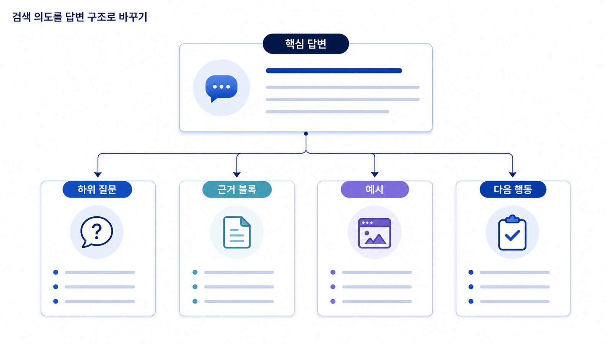

## SEO 콘텐츠 구조: 검색 의도를 Answer-first 답변으로 바꾸기


콘텐츠 구조는 글의 목차를 예쁘게 만드는 일이 아닙니다. 검색 의도를 실제 답변 순서로 바꾸는 작업입니다. 좋은 SEO 콘텐츠는 키워드를 많이 넣은 글이 아니라, 사용자가 기대한 답을 빠르게 제공하고, 필요한 근거와 다음 행동까지 자연스럽게 안내하는 글입니다.

GEO에서는 콘텐츠 구조가 더 중요해집니다. AI는 긴 글 전체를 그대로 가져가기보다 정의, 비교 기준, 절차, 표, FAQ, 사례 같은 정보 단위를 조합해 답변을 만듭니다. 따라서 콘텐츠는 사람이 읽기에도 좋아야 하고, AI가 답변 재료로 쓰기에도 구조화되어 있어야 합니다.

[TOC]

## 좋은 콘텐츠 구조의 원리

좋은 콘텐츠는 먼저 답하고, 그다음 설명합니다. 사용자가 `GEO 도구를 고를 때 무엇을 봐야 하나?`라고 묻는다면 첫 문단에서 바로 핵심 기준을 말해야 합니다. 배경 설명을 길게 늘어놓고 마지막에 답을 숨기면 사용자도 AI도 핵심을 잡기 어렵습니다.

콘텐츠 구조는 보통 아래 순서로 설계합니다.

1. 사용자의 질문을 한 문장으로 정의합니다.
2. 첫 문단에서 짧게 답합니다.
3. 왜 이 문제가 중요한지 설명합니다.
4. 판단 기준을 나눕니다.
5. 실제 예시나 Before/After를 보여줍니다.
6. 실행 순서나 체크리스트를 제공합니다.
7. 관련 페이지로 연결합니다.
8. FAQ로 남은 질문을 정리합니다.

이 흐름은 SEO에도 좋고 GEO에도 좋습니다. 사용자는 빠르게 이해하고, AI는 답변에 넣을 수 있는 구조화된 재료를 얻습니다.

## H2는 목차가 아니라 하위 질문이다

많은 글이 H2를 `개요`, `장점`, `기능`, `정리`처럼 씁니다. 이런 제목은 내부자에게는 편하지만 사용자에게는 약합니다. H2는 사용자가 실제로 묻는 하위 질문처럼 읽혀야 합니다.

예를 들어 `GEO 도구 비교` 글에서 약한 H2는 `주요 기능`, `가격`, `결론`입니다. 더 좋은 H2는 `GEO 도구는 어떤 질문셋을 관리해야 하나?`, `mention/source/citation을 따로 보여주는가?`, `월간 리포트로 재측정할 수 있는가?`, `SEO 도구와 GEO 도구는 어디가 달라지는가?`입니다.

이렇게 바꾸면 H2 자체가 검색 의도와 AI 질문 의도를 담습니다. 또한 내부 링크를 걸 때도 앵커 텍스트가 자연스러워집니다.

## Answer-first 구조

Answer-first 구조는 첫 문단에서 결론을 먼저 말하는 방식입니다. 단순히 요약문을 앞에 붙이는 것이 아닙니다. 첫 문단은 사용자가 이 페이지에 온 이유에 직접 답해야 합니다.

약한 첫 문단은 이렇게 시작합니다.

```text
최근 AI 검색이 중요해지면서 GEO 도구에 대한 관심이 커지고 있습니다. 여러 도구가 등장하고 있으며, 각 도구마다 기능이 다릅니다.
```

이 문단은 틀리지는 않지만 답이 없습니다. 좋은 첫 문단은 이렇게 바뀝니다.

```text
GEO 도구를 고를 때는 단순 순위 추적보다 질문셋 관리, 브랜드 mention, 답변 근거(source), 화면 인용(citation), 경쟁사 비교, 리포트 재측정 기능을 먼저 봐야 합니다. AI 검색에서는 검색결과 순위보다 어떤 질문에서 브랜드가 어떤 출처와 함께 설명되는지가 더 중요하기 때문입니다.
```

두 번째 문단은 사용자에게 바로 답을 주고, AI 답변에도 인용 가능한 문장 단위가 됩니다.



## 콘텐츠 블록을 설계하는 법

콘텐츠는 문단만으로 구성하지 않습니다. 의도에 따라 적절한 블록을 배치해야 합니다.

| 블록 | 쓰는 상황 | 역할 |
|---|---|---|
| 정의 | 용어를 처음 설명할 때 | AI가 짧게 요약할 수 있는 기본 문장 제공 |
| 비교표 | 여러 개념/도구/기준을 나눌 때 | 판단 기준을 빠르게 보여줌 |
| 절차 | 실행 방법을 알려줄 때 | 독자가 따라 할 순서 제공 |
| 체크리스트 | 점검이 필요할 때 | 누락 방지와 실무 적용 지원 |
| 사례 | 추상 개념을 구체화할 때 | 이해와 신뢰를 높임 |
| FAQ | 남은 질문을 정리할 때 | 롱테일 질문 대응 |
| CTA | 다음 행동이 필요할 때 | 상담, 다운로드, 다음 글, 리포트로 연결 |

표는 유용하지만 표만 많으면 요약본처럼 보입니다. 표 앞뒤에는 반드시 왜 이 표가 필요한지, 어떻게 읽어야 하는지, 다음 액션이 무엇인지 서술이 있어야 합니다.

## 실제 query에서 콘텐츠 브리프로 바꾸는 예

콘텐츠 브리프는 SEO 담당자의 분석과 작성자의 원고 사이를 연결하는 문서입니다. 예를 들어 `GEO 도구 비교`라는 query를 발견했다면 바로 글을 쓰기보다 아래처럼 브리프로 바꿉니다.

```text
타깃 query: GEO 도구 비교
검색 의도: B2B SaaS 마케팅팀이 AI 검색 모니터링 도구를 비교하려는 상업 조사형 의도
핵심 답변: 좋은 GEO 도구는 질문셋 관리, mention/source/citation 분리, 경쟁사 비교, 월간 재측정 리포트를 제공해야 한다.
필수 섹션: SEO 도구와 차이 / 질문셋 관리 / 지표 해석 / 리포트 예시 / 첫 30일 체크리스트
내부 링크: SEO/GEO 차이, 기준선 측정, mention/source/citation, 테크니컬 SEO
CTA: 리포트 샘플 보기 또는 상담 전 체크리스트
```

이렇게 브리프를 만들면 작성자는 “GEO 도구를 소개하는 글”이 아니라 “도구 선택을 도와주는 글”을 쓰게 됩니다. SEO 담당자와 콘텐츠팀이 같은 문서를 보고 작업하므로, 원고가 중간에 다른 방향으로 새는 것도 줄일 수 있습니다.

## 콘텐츠팀 작업 순서

1. 핵심 query와 AI 질문을 정합니다.
2. 검색 의도를 한 문장으로 씁니다.
3. 첫 문단의 직접 답변을 작성합니다.
4. H2를 하위 질문 형태로 구성합니다.
5. 각 H2 아래에 정의, 설명, 예시, 실행 방법을 배치합니다.
6. 표는 판단을 빠르게 돕는 곳에만 사용합니다.
7. 내부 링크와 CTA를 넣어 다음 행동을 연결합니다.
8. FAQ로 남은 롱테일 질문을 정리합니다.

## Before/After 예시

Before 구조는 흔한 요약형 글입니다.

```text
제목: GEO 도구란?
1. GEO 도구 소개
2. GEO 도구 기능
3. GEO 도구 장점
4. 마무리
```

이 구조는 너무 넓습니다. 사용자가 어떤 문제를 해결할 수 있는지 보이지 않습니다. After 구조는 검색 의도를 반영합니다.

```text
제목: GEO 도구 비교: AI 검색 모니터링에서 봐야 할 7가지 기준
1. GEO 도구는 무엇을 측정해야 하나?
2. SEO 도구와 GEO 도구는 어디가 달라지는가?
3. 질문셋 관리는 왜 중요한가?
4. mention/source/citation은 어떤 기준으로 나눠 봐야 하나?
5. 경쟁사 비교와 리포트 재측정은 측정과 기록?
6. 도입 전 준비해야 할 데이터는 무엇인가?
7. 첫 30일 실행 체크리스트
```

After 구조는 독자가 실제로 판단할 수 있게 돕습니다. 또한 AI가 질문에 답할 때 가져갈 수 있는 정보 단위가 분명합니다.

## GEO 연결

AI 검색에서 브랜드가 좋은 답변 재료가 되려면 페이지 안에 명확한 정의, 비교 기준, 절차, 사례, FAQ가 있어야 합니다. 콘텐츠 구조가 약하면 AI는 우리 페이지를 참고하더라도 답변에 쓸 문장을 찾기 어렵습니다. 따라서 GEO 콘텐츠는 `길게 쓰기`가 아니라 `답변에 필요한 정보 단위를 설계하기`에 가깝습니다.

## SEO 핵심 개념 더 깊게 보기

콘텐츠 구조를 실무로 옮기려면 `content brief`가 필요합니다. content brief는 작성자가 글을 쓰기 전에 보는 설계 문서입니다. 여기에는 타깃 query, 검색 의도, 독자 상태, 핵심 메시지, H2 구조, 포함할 예시, 내부 링크, CTA, 금지 표현, 참고 SERP가 들어갑니다.

또 중요한 개념은 `topical authority`입니다. 검색엔진과 사용자는 한 사이트가 특정 주제를 얼마나 폭넓고 깊게 다루는지 봅니다. `GEO 도구 비교` 한 글만으로는 부족합니다. GEO 뜻, AI 검색 모니터링, mention/source/citation, 리포트 운영, 테크니컬 점검, 엔티티 전략이 서로 연결되어야 주제 권위가 쌓입니다.

`content refresh`도 필요합니다. SEO 콘텐츠는 한 번 발행하고 끝나는 자산이 아닙니다. SERP가 바뀌거나 제품 기능이 바뀌거나 AI 검색 환경이 바뀌면 title, 첫 문단, H2, FAQ, 사례, 내부 링크를 갱신해야 합니다. 특히 GEO 주제는 변화가 빠르기 때문에 업데이트 날짜와 변경 이력을 봐야 합니다.

## 콘텐츠 브리프 템플릿

| 항목 | 작성 내용 |
|---|---|
| 타깃 query | GEO 도구 비교 |
| 검색 의도 | MOFU/상업 조사형/비교형 |
| 독자 | B2B SaaS 마케팅팀/대표/SEO 담당자 |
| 핵심 답변 | 좋은 GEO 도구는 질문셋, mention/source/citation, 경쟁사 비교, 재측정 기능을 제공해야 한다 |
| H2 구조 | 도구 차이/질문셋/지표/경쟁사/리포트/첫 30일 |
| 반드시 포함할 예시 | AcmeGEO 리포트 예시, GSC query 변환 예시 |
| 내부 링크 | SEO/GEO 차이, 기준선 측정, 리포트 운영, 테크니컬 SEO |
| CTA | 리포트 샘플 확인/상담 전 체크리스트 다운로드 |
| 검수 포인트 | 과장 표현, 출처 없는 비교, 최신성 |

## 가상 기업 AcmeGEO 연속 케이스: 브리프로 작가와 SEO 담당자 맞추기

AcmeGEO 팀은 SERP와 검색 의도 분석을 끝낸 뒤 바로 원고를 쓰지 않았습니다. 먼저 콘텐츠 브리프를 만들었습니다. SEO 담당자는 타깃 query와 SERP 갭을 정리했고, 콘텐츠팀은 H2를 질문형으로 바꿨습니다. 세일즈팀은 고객이 도입 전에 묻는 질문을 추가했고, 브랜드팀은 경쟁사 비교 표현의 수위를 검토했습니다.

이 과정을 거치자 글의 목적이 분명해졌습니다. 이 글은 `GEO 도구란 무엇인가`를 설명하는 글이 아니라, `GEO 도구를 고를 때 어떤 기준을 봐야 하는가`를 답하는 글이 되었습니다. 덕분에 첫 문단, 표, FAQ, CTA가 모두 같은 방향으로 정렬되었습니다.

## 참고 링크

- Google의 [유용한 콘텐츠 만들기](https://developers.google.com/search/docs/fundamentals/creating-helpful-content)는 콘텐츠가 실제 사용자에게 도움이 되는지 점검할 때 참고합니다.
- HaloX의 [AI 검색 콘텐츠 구조 가이드](https://haloxlabs.ai/ko/blog/geo-content-structure)는 GEO 콘텐츠 블록을 설계할 때 함께 볼 수 있습니다.

## 콘텐츠 구조를 팀 회의에서 확정하는 법

콘텐츠 구조는 작성자가 혼자 결정하면 안 됩니다. SEO 담당자는 검색 의도와 SERP 갭을 가져오고, 콘텐츠팀은 독자가 읽을 순서로 바꾸고, 세일즈팀은 실제 구매 전 질문을 보강하고, 브랜드팀은 표현 리스크를 검토해야 합니다. 특히 GEO 콘텐츠는 AI 답변에 그대로 인용될 수 있으므로 과장된 표현이나 근거 없는 비교를 피해야 합니다.

회의에서는 먼저 `이 페이지가 답해야 할 핵심 질문은 무엇인가?`를 정합니다. 그다음 `독자가 이 답을 믿으려면 어떤 근거가 필요한가?`를 묻습니다. 마지막으로 `읽고 난 뒤 독자가 무엇을 해야 하는가?`를 정합니다. 이 세 질문이 정리되지 않으면 페이지는 정보는 많지만 방향이 없는 글이 됩니다.

예를 들어 `GEO 도구 비교` 페이지의 핵심 질문은 “우리 팀에 맞는 GEO 도구를 고르려면 무엇을 봐야 하는가?”입니다. 신뢰 근거는 지표 정의, 리포트 예시, 경쟁사 비교 방식, 첫 30일 운영 절차입니다. 다음 행동은 내부 질문셋을 만들거나 리포트 샘플을 확인하는 것입니다. 이 흐름이 정해지면 목차와 CTA가 자연스럽게 나옵니다.

## 표를 남발하지 않는 기준

표는 비교와 점검에 강하지만 설명을 대신할 수 없습니다. 표만 읽어도 빠르게 판단할 수 있어야 하지만, 표 앞에는 왜 이 기준이 필요한지 설명이 있어야 하고, 표 뒤에는 그래서 무엇을 해야 하는지 안내가 있어야 합니다. 표가 많은데 서술이 없으면 독자는 지식 조각만 보고 전체 맥락을 놓칩니다.

좋은 기준은 `서술 → 표 → 해석 → 다음 액션`입니다. 먼저 개념을 설명하고, 표로 판단 기준을 보여주고, 표를 어떻게 읽어야 하는지 해석하고, 마지막에 실무자가 해야 할 일을 제시합니다. 1장의 모든 실무 표는 이 순서를 따라야 합니다.

다음은 [온페이지 SEO: 검색결과에서 약속한 답을 페이지에서 증명하는 법](https://wikidocs.net/346341)입니다.
