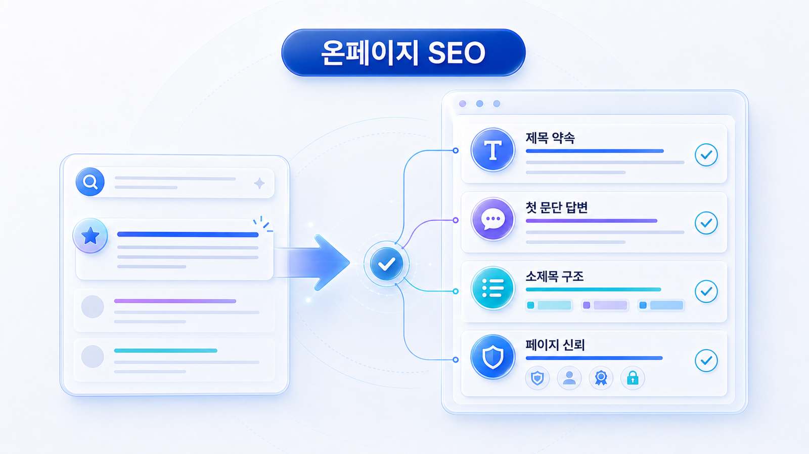
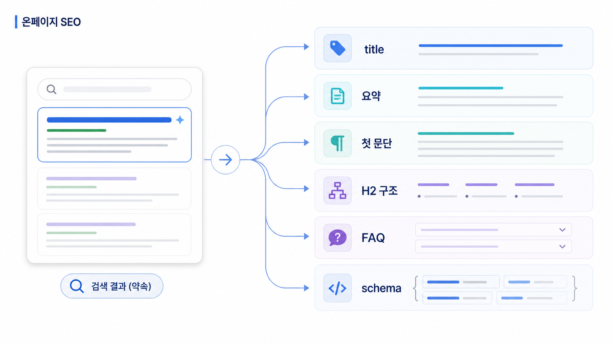

## 온페이지 SEO: 검색결과의 약속을 페이지에서 증명하기



온페이지 SEO는 페이지 안에서 검색 의도에 맞게 정보를 배치하는 작업입니다. 많은 사람이 온페이지 SEO를 title, meta description, H1 같은 요소를 채우는 일로만 이해하지만, 실제로는 검색결과에서 한 약속을 페이지 본문에서 증명하는 과정입니다.

사용자가 검색결과에서 어떤 제목을 보고 들어왔다면, 페이지는 그 제목이 약속한 답을 빠르게 제공해야 합니다. AI 검색에서도 마찬가지입니다. AI가 페이지를 답변 재료로 쓰려면 title, heading, 첫 문단, 본문 구조, 표, FAQ, schema가 같은 주제를 말해야 합니다.

`AcmeGEO`라는 이름은 설명을 위한 가상 기업명이며, 실제 고객 사례가 아닙니다.

[TOC]

## 온페이지 SEO의 핵심 원리

온페이지 SEO는 페이지의 모든 요소가 같은 의도를 향하게 만드는 작업입니다. title은 검색결과에서 약속을 합니다. meta description은 클릭 전에 기대치를 설명합니다. H1과 H2는 페이지의 답변 구조를 보여줍니다. 첫 문단은 사용자가 찾는 답을 바로 제공합니다. 본문은 근거와 예시를 쌓습니다. 내부 링크는 다음 판단으로 이어줍니다. schema는 본문 정보를 구조화합니다.

이 요소들이 서로 다른 말을 하면 페이지 품질이 약해집니다. title은 `GEO 도구 비교`인데 본문은 GEO의 정의만 설명한다면 사용자는 이탈할 가능성이 높습니다. H2는 기능 중심인데 실제 검색 의도는 리포트 검증이라면 콘텐츠가 빗나갑니다.

## title은 검색어와 답변 약속을 함께 담는다

title은 단순히 키워드를 넣는 자리가 아닙니다. 검색어와 사용자가 얻을 답을 함께 보여줘야 합니다.

약한 title은 `GEO 도구 정리`입니다. 무엇을 기준으로 정리했는지, 누가 읽어야 하는지, 어떤 판단을 도와주는지 보이지 않습니다. 더 좋은 title은 `GEO 도구 비교: AI 검색 모니터링에서 봐야 할 7가지 기준`입니다. 이 제목은 키워드와 답변 약속을 함께 담습니다.

title을 쓸 때는 세 가지를 확인합니다. 첫째, 핵심 query가 자연스럽게 들어갔는가. 둘째, 사용자가 얻을 결과가 보이는가. 셋째, 본문이 실제로 그 약속을 지키는가.

## meta description은 클릭 전 요약이다

meta description은 순위 요소로만 볼 것이 아니라, 사용자가 클릭 전에 페이지의 가치를 판단하는 요약문으로 봐야 합니다. 좋은 meta description은 페이지가 누구에게 어떤 답을 주는지 설명합니다.

예를 들어 `GEO 도구를 질문셋, mention/source/citation, 경쟁사 비교, 월간 리포트 재측정 기준으로 비교합니다.`라는 설명은 단순 소개보다 훨씬 구체적입니다. 사용자는 이 페이지가 기능 목록이 아니라 선택 기준을 제공한다는 것을 알 수 있습니다.

## 첫 문단은 답을 미루지 않는다

많은 SEO 글이 배경 설명으로 시작합니다. 하지만 사용자는 이미 문제를 가지고 들어왔습니다. 첫 문단은 답을 미루지 않아야 합니다.

`GEO 도구 비교` 페이지라면 첫 문단에서 좋은 GEO 도구의 기준을 말해야 합니다. `AI 검색 노출 확인 방법` 페이지라면 첫 문단에서 어떤 플랫폼, 어떤 질문셋, 어떤 지표를 기록해야 하는지 말해야 합니다.

첫 문단은 보통 2~4문장이 좋습니다. 첫 문장은 답, 두 번째 문장은 이유, 세 번째 문장은 이 페이지에서 다룰 범위를 말합니다.



## H2와 본문 구조

H2는 페이지의 하위 질문입니다. 사용자가 목차만 보고도 이 페이지가 자신이 궁금한 내용을 다루는지 판단할 수 있어야 합니다. `기능`, `장점`, `정리` 같은 H2는 너무 넓습니다. `mention/source/citation을 따로 보여주는가?`, `경쟁사와 같은 질문에서 비교할 수 있는가?`, `월간 리포트로 재측정할 수 있는가?`처럼 질문형으로 쓰면 더 좋습니다.

본문은 각 H2 아래에서 같은 순서로 전개하면 읽기 쉽습니다. 먼저 결론을 말하고, 왜 그런지 설명하고, 실무 예시를 보여주고, 필요하면 표나 체크리스트로 정리합니다.

## 이미지 alt, URL, FAQ, schema

온페이지 SEO는 텍스트 본문만으로 끝나지 않습니다. 이미지가 있다면 alt는 이미지를 설명하면서 페이지 주제와 연결되어야 합니다. URL slug는 짧고 의미가 있어야 합니다. FAQ는 본문에서 다룬 내용을 질문형으로 다시 정리해야 합니다. schema는 본문에 실제로 있는 정보를 구조화해야 합니다.

schema를 넣을 때 가장 중요한 원칙은 본문과 일치입니다. 본문에 없는 FAQ를 schema에만 넣거나, 실제 제품 정보와 다른 가격/리뷰 데이터를 넣으면 안 됩니다. GEO 관점에서도 구조화 데이터와 본문이 충돌하면 신뢰 신호가 약해집니다.

## 온페이지 리라이트 실무 순서

1. 대상 페이지의 핵심 query와 검색 의도를 확인합니다.
2. SERP에서 상위 결과의 title과 H2를 봅니다.
3. 현재 페이지의 title, meta, 첫 문단, H2가 같은 의도를 향하는지 점검합니다.
4. 첫 문단을 Answer-first 방식으로 다시 씁니다.
5. H2를 하위 질문 형태로 바꿉니다.
6. 비교, 절차, 체크리스트가 필요한 부분을 본문에 추가합니다.
7. 내부 링크와 CTA를 연결합니다.
8. FAQ와 schema를 본문과 일치하게 정리합니다.
9. 수정 후 GSC에서 CTR, query, page 변화를 봅니다.

## 긴 Before/After 예시

Before:

```text
제목: GEO 도구 소개
본문: 최근 AI 시대가 오면서 GEO 도구가 중요해지고 있습니다. GEO 도구는 여러 기능을 제공하며 기업의 마케팅에 판단 기준이 됩니다. 이번 글에서는 GEO 도구의 장점을 정리합니다.
```

이 글은 어떤 사용자에게 어떤 답을 주는지 불분명합니다. GEO 도구를 입문 단계하려는 사람에게도 부족하고, 도구를 비교하려는 사람에게도 부족합니다.

After:

```text
제목: GEO 도구 비교: AI 검색 모니터링에서 봐야 할 7가지 기준
첫 문단: GEO 도구를 고를 때는 검색 순위보다 질문셋 관리, 브랜드 mention, 답변 근거(source), 화면 인용(citation), 경쟁사 비교, 리포트 재측정 기능을 먼저 봐야 합니다. AI 검색에서는 사용자가 어떤 질문을 했을 때 브랜드가 어떤 출처와 함께 설명되는지가 성과 판단의 핵심이기 때문입니다. 여기서는 B2B SaaS 마케팅팀이 GEO 도구를 비교할 때 확인해야 할 기준과 첫 30일 측정 순서를 정리합니다.
H2:
- GEO 도구는 SEO 도구와 어디가 달라지는가?
- 질문셋 관리는 왜 중요한가?
- mention/source/citation은 어떤 기준으로 나눠 봐야 하나?
- 경쟁사 비교는 어떤 방식으로 해야 하나?
- 월간 리포트에서 어떤 개선 액션이 나와야 하나?
```

After는 title, 첫 문단, H2가 모두 같은 의도를 향합니다. 독자도 이해하기 쉽고, AI 답변에도 정의와 기준이 들어가기 좋습니다.

## 팀별 역할

콘텐츠팀은 첫 문단과 본문 구조를 책임집니다. SEO 담당자는 query, title, heading, 내부 링크, GSC 성과를 봅니다. 개발팀은 schema, 렌더링, canonical, 페이지 속도 같은 기술 요소를 지원합니다. 브랜드팀은 표현 리스크와 공식 용어를 검토합니다.

## GSC로 온페이지 개선 후보 찾기

온페이지 SEO는 감으로 고치기보다 Search Console 데이터에서 후보를 찾는 편이 좋습니다. 가장 먼저 볼 것은 `impressions는 있는데 CTR이 낮은 query/page`입니다. 이 경우 검색 수요는 있지만 검색결과에서 클릭을 설득하지 못하고 있을 가능성이 있습니다. title과 meta description, 검색 의도와의 일치 여부를 먼저 봅니다.

두 번째 후보는 `평균 순위가 5~20위인 query`입니다. 이미 Google이 어느 정도 관련성을 인정했지만 상위권으로 올라가기에는 콘텐츠 깊이, 내부 링크, 권위 신호가 부족할 수 있습니다. 이때는 title만 고치기보다 H2, 첫 문단, FAQ, 사례, 내부 링크까지 함께 봐야 합니다.

세 번째 후보는 `클릭은 있는데 GA4 engagement가 낮은 landing page`입니다. 이 경우 검색결과의 약속과 페이지 안의 답변이 맞지 않거나, 첫 문단이 답을 늦게 주거나, 다음 행동으로 이어지는 CTA가 약할 수 있습니다. 온페이지 SEO는 클릭을 얻는 작업이면서 동시에 클릭 이후의 만족도를 높이는 작업입니다.

## SEO 핵심 개념 더 깊게 보기

온페이지 SEO에서 자주 놓치는 것은 `CTR 개선`입니다. title과 meta description은 단순한 입력란이 아니라 검색결과에서 클릭을 결정하는 약속입니다. GSC에서 impressions는 높은데 CTR이 낮은 query는 title/meta 개선 후보입니다. 단, 클릭을 유도하려고 본문이 제공하지 않는 약속을 하면 안 됩니다.

URL slug도 함께 봐야 합니다. 짧고 의미 있는 URL은 사용자와 검색엔진 모두에게 페이지 주제를 이해시키는 데 판단 기준이 됩니다. 예를 들어 `/geo-tools-comparison`은 `/post?id=123`보다 의미가 분명합니다. 다만 이미 성과가 있는 URL을 자주 바꾸는 것은 위험합니다. URL 변경은 redirect, canonical, 내부 링크 수정과 함께 진행해야 합니다.

이미지 alt는 접근성과 SEO 모두에 필요합니다. alt는 키워드를 반복하는 자리가 아니라 이미지가 무엇을 보여주는지 설명하는 자리입니다. 리포트 캡처라면 `AcmeGEO 월간 GEO 리포트에서 mention/source/citation 지표를 보여주는 화면`처럼 구체적으로 쓰는 것이 좋습니다.

## 온페이지 SEO 체크리스트

| 항목 | 확인 질문 | 개선 액션 |
|---|---|---|
| title | 핵심 query와 답변 약속이 함께 있는가? | 검색 의도에 맞게 재작성 |
| meta | 클릭 전 기대치를 구체적으로 설명하는가? | 대상/기준/결과 포함 |
| H1/H2 | 페이지 주제와 하위 질문이 분명한가? | 모호한 제목을 질문형으로 수정 |
| 첫 문단 | 2~4문장 안에 답을 주는가? | Answer-first로 리라이트 |
| URL | 짧고 의미가 있는가? | 신규 URL은 규칙 적용, 기존 URL 변경은 신중히 |
| 이미지 alt | 이미지 내용을 설명하는가? | 키워드 반복 대신 설명 작성 |
| FAQ | 본문 핵심 질문을 보강하는가? | 실제 질문만 추가 |
| schema | 본문과 일치하는가? | Rich Results Test로 검증 |
| 내부 링크 | 다음 판단으로 이어지는가? | 의미 있는 앵커로 연결 |

## 가상 기업 AcmeGEO 연속 케이스: CTR 낮은 페이지 리라이트

AcmeGEO는 GSC에서 `GEO 도구 비교` query의 impressions는 늘었지만 CTR이 낮다는 것을 확인했습니다. 기존 title은 `GEO 도구 소개`였습니다. 이 제목은 검색어는 일부 담고 있지만 사용자가 얻을 답을 보여주지 못했습니다.

팀은 title을 `GEO 도구 비교: AI 검색 모니터링에서 봐야 할 7가지 기준`으로 바꾸고, meta description에는 `질문셋, mention/source/citation, 경쟁사 비교, 월간 리포트 재측정`을 넣었습니다. 첫 문단도 배경 설명 대신 선택 기준을 바로 말하도록 바꿨습니다. 이후 CTR과 engagement 변화를 함께 봅니다.

## 참고 링크

- Google의 [타이틀 링크 문서](https://developers.google.com/search/docs/appearance/title-link)는 title 작성 기준을 확인할 때 참고합니다.
- Google의 [스니펫 문서](https://developers.google.com/search/docs/appearance/snippet)는 meta description과 본문 요약의 관계를 이해할 때 유용합니다.
- Google의 [구조화 데이터 소개](https://developers.google.com/search/docs/appearance/structured-data/intro-structured-data)는 schema 적용 원칙을 볼 때 참고합니다.

다음은 [내부 링크: 페이지 사이의 의미 관계를 설계하는 법](https://wikidocs.net/346925)입니다.
