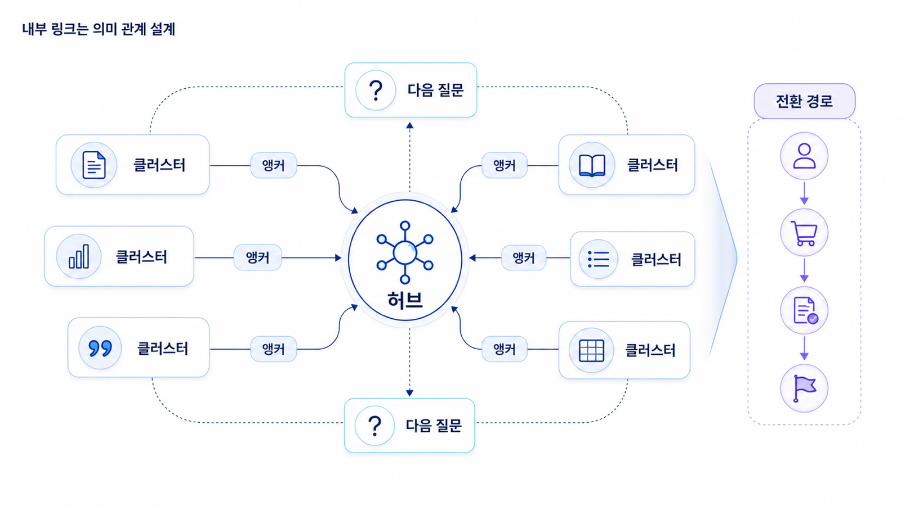

## 내부 링크: 페이지 사이의 의미 관계를 설계하는 법


내부 링크는 사이트 안의 페이지를 연결하는 링크입니다. 단순히 관련 글을 몇 개 붙이는 일이 아닙니다. 내부 링크는 검색엔진과 AI에게 어떤 페이지가 중요한지, 어떤 주제가 서로 연결되는지, 사용자가 다음에 무엇을 읽어야 하는지 알려주는 구조입니다.

SEO에서 내부 링크는 크롤링과 주제 권위에 영향을 줍니다. GEO에서도 함께 봐야 합니다. AI가 특정 주제에 대해 브랜드를 이해할 때, 하나의 페이지보다 연결된 설명 묶음이 더 강한 신호가 됩니다. `GEO 도구 비교` 페이지가 `mention/source/citation 지표`, `GEO 리포트`, `테크니컬 SEO`, `엔티티 전략`과 연결되어 있다면 사이트는 더 일관된 답변 근거를 제공합니다.

[TOC]

## 내부 링크의 기본 개념

내부 링크는 페이지 사이의 길입니다. 검색엔진 크롤러는 이 길을 따라 페이지를 발견합니다. 사용자는 링크를 따라 더 깊은 정보를 읽습니다. 사이트 운영자는 내부 링크를 통해 어떤 페이지가 허브이고 어떤 페이지가 세부 설명인지 보여줍니다.

내부 링크가 약하면 중요한 페이지가 고립됩니다. 고립 페이지는 사이트 안에서 발견되기 어렵고, 주제 맥락도 약합니다. 반대로 모든 페이지가 무작위로 서로 연결되어 있으면 구조가 흐려집니다. 좋은 내부 링크는 `관련 있는 페이지끼리`, `명확한 앵커 텍스트로`, `사용자의 다음 질문에 맞게` 연결합니다.

## 허브와 클러스터

SEO 실무에서 자주 쓰는 구조가 허브와 클러스터입니다. 허브 페이지는 넓은 주제를 다루는 중심 페이지입니다. 클러스터 페이지는 허브의 하위 질문을 깊게 다루는 페이지입니다.

예를 들어 `GEO 실전 교과서`에서 1장 인트로는 SEO 기본기의 허브 역할을 합니다. `키워드 리서치`, `SERP 분석`, `검색 의도`, `온페이지 SEO`, `테크니컬 SEO`, `권위/엔티티`, `측정/개선` 페이지는 클러스터입니다. 허브는 각 클러스터로 연결하고, 클러스터는 다시 허브와 관련 클러스터로 연결되어야 합니다.

이 구조는 독자에게도 좋습니다. 처음 읽는 사람은 허브에서 전체 지도를 보고, 필요한 하위 페이지로 이동할 수 있습니다. AI와 검색엔진도 사이트가 특정 주제를 체계적으로 설명하고 있음을 이해하기 쉽습니다.

## 앵커 텍스트는 의미를 담아야 한다

앵커 텍스트는 링크가 걸린 문장입니다. `여기`, `자세히 보기`, `관련 글` 같은 앵커는 의미가 약합니다. 더 좋은 앵커는 이동할 페이지의 주제와 사용자의 다음 질문을 보여줍니다.

약한 예:

```text
자세한 내용은 여기를 참고하세요.
```

좋은 예:

```text
검색 의도를 콘텐츠 구조로 바꾸는 방법은 콘텐츠 구조 설계 페이지에서 이어서 볼 수 있습니다.
```

좋은 앵커는 사용자에게도 도움이 되고, 검색엔진에게도 링크된 페이지의 의미를 알려줍니다.



## 내부 링크 맵을 만드는 실무 순서

1. 핵심 허브 페이지를 정합니다.
2. 허브 아래에 들어갈 클러스터 페이지를 나눕니다.
3. 각 클러스터가 답하는 질문을 한 문장으로 씁니다.
4. 허브에서 모든 핵심 클러스터로 링크합니다.
5. 클러스터끼리 이어지는 순서가 있으면 다음 단계 링크를 넣습니다.
6. 깊은 실무 페이지에서 다시 허브나 측정 페이지로 돌아갈 수 있게 합니다.
7. 앵커 텍스트가 `여기`가 아니라 의미 있는 문장인지 확인합니다.
8. GSC와 크롤링 도구로 고립 페이지가 없는지 확인합니다.

## 실제 query별 내부 링크 설계 예

내부 링크는 query의 의도에 따라 달라져야 합니다. 같은 GEO 주제라도 사용자가 처음 배우는 단계인지, 비교하는 단계인지, 검증하는 단계인지에 따라 다음에 연결할 페이지가 다릅니다.

| 실제 query | 사용자의 다음 질문 | 우선 연결할 내부 페이지 |
|---|---|---|
| GEO 뜻 | SEO와 무엇이 다른가? | GEO/SEO/AEO/AIO 차이, AI 검색 차이 |
| AI 검색 최적화 방법 | 실제로 어떤 순서로 실행하나? | 4주 실행 로드맵, Answer-first 콘텐츠 |
| GEO 도구 비교 | 어떤 지표로 골라야 하나? | mention/source/citation, GEO 리포트 지표 |
| ChatGPT 브랜드 노출 확인 | 우리 브랜드 기준선을 어떻게 잡나? | 기준선 진단, AI 검색 모니터링 |
| GEO 대행사 비용 | 제안서를 어떻게 검증하나? | 대행사 체크리스트, 제안서 비교 |

이 표를 만들면 내부 링크가 단순 추천 글 목록이 아니라 사용자 여정 지도가 됩니다. SEO 담당자는 query별 다음 질문을 기준으로 링크 우선순위를 정하고, 콘텐츠팀은 본문 안에 자연스러운 앵커 문장으로 연결합니다.

## GEO 도구 비교 글의 내부 링크 예시

`GEO 도구 비교` 페이지가 있다고 가정해 봅니다. 이 페이지는 혼자 존재하면 약합니다. 독자가 도구를 비교하다가 지표 해석, 기준선 측정, 기술 SEO, 엔티티 전략으로 이어질 수 있어야 합니다.

```text
GEO 도구 비교 페이지
→ mention/source/citation 지표 설명
→ AI 검색 기준선 측정 방법
→ GEO 리포트 예시
→ 테크니컬 SEO 점검표
→ 권위/엔티티 신호 보강 방법
→ 상담 또는 리포트 다운로드 CTA
```

이 흐름은 사용자의 판단 여정을 돕습니다. 동시에 사이트 안에서 GEO라는 주제의 의미 관계를 강화합니다.

## 내부 링크와 GEO의 관계

AI 검색에서 내부 링크가 직접 순위를 결정한다고 단정할 수는 없습니다. 하지만 내부 링크는 공개 웹에서 브랜드와 주제가 어떻게 구조화되어 있는지를 보여주는 중요한 신호입니다. 잘 연결된 사이트는 특정 질문에 대해 여러 깊이의 답변을 제공합니다. 정의 페이지, 비교 페이지, 리포트 페이지, 기술 점검 페이지, 사례 페이지가 서로 연결되어 있으면 AI가 브랜드를 특정 주제의 답변 후보로 이해하기 쉽습니다.

GEO에서는 내부 링크를 `citation 후보를 안정화하는 작업`으로도 봐야 합니다. AI 답변에 인용되기를 원하는 핵심 페이지가 있다면, 그 페이지는 사이트 안에서 고립되어 있으면 안 됩니다. 허브와 관련 페이지에서 자연스럽게 연결되어야 합니다.

## 팀별 역할

SEO 담당자는 허브/클러스터 구조와 앵커 기준을 설계합니다. 콘텐츠팀은 본문 안에서 자연스러운 링크 문장을 작성합니다. 개발팀은 사이트맵, breadcrumbs, 관련 글 모듈, URL 구조를 지원합니다. 브랜드팀은 중요한 공식 페이지가 잘 연결되어 있는지 확인합니다.

## 흔한 실수

첫 번째 실수는 글 하단에 관련 글을 무작위로 붙이는 것입니다. 내부 링크는 사용자의 다음 질문과 연결되어야 합니다. 두 번째 실수는 모든 페이지에서 동일한 CTA만 반복하는 것입니다. 정보형 글과 비교형 글, 실행형 글의 다음 행동은 다릅니다. 세 번째 실수는 중요한 페이지가 메뉴나 허브에서 연결되지 않는 것입니다. 핵심 페이지는 사이트 구조 안에서 반복적으로 발견되어야 합니다.

## 내부 링크 산출물

| 항목 | 작성 내용 |
|---|---|
| 허브 페이지 | 넓은 주제를 설명하는 중심 페이지 |
| 클러스터 페이지 | 하위 질문을 깊게 다루는 페이지 |
| 앵커 텍스트 | 링크될 페이지의 의미를 담은 문장 |
| 우선 링크 | 반드시 연결해야 할 핵심 페이지 |
| 보조 링크 | 맥락상 있으면 좋은 페이지 |
| 고립 페이지 | 내부 링크가 부족한 페이지 |
| 다음 액션 | 링크 추가/앵커 수정/허브 보강/사이트맵 확인 |

## SEO 핵심 개념 더 깊게 보기

내부 링크 실무에서는 `contextual link`, `anchor text`, `orphan page`, `topic cluster`를 이해해야 합니다. contextual link는 본문 문맥 안에 자연스럽게 들어간 링크입니다. 하단 관련 글보다 문맥 링크가 독자의 다음 질문을 더 잘 안내할 때가 많습니다.

anchor text는 링크가 걸린 텍스트입니다. `여기`보다 `GEO 리포트 지표 해석`처럼 목적지가 무엇인지 보이는 앵커가 좋습니다. anchor text는 과하게 최적화하면 부자연스럽지만, 너무 모호하면 의미 전달이 약합니다.

orphan page는 내부 링크가 거의 없어 사이트 구조 안에서 고립된 페이지입니다. 좋은 콘텐츠라도 고립되어 있으면 크롤러와 사용자가 발견하기 어렵습니다. topic cluster는 허브 페이지와 여러 하위 페이지가 주제 단위로 연결된 구조입니다. GEO에서는 이 구조가 브랜드가 특정 질문 영역을 깊게 다룬다는 신호가 됩니다.

## 내부 링크 맵 템플릿

| 항목 | 적용 예시 | 확인 질문 |
|---|---|---|
| 허브 페이지 | SEO 기본기와 GEO 확장 전략 | 넓은 주제를 대표하는가? |
| 클러스터 페이지 | 키워드 리서치, SERP 분석, 온페이지 SEO | 하위 질문을 깊게 다루는가? |
| 핵심 앵커 | 검색 의도를 답변 구조로 바꾸는 법 | 목적지가 분명한가? |
| 문맥 링크 위치 | SERP 분석 후 콘텐츠 구조로 이동 | 독자의 다음 질문과 맞는가? |
| 고립 페이지 | 리포트 예시 페이지 | 허브나 관련 글에서 링크되는가? |
| CTA 링크 | 리포트 샘플 확인 | 행동 단계와 맞는가? |
| 점검 주기 | 월 1회 | 새 글/리라이트 후 반영되는가? |

## AcmeGEO 연속 케이스: 내부 링크로 퍼널 만들기

AcmeGEO는 `GEO 도구 비교` 글을 발행한 뒤 내부 링크를 설계했습니다. 정보형 독자는 `GEO 뜻`과 `SEO/GEO 차이`로 이동할 수 있게 했고, 비교형 독자는 `mention/source/citation 지표 해석`과 `GEO 리포트 예시`로 이동하게 했습니다. 구매 직전 독자는 `첫 30일 기준선 측정 체크리스트`와 상담 CTA로 연결했습니다.

이 구조는 SEO만을 위한 것이 아닙니다. AI 답변에 인용되기를 원하는 핵심 URL이 사이트 안에서 어떤 문맥으로 연결되는지 보여줍니다. 내부 링크가 정리되면 콘텐츠 묶음이 생기고, 그 묶음은 GEO에서 source/citation 후보를 안정화하는 기반이 됩니다.

## 참고 링크

- Google Search Central의 [SEO 시작 가이드](https://developers.google.com/search/docs/fundamentals/seo-starter-guide)는 사이트 구조와 링크 기본 원칙을 이해하는 데 판단 기준이 됩니다.
- 내부 링크와 콘텐츠 구조를 함께 고칠 때는 [AI가 인용하는 Answer-first 콘텐츠](https://wikidocs.net/346347)와 연결해 보면 좋습니다.

## 내부 링크를 실제로 고치는 운영 시나리오

내부 링크 개선은 새 글을 발행할 때만 하는 일이 아닙니다. 월 1회 정도는 핵심 페이지를 기준으로 링크 상태를 점검해야 합니다. 먼저 GSC에서 노출이 늘고 있는 페이지를 고릅니다. 그 페이지가 어떤 query에서 보이는지 확인한 뒤, 사용자가 다음에 궁금해할 페이지로 연결되어 있는지 봅니다. 클릭은 많지만 전환이 낮은 페이지라면 다음 행동으로 이어지는 내부 링크와 CTA가 약할 수 있습니다.

예를 들어 `AI 검색 모니터링` 글에 유입이 늘었는데 문의가 없다면, 독자가 다음에 봐야 할 `GEO 리포트 예시`, `도구 비교 기준`, `첫 30일 기준선 측정` 페이지가 본문 안에서 자연스럽게 연결되어 있는지 확인합니다. 하단 관련 글 모듈에만 의존하지 말고, 본문 문맥 안에서 “이 지표를 실제 리포트에서 어떻게 읽는지는 GEO 리포트 예시에서 확인할 수 있습니다”처럼 연결해야 합니다.

## 내부 링크 우선순위 정하기

모든 페이지에 모든 링크를 넣으면 구조가 흐려집니다. 우선순위는 사용자 여정과 사업 중요도를 함께 봐야 합니다. 정보형 페이지에서는 더 깊은 설명으로, 비교형 페이지에서는 선택 기준과 사례로, 실행형 페이지에서는 체크리스트와 템플릿으로, 구매 직전 페이지에서는 상담이나 리포트 요청으로 이어지는 링크가 필요합니다.

내부 링크를 고칠 때는 `이 링크가 독자의 다음 질문에 답하는가?`를 기준으로 삼습니다. 답이 아니라면 빼도 됩니다. SEO를 위해 무리하게 링크를 넣는 것이 아니라, 독자가 자연스럽게 더 정확한 판단으로 이동하도록 돕는 것이 목적입니다.

다음은 [테크니컬 SEO: 좋은 콘텐츠가 검색엔진과 AI에게 읽히게 만드는 조건](https://wikidocs.net/346926)입니다.
