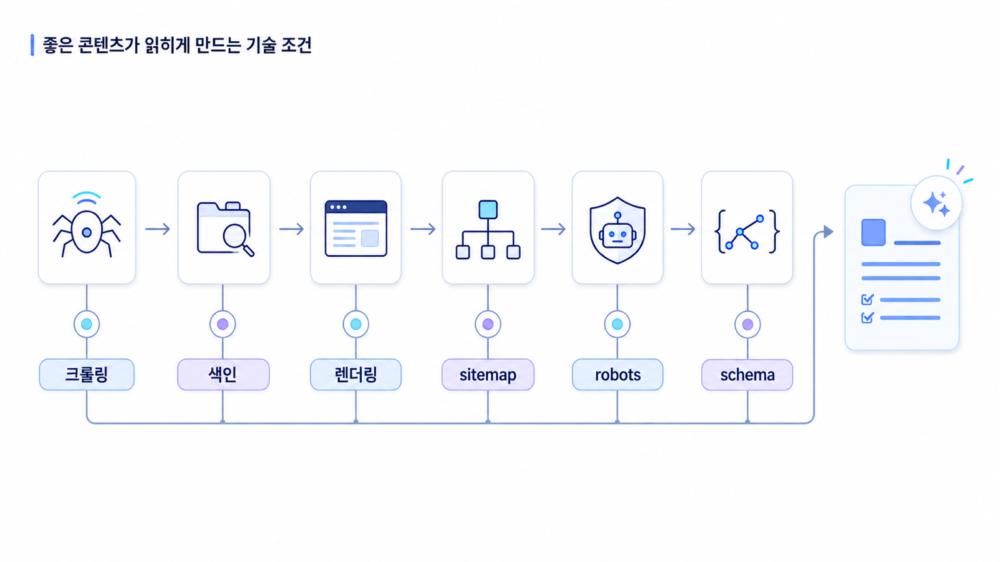

## 테크니컬 SEO: 좋은 콘텐츠가 검색엔진과 AI에게 읽히게 만드는 조건


테크니컬 SEO는 검색엔진이 페이지를 발견하고, 접근하고, 렌더링하고, 색인하고, 올바른 대표 URL로 이해하도록 만드는 작업입니다. 좋은 콘텐츠를 만들어도 검색엔진이 페이지를 찾지 못하거나, 본문을 읽지 못하거나, canonical이 잘못되어 대표 URL이 흔들리면 성과가 제한됩니다.

GEO에서도 테크니컬 SEO는 꼭 봐야 합니다. AI 검색이 어떤 방식으로 답변 근거를 수집하든, 공개 페이지가 발견 가능하고 읽을 수 있고 구조적으로 해석 가능해야 답변 재료가 될 가능성이 생깁니다.

[TOC]

## 테크니컬 SEO를 어렵게 느끼는 이유

테크니컬 SEO는 용어가 낯섭니다. 크롤링, 색인, canonical, robots, sitemap, rendering, schema 같은 말이 나오면 콘텐츠팀은 개발 영역이라고 느끼기 쉽습니다. 하지만 실무자는 모든 기술을 직접 구현할 필요는 없습니다. 중요한 것은 어떤 문제가 콘텐츠 성과를 막는지 이해하고, 개발팀과 같은 언어로 이슈를 전달하는 것입니다.

테크니컬 SEO는 완벽한 기술 문서가 아니라 질문입니다.

```text
이 페이지를 검색엔진과 AI가 찾을 수 있는가?
이 페이지에 접근할 수 있는가?
이 페이지의 본문을 읽을 수 있는가?
어떤 URL이 대표인지 분명한가?
본문과 구조화 데이터가 같은 내용을 말하는가?
```

이 질문에 답할 수 있으면 실무 대화가 훨씬 쉬워집니다.

## 크롤링, 색인, 렌더링

크롤링은 검색엔진이 URL을 발견하고 방문하는 과정입니다. sitemap, 내부 링크, 외부 링크가 크롤링의 길이 됩니다. 색인은 검색엔진이 페이지를 검색 대상에 포함하는 과정입니다. noindex, robots 차단, 중복 canonical, 품질 문제는 색인을 막을 수 있습니다. 렌더링은 브라우저나 크롤러가 페이지를 실제로 그려 본문을 읽는 과정입니다. JavaScript에 지나치게 의존하는 페이지는 본문이 늦게 보이거나 일부 크롤러에게 약하게 읽힐 수 있습니다.

GEO 관점에서는 이 세 가지가 모두 답변 근거의 기본 조건입니다. 페이지가 발견되지 않으면 source 후보가 되기 어렵고, 색인되지 않으면 검색 기반 신호가 약해지며, 본문이 제대로 렌더링되지 않으면 AI가 가져갈 설명 재료가 부족해질 수 있습니다.

## sitemap, robots, canonical

sitemap은 중요한 URL 목록을 알려주는 파일입니다. 모든 URL을 무조건 넣는 것이 아니라 검색엔진이 알아야 할 핵심 URL을 포함해야 합니다. robots.txt는 크롤러 접근 규칙을 알려줍니다. 실수로 핵심 경로를 차단하면 좋은 콘텐츠도 발견되지 않을 수 있습니다. canonical은 중복되거나 유사한 URL 중 대표 URL을 지정합니다. canonical이 흔들리면 검색 신호와 citation 후보가 분산될 수 있습니다.

예를 들어 리포트 예시 페이지가 `/reports/geo-report`와 `/campaign/geo-report?utm=...`로 동시에 존재하는데 canonical이 캠페인 URL을 가리키면 AI나 검색엔진이 대표 URL을 혼동할 수 있습니다. GEO에서는 source/citation으로 남길 URL이 안정적이어야 하므로 canonical 정리를 봐야 합니다.

## schema와 구조화 데이터

schema는 페이지의 정보를 구조화해 검색엔진이 이해하기 쉽게 만드는 방식입니다. Article, Organization, FAQPage, Product 같은 타입이 자주 쓰입니다. 하지만 schema는 본문을 대신하지 않습니다. 본문에 없는 정보를 schema에만 넣으면 안 됩니다.

GEO 관점에서도 schema는 보조 신호입니다. AI가 페이지를 이해하는 데 도움이 될 수 있지만, 본문 자체가 명확하지 않으면 구조화 데이터만으로 좋은 답변 재료가 되기 어렵습니다. 따라서 먼저 본문에 정의, 기준, 절차, FAQ를 명확히 쓰고, 그중 구조화할 수 있는 내용을 schema로 표현하는 순서가 좋습니다.



## 콘텐츠팀이 알아야 할 기술 SEO

콘텐츠팀은 모든 기술 구현을 몰라도 됩니다. 다만 아래는 알아야 합니다.

- 핵심 페이지가 sitemap에 포함되어야 한다.
- 페이지가 noindex나 robots 차단 상태면 검색에 나오기 어렵다.
- title, H2, 첫 문단, schema가 서로 다른 말을 하면 해석이 흔들린다.
- 이미지나 인터랙션 안에만 핵심 텍스트가 있으면 읽히기 어려울 수 있다.
- URL이 자주 바뀌면 citation과 내부 링크가 깨질 수 있다.
- 오래된 페이지를 삭제할 때는 redirect와 canonical을 함께 봐야 한다.

## 실제 query에서 기술 점검 대상으로 바꾸기

테크니컬 SEO는 사이트 전체를 막연히 점검하면 범위가 커집니다. 먼저 성과에 중요한 query와 페이지를 고른 뒤, 그 페이지가 검색엔진과 AI에게 안정적으로 읽히는지 확인하는 방식이 현실적입니다.

| 실제 query | 핵심 URL | 우선 점검할 기술 항목 |
|---|---|---|
| GEO 도구 비교 | `/geo-tools-comparison` | canonical, title/H1 일치, Product/Article schema |
| GEO 리포트 예시 | `/geo-report-sample` | sitemap 포함, HTML 본문, 이미지 alt, FAQ schema |
| ChatGPT 브랜드 노출 확인 | `/chatgpt-brand-visibility` | 색인 상태, 내부 링크, Core Web Vitals |
| GEO 대행사 체크리스트 | `/geo-agency-checklist` | robots 차단 여부, 구조화 데이터, 모바일 가독성 |

이렇게 정리하면 개발팀 티켓이 구체화됩니다. `SEO 점검 필요`가 아니라 `GEO 리포트 예시 페이지를 sitemap에 포함하고 canonical을 대표 URL로 고정한다`처럼 담당자가 바로 실행할 수 있는 요청이 됩니다.

## 개발팀과 나눌 점검표

| 점검 항목 | 콘텐츠팀 질문 | 개발팀 확인 |
|---|---|---|
| 발견 | 핵심 페이지가 sitemap과 내부 링크에 있는가? | sitemap, robots, crawl log |
| 접근 | 로그인이나 차단 없이 열리는가? | HTTP status, robots meta |
| 렌더링 | 본문이 HTML에서 읽히는가? | SSR/CSR, hydration, rendered HTML |
| 대표 URL | canonical이 올바른가? | canonical, redirect, URL parameter |
| 구조화 | schema가 본문과 일치하는가? | JSON-LD, Rich Results Test |
| 성능 | 모바일에서 읽기 괜찮은가? | Core Web Vitals, PageSpeed |

## 실무 점검 순서

1. AI 답변 근거가 되어야 할 핵심 URL 10개를 고릅니다.
2. 각 URL이 sitemap에 있는지 확인합니다.
3. robots.txt와 robots meta가 접근을 막지 않는지 봅니다.
4. HTTP status가 200인지 확인합니다.
5. canonical이 대표 URL을 가리키는지 확인합니다.
6. 본문 핵심 텍스트가 HTML에서 읽히는지 봅니다.
7. title, H2, 첫 문단, schema가 같은 주제를 말하는지 확인합니다.
8. Google Search Console URL 검사, Rich Results Test, PageSpeed Insights로 검증합니다.
9. 수정 담당을 콘텐츠/개발/SEO로 나눕니다.

## AcmeGEO 예시

AcmeGEO는 `GEO 리포트 예시` 페이지를 만들었지만 AI 답변에서 source로 잘 잡히지 않았습니다. 확인해 보니 페이지는 캠페인 랜딩으로 만들어져 내부 링크가 거의 없었고, sitemap에도 빠져 있었습니다. URL은 UTM이 붙은 버전이 여러 개였고 canonical도 불명확했습니다. 본문 핵심 설명은 이미지 안에 들어가 있어 텍스트로 충분히 읽히지 않았습니다.

팀은 먼저 대표 URL을 정하고 canonical을 수정했습니다. sitemap에 페이지를 추가하고, `GEO 리포트`, `mention/source/citation`, `도구 비교` 페이지에서 내부 링크를 연결했습니다. 이미지 안에 있던 리포트 설명을 본문 텍스트와 표로 옮겼고, FAQ와 Article schema를 본문과 일치하게 추가했습니다. 이 작업 이후 GSC에서 페이지 노출이 생기고, AI 답변 측정에서도 source 후보로 확인할 수 있게 되었습니다.

## SEO 핵심 개념 더 깊게 보기

테크니컬 SEO에서는 status code를 이해해야 합니다. 200은 정상 페이지, 301은 영구 이동, 302는 임시 이동, 404는 찾을 수 없음, 410은 제거됨, 500번대는 서버 오류입니다. 핵심 페이지가 404이거나 redirect chain이 길면 검색엔진과 사용자가 안정적으로 접근하기 어렵습니다.

`noindex`는 페이지를 검색 색인에서 제외하라는 신호입니다. 운영 중 실수로 noindex가 남아 있으면 좋은 콘텐츠도 검색에 나오지 않습니다. `nofollow`는 링크를 따라가지 말라는 신호와 관련됩니다. robots.txt는 크롤러 접근을 제어하지만, noindex와 역할이 다릅니다. 두 개념을 혼동하면 색인 문제가 생깁니다.

Core Web Vitals는 페이지 경험 지표입니다. LCP는 주요 콘텐츠가 얼마나 빨리 보이는지, INP는 사용자 입력에 얼마나 빠르게 반응하는지, CLS는 화면이 얼마나 안정적인지를 봅니다. GEO에서 직접적인 답변 노출을 보장하는 지표는 아니지만, 검색성과 사용자 경험을 함께 관리하려면 판단 기준으로 봅니다.

## 기술 SEO 이슈 티켓 템플릿

| 항목 | 적용 예시 |
|---|---|
| 이슈 제목 | `/geo-report` 페이지 canonical이 캠페인 URL을 가리킴 |
| 발견 경로 | GSC URL 검사 / 크롤링 점검 |
| 영향 | 대표 URL 혼선, source/citation URL 분산 가능성 |
| 대상 URL | www.example.com/geo-report |
| 기대 상태 | canonical이 대표 URL을 가리켜야 함 |
| 담당 | 개발팀/SEO 담당자 |
| 우선순위 | 높음 |
| 검증 방법 | 수정 후 GSC URL 검사, canonical 확인, sitemap 재제출 |

## AcmeGEO 연속 케이스: 기술 이슈를 개발 티켓으로 바꾸기

AcmeGEO는 리포트 예시 페이지가 AI 답변 source로 잘 잡히지 않는 문제를 발견했습니다. SEO 담당자는 페이지가 sitemap에 없고, canonical이 UTM이 붙은 캠페인 URL을 가리키며, 리포트 설명의 핵심 내용이 이미지 안에만 있다는 점을 확인했습니다.

이 문제를 `SEO 개선 필요`라고 쓰면 개발팀이 움직이기 어렵습니다. 대신 `대표 URL canonical 수정`, `sitemap 포함`, `리포트 핵심 설명 HTML 본문화`, `FAQ schema 검증`처럼 작은 티켓으로 나눴습니다. 각 티켓에는 영향, 대상 URL, 기대 상태, 검증 방법을 붙였습니다. 이렇게 해야 콘텐츠팀과 개발팀이 같은 문제를 같은 기준으로 해결할 수 있습니다.

## 참고 링크

- Google의 [사이트맵 문서](https://developers.google.com/search/docs/crawling-indexing/sitemaps/overview)는 핵심 URL 발견 상태를 점검할 때 참고합니다.
- Google의 [robots.txt 소개](https://developers.google.com/search/docs/crawling-indexing/robots/intro)는 크롤러 접근 차단 여부를 볼 때 필요합니다.
- Google의 [중복 URL 통합/canonical 문서](https://developers.google.com/search/docs/crawling-indexing/consolidate-duplicate-urls)는 대표 URL 정리에 유용합니다.
- Google의 [구조화 데이터 소개](https://developers.google.com/search/docs/appearance/structured-data/intro-structured-data)는 schema 적용 원칙을 확인할 때 참고합니다.

다음은 [권위/백링크/엔티티: 믿을 만한 브랜드로 이해되게 만드는 외부 신호](https://wikidocs.net/346927)입니다.
