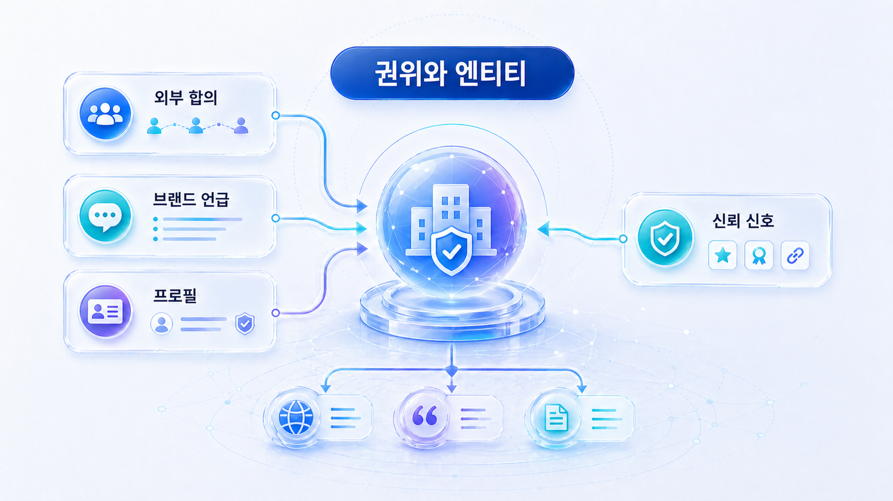
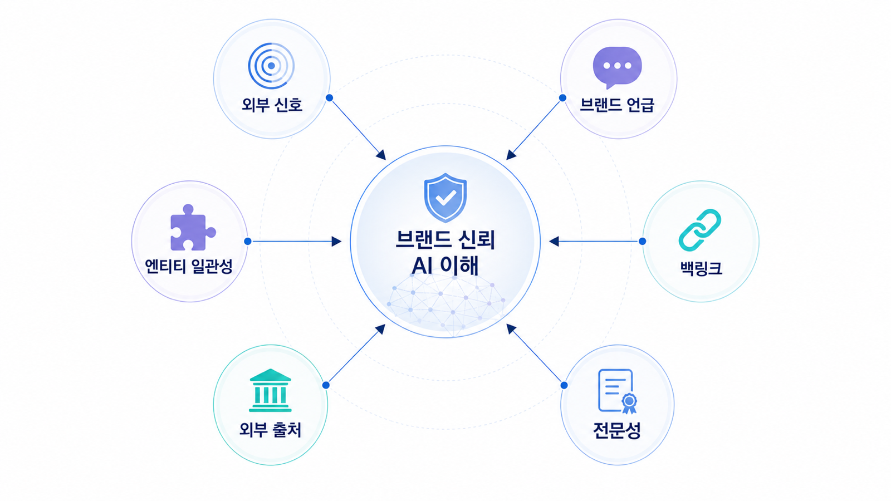

## SEO 권위 신호와 엔티티: 백링크/E-E-A-T를 GEO로 확장하기

SEO에서 권위는 단순히 링크 수가 많다는 뜻이 아닙니다. 검색엔진과 사용자가 어떤 사이트와 브랜드를 믿을 만한 정보원으로 볼 수 있는지 판단하는 여러 신호의 묶음입니다. 백링크, 브랜드 mention, 외부 프로필, 뉴스룸, 고객 사례, 리뷰, 전문성, 작성자 정보, 업데이트 이력 등이 모두 권위 신호와 연결됩니다.

GEO에서는 이 개념이 더 넓어집니다. AI가 브랜드를 어떤 카테고리의 답으로 이해하는지, 어떤 외부 출처가 같은 설명을 반복하는지, 어떤 문장이 source나 citation으로 쓰일 수 있는지까지 관리해야 합니다. 그래서 권위/백링크/엔티티 작업은 링크를 많이 만드는 일이 아니라, 브랜드에 대한 신뢰 가능한 설명 생태계를 만드는 일입니다.

[TOC]

## 백링크를 다시 이해하기

백링크는 다른 사이트에서 우리 사이트로 거는 링크입니다. 과거에는 링크 수 자체를 늘리는 방식이 강조되기도 했지만, 지금은 링크의 품질, 맥락, 관련성이 훨씬 판단 기준으로 봅니다. 관련 없는 사이트에서 온 링크, 인위적으로 만든 링크, 내용 없는 디렉터리 링크는 장기적으로 도움이 되지 않습니다.

좋은 백링크는 사용자의 이해를 돕는 맥락에서 생깁니다. 업계 매체가 우리 방법론을 인용하거나, 파트너가 실제 사례를 설명하거나, 고객사가 도입 배경을 소개하거나, 전문 블로그가 비교 기준을 설명하면서 링크하는 경우입니다. 이런 링크는 단순한 SEO 신호를 넘어 AI 답변에서 참고할 수 있는 외부 근거가 됩니다.

## 브랜드 mention과 엔티티

브랜드 mention은 링크가 없더라도 외부에서 브랜드가 언급되는 신호입니다. GEO에서는 이 mention을 봐야 합니다. AI는 브랜드가 어떤 문맥에서 반복적으로 설명되는지 보고 카테고리와 속성을 이해할 수 있습니다.

엔티티는 검색엔진과 AI가 사람, 조직, 제품, 장소, 개념을 식별 가능한 대상으로 이해하는 방식입니다. 브랜드명이 여러 방식으로 쓰이고, 제품 설명이 매체마다 다르고, 공식 URL이 흔들리면 엔티티 이해도 약해질 수 있습니다.

예를 들어 AcmeGEO가 어떤 곳에서는 `SEO 분석 도구`, 어떤 곳에서는 `AI 마케팅 플랫폼`, 어떤 곳에서는 `GEO 리포트 솔루션`으로 설명된다면 AI는 이 브랜드가 정확히 어떤 카테고리에 속하는지 혼동할 수 있습니다. 공식 설명, 외부 프로필, 뉴스룸, 파트너 페이지에서 핵심 문장이 일관되어야 합니다.

## E-E-A-T를 실무로 바꾸기

E-E-A-T는 Experience, Expertise, Authoritativeness, Trustworthiness의 약자입니다. 이것을 추상적인 품질 구호로만 보면 실행이 어렵습니다. 실무에서는 아래 질문으로 바꿔야 합니다.

경험은 실제로 해본 사례가 있는가를 묻습니다. 전문성은 주제에 대해 깊이 설명할 수 있는가를 묻습니다. 권위는 다른 신뢰 가능한 곳에서도 이 브랜드나 콘텐츠를 인정하는가를 묻습니다. 신뢰성은 정보가 정확하고 최신이며 위험한 표현을 피하는가를 묻습니다.

GEO에서는 이 네 가지가 AI 답변의 근거 품질로 이어집니다. 경험이 없으면 사례가 약합니다. 전문성이 없으면 기준이 얕습니다. 권위가 없으면 외부 source가 부족합니다. 신뢰성이 없으면 AI 답변에서 조심스럽게 다뤄지거나 제외될 수 있습니다.

## 오프사이트 출처 후보를 설계하는 법

모든 외부 출처가 같은 역할을 하지 않습니다. 뉴스룸은 최신 발표와 공식성을 담당합니다. 고객 사례는 실제 사용 경험을 담당합니다. 파트너 페이지는 생태계와 도입 맥락을 보여줍니다. 디렉터리는 기본 카테고리와 제품 정보를 정리합니다. 전문 블로그나 기고는 방법론과 시장 해석을 설명합니다. 커뮤니티와 리뷰는 실제 사용감과 문제 해결 맥락을 보여줍니다.

따라서 오프사이트 전략은 `많이 뿌리기`가 아니라 `질문별로 필요한 출처를 배치하기`입니다.

| 질문 유형 | 필요한 외부 출처 | 이유 |
|---|---|---|
| 이 브랜드는 무엇인가? | 공식 프로필, 디렉터리, 뉴스룸 | 기본 엔티티 설명을 일관화 |
| 실제로 써본 사례가 있는가? | 고객 사례, 파트너 글, 인터뷰 | 경험 신호 보강 |
| 다른 도구와 어디가 달라지는가? | 비교 글, 전문 기고, 리뷰 | 비교 기준과 차별점 설명 |
| 믿을 만한가? | 언론, 인증, 정책, 업데이트 이력 | 신뢰와 최신성 보강 |
| 어떤 문제를 해결하는가? | 문제 해결형 블로그, 커뮤니티, FAQ | 사용 맥락 확장 |

## PR팀과 브랜드팀의 역할

권위 신호는 콘텐츠팀 혼자 만들 수 없습니다. PR팀은 보도자료를 배포하는 데서 끝나면 안 됩니다. 어떤 질문에서 어떤 외부 출처가 답변 근거가 되어야 하는지 보고, 뉴스룸과 인터뷰, 기고, 파트너 콘텐츠를 설계해야 합니다. 브랜드팀은 공식 명칭, 카테고리 문장, 제품 설명, 대표 URL, 로고, sameAs 정보를 관리해야 합니다.

SEO 담당자는 외부 출처가 어떤 query와 연결되는지 봅니다. 콘텐츠팀은 공식 사이트 안에서 외부 출처가 참고할 수 있는 기준 문서를 만듭니다. 개발팀은 Organization schema, Person schema, sameAs, canonical 같은 구조를 지원합니다.

## 엔티티 정리 실무 순서

1. 공식 브랜드명, 제품명, 약칭, 영문명을 정합니다.
2. 한 문장 카테고리 설명을 작성합니다.
3. 대표 URL과 핵심 근거 페이지를 정합니다.
4. 외부 프로필, 기사, 디렉터리, 파트너 페이지를 수집합니다.
5. 이름, 카테고리, 기능, 가격, 지역, 대표 URL의 불일치를 표시합니다.
6. 수정 가능한 외부 페이지는 업데이트를 요청합니다.
7. 수정이 어려운 정보는 공식 사이트와 뉴스룸에서 최신 설명을 강화합니다.
8. 질문군별로 어떤 외부 출처가 어떤 근거를 맡을지 정합니다.

## 가상 기업 AcmeGEO 예시

AcmeGEO는 AI 답변에서 종종 `SEO 분석 도구`로 설명되었습니다. 하지만 실제 포지션은 `AI 검색 모니터링과 GEO 리포트 도구`였습니다. 팀이 외부 출처를 확인해 보니 오래된 보도자료에는 SEO 도구라고 되어 있었고, 일부 디렉터리에는 마케팅 자동화 도구로 분류되어 있었습니다. 고객 사례 페이지는 있었지만 제품 카테고리 설명이 약했습니다.

팀은 먼저 공식 소개 페이지의 한 문장 설명을 고쳤습니다. 그다음 뉴스룸에 최신 제품 설명을 발행하고, 디렉터리 프로필을 업데이트했습니다. 파트너 글에는 `mention/source/citation을 측정하는 GEO 리포트`라는 표현을 넣었습니다. 고객 사례에는 도입 전후 질문셋과 리포트 예시를 추가했습니다.

이 작업은 단순한 링크 빌딩이 아닙니다. AI가 AcmeGEO를 어떤 문제의 답으로 이해해야 하는지 외부 신호까지 정렬한 것입니다.

## 나쁜 링크 빌딩을 피해야 하는 이유

짧은 시간에 링크 수만 늘리는 방식은 위험합니다. 관련 없는 사이트, 품질 낮은 디렉터리, 반복 복붙된 보도자료, 과장된 리뷰는 오히려 신뢰를 해칠 수 있습니다. GEO 관점에서도 이런 출처는 좋은 답변 근거가 되기 어렵습니다.

권위 신호의 기준은 `이 출처가 사용자의 판단에 실제로 도움이 되는가`입니다. 도움이 되지 않는 링크는 숫자로는 보일 수 있어도 브랜드 신뢰를 만들지 못합니다.

## 실제 query에서 외부 근거를 설계하는 법

권위 신호는 “좋은 링크를 많이 얻자”가 아니라 query별로 필요한 근거를 배치하는 방식으로 설계해야 합니다. `GEO 도구 비교` query에서는 전문 블로그나 파트너 글이 비교 기준을 설명해주는 것이 판단 기준이 됩니다. `AcmeGEO는 어떤 도구인가` 같은 브랜드 query에서는 공식 프로필, 디렉터리, 뉴스룸의 설명이 일관되어야 합니다. `GEO 리포트가 믿을 만한가` 같은 검증형 query에서는 고객 사례, 방법론 문서, 리포트 샘플을 더 먼저 봅니다.

이렇게 query별로 필요한 외부 근거를 나누면 PR팀의 일도 달라집니다. 보도자료를 많이 배포하는 것이 목표가 아니라, 어떤 질문에서 어떤 출처가 브랜드를 설명해야 하는지 정하는 일이 됩니다. GEO 관점에서는 이 출처들이 AI 답변의 source나 citation 후보가 될 수 있으므로, 링크 여부뿐 아니라 문장 자체의 정확성과 최신성도 함께 봐야 합니다.

## SEO 핵심 개념 더 깊게 보기

백링크를 볼 때는 `referring domain`, `link quality`, `topical relevance`, `anchor text profile`을 구분해야 합니다. referring domain은 우리 사이트로 링크하는 고유 도메인입니다. 같은 사이트에서 링크가 100개 생기는 것보다 관련성 높은 여러 도메인에서 자연스러운 링크가 생기는 것이 더 의미 있을 수 있습니다.

link quality는 링크가 있는 페이지와 도메인의 신뢰도를 봅니다. topical relevance는 링크를 건 사이트와 페이지가 우리 주제와 관련 있는지를 봅니다. GEO 도구 페이지에 요리 블로그에서 링크가 생기는 것보다 마케팅/SEO/AI 검색 관련 매체에서 링크가 생기는 것이 더 자연스럽습니다.

anchor text profile은 외부 링크의 앵커 텍스트 분포입니다. 모든 링크가 같은 상업 키워드로 반복되면 부자연스러울 수 있습니다. 브랜드명, URL, 자연 문장, 주제 키워드가 섞이는 편이 좋습니다. follow/nofollow/sponsored/UGC 속성도 링크의 성격을 이해하는 데 필요합니다.

## 권위/source 후보 맵 템플릿

| 출처 후보 | 유형 | 맡을 질문 | 필요한 문장 | 액션 |
|---|---|---|---|---|
| 공식 뉴스룸 | owned media | AcmeGEO는 무엇인가? | AI 검색 모니터링과 GEO 리포트 도구 | 최신 소개 글 발행 |
| 파트너 블로그 | earned/partner | 어떤 팀에 적합한가? | B2B SaaS의 질문셋 기반 모니터링 사례 | 기고/공동 콘텐츠 |
| 디렉터리 | profile | 어떤 카테고리인가? | GEO/AI visibility monitoring | 카테고리 수정 |
| 고객 사례 | proof | 실제로 효과가 있는가? | 기준선 측정 전후 비교 | 사례 페이지 보강 |
| 전문 매체 | authority | 시장에서 왜 중요한가? | AI 검색과 SEO 측정의 변화 | 인터뷰/기고 |

## 가상 기업 AcmeGEO 연속 케이스: 링크 빌딩이 아니라 근거 생태계 만들기

AcmeGEO는 처음에 백링크 수를 늘리는 것을 목표로 잡았습니다. 하지만 SERP와 AI 답변을 보니 문제는 링크 수가 아니라 설명의 불일치였습니다. 어떤 외부 페이지는 AcmeGEO를 SEO 도구라고 설명했고, 어떤 곳은 AI 마케팅 플랫폼이라고 설명했습니다.

팀은 링크 수 KPI를 잠시 내려놓고 엔티티 정렬부터 시작했습니다. 공식 소개 문장을 통일하고, 뉴스룸과 디렉터리, 파트너 글에서 같은 카테고리 문장이 반복되게 했습니다. 고객 사례에는 실제 질문셋과 리포트 전후 비교를 추가했습니다. 이 작업은 단기 링크 수보다 AI가 브랜드를 올바른 문제의 답으로 이해하게 만드는 데 더 중요했습니다.

## 참고 링크

- Google의 [유용한 콘텐츠 만들기](https://developers.google.com/search/docs/fundamentals/creating-helpful-content)는 경험과 신뢰를 콘텐츠에 드러내는 기준으로 볼 수 있습니다.
- Google Search Central의 [SEO 시작 가이드](https://developers.google.com/search/docs/fundamentals/seo-starter-guide)는 링크와 사이트 품질 기본 관점을 확인할 때 참고합니다.
- 5장의 [엔티티와 브랜드 합의 신호](https://wikidocs.net/346351)는 이 작업을 GEO source/citation 전략으로 확장합니다.

다음은 [측정/개선: SEO와 GEO를 월간 운영 루프로 만드는 법](https://wikidocs.net/346928)입니다.
