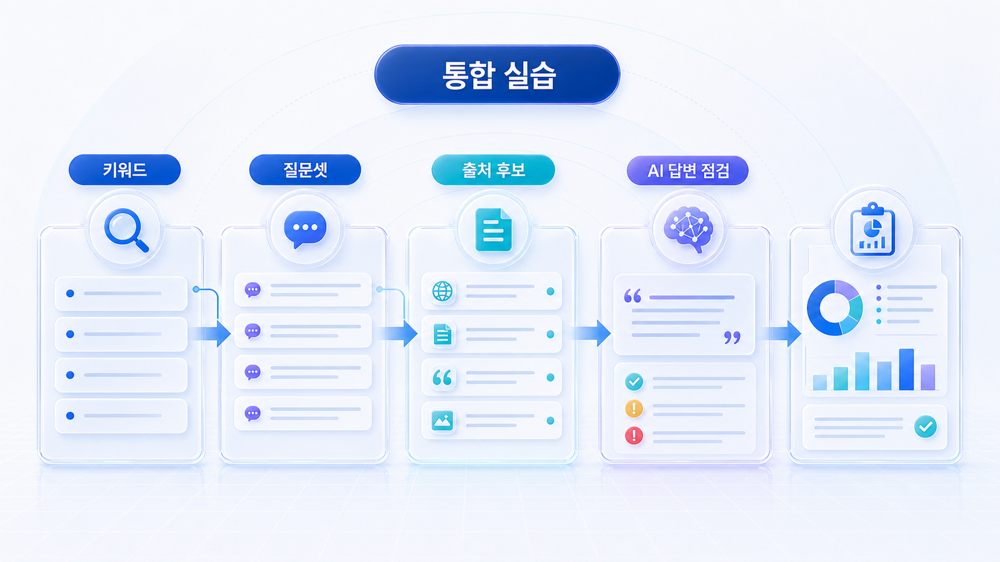
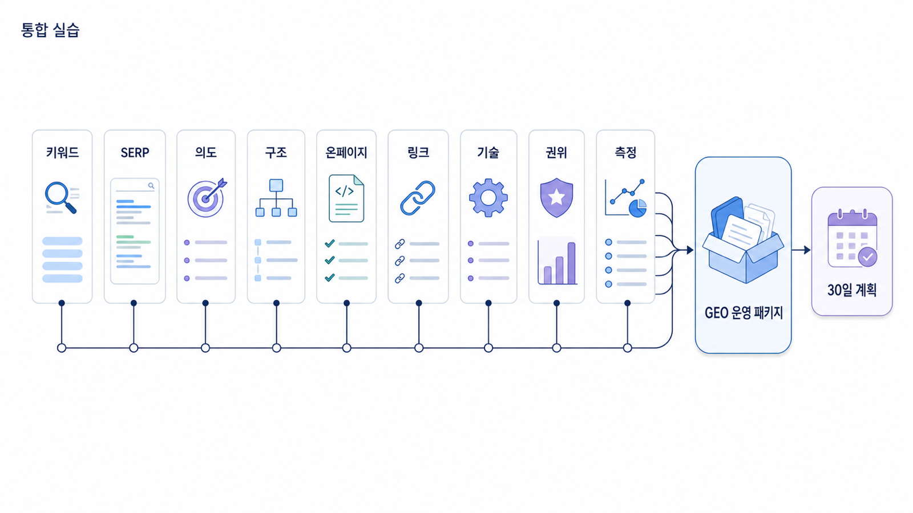

## SEO에서 GEO로 확장하는 통합 실습



이 페이지는 1장의 마지막 실습입니다. 앞에서 배운 키워드 리서치, SERP 분석, 검색 의도, 콘텐츠 구조, 온페이지 SEO, 내부 링크, 테크니컬 SEO, 권위/엔티티, 측정/개선을 하나의 흐름으로 연결합니다.

실무에서는 각 단계를 따로 알기보다 한 키워드가 어떻게 실행 계획으로 바뀌는지 이해하는 것이 중요합니다. 여기서는 가상의 브랜드 AcmeGEO가 `GEO 도구`라는 키워드를 가지고 SEO/GEO 실행 플랜을 만드는 과정을 따라갑니다.

[TOC]

## 실습 목표

이 실습의 목표는 `GEO 도구`라는 키워드를 단순 글 제목으로 쓰는 것이 아니라, 실제 운영 계획으로 바꾸는 것입니다. 최종 산출물은 하나의 콘텐츠 아이디어가 아니라 다음 30일 동안 실행할 SEO/GEO 작업 목록입니다.

완성되어야 할 산출물은 다음과 같습니다.

- 핵심 키워드와 질문셋
- SERP 분석 노트
- 검색 의도 판단
- 콘텐츠 구조안
- 온페이지 리라이트 기준
- 내부 링크 맵
- 기술 SEO 점검표
- 권위/엔티티 보강 목록
- GSC/GA4/네이버/AI 답변 측정 계획
- 다음 30일 액션 플랜

## 1단계: 키워드 리서치

AcmeGEO는 처음에 `GEO 도구`라는 키워드를 발견했습니다. 하지만 이 키워드 하나로 바로 글을 쓰지 않습니다. 먼저 관련 표현을 넓힙니다.

```text
GEO 도구 / AI 검색 모니터링 / ChatGPT 브랜드 노출 / GEO 리포트 / AI visibility / Perplexity SEO / Google AI Overviews 최적화 / GEO 솔루션 / GEO 대행사 / LLM SEO / 브랜드 언급률 / citation 추적
```

이 목록에서 팀은 세 가지를 봅니다. 첫째, 시장이 어떤 용어를 쓰는가. 둘째, 어떤 표현이 이미 검색 수요가 있는가. 셋째, 어떤 표현이 AI 질문으로 확장될 수 있는가.

`GEO 도구`는 헤드 키워드입니다. `ChatGPT 브랜드 노출 확인 방법`은 실행형 롱테일입니다. `GEO 리포트 지표`는 검증형/실무형 키워드입니다. 이 구분이 이후 콘텐츠 구조를 결정합니다.

## 2단계: SERP 분석

팀은 `GEO 도구`, `AI 검색 모니터링`, `ChatGPT 브랜드 노출`을 검색합니다. 상위 결과를 보니 개념 설명, 도구 목록, SEO 도구 비교 글, 일부 제품 페이지가 섞여 있습니다. 하지만 대부분의 글이 실제 리포트 지표를 깊게 설명하지 않습니다.

SERP 분석에서 팀은 이렇게 기록합니다.

| 관찰 | 해석 | 실행 의미 |
|---|---|---|
| 도구 목록 글이 많음 | 사용자는 후보를 찾고 있음 | 비교 기준이 필요 |
| mention/source/citation 설명이 약함 | 지표 이해 갭이 있음 | 지표 정의 섹션 필요 |
| 리포트 예시가 부족함 | 구매 전 검증 자료가 약함 | 샘플 리포트와 해석 예시 필요 |
| SEO 도구와 GEO 도구가 섞임 | 카테고리 혼란이 있음 | SEO 도구와 GEO 도구 차이 설명 필요 |

여기서 중요한 것은 상위 글을 흉내 내지 않는 것입니다. 상위 글이 약하게 다룬 지점을 우리 콘텐츠의 강점으로 삼습니다.

## 3단계: 검색 의도 판단

`GEO 도구`는 겉으로 보면 도구 탐색 키워드입니다. 하지만 실제 의도는 여러 개입니다.

- GEO 도구가 무엇인지 알고 싶은 정보형 의도
- SEO 도구와 무엇이 다른지 알고 싶은 비교형 의도
- 우리 팀에 맞는 도구를 고르고 싶은 추천형 의도
- 리포트가 믿을 만한지 확인하려는 검증형 의도
- 첫 30일에 무엇을 측정할지 알고 싶은 실행형 의도

따라서 콘텐츠는 단순 소개글이 아니라 `도구 선택 기준 + 측정 지표 + 실행 순서 + 리포트 예시`를 포함해야 합니다.

## 4단계: 콘텐츠 구조 설계

팀은 아래와 같은 구조를 만듭니다.

```text
제목: GEO 도구 비교: AI 검색 모니터링에서 봐야 할 7가지 기준
첫 문단: GEO 도구를 고를 때는 질문셋 관리, 브랜드 mention, 답변 근거(source), 화면 인용(citation), 경쟁사 비교, 리포트 재측정 기능을 먼저 봐야 한다.
H2:
1. GEO 도구는 SEO 도구와 무엇이 다른가?
2. AI 검색 모니터링에서 질문셋은 왜 중요한가?
3. mention/source/citation은 어떻게 나눠 봐야 하나?
4. 경쟁사 비교는 어떤 질문 단위로 해야 하나?
5. 리포트에서 다음 액션이 나오는가?
6. 도입 전 준비해야 할 데이터는 무엇인가?
7. 첫 30일 실행 체크리스트
FAQ:
- GEO 도구와 SEO 도구를 같이 써야 하나?
- ChatGPT 브랜드 노출은 어떻게 측정하나?
- citation이 없으면 실패인가?
- 월간 리포트에서 무엇을 봐야 하나?
```

이 구조는 검색 의도와 AI 질문 의도를 함께 반영합니다.

## 5단계: 온페이지 SEO 적용

온페이지에서는 title, meta, 첫 문단, H2, FAQ, schema를 정리합니다. title은 검색어와 답변 약속을 함께 담습니다. meta description은 도구 비교 기준을 구체적으로 설명합니다. 첫 문단은 결론을 먼저 말합니다. H2는 사용자의 하위 질문으로 구성합니다.

meta description 예시는 다음과 같습니다.

```text
GEO 도구를 질문셋 관리, mention/source/citation, 경쟁사 비교, 월간 리포트 재측정 기준으로 비교합니다. B2B SaaS 팀이 AI 검색 모니터링을 시작할 때 확인해야 할 첫 30일 체크리스트를 정리했습니다.
```

schema는 본문에 실제 FAQ가 있을 때 FAQPage를 검토하고, 작성자와 업데이트 날짜가 명확하면 Article schema를 적용합니다.

## 6단계: 내부 링크 맵 만들기

이 페이지는 혼자 있으면 약합니다. 내부 링크로 관련 페이지와 연결해야 합니다.

```text
GEO 도구 비교
→ SEO/GEO/AEO 차이
→ ChatGPT 브랜드 노출 확인 방법
→ mention/source/citation 지표 해석
→ GEO 리포트 예시
→ 테크니컬 SEO 점검표
→ 권위/엔티티 신호 보강
→ 상담/리포트 다운로드 CTA
```

앵커 텍스트는 `관련 글`이 아니라 `mention/source/citation 지표 해석`, `AI 검색 기준선 측정 방법`처럼 의미를 담아 작성합니다.

## 7단계: 테크니컬 SEO 점검

팀은 핵심 URL이 sitemap에 포함되어 있는지 확인합니다. robots나 noindex로 막혀 있지 않은지 봅니다. canonical이 대표 URL을 가리키는지 확인합니다. 본문 핵심 정보가 HTML 텍스트로 존재하는지 보고, schema가 본문과 일치하는지 검증합니다.

특히 리포트 예시 이미지가 있다면 이미지 안에만 정보를 넣지 않습니다. 핵심 지표 설명은 본문 텍스트와 표로도 제공합니다. 그래야 검색엔진과 AI가 내용을 읽을 수 있습니다.

## 8단계: 권위/엔티티 보강

AcmeGEO가 AI 답변에서 추천되려면 공식 사이트 안의 콘텐츠만으로는 부족할 수 있습니다. 외부에서도 같은 카테고리 설명이 반복되어야 합니다.

팀은 다음 작업을 진행합니다.

- 공식 소개 페이지의 한 문장 설명 통일
- 뉴스룸에 `AI 검색 모니터링과 GEO 리포트` 설명 글 발행
- 디렉터리 프로필의 카테고리 수정
- 고객 사례에 질문셋과 리포트 전후 비교 추가
- 파트너 블로그에 GEO 도구 선택 기준 기고
- Organization schema와 sameAs 정리

이 작업의 목적은 링크 수를 늘리는 것이 아니라, AcmeGEO가 어떤 문제의 답인지 외부에서도 일관되게 설명되게 만드는 것입니다.

## 9단계: 측정 계획

발행 후에는 GSC, GA4, 네이버, AI 답변을 함께 봅니다.

GSC에서는 `GEO 도구`, `AI 검색 모니터링`, `ChatGPT 브랜드 노출` query의 impressions, clicks, CTR, position을 봅니다. GA4에서는 해당 페이지의 engagement, key events, CTA 클릭을 봅니다. 네이버에서는 수집/색인 상태와 한국어 검색어를 확인합니다. AI 답변 측정에서는 같은 질문셋으로 mention/source/citation/경쟁사 언급을 기록합니다.

중요한 것은 같은 질문셋을 반복 측정하는 것입니다. 매번 질문을 바꾸면 개선 효과를 비교하기 어렵습니다.

## 10단계: 다음 30일 액션 플랜

측정 결과에 따라 액션을 나눕니다.

| 증상 | 원인 후보 | 담당 | 액션 |
|---|---|---|---|
| 노출은 있는데 CTR 낮음 | title/meta 약함 | SEO/콘텐츠 | 검색결과 약속 리라이트 |
| 클릭은 있는데 engagement 낮음 | 첫 문단/구조 약함 | 콘텐츠 | Answer-first 구조 보강 |
| AI 답변에 경쟁사만 언급 | 카테고리/source 신호 약함 | 콘텐츠/PR | 비교 기준 글과 외부 출처 보강 |
| source는 잡히지만 citation 없음 | 대표 URL/구조 약함 | SEO/개발 | canonical, 내부 링크, 본문 구조 점검 |
| 설명이 오래됨 | 엔티티 최신성 문제 | 브랜드/PR | 뉴스룸, 디렉터리, 공식 소개 업데이트 |



## 앞 단계 산출물이 최종 운영으로 이어지는 방식

이 실습에서 중요한 것은 각 단계의 산출물이 끊기지 않고 다음 단계로 넘어가는 것입니다. 키워드 리서치 시트는 SERP 분석의 입력값이 되고, SERP 분석 노트는 검색 의도 판단의 근거가 됩니다. 검색 의도 판단은 콘텐츠 브리프를 만들고, 콘텐츠 브리프는 온페이지 리라이트와 내부 링크 맵으로 이어집니다. 내부 링크 맵과 기술 SEO 티켓은 source/citation 후보 URL을 안정화하고, 권위/source 후보 맵은 외부에서 브랜드가 어떤 문장으로 설명되어야 하는지 정합니다.

마지막 월간 리포트는 이 모든 산출물을 다시 검증합니다. GSC에서 query가 움직였는지, GA4에서 사용자가 행동했는지, AI 답변에서 mention/source/citation이 생겼는지, 외부 출처가 업데이트됐는지 확인합니다. 그래서 01-10은 단순 요약 페이지가 아니라 “SEO 업무를 GEO 운영 루프로 묶는 리허설”입니다.

## 이 실습의 핵심

SEO와 GEO는 따로 놀지 않습니다. 키워드 리서치는 AI 질문셋의 출발점이 됩니다. SERP 분석은 사용자가 기대하는 답변 형식을 보여줍니다. 검색 의도는 콘텐츠 구조를 결정합니다. 온페이지 SEO는 검색결과의 약속을 페이지 안에서 증명합니다. 내부 링크는 사이트 안의 의미 관계를 만듭니다. 테크니컬 SEO는 콘텐츠가 발견되고 읽히게 합니다. 권위와 엔티티는 외부에서 브랜드를 신뢰 가능한 답변 후보로 만듭니다. 측정과 개선은 이 모든 작업을 반복 가능한 운영으로 바꿉니다.

이 흐름을 이해하면 GEO는 새로운 유행어가 아니라, SEO 실무를 AI 검색 환경에 맞게 확장하는 운영 체계로 보입니다.

## SEO 핵심 개념 더 깊게 보기

통합 실습에서는 SEO 업무 산출물을 하나의 운영 패키지로 묶어야 합니다. `SEO brief`는 콘텐츠를 만들기 전의 설계 문서입니다. `technical ticket`은 개발팀이 처리할 수 있게 쪼갠 기술 이슈입니다. `source map`은 내부/외부 출처 후보와 각 출처가 맡을 질문을 정리한 표입니다. `monthly report`는 성과와 다음 액션을 연결하는 운영 문서입니다.

여기서 중요한 개념은 KPI의 계층입니다. 비즈니스 KPI는 문의, 가입, 구매, 예약입니다. SEO KPI는 impressions, clicks, CTR, average position, organic sessions입니다. GEO KPI는 mention, source, citation, answer quality, competitor mention입니다. 실행 KPI는 리라이트 수, 기술 이슈 해결 수, 내부 링크 추가 수, 외부 출처 업데이트 수입니다.

이 계층을 구분해야 리포트가 단순 숫자 모음이 되지 않습니다. 예를 들어 organic sessions가 늘었지만 문의가 늘지 않았다면 콘텐츠와 CTA를 봐야 합니다. mention이 늘었지만 citation이 없다면 source 후보와 URL 안정성을 봐야 합니다. impressions가 늘었지만 CTR이 낮다면 title/meta를 봐야 합니다.

## 최종 운영 패키지 템플릿

| 문서 | 포함 내용 | 담당 |
|---|---|---|
| SEO brief | query, intent, SERP gap, H2, CTA | SEO/콘텐츠 |
| Content draft | 첫 문단, 본문, FAQ, 사례, 내부 링크 | 콘텐츠팀 |
| On-page checklist | title, meta, URL, H1/H2, alt, schema | SEO 담당자 |
| Technical ticket | sitemap, robots, canonical, status, schema 검증 | 개발팀 |
| Internal link map | 허브/클러스터/앵커/고립 페이지 | SEO/콘텐츠 |
| Source map | 뉴스룸, 디렉터리, 파트너, 고객 사례 | PR/브랜드 |
| Monthly report | GSC, GA4, 네이버, AI 답변, KPI, 다음 액션 | 전체 |

## AcmeGEO 연속 케이스: 최종 산출물 묶기

AcmeGEO 팀은 `GEO 도구 비교` 프로젝트를 하나의 글 발행으로 끝내지 않았습니다. 먼저 SEO brief를 만들고, 콘텐츠팀이 Answer-first 구조로 초안을 작성했습니다. SEO 담당자는 title/meta와 내부 링크를 점검했고, 개발팀은 schema와 canonical을 확인했습니다. PR팀은 외부 디렉터리와 뉴스룸의 카테고리 설명을 수정했습니다.

발행 후 30일 리포트에서는 GSC query, GA4 engagement, AI mention/source/citation, 외부 출처 업데이트 상태를 함께 봤습니다. 결과가 부족한 지표는 다시 액션으로 나뉘었습니다. 이 방식이 바로 SEO를 GEO 운영 체계로 확장하는 방법입니다.

## 참고 링크

- Google Search Central의 [SEO 시작 가이드](https://developers.google.com/search/docs/fundamentals/seo-starter-guide)는 전체 SEO 기본기를 확인할 때 참고합니다.
- Google Search Console의 [실적 보고서 도움말](https://support.google.com/webmasters/answer/7576553?hl=ko)은 발행 후 query/page 성과를 보는 기준입니다.
- HaloX의 [SEO/GEO 키워드 전략 프레임워크](https://haloxlabs.ai/ko/blog/seo-geo-keyword-strategy-framework)는 이 실습을 실제 GEO 질문셋으로 확장할 때 참고할 수 있습니다.

다음 장에서는 [AI 검색 모니터링: 브랜드 언급률, 답변 근거, 화면 인용 읽는 법](https://wikidocs.net/346342)을 다룹니다.


## 팀 운영 관점에서 보는 통합 실습

이 실습은 SEO 담당자 혼자 수행하는 과제가 아닙니다. SEO 담당자는 query와 SERP, 내부 링크, 측정 기준을 정리합니다. 콘텐츠팀은 검색 의도를 읽고 Answer-first 구조로 글을 씁니다. 개발팀은 sitemap, canonical, schema, 렌더링, 속도 같은 기술 조건을 확인합니다. PR팀과 브랜드팀은 외부 출처와 엔티티 설명을 통일합니다. 마케팅 운영 담당자는 GA4 전환과 CTA 흐름을 확인합니다.

실무에서는 각 팀이 자기 작업만 하면 전체 흐름이 끊깁니다. 콘텐츠팀이 좋은 글을 써도 개발팀이 noindex 문제를 놓치면 검색에 나오지 않습니다. SEO 담당자가 내부 링크를 설계해도 브랜드팀이 외부 디렉터리의 낡은 설명을 방치하면 AI 답변에서 오래된 정보가 반복될 수 있습니다. GA4 전환을 보지 않으면 검색과 AI 답변 노출이 실제 사업 성과로 이어지는지도 알 수 없습니다.

따라서 통합 실습의 진짜 목적은 문서 하나를 만드는 것이 아니라, 팀이 같은 질문셋을 기준으로 움직이는 운영 체계를 만드는 것입니다.

## 실습 완료 후 남아야 할 회의 안건

실습이 끝나면 다음 회의에서 바로 확인할 안건이 있어야 합니다. `GEO 도구` 페이지를 발행했다면 다음 회의에서는 GSC query 변화, GA4 landing page 행동, AI 답변 mention/source/citation, 내부 링크 클릭, 외부 출처 업데이트 상태를 함께 봅니다. 그리고 각 지표가 기대만큼 움직이지 않았다면 어느 단계에서 병목이 생겼는지 판단합니다.

회의 안건은 다음처럼 정리할 수 있습니다.

| 안건 | 확인할 것 | 담당 |
|---|---|---|
| 검색 수요 | GSC query, impressions, CTR | SEO 담당자 |
| 페이지 행동 | GA4 engagement, CTA, key event | 마케팅 운영 |
| 콘텐츠 품질 | 첫 문단, H2, 표, FAQ, 사례 | 콘텐츠팀 |
| 기술 상태 | 색인, sitemap, canonical, schema | 개발팀 |
| 외부 신호 | 뉴스룸, 디렉터리, 파트너 글, mention | PR/브랜드팀 |
| AI 답변 | mention/source/citation, 경쟁사 언급 | SEO/GEO 담당자 |

이 회의 구조가 만들어지면 SEO와 GEO는 일회성 캠페인이 아니라 반복 운영이 됩니다.

