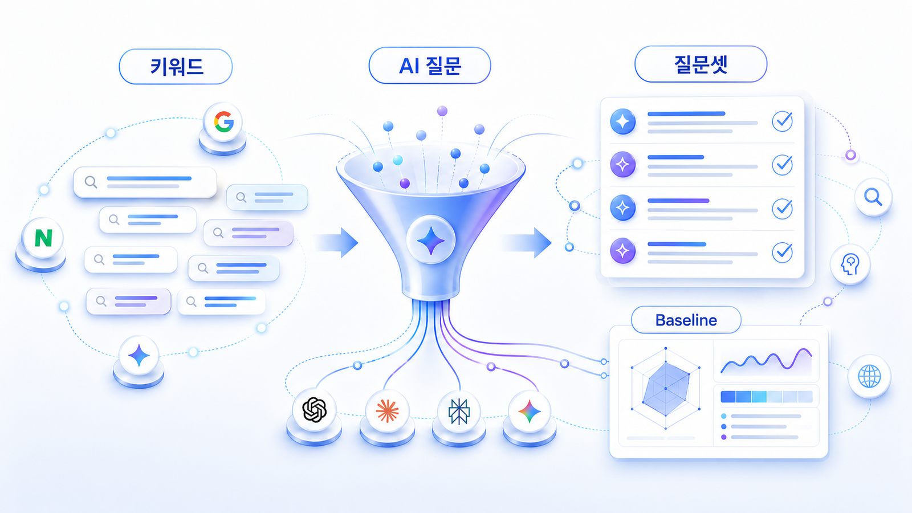

## SEO에서 AI 질문 시장으로

이 장에서는 SEO 키워드를 AI 질문으로 바꾸는 기본 관점을 다룹니다. 이후 [Fan-out과 질문 확장](https://wikidocs.net/346343)에서 질문을 더 촘촘하게 펼칩니다.

이 장은 4주 실행 로드맵의 1주차와 직접 연결됩니다. 참여자는 자기 브랜드의 핵심 키워드 10개를 고르고, 이를 독자/고객 질문 30개로 바꾼 뒤, HaloX 같은 분석 도구로 현재 AI 답변 내 브랜드 상태를 진단합니다.

## 이 장에서 얻을 것

- SEO 키워드를 GEO 질문으로 바꾸는 기준
- 검색 의도와 AI 질문 의도의 차이
- 질문셋 구성 비중이라는 개념
- 브랜드 기준선 진단표를 만드는 흐름

## 왜 질문으로 바꿔야 하나

사용자는 더 이상 “GEO 도구”만 검색하지 않습니다. “우리 브랜드가 ChatGPT에 보이는지 확인할 수 있는 도구가 있나?”, “Perplexity에서 경쟁사와 비교되는지 어떻게 보나?”처럼 질문합니다. 이 질문들이 실제 AI 답변 시장입니다.

## 검색어는 SERP에서 끝나지 않는다

기존 SEO에서는 키워드를 고르면 주로 SERP에서 어떤 문서가 노출되는지 봤습니다. 하지만 AI 검색 환경에서는 같은 키워드가 여러 층으로 갈라집니다. 먼저 Google 검색 결과에서 어떤 문서가 보이는지 확인하고, 그다음 AI Overview가 어떤 요약과 인용을 만드는지 봅니다. 마지막으로 ChatGPT, Claude, Perplexity 같은 답변형 환경에서 그 키워드가 어떤 질문과 비교 프롬프트로 바뀌는지 봐야 합니다.

예를 들어 `GEO 도구`라는 키워드는 SERP에서는 도구 비교 글이지만, AI 답변 환경에서는 `B2B SaaS 팀이 쓸 만한 GEO 모니터링 도구는?`, `GEO 도구와 SEO 도구는 무엇이 다른가?`, `AI 검색 리포트에서 어떤 지표를 믿어야 하나?` 같은 질문 시장으로 바뀝니다. 그래서 1장은 키워드를 버리는 장이 아니라, 키워드를 질문 시장으로 확장하는 장입니다.

## 이 장의 실습 패키지 흐름

01장은 키워드를 AI 질문 시장으로 바꾸는 1주차 핵심 단계입니다. 세부 페이지를 따라가면 키워드 10개를 질문 30개로 확장하고, 질문셋 구성 비중을 나눠 기준선 진단표까지 만들 수 있습니다.

| 페이지 | 실습 산출물 |
|---|---|
| 01-01 | 핵심 키워드 10개와 확장 방향 |
| 01-02 | 키워드별 질문/프롬프트 변환표 |
| 01-03 | 검색 의도와 AI 질문 의도 비교 |
| 01-04 | 질문셋 구성 비중 설계표 |
| 01-05 | 브랜드 GEO 기준선 진단표 |

## HaloX로 이어지는 지점

키워드에서 AI 질문 시장으로 넘어가는 감각은 HaloX의 [SEO/GEO 키워드 전략 프레임워크](https://haloxlabs.ai/ko/blog/seo-geo-keyword-strategy-framework)와 연결됩니다. 1장은 질문을 만드는 법을 다루고, HaloX 글은 그 질문이 콘텐츠 전략으로 이어지는 방식을 설명합니다. 기존 SEO 키워드 조사와 연결해서 보려면 Google의 [SEO 시작 가이드](https://developers.google.com/search/docs/fundamentals/seo-starter-guide)를 함께 참고합니다. 이 장에서는 그 키워드를 AI 질문 시장으로 바꾸는 데 초점을 둡니다.

## 다음에 읽을 글

먼저 [SEO 키워드는 왜 여전히 중요한가](https://wikidocs.net/346313)를 읽습니다.
