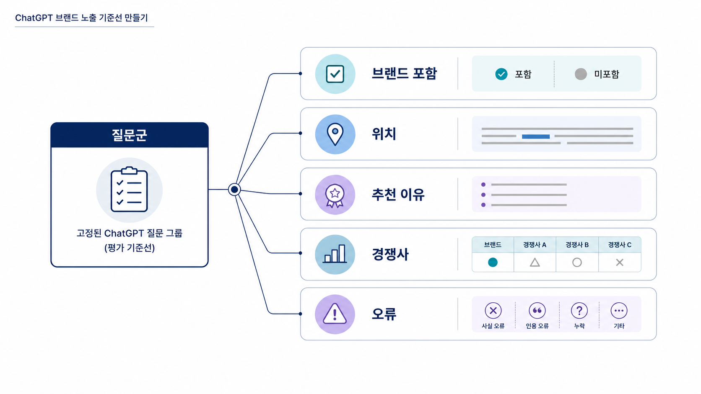

## ChatGPT 브랜드 노출은 어떻게 확인하나


ChatGPT 브랜드 노출은 “우리 브랜드가 한 번 나왔는가”를 세는 일이 아닙니다. 어떤 질문에서, 어떤 경쟁자와 함께, 어떤 이유로 추천됐는지를 확인하는 기준선 작업입니다.

실무에서는 `ChatGPT SEO`, `ChatGPT 최적화`, `ChatGPT 검색 최적화`라고 부르기도 합니다. 이 책에서는 더 좁게 봅니다. ChatGPT가 브랜드를 추천 후보로 넣는지, 이름만 언급하는지, 근거 없는 설명처럼 말하는지를 나눠 읽습니다.

ChatGPT는 화면 인용(citation)을 항상 보여주지 않습니다. 그래서 이 페이지에서는 citation 유무보다 답변 문맥, 추천 이유, 경쟁자 배열, 오류 여부를 먼저 봅니다. 화면 인용이 중요한 플랫폼은 다음 페이지의 [Perplexity SEO와 Google AI Overviews 최적화](https://wikidocs.net/346602)에서 따로 다룹니다.

[TOC]

## 먼저 질문군을 고정한다

브랜드 노출 측정은 질문을 고정하지 않으면 비교가 되지 않습니다. 오늘은 추천형 질문을 묻고 다음 달에는 정의형 질문만 물으면 수치가 달라져도 원인을 해석할 수 없습니다.

1장에서 만든 [SEO 키워드 기반 AI 질문셋](https://wikidocs.net/346312)을 기준으로 질문을 4개 묶음으로 나눕니다.

| 질문군 | 확인할 것 |
|---|---|
| 정의형 | 카테고리 설명 안에 우리 브랜드가 자연스럽게 등장하는가 |
| 비교형 | 경쟁 브랜드와 함께 비교 후보로 들어가는가 |
| 추천형 | “추천해줘” 질문에서 후보군에 포함되는가 |
| 검증형 | 신뢰도/가격/기능/사례 질문에서 설명이 정확한가 |

질문은 한 번에 많이 늘리기보다 같은 질문을 반복해서 보는 편이 낫습니다. GEO 모니터링의 핵심은 순간 포착이 아니라 같은 조건에서의 변화입니다.

## 답변에서 볼 다섯 가지

ChatGPT 답변은 URL 목록보다 문장 흐름을 먼저 봐야 합니다. 브랜드 이름이 보였다는 사실보다 그 이름이 어떤 역할로 쓰였는지가 더 큰 판단 기준입니다.

- **언급 위치**: 첫 후보인지, 보조 후보인지, 마지막에 붙은 이름인지 본다.
- **추천 이유**: 기능/가격/사례/업종 적합성처럼 이유가 붙어 있는지 본다.
- **경쟁 문맥**: 어떤 경쟁자와 함께 묶이는지 본다.
- **설명 정확도**: 없는 기능, 오래된 설명, 과장된 문장이 있는지 본다.
- **다음 행동 연결**: 공식 페이지 확인, 비교표, 도입 절차 같은 행동으로 이어지는지 본다.

좋은 신호는 단순 노출이 아닙니다. “왜 이 브랜드가 이 질문의 답 후보인지”가 설명되는 상태입니다. 위험 신호는 이름은 나오지만 이유가 없거나, 잘못된 설명이 반복되는 상태입니다.

## 오류는 별도로 표시한다

브랜드가 언급됐더라도 설명이 틀리면 좋은 노출로 계산하면 안 됩니다. ChatGPT 브랜드 가시성 분석에서는 오류를 따로 분리해야 다음 액션이 보입니다.

| 오류 유형 | 예시 | 다음 액션 |
|---|---|---|
| 기능 오류 | 제공하지 않는 기능을 제공한다고 말함 | 공식 기능 페이지 보강 |
| 포지션 오류 | B2B 솔루션을 일반 소비자 앱처럼 설명함 | 카테고리/비교 문서 보강 |
| 근거 약함 | 추천 이유가 추상적임 | 사례/리포트/외부 출처 보강 |
| 경쟁 문맥 오류 | 비교 대상이 맞지 않음 | 대체재/경쟁군 설명 정리 |

이 표는 점수표가 아니라 원인 분류표입니다. 오류가 반복되는 질문군은 콘텐츠, 외부 출처, 기술 구조 중 어디가 약한지 다음 장에서 더 좁혀야 합니다.

## AcmeGEO 예시

가상의 B2B SaaS `AcmeGEO`가 “AI 검색 브랜드 가시성 분석 도구 추천” 질문을 측정한다고 가정해 보겠습니다.

처음 답변에서 AcmeGEO는 한 번 언급됐지만 추천 이유가 “AI 검색에 도움이 되는 도구” 정도로만 나왔습니다. 이 상태는 mention은 있지만 추천 근거가 약한 상태입니다. 팀은 곧바로 점수를 올리려 하지 않고, 먼저 어떤 설명이 비어 있는지 확인합니다.

- 공식 제품 페이지에 `mention/source/citation` 구분 설명이 있는가
- 경쟁 도구와 다른 측정 기준이 한 문단 안에 정리돼 있는가
- 실제 리포트 예시가 공개적으로 읽을 수 있는 형태로 있는가
- 외부 블로그나 가이드에서 같은 표현이 반복되는가

다음 달 같은 질문에서 “AcmeGEO는 브랜드 언급률, 답변 근거, 화면 인용을 분리해 보여주는 도구”라고 설명되면 단순 노출보다 더 나은 변화입니다. 브랜드가 답변 안에서 명확한 역할을 얻었기 때문입니다.



*같은 질문군을 반복 측정해야 브랜드 노출의 방향을 읽을 수 있다.*

## 정리 양식

아래 항목만 채워도 첫 기준선은 만들 수 있습니다.

```text
측정 날짜:
모델/환경:
질문군:
실제 질문:
브랜드 언급 여부:
언급 위치:
추천 이유:
함께 나온 경쟁자:
설명 오류:
다음 액션:
```

처음부터 완벽한 대시보드를 만들 필요는 없습니다. 같은 질문을 같은 방식으로 남기는 것이 먼저입니다.

## 다음 흐름

ChatGPT 브랜드 노출을 확인했다면 [02-03 브랜드 언급률, 답변 근거, 화면 인용](https://wikidocs.net/346603)에서 mention/source/citation을 분리해 해석합니다. 플랫폼별 인용 구조를 더 보려면 [Perplexity SEO와 Google AI Overviews 최적화](https://wikidocs.net/346602)를 읽습니다.
