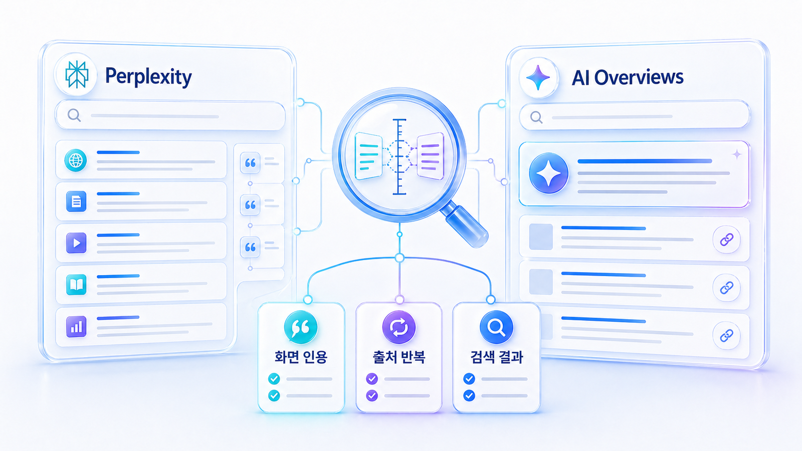
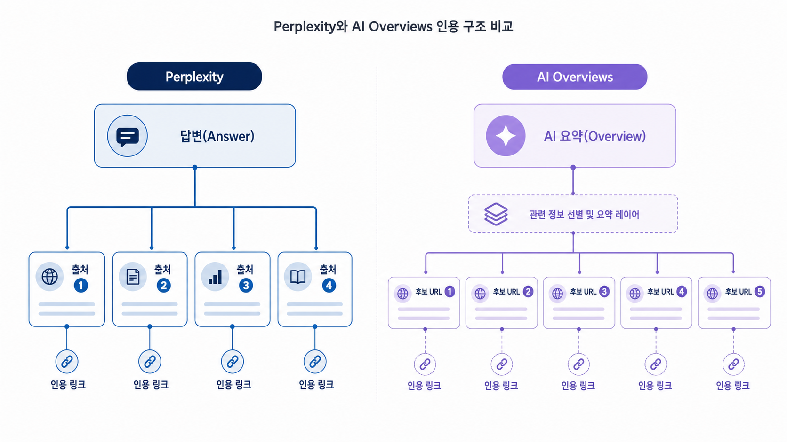

## Perplexity SEO와 Google AI Overviews 최적화 비교



Perplexity SEO와 Google AI Overviews 최적화는 모두 AI 검색 노출을 다루지만 같은 지표로 읽으면 안 됩니다. Perplexity는 답변과 출처 링크의 관계가 비교적 선명하고, Google AI Overviews는 기존 검색결과 페이지 안에서 AI 요약과 웹 결과가 함께 움직입니다.

그래서 두 플랫폼을 한 줄 점수로 묶으면 원인이 흐려집니다. GEO에서는 플랫폼별로 질문, 답변 근거(source), 화면 인용(citation), 검색 결과와 AI 답변의 차이를 나눠 봐야 합니다.

[TOC]

## 두 플랫폼의 차이

Perplexity는 “답변이 어떤 출처를 사용했는가”를 추적하기 좋습니다. 반면 Google AI Overviews는 기존 SEO 성과, SERP 구성, AI 요약 노출이 함께 얽힙니다. 같은 URL이 두 플랫폼에서 다르게 보일 수 있는 이유입니다.

| 구분 | Perplexity | Google AI Overviews |
|---|---|---|
| 주로 볼 것 | 답변 문장과 인용 URL의 연결 | 검색결과와 AI 요약의 관계 |
| 강한 신호 | 특정 URL이 반복 인용됨 | 상위 검색결과/AI 요약에 함께 노출됨 |
| 조심할 점 | 한 번의 인용을 과대평가하지 않기 | SEO 순위와 AI 요약 노출을 혼동하지 않기 |

Perplexity에서 인용됐다고 Google AI Overviews에서도 유리하다고 단정할 수 없습니다. 반대로 Google 검색 상위에 있어도 AI 요약에 들어가지 않을 수 있습니다.

## Perplexity에서 볼 것

Perplexity는 질문별로 어떤 출처가 답변 재료로 쓰였는지 보기 좋습니다. 여기서 중요한 것은 “우리 URL이 나왔는가”보다 “어떤 문장의 근거로 쓰였는가”입니다.

다음 순서로 봅니다.

1. 같은 질문을 3~5회 반복해 인용 URL이 안정적으로 나오는지 확인한다.
2. 우리 URL이 브랜드 설명, 비교 근거, 가격/기능 근거 중 어디에 붙는지 본다.
3. 경쟁 URL이 반복된다면 그 페이지가 어떤 정보를 더 잘 제공하는지 확인한다.
4. 인용은 됐지만 답변 문맥이 약하면 페이지의 첫 문단/표/FAQ 구조를 고친다.

한 번 인용된 URL은 신호입니다. 반복 인용되는 URL은 운영 대상입니다.

## Google AI Overviews에서 볼 것

Google AI Overviews는 기존 검색결과와 분리해서 볼 수 없습니다. 같은 질문에서 일반 검색 상위 결과, AI 요약 안의 문장, 표시되는 출처가 함께 움직입니다.

먼저 GSC와 SERP를 함께 봅니다. 검색 노출은 있는데 AI 요약에 들어가지 못한다면 답변 구조가 약할 수 있습니다. 반대로 AI 요약에 인용되는데 클릭이 약하다면 제목/스니펫/페이지 약속이 약할 수 있습니다.

Google AI Overviews 최적화는 “AI 요약에 들어가자”가 아니라 “검색자가 본 질문에 대해 페이지가 명확한 답과 근거를 제공하게 만들자”에 가깝습니다.

## citation 후보 URL 점검 순서

화면 인용(citation)을 늘리고 싶다면 먼저 URL 단위로 읽어야 합니다. 사이트 전체 권위보다 질문별 후보 URL의 구조가 더 직접적인 경우가 많습니다.

- 질문에 대한 답이 첫 화면에 바로 있는가
- 페이지 제목과 첫 문단이 같은 약속을 하는가
- 표/FAQ/schema가 답변을 보조하는가
- 최신성, 저자, 회사 정보, 사례가 확인되는가
- 내부 링크가 관련 페이지로 자연스럽게 이어지는가



*Perplexity는 출처 반복성을, AI Overviews는 검색결과와 AI 요약의 겹침을 함께 본다.*

## 운영 판단

Perplexity에서 반복 인용되지만 Google AI Overviews에는 보이지 않는다면, 검색 의도와 SERP 경쟁을 다시 봅니다. 반대로 Google 검색에서는 잘 보이지만 Perplexity에서 인용되지 않는다면, 페이지 안의 답변 단위와 출처 신호를 점검합니다.

플랫폼별 가시성을 한 리포트로 묶어 보고 싶다면 HaloX의 [AVI 점수 가이드](https://haloxlabs.ai/ko/blog/avi-score-explained)를 참고합니다. 단, 운영에서는 플랫폼별 원인을 분리해 보는 것이 먼저입니다. 커머스 쪽은 [커머스 GEO와 AI 구매 에이전트](https://wikidocs.net/346596)에서 더 자세히 다룹니다.

## 정리 양식

```text
질문:
플랫폼:
반복 측정 횟수:
우리 브랜드 언급:
우리 URL citation:
경쟁 URL citation:
AI 답변의 핵심 문장:
검색결과 TOP10과 겹치는 URL:
다음 수정 대상 URL:
```

## 다음 흐름

플랫폼별 측정값을 리포트 지표로 정리하려면 [브랜드 언급률, 답변 근거, 화면 인용은 지표 분리](https://wikidocs.net/346603)를 읽습니다.
