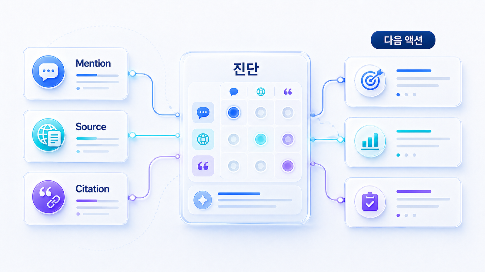
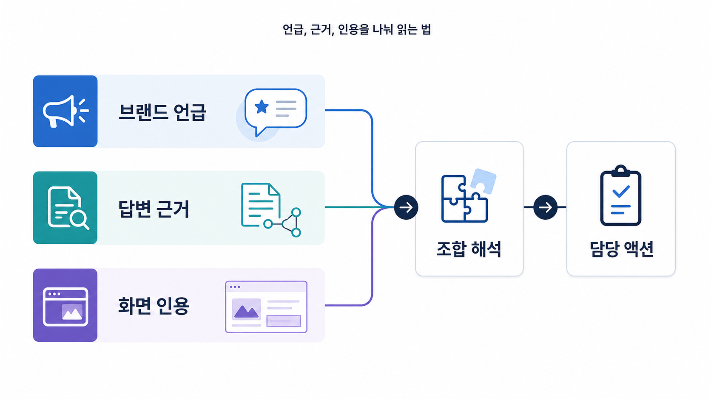

## 브랜드 언급률, 답변 근거, 화면 인용은 어떻게 나눠 읽나

브랜드 언급률, 답변 근거(source), 화면 인용(citation)은 비슷해 보이지만 서로 다른 지표입니다. AI 검색 모니터링에서 이 셋을 한 점수로 합치면 왜 잘되고 있는지와 무엇을 고쳐야 하는지가 보이지 않습니다.

GEO 분석 지표는 먼저 분리해서 읽어야 합니다. 브랜드가 언급됐지만 출처가 약한 경우, 출처로 쓰였지만 화면 인용이 없는 경우, 화면 인용은 있지만 추천 문맥이 약한 경우는 각각 다른 문제입니다.

[TOC]

## 세 지표의 차이

| 지표 | 의미 | 좋은 신호 | 약한 신호 | 주로 고칠 곳 |
|---|---|---|---|---|
| 브랜드 언급률 | 질문군에서 브랜드가 답변에 등장하는 비율 | 추천형/비교형 질문에서 반복 등장 | 정보형 질문에만 가끔 등장 | 카테고리 콘텐츠, 비교/추천 페이지 |
| 답변 근거(source) | AI가 답변을 만들 때 참고한 정보 재료 | 공식 페이지/가이드/리포트가 설명의 근거가 됨 | 제3자 글이나 오래된 자료만 근거가 됨 | 공식 가이드, 사례, 외부 출처 |
| 화면 인용(citation) | 사용자가 볼 수 있는 링크로 표시되는 출처 | 클릭 가능한 우리 URL이 반복 표시됨 | 브랜드는 언급되지만 링크가 없음 | 제목, 첫 문단, 표, schema, 내부 링크 |
| 답변 품질 | 설명이 정확하고 설득력 있는가 | 추천 이유가 구체적이고 최신 정보와 일치 | 모호하거나 오래된 설명 반복 | 메시지, FAQ, 제품 설명, 오류 정정 |

이 셋은 순서가 아니라 역할입니다. 어떤 플랫폼에서는 source를 직접 확인하기 어렵고, 어떤 플랫폼에서는 citation이 명확하게 보입니다. 그래서 플랫폼별 한계를 인정하고 같은 질문을 반복 측정하는 것을 기준으로 봅니다.

## 조합으로 읽는 법

| 조합 | 해석 | 우선 액션 |
|---|---|---|
| mention 있음 / source 약함 / citation 없음 | 브랜드는 알려졌지만 근거 자산이 약함 | 공식 가이드, 비교표, 사례 페이지 보강 |
| mention 없음 / 경쟁사 citation 반복 | 구매 후보군에서 빠질 위험 | 질문셋 기반 콘텐츠와 오프사이트 출처 확보 |
| source 있음 / citation 없음 | 답변 재료로는 쓰이나 사용자 화면 노출이 약함 | 제목/첫 문단/구조/내부 링크 정리 |
| citation 있음 / answer quality 약함 | 링크는 보이나 추천 이유가 약함 | 포지셔닝 문구와 FAQ, 비교 기준 보강 |
| mention 있음 / source 있음 / citation 있음 | 좋은 신호 | 같은 질문군에서 반복성 확인 |
| mention 있음 / 설명 오류 | 노출은 되지만 브랜드 이해가 틀림 | 최신 정보/FAQ/schema/About 정리 |

이 방식으로 읽으면 “AI 검색에서 노출됐다”는 말을 실행 가능한 진단으로 바꿀 수 있습니다.

## 브랜드 언급률을 볼 때 조심할 점

브랜드 언급률은 질문셋 구성에 따라 크게 달라집니다. 브랜드명을 포함한 질문만 많이 넣으면 언급률은 쉽게 올라갑니다. 하지만 비브랜드 추천형/비교형 질문에서 빠진다면 실제 사업 영향은 약합니다.

따라서 리포트에는 반드시 질문군 비중을 함께 적어야 합니다.

| 질문군 | 권장 비중 | 이유 |
|---|---:|---|
| 브랜드 질문 | 10~20% | 현재 설명 정확도 확인 |
| 정보형 질문 | 20~30% | 카테고리 이해도 확인 |
| 비교형 질문 | 20~30% | 경쟁 문맥 확인 |
| 추천형 질문 | 20~30% | 구매 후보군 포함 여부 확인 |
| 검증형/실행형 질문 | 10~20% | 신뢰와 실행 전환 확인 |

## 업종별 해석 차이

| 업종/상황 | 특히 볼 지표 | 이유 | 우선 액션 |
|---|---|---|---|
| B2B SaaS | 비교형 mention, source, answer quality | 도입 검토에서 비교 기준이 중요 | 기능/가격/보안/대상 고객 비교표 |
| 금융/규제 산업 | source, answer quality, 리스크 문맥 | 잘못된 추천이나 오래된 정보가 위험 | 공식 근거, 리스크 설명, 최신성 관리 |
| 로컬/병원 | citation, 로컬 출처, 리뷰 문맥 | 지도/리뷰/지점 정보가 선택에 영향 | NAP, 리뷰, 진료/서비스 FAQ 정리 |
| 커머스 | citation, 상품 데이터, 추천 이유 | AI 구매 추천은 상품 속성과 리뷰를 봄 | Product schema, 상품 비교표, 리뷰 요약 |
| PR/평판 관리 | mention, co-mention, 부정확한 설명 | 브랜드 평판 요약이 오해를 만들 수 있음 | 뉴스룸, 공식 입장, 외부 프로필 정리 |

## 보조 해석 지표까지 함께 본다

mention/source/citation만으로도 기본 진단은 가능하지만, 월간 운영에서는 보조 지표를 함께 봐야 합니다. 특히 경쟁 문맥과 답변 품질을 보지 않으면 `언급은 됐지만 좋은 언급인지` 판단하기 어렵습니다.

| 보조 지표 | 의미 | 읽는 법 | 연결 액션 |
|---|---|---|---|
| Share of voice | 같은 질문군에서 우리 브랜드가 경쟁사 대비 얼마나 자주 등장하는가 | 추천형/비교형 질문에서 경쟁사와 비중 비교 | 비교 콘텐츠, 외부 출처, 카테고리 설명 보강 |
| Co-mention | 어떤 브랜드와 함께 언급되는가 | 같은 카테고리로 묶이는 경쟁사 확인 | 포지셔닝과 차별점 정리 |
| Sentiment | 긍정/중립/부정 문맥으로 설명되는가 | 추천 이유와 우려 이유를 분리 | FAQ, 리스크 설명, 고객 사례 보강 |
| Answer accuracy | 답변의 사실 정확도 | 기능/가격/대상 고객/지역 정보 오류 확인 | 제품 페이지, About, schema, 뉴스룸 업데이트 |
| Freshness | 최신 정보가 반영되는가 | 오래된 기능명이나 가격이 반복되는지 확인 | 변경 로그, 최신 가이드, 외부 프로필 수정 |
| Source diversity | 출처가 한두 곳에 치우치는가 | 공식/제3자/커뮤니티/뉴스의 균형 확인 | source 후보 맵 확장 |

이 지표들은 한 번에 점수화하려고 넣는 것이 아닙니다. 어떤 질문군에서 왜 추천되는지, 왜 빠지는지, 어떤 설명이 반복되는지 읽기 위한 보조 렌즈입니다.

## AcmeGEO 예시: 같은 mention도 다르게 읽기

AcmeGEO가 추천형 질문 30개 중 12개에서 mention되었다고 가정해 보겠습니다. 숫자만 보면 나쁘지 않아 보입니다. 하지만 co-mention을 보니 항상 저가형 SEO 도구와 함께 묶이고 있었고, answer accuracy를 보니 `키워드 순위 추적 도구`로 설명되는 경우가 많았습니다. 이 경우 mention 증가는 좋은 성과이면서 동시에 포지셔닝 오류 신호입니다.

팀은 다음 달 액션을 세 가지로 나눴습니다. 첫째, 공식 소개 문장을 `AI 검색 모니터링과 GEO 리포트 도구`로 통일했습니다. 둘째, 비교형 콘텐츠에서 SEO 순위 추적 도구와 GEO 리포트 도구의 차이를 설명했습니다. 셋째, 외부 디렉터리와 파트너 글의 카테고리 설명을 업데이트했습니다. 다음 측정에서는 mention 수뿐 아니라 함께 묶이는 경쟁군과 설명 정확도까지 같이 봤습니다.

## 지표별 담당 액션

| 지표가 약한 경우 | 주로 볼 원인 | 담당 액션 |
|---|---|---|
| Mention 약함 | 카테고리 연결과 브랜드 인지도 부족 | 질문셋 기반 콘텐츠, 비교/추천형 페이지 작성 |
| Source 약함 | AI가 참고할 근거 자산 부족 | 공식 가이드, 리포트, 사례, 외부 출처 확보 |
| Citation 약함 | 화면에 걸릴 URL 구조와 제목이 약함 | 제목/첫 문단/표/schema/내부 링크 정리 |
| Answer quality 약함 | 브랜드 메시지와 실제 답변이 불일치 | 제품 설명, FAQ, 오래된 글 업데이트 |
| 경쟁 문맥 약함 | 비교 기준에서 차별점이 흐림 | 경쟁 대안 비교표, 선택 기준 콘텐츠 작성 |

이렇게 분리하면 `브랜드 언급률을 올리자` 같은 추상 목표가 아니라 `비교형 질문 10개 중 citation 3개 확보`처럼 측정 가능한 목표가 됩니다.

## 월간 측정표 예시

| 질문군 | 질문 수 | Mention | Source | Citation | 전월 대비 | 판단 | 다음 액션 |
|---|---:|---:|---:|---:|---|---|---|
| 브랜드 질문 | 10 | 9 | 7 | 5 | citation +2 | 설명은 안정적이나 화면 인용 보강 필요 | 공식 소개/FAQ 최신화 |
| 비교형 질문 | 10 | 3 | 2 | 1 | mention -1 | 경쟁사 대비 후보군 약함 | 비교 기준 콘텐츠 작성 |
| 추천형 질문 | 10 | 2 | 1 | 0 | 변화 없음 | 구매 후보군 진입 부족 | 사례/가격/도입 조건 보강 |
| 검증형 질문 | 5 | 1 | 1 | 0 | 신규 mention | 신뢰 자료 부족 | 리포트/체크리스트 공개 |

## 실습 워크시트

| 질문 | 질문군 | Mention | Source | Citation | Answer quality | 경쟁 문맥 | 다음 액션 |
|---|---|---|---|---|---|---|---|
|  |  | 있음/없음 | 우리/경쟁사/제3자 | 있음/없음 | 정확/약함/오류 | 경쟁사/대안 |  |

처음부터 완벽한 자동 측정표를 만들 필요는 없습니다. 20~30개 핵심 질문만 손으로 확인해도 어떤 콘텐츠와 출처가 부족한지 보입니다.

## 다음 흐름

이 조합을 해석한 뒤 [02-04 AI 검색 리포트](https://wikidocs.net/346604)에서 팀이 실행할 수 있는 30일 액션으로 바꿉니다. 출처와 인용을 더 깊게 보려면 [답변 근거(source)와 화면 인용(citation)은 무엇이 다른가](https://wikidocs.net/346350)로 이어갑니다.
