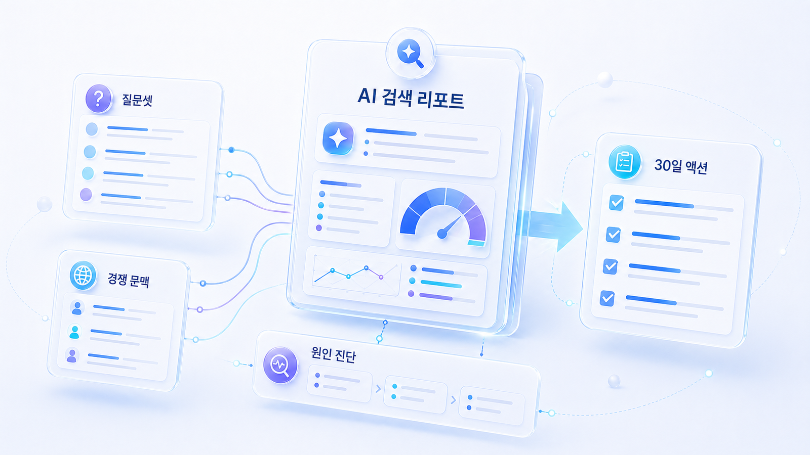
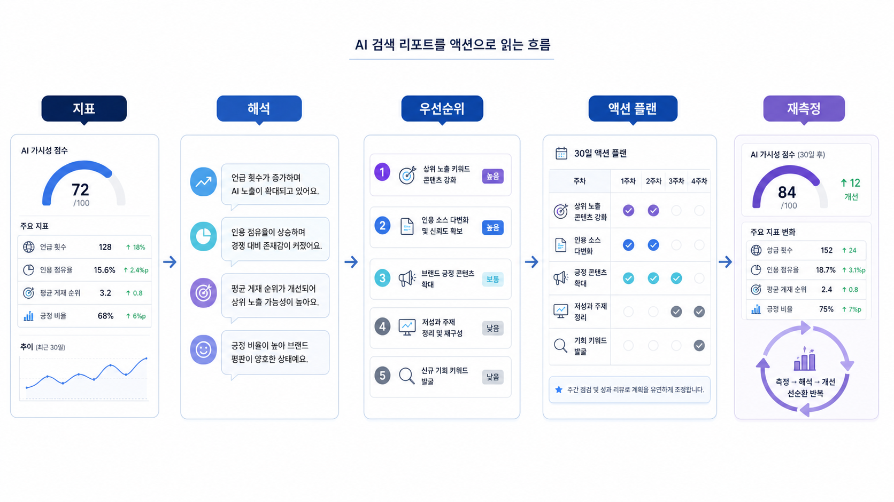

## AI 검색 리포트는 어떤 지표로 읽어야 하나



AI 검색 리포트는 점수표가 아니라 다음 행동을 정하는 운영 문서입니다. 좋은 GEO 리포트는 브랜드 가시성 분석, 브랜드 언급률, 답변 근거(source), 화면 인용(citation), 경쟁 문맥, 콘텐츠/출처/기술 액션을 한 흐름으로 보여줘야 합니다.

반대로 나쁜 리포트는 `AI 검색 점수 72점`처럼 숫자만 남깁니다. 점수가 높거나 낮은 이유, 어떤 질문에서 빠졌는지, 다음 달에 무엇을 고칠지 없으면 팀은 움직일 수 없습니다.

[TOC]

## 리포트에서 반드시 봐야 할 지표

| 지표 | 질문 | 실행으로 바꾸는 법 |
|---|---|---|
| 질문셋 커버리지 | 어떤 질문군을 측정했나 | 브랜드/정보/비교/추천/검증 비중 조정 |
| 플랫폼 커버리지 | ChatGPT/Perplexity/Google AI Overviews를 어떻게 나눴나 | 플랫폼별 원인을 따로 기록 |
| 브랜드 언급률 | 어디서 등장하고 빠졌나 | 빠진 질문군의 콘텐츠/출처 보강 |
| 답변 근거(source) | 어떤 자료가 답변 재료가 됐나 | 공식 가이드, 비교표, 사례, 외부 출처 확보 |
| 화면 인용(citation) | 어떤 URL이 사용자 화면에 보이나 | 제목, 첫 문단, 구조화 데이터, 내부 링크 점검 |
| 경쟁 문맥 | 어떤 경쟁사와 비교되나 | 포지셔닝과 비교 콘텐츠 개선 |
| Answer quality | 설명이 정확한가 | 제품 메시지/FAQ/오래된 정보 수정 |
| 다음 액션 | 무엇을 언제 고칠까 | 담당자/기한/완료 기준으로 전환 |

이 표는 GEO 도구를 쓰든, 대행사 리포트를 받든, 내부에서 수동 측정하든 공통으로 적용할 수 있습니다.

## 리포트 첫 페이지 구조

AI 검색 리포트는 첫 페이지에서 결론을 보여줘야 합니다. 팀이 바로 읽을 수 있게 아래 순서로 정리합니다.

1. 이번 달 가장 중요한 변화 3개
2. 좋아진 질문군과 나빠진 질문군
3. 브랜드 언급률/source/citation 핵심 수치
4. 플랫폼별 차이: ChatGPT / Perplexity / Google AI Overviews
5. 경쟁사와 함께 언급된 문맥
6. 오류가 있거나 약하게 설명된 브랜드 메시지
7. 다음 30일 액션 5개
8. 다음 측정일과 담당자

이 구조가 있으면 리포트는 보고서가 아니라 실행 회의의 기준이 됩니다.



## 좋은 리포트 문장 예시

나쁜 문장:

```text
이번 달 GEO 점수는 67점입니다.
```

좋은 문장:

```text
추천형 질문 30개 중 브랜드 mention은 6개였고, citation은 2개였습니다. 경쟁사 A/B는 비교형 질문에서 반복 추천되지만, 우리 브랜드는 가격/보안 기준 설명이 부족해 후보군에서 빠지는 경우가 많았습니다. 다음 30일은 비교표 콘텐츠 2개, 보안 FAQ 1개, 외부 리뷰 출처 3개 확보를 우선합니다.
```

두 번째 문장은 점수보다 길지만, 바로 실행할 수 있습니다. GEO 리포트는 짧은 점수보다 실행 가능한 원인을 보여주는 편이 더 좋습니다.

## 리포트 해석 예시

| 질문군 | 현재 상태 | 핵심 원인 | 다음 액션 |
|---|---|---|---|
| 브랜드 직접 질문 | mention 높음, citation 낮음 | 공식 페이지보다 외부 소개 글이 더 자주 인용됨 | 회사 소개/제품 페이지 첫 문단과 FAQ 보강 |
| 비교 질문 | 경쟁사 A/B 반복 등장 | 비교 기준 콘텐츠와 제3자 출처 부족 | 비교표, 대안 콘텐츠, 외부 리뷰 출처 확보 |
| 추천 질문 | 후보군에서 자주 제외 | 가격/보안/도입 조건 설명 부족 | 구매 기준형 콘텐츠와 사례 페이지 작성 |
| 문제 해결 질문 | 일부 답변에서 오해 발생 | 오래된 블로그와 최신 제품 메시지 불일치 | 오래된 글 업데이트와 내부 링크 정리 |
| 로컬/지점 질문 | 지역 추천 문맥에서 빠짐 | NAP/리뷰/지역 FAQ 신호 부족 | 지도/리뷰/지점 페이지 정리 |

이 표의 목적은 점수를 예쁘게 보여주는 것이 아닙니다. `어떤 질문에서 빠졌는지`, `왜 빠졌는지`, `무엇을 고칠지`를 한 화면에 놓는 것입니다.

## 월간 리포트 운영 워크플로우

AI 검색 리포트는 한 번 만들고 끝나는 문서가 아닙니다. 매달 같은 질문셋을 기준으로 측정하고, 검색성과와 함께 읽고, 다음 액션을 정한 뒤, 다음 달에 같은 조건으로 다시 확인해야 합니다.

```text
질문셋 고정
→ ChatGPT/Perplexity/AI Overviews 측정
→ mention/source/citation/answer quality 기록
→ GSC/GA4/네이버 데이터와 대조
→ 콘텐츠/출처/기술/메시지 액션 배정
→ 수정 반영
→ 같은 질문셋으로 재측정
```

| 단계 | 담당 | 산출물 | 완료 기준 |
|---|---|---|---|
| 질문셋 관리 | SEO/GEO 담당 | 브랜드/비브랜드 질문셋 | 질문군 비중과 측정 조건 확정 |
| 플랫폼 측정 | 운영 담당 | 원문 답변과 citation 캡처 | 동일 조건 반복 측정 완료 |
| 검색성과 대조 | SEO 담당 | GSC/GA4/네이버 요약 | query/page/전환 변화 확인 |
| 원인 해석 | 콘텐츠/브랜드/개발 | 원인별 이슈 목록 | 콘텐츠/출처/기술/메시지로 분류 |
| 실행 배정 | PM/마케팅 리드 | 30일 액션 플랜 | 담당자/기한/검증 방법 포함 |
| 재측정 | 운영 담당 | 전월 대비 변화표 | 같은 질문셋으로 비교 가능 |

이 워크플로우가 있어야 리포트가 점수표가 아니라 운영 시스템이 됩니다. 특히 GSC, GA4, 네이버 서치어드바이저, AI 답변 측정 결과를 따로 보지 않고 같은 회의 안에서 해석해야 합니다.

## 기존 SEO 지표와 함께 읽기

AI 검색 리포트는 기존 SEO 리포트를 대체하지 않습니다. Google Search Console의 [성과 보고서](https://support.google.com/webmasters/answer/7576553)처럼 검색어, 노출, 클릭, 페이지 성과를 보여주는 자료와 함께 봐야 원인을 더 잘 나눌 수 있습니다.

| SEO/GEO 조합 | 해석 | 다음 액션 |
|---|---|---|
| 검색 노출 높음 / AI mention 낮음 | 페이지는 발견되지만 AI 답변 후보로 약함 | answer-first 문단, 비교표, FAQ 보강 |
| 검색 노출 낮음 / AI citation 있음 | 특정 질문에서는 출처로 쓰이나 검색 기반이 약함 | 제목/메타/내부 링크/검색 기본기 점검 |
| 검색 노출 높음 / AI citation 없음 | 주제는 맞지만 화면 인용 경쟁에서 밀림 | 구조화 데이터, 첫 문단, 최신성, 외부 출처 보강 |
| 검색 노출 낮음 / AI mention 낮음 | 카테고리 자산 자체가 약함 | 질문셋 기반 신규 콘텐츠와 source map 구축 |

## GEO 도구와 대행사 리포트 검토 기준

GEO 도구나 GEO 대행사 리포트를 받을 때는 아래 질문을 확인합니다.

- 질문셋 원문을 볼 수 있는가?
- ChatGPT, Perplexity, Google AI Overviews를 같은 기준으로 뭉개지 않았는가?
- 브랜드 언급률, 답변 근거, 화면 인용을 분리했는가?
- 경쟁사와 함께 등장한 문맥을 보여주는가?
- 답변 오류와 최신성 문제를 따로 표시하는가?
- 콘텐츠/출처/기술 액션이 담당자와 기한으로 이어지는가?
- 다음 달 같은 조건으로 재측정할 수 있는가?

이 질문에 답하지 못하면 리포트는 보기에는 좋아도 운영에는 약합니다. 더 자세한 리포트/도구/제안서 검증 기준은 [GEO 리포트와 실행 검증: AI 검색 성과를 읽는 법](https://wikidocs.net/346337)에서 다룹니다.

## 30일 액션 플랜 템플릿

| 우선순위 | 발견한 문제 | 담당 영역 | 액션 | 완료 기준 | 재측정 질문 |
|---|---|---|---|---|---|
| P0 | 추천형 질문에서 후보군 제외 | 콘텐츠 | 비교 기준 글 1개 작성 | 추천형 질문 10개 재측정 | B2B SaaS GEO 도구 추천 |
| P0 | citation 없음 | 기술/콘텐츠 | 핵심 페이지 첫 문단/FAQ/schema 점검 | 우리 URL citation 확인 | AI 검색 모니터링 방법 |
| P1 | 경쟁사만 반복 등장 | 출처/PR | 외부 리뷰/뉴스/디렉터리 출처 확보 | 제3자 출처 3개 추가 | GEO 도구 비교 |
| P1 | 설명 오류 반복 | 메시지 | About/FAQ/제품 설명 최신화 | 오류 문장 사라짐 | 우리 브랜드는 어떤 도구야? |

## 실습 워크시트

| 섹션 | 작성 내용 |
|---|---|
| 이번 달 결론 | 가장 중요한 변화 3개 |
| 질문셋 | 측정한 질문군과 비중 |
| 플랫폼 | ChatGPT / Perplexity / Google AI Overviews 결과 구분 |
| 핵심 지표 | mention/source/citation/answer quality |
| 경쟁 문맥 | 반복 등장한 경쟁사/대안 |
| 문제 원인 | 콘텐츠/출처/기술/메시지 중 어디 문제인가 |
| 30일 액션 | 담당자, 기한, 완료 기준 |
| 재측정 계획 | 같은 질문으로 다시 볼 날짜 |

## HaloX로 이어지는 지점

브랜드 가시성 분석을 실제 운영 리포트로 확장하려면 HaloX의 [AVI 점수 가이드](https://haloxlabs.ai/ko/blog/avi-score-explained)와 [GEO 콘텐츠 구조화 가이드](https://haloxlabs.ai/ko/blog/geo-content-structure)를 함께 참고합니다. 리포트의 숫자는 시작점이고, 실제 가치는 질문군별 원인과 30일 액션을 정리하는 데 있습니다.

리포트를 실제 실행 계획으로 바꾸려면 [4주 실행 로드맵과 GEO 리포트](https://wikidocs.net/346338)를 읽습니다. 외부 도구나 제안서를 검토해야 한다면 [GEO 리포트와 실행 검증](https://wikidocs.net/346337)으로 이어갑니다.
