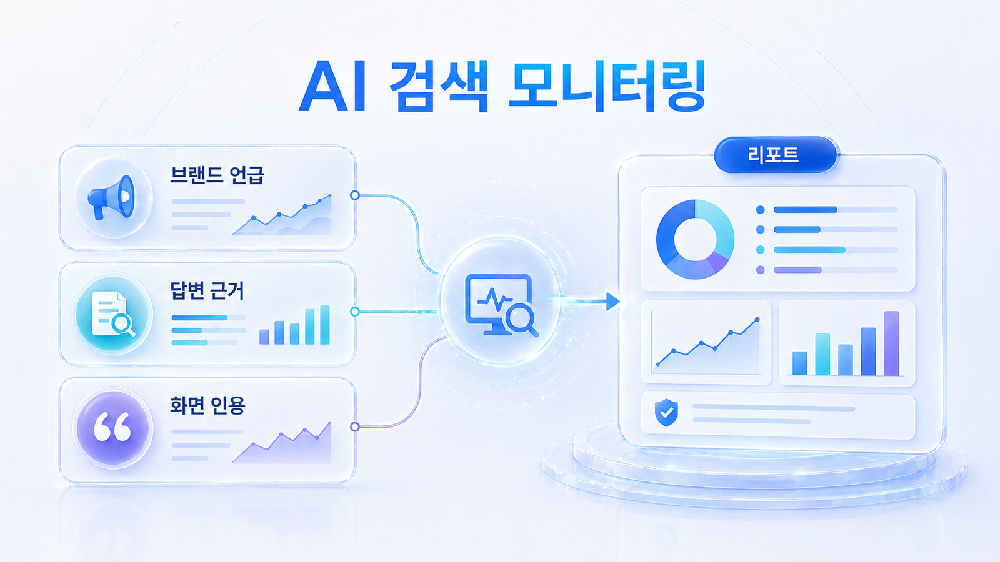
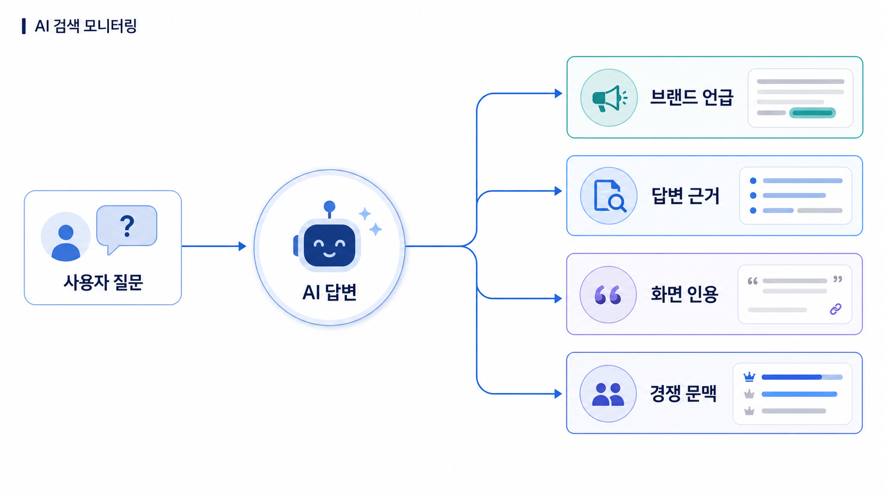

## AI 검색 모니터링: 브랜드 언급률, 답변 근거, 화면 인용 읽는 법



AI 검색 모니터링은 “우리 브랜드가 AI 답변에 나왔는가”를 세는 일이 아닙니다. 같은 브랜드 언급이라도 질문군, 플랫폼, 답변 근거(source), 화면 인용(citation), 경쟁사 문맥에 따라 의미가 달라집니다.

01장에서 만든 SEO 키워드와 질문셋은 이 장에서 기준선 진단표로 바뀝니다. 기준선은 점수를 예쁘게 만드는 자료가 아니라, 다음 달에 무엇이 달라졌는지 비교하기 위한 출발점입니다. 이 장을 읽고 나면 ChatGPT 브랜드 노출, Perplexity SEO, Google AI Overviews 최적화를 한 점수로 뭉개지 않고 각각 다른 신호로 읽을 수 있습니다.

HaloX의 [AVI 점수 가이드](https://haloxlabs.ai/ko/blog/avi-score-explained)는 AI 검색 시대의 브랜드 가시성을 점수화해서 보는 관점을 설명합니다. 이 장은 그 점수를 실무자가 읽을 수 있는 운영 언어로 바꿉니다.

[TOC]

## 이 장에서 먼저 잡을 기준

AI 검색 모니터링에서 가장 위험한 실수는 모든 결과를 “노출됐다/안 됐다”로만 보는 것입니다. 브랜드가 언급됐더라도 공식 페이지가 인용되지 않으면 유입 경로가 약하고, 링크가 보이더라도 답변 문맥이 틀리면 좋은 상태가 아닙니다.

그래서 이 장에서는 네 가지를 나눠 봅니다.

- **브랜드 언급률**: 어떤 질문군에서 이름이 등장하는가
- **답변 근거**: AI가 답변을 만들 때 어떤 자료를 참고했는가
- **화면 인용**: 사용자가 실제로 볼 수 있는 링크가 붙는가
- **답변 품질**: 추천 이유, 제외 이유, 경쟁 비교가 정확한가



이 네 가지를 분리하면 리포트가 훨씬 실무적으로 바뀝니다. 예를 들어 mention은 높은데 citation이 낮은 브랜드는 콘텐츠 수보다 대표 URL, title, 첫 문단, 내부 링크, schema를 먼저 볼 수 있습니다. 반대로 citation은 있는데 추천 이유가 약하면 제품 설명, FAQ, 사례, 비교 기준을 다시 정리해야 합니다.

## 플랫폼별로 다르게 읽는다

ChatGPT, Perplexity, Google AI Overviews는 같은 AI 검색처럼 보여도 화면 구조와 출처 노출 방식이 다릅니다. ChatGPT에서는 추천 문맥과 답변 품질이 먼저 보일 수 있고, Perplexity에서는 반복 인용 URL이 더 잘 드러납니다. Google AI Overviews는 기존 검색 결과와 AI 요약의 관계를 함께 봐야 합니다.

Google의 [AI features and your website](https://developers.google.com/search/docs/appearance/ai-features)는 Google 검색의 AI 기능이 웹사이트 발견과 연결될 수 있음을 설명합니다. 그래서 Google AI Overviews를 볼 때는 AI 요약만 보지 말고 기존 검색 결과, 콘텐츠 품질, 구조화 데이터, Search Console 지표까지 함께 봅니다.

## 01장 산출물이 02장 측정표로 바뀌는 방식

02장은 01장에서 만든 SEO 산출물을 그대로 이어받습니다. 키워드 리서치에서 나온 query는 AI 질문셋의 후보가 되고, SERP 분석에서 확인한 검색 의도는 질문군 분류 기준이 됩니다. 온페이지 SEO와 내부 링크 점검 결과는 citation 후보 URL을 고르는 기준이 되고, 권위/엔티티 점검 결과는 source 후보를 해석하는 기준이 됩니다.

측정표는 “AI가 우리를 알고 있나?”를 묻는 표가 아닙니다. “어떤 SEO/GEO 자산을 고치면 다음 측정에서 달라질까?”를 찾는 운영 도구입니다.

```text
질문셋
→ 플랫폼별 답변 수집
→ 브랜드 언급률/답변 근거/화면 인용 분리
→ 경쟁 문맥과 답변 품질 해석
→ 콘텐츠/출처/기술/메시지 액션 결정
→ 같은 질문으로 재측정
```

## 기준선 진단에서 남길 것

처음부터 복잡한 리포트를 만들 필요는 없습니다. 대신 비교 가능한 기록은 반드시 남겨야 합니다. 질문 원문, 질문군, 플랫폼, 모델/날짜, 브랜드 언급 여부, 답변 근거, 화면 인용, 경쟁 문맥, 답변 품질, 다음 액션을 한 줄로 정리합니다.

이 기록이 있어야 30일 뒤에 같은 질문으로 다시 봤을 때 변화가 보입니다. 질문을 매번 바꾸거나 플랫폼을 섞어 기록하면 점수가 좋아져도 원인을 설명하기 어렵습니다.

## 약한 지표를 실행 액션으로 바꾸기

| 약한 신호 | 먼저 볼 자산 | 이어지는 장 |
|---|---|---|
| 브랜드 언급률이 낮음 | 카테고리 콘텐츠, 비교 콘텐츠, 질문셋 커버리지 | 03장/04장 |
| 답변 근거가 약함 | 공식 가이드, 고객 사례, 외부 출처, 엔티티 설명 | 05장 |
| 화면 인용이 약함 | title, 첫 문단, schema, 내부 링크, canonical | 04장/06장 |
| 답변 품질이 낮음 | FAQ, 제품 설명, E-E-A-T 근거, 최신성 | 04장/05장 |

AI 검색 모니터링의 목적은 점수를 확인하는 것이 아니라 다음 작업을 정하는 것입니다. 이 장에서는 지표를 합치기보다 분리해서 읽고, 콘텐츠 리라이트, 외부 출처 보강, 기술 점검, 메시지 정리 중 무엇을 먼저 해야 하는지 판단합니다.

## 이 장을 읽는 순서

먼저 [02-01. ChatGPT 브랜드 노출은 어떻게 확인하나](https://wikidocs.net/346601)에서 질문군별 브랜드 언급률과 추천 문맥을 봅니다. 다음으로 [02-02. Perplexity SEO와 Google AI Overviews 최적화는 어떻게 다르게 볼까](https://wikidocs.net/346602)에서 플랫폼별 출처 노출 방식을 나눕니다.

그다음 [02-03. 브랜드 언급률, 답변 근거, 화면 인용은 어떻게 나눠 읽나](https://wikidocs.net/346603)에서 세 지표의 조합을 해석하고, [02-04. AI 검색 리포트는 어떤 지표로 읽어야 하나](https://wikidocs.net/346604)에서 30일 실행 계획으로 넘깁니다.

## 다음 흐름

02장은 1주차 기준선 진단의 후반부입니다. 01장에서 질문셋을 만들었다면, 이 장에서는 같은 질문을 반복 측정해 기준선을 남깁니다. 이후 [03장 Query Fan-out](https://wikidocs.net/346343)에서 약한 질문군을 더 촘촘하게 펼치고, [04장 콘텐츠 구조](https://wikidocs.net/346332)와 [05장 답변 근거/화면 인용/엔티티 전략](https://wikidocs.net/346333)에서 실제 개선으로 넘어갑니다.
