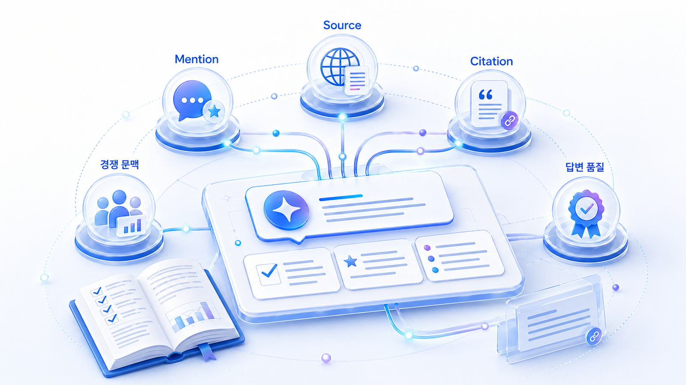

## AI 검색 모니터링: 브랜드 언급률, 답변 근거, 화면 인용 읽는 법



AI 검색 모니터링은 `GEO가 잘되고 있다`는 말을 측정 가능한 문장으로 바꾸는 작업입니다. 단순히 ChatGPT나 Perplexity 답변에 브랜드가 한 번 나왔는지만 보면 부족합니다. 어떤 질문군에서 브랜드 언급률이 올라가는지, 어떤 답변 근거(source)가 쓰이는지, 사용자가 볼 수 있는 화면 인용(citation)이 붙는지, 경쟁사와 어떤 문맥에서 비교되는지까지 함께 봐야 합니다.

01장에서 만든 질문셋은 이 장에서 기준선 진단표로 바뀝니다. 핵심은 점수를 하나로 합치는 것이 아니라, 질문군과 플랫폼별로 상태를 나누는 것입니다. 같은 `AI 검색 모니터링`이라도 ChatGPT 브랜드 노출, Perplexity SEO, Google AI Overviews 최적화는 화면 구조와 판단 기준이 다릅니다.

HaloX의 [AVI 점수 가이드](https://haloxlabs.ai/ko/blog/avi-score-explained)는 AI 검색 시대의 브랜드 가시성을 점수화해서 보는 관점을 설명합니다. 이 장은 그 점수를 실무자가 읽을 수 있는 운영 언어로 바꿉니다.

[TOC]

## 이 장의 핵심 모델

```text
질문셋
→ 플랫폼별 답변 수집
→ mention/source/citation 분리
→ 경쟁 문맥과 답변 품질 해석
→ 콘텐츠/출처/기술/메시지 액션 결정
→ 같은 질문으로 재측정
```

이 흐름을 지키면 `브랜드가 나왔다/안 나왔다`에서 멈추지 않습니다. 어떤 질문군에서 빠졌는지, 왜 빠졌는지, 무엇을 고치면 다음 측정에서 달라지는지까지 볼 수 있습니다.

## 네 가지 지표를 먼저 분리한다

| 지표 | 의미 | 확인 질문 | 바로 이어지는 액션 |
|---|---|---|---|
| 브랜드 mention | 답변 안에 브랜드가 등장하는가 | 어떤 질문군에서 이름이 나오는가? | 빠진 질문군의 콘텐츠/출처 보강 |
| 답변 근거(source) | AI가 답변을 만들 때 참고한 정보 재료 | 설명의 근거가 우리 자산인가, 제3자 자산인가? | 공식 가이드/사례/비교표/외부 출처 확보 |
| 화면 인용(citation) | 사용자가 볼 수 있는 링크로 표시되는 출처 | 클릭 가능한 우리 URL이 보이는가? | 제목/첫 문단/구조화 데이터/내부 링크 점검 |
| 답변 품질 | 브랜드가 정확하고 설득력 있게 설명되는가 | 추천 이유와 제외 이유가 맞는가? | 메시지/FAQ/오래된 글/제품 설명 정리 |

이 네 가지를 섞으면 리포트가 흐려집니다. mention은 높은데 citation이 낮은 브랜드, citation은 있는데 추천 이유가 약한 브랜드, source는 있지만 오래된 설명이 반복되는 브랜드는 각각 다른 처방이 필요합니다.

## 플랫폼별로 다르게 읽어야 하는 이유

| 플랫폼/화면 | 먼저 볼 것 | 조심할 점 |
|---|---|---|
| ChatGPT | 질문군별 브랜드 mention, 추천 문맥, 답변 품질 | 출처가 항상 명확하게 보이는 환경만 있는 것은 아님 |
| Perplexity | 답변에 붙은 citation, 반복 출처, 경쟁사 출처 | 출처가 보여도 추천 이유가 약할 수 있음 |
| Google AI Overviews | AI 요약 포함 여부, 화면 인용, 일반 검색 결과와의 관계 | 기존 SEO 노출과 AI 요약 포함을 함께 봐야 함 |
| 수동/도구 리포트 | 질문셋 원문, 재측정 조건, 경쟁 문맥 | 플랫폼별 차이를 한 점수로 뭉개면 원인을 놓침 |

Google의 [AI features and your website](https://developers.google.com/search/docs/appearance/ai-features)는 Google 검색의 AI 기능이 웹사이트 발견과 연결될 수 있음을 설명합니다. 그래서 Google AI Overviews를 볼 때는 AI 요약만 보지 말고, 기존 검색 결과, 콘텐츠 품질, 구조화 데이터, Search Console 지표까지 함께 봐야 합니다.

## 기준선 진단에서 기록할 항목

| 항목 | 기록 방식 | 해석 포인트 |
|---|---|---|
| 질문 원문 | 01장에서 만든 질문 그대로 기록 | 질문을 바꾸면 결과 비교가 어려움 |
| 질문군 | 브랜드/카테고리/비교/추천/검증/실행 | 질문군별 성과를 나눠 봄 |
| 플랫폼 | ChatGPT/Perplexity/Google AI Overviews 등 | 플랫폼별 화면과 출처 노출 방식이 다름 |
| 브랜드 mention | 있음/없음/부분 언급 | 단순 이름 언급과 추천 문맥을 구분 |
| 답변 근거(source) | 확인 가능한 근거 URL/출처 | 우리 자산인지, 제3자 자산인지 봄 |
| 화면 인용(citation) | 사용자 화면에 보이는 링크 | 클릭 가능한 출처가 반복되는지 봄 |
| 경쟁 문맥 | 함께 언급된 브랜드/비교 기준 | 어떤 포지션으로 묶이는지 확인 |
| 답변 품질 | 정확/모호/오류/오래됨 | 메시지 정리나 오류 수정 필요 여부 판단 |
| 다음 액션 | 콘텐츠/출처/기술/메시지 과제 | 측정이 실행으로 이어져야 함 |

## 점수보다 중요한 것

AI 검색 리포트에서 점수는 시작점일 뿐입니다. 더 중요한 것은 `왜 그 점수가 나왔는가`입니다. 같은 70점이라도 브랜드 언급은 많은데 citation이 없는 경우와, citation은 있는데 추천 문맥이 약한 경우는 완전히 다른 문제입니다.

따라서 이 장에서는 지표를 합치기보다 분리해서 읽습니다. 그래야 콘텐츠 리라이트, 외부 출처 보강, 기술 점검, 메시지 정리 중 무엇을 먼저 해야 하는지 보입니다.

## 이 장에서 나눠 읽을 네 가지 질문

| 세부 질문 | 먼저 볼 지표 | 이어서 할 일 |
|---|---|---|
| [ChatGPT 브랜드 노출은 어떻게 확인하나](https://wikidocs.net/346601) | 질문군별 브랜드 언급률과 추천 문맥 | 빠진 질문을 콘텐츠/출처 과제로 나눈다 |
| [Perplexity SEO와 Google AI Overviews 최적화는 어떻게 다르게 볼까](https://wikidocs.net/346602) | 화면 인용(citation), 출처 반복성, 검색 결과와 AI 답변의 차이 | 플랫폼별 측정표를 따로 만든다 |
| [브랜드 언급률, 답변 근거, 화면 인용은 어떻게 나눠 읽나](https://wikidocs.net/346603) | mention/source/citation의 조합 | 문제 유형별 액션을 정한다 |
| [AI 검색 리포트는 어떤 지표로 읽어야 하나](https://wikidocs.net/346604) | 질문셋 커버리지, 경쟁 문맥, 다음 액션 | 30일 실행 계획으로 넘긴다 |

## 다음 흐름

02장은 1주차 기준선 진단의 후반부입니다. 01장에서 질문셋을 만들었다면, 이 장에서는 같은 질문을 반복 측정해 기준선을 남깁니다. 이후 [03장 Fan-out 질문 확장](https://wikidocs.net/346343)에서 약한 질문군을 더 촘촘하게 펼치고, [04장 콘텐츠 구조](https://wikidocs.net/346332)와 [05장 답변 근거/source 전략](https://wikidocs.net/346333)에서 실제 개선으로 넘어갑니다.
