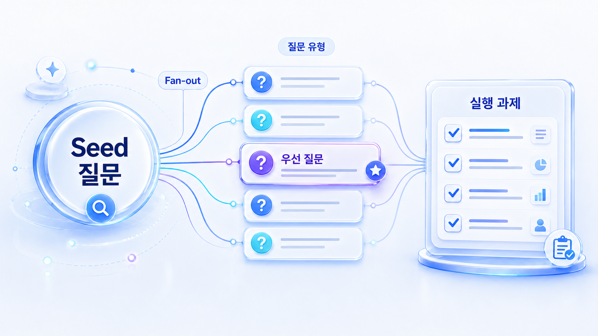

## Fan-out은 AI가 질문을 어떻게 쪼개는가

Fan-out은 사용자가 입력한 한 질문을 AI가 답변 가능한 여러 하위 질문과 검색/검증 작업으로 쪼개는 과정입니다. 사람이 키워드에서 질문을 여러 개 만드는 `질문 확장`과 다릅니다. 질문 확장은 우리가 측정할 프롬프트를 준비하는 일이고, fan-out은 AI가 답변을 만들면서 내부적으로 수행하는 하위 판단 구조를 이해하는 일입니다.

예를 들어 `우리 회사에 맞는 GEO 도구 추천해줘`라는 한 문장에는 많은 하위 작업이 숨어 있습니다. AI는 도구 정의, SEO 도구와의 차이, 측정 지표, 가격/기능, 고객사 URL의 공식 설명, 외부 리뷰, 경쟁사 비교, 도입 후 30일 액션까지 함께 확인하려 할 수 있습니다. 이 숨은 질문 패턴을 밖으로 꺼내야 콘텐츠 전략이 정확해집니다.

[TOC]

## fan-out과 질문 확장의 차이

| 구분 | 질문 확장 | AI query fan-out |
|---|---|---|
| 주체 | 우리/마케터/콘텐츠팀 | AI 시스템 |
| 출발점 | SEO 키워드, PAA, 연관 검색, 고객 질문 | 사용자가 AI에게 던진 한 질문 |
| 목적 | 측정할 질문셋을 넓힘 | 답변을 만들기 위한 하위 판단과 검색 수행 |
| 예시 | `GEO 도구`, `ChatGPT SEO`, `AI 검색 리포트`를 질문 30개로 바꿈 | `GEO 도구 추천`을 정의/비교/검증/source/URL 확인/실행 단계로 쪼갬 |
| 산출물 | 기준선 측정용 프롬프트 목록 | AI 검색 패턴 추정표와 콘텐츠 갭 |

둘 다 필요합니다. 다만 순서와 역할이 다릅니다. 먼저 사용자 질문셋을 만들고, 그 질문을 실제 AI에 넣어 답변 구조를 관찰한 뒤, AI가 어떤 하위 질문으로 fan-out했는지 추정합니다.

## AI가 한 질문을 쪼갤 때 볼 수 있는 하위 작업

| fan-out 노드 | AI가 확인하려는 것 | 필요한 자산 |
|---|---|---|
| 정의 노드 | 이 개념이 무엇인가 | 용어 설명, 첫 답변, glossary |
| 비교 노드 | 무엇과 비교해야 하는가 | 비교표, 대안 페이지, 가격/기능/대상 차이 |
| 추천 노드 | 어떤 조건에서 누구에게 맞는가 | 고객 유형, 선택 기준, 제외 기준 |
| 검증 노드 | 믿을 근거가 있는가 | 공식 문서, 뉴스룸, 사례, 리뷰, 외부 출처 |
| source 노드 | 답변 근거로 삼을 URL이 있는가 | 블로그, 문서, 제품 페이지, 리포트, 보도자료 |
| URL 확인 노드 | 공식 URL이나 고객사 URL이 실제 설명과 맞는가 | 공식 홈페이지, 고객사 사례 페이지, 파트너 페이지, canonical URL |
| 실행 노드 | 지금 무엇부터 해야 하는가 | 체크리스트, 워크플로우, 30일 액션 |
| 리스크 노드 | 무엇을 조심해야 하는가 | 정책, 금지 표현, 오류 사례, FAQ |

여기서 `URL 확인 노드`가 중요합니다. 검색형 AI나 브라우징형 답변은 때로 공식 사이트, 제품 페이지, 고객사 사례 URL, 외부 기사 같은 웹 자산을 확인하면서 답변을 구성합니다. 따라서 GEO 콘텐츠는 질문에 답하는 문장뿐 아니라, AI가 확인할 수 있는 공식 URL과 일관된 설명을 갖춰야 합니다.

## fan-out 관찰 예시

Seed 질문을 `B2B SaaS 팀에 맞는 GEO 도구는 무엇인가?`로 잡으면 사람이 만든 질문 목록과 AI fan-out 추정은 다르게 보입니다.

| 단계 | 사람이 만든 질문 확장 | AI fan-out 추정 |
|---|---|---|
| 시작 | GEO 도구 추천, GEO 도구 비교, ChatGPT SEO 도구 | 사용자가 도구 추천을 요청함 |
| 하위 판단 | 가격/기능/리포트/지원 플랫폼 질문을 추가 | 도구 정의, SEO 도구와 차이, visibility 측정 방식, citation 추적 여부를 확인 |
| 검증 | PAA/연관 검색에서 질문 추가 | 공식 URL, 제품 설명, 고객사 사례, 외부 리뷰, 경쟁사 문맥을 확인 |
| 실행 | 콘텐츠 주제로 정리 | 추천 이유, 제외 기준, 30일 실행 가능성까지 합성 |
| 결과 | 질문셋 30개 | source/citation/콘텐츠/기술 갭이 드러남 |

이렇게 보면 fan-out은 콘텐츠 아이디어 발상이 아니라 AI의 답변 생성 패턴을 이해하는 분석 프레임입니다.

## HaloX 검색 패턴으로 보는 이유

HaloX가 보려는 것은 `우리가 어떤 프롬프트를 발견했는가`만이 아닙니다. 더 중요한 것은 AI가 답변을 만들 때 어떤 질문 패턴을 반복하는지입니다.

| HaloX에서 볼 질문 | 의미 | 다음 액션 |
|---|---|---|
| AI가 반복해서 비교하는 기준은 무엇인가 | 비교/추천 fan-out 노드 | 비교표와 선택 기준 보강 |
| AI가 확인하는 source는 어디인가 | source fan-out 노드 | 공식/외부 출처 맵 작성 |
| 고객사 URL이나 공식 URL이 답변에 쓰이는가 | URL 확인 노드 | 사례 페이지, 뉴스룸, 제품 페이지 정비 |
| 답변에서 빠지는 조건은 무엇인가 | 메시지 갭 | 대상 고객/제외 기준/기능 설명 보강 |
| 어떤 하위 질문에서 경쟁사가 강한가 | 경쟁 fan-out 노드 | 경쟁 비교 콘텐츠와 proof 보강 |

## 실습 워크시트

| 입력 항목 | 작성 기준 |
|---|---|
| 사용자 질문 | 실제 AI에 넣은 질문 1개 |
| AI 답변 요약 | 답변이 어떤 기준으로 구성됐는지 |
| 관찰된 하위 판단 | 정의/비교/추천/검증/source/URL/실행/리스크 |
| 확인된 source/URL | AI가 언급하거나 인용한 URL, 또는 확인해야 할 공식 URL |
| 우리 자산 커버 | 충분/부분/없음 |
| gap_note | 어떤 하위 질문에 답변 재료가 부족한가 |
| next_action | 신규 작성/리라이트/source 보강/기술 점검/메시지 보강 |

## 참고 링크

개념 정의는 HaloX의 [쿼리 팬아웃](https://haloxlabs.ai/ko/glossary/query-fan-out)을 확인합니다. 사용자 질문 확장의 단서로는 [PAA](https://haloxlabs.ai/ko/glossary/paa), Google 자동완성, 연관 검색, 고객 상담 질문을 함께 봅니다. 다만 PAA는 AI fan-out 자체가 아니라 사람들이 함께 묻는 질문의 공개 단서라는 점을 구분해야 합니다.

Google의 [AI features and your website](https://developers.google.com/search/docs/appearance/ai-features)는 AI 기능과 웹 콘텐츠의 관계를 이해하는 데 참고할 수 있습니다. 콘텐츠가 실제로 도움이 되는지는 [유용한 콘텐츠 만들기](https://developers.google.com/search/docs/fundamentals/creating-helpful-content) 기준으로 함께 점검합니다.

## 흔한 질문

**Q. fan-out은 우리가 질문을 많이 뽑는 작업인가요?**

아닙니다. 우리가 질문을 많이 뽑는 것은 사용자 질문 확장입니다. fan-out은 AI가 한 질문을 답하기 위해 내부적으로 어떤 하위 질문과 검색/검증 작업으로 나누는지 이해하는 개념입니다.

**Q. PAA와 연관 검색만 보면 fan-out을 알 수 있나요?**

부분 단서만 얻을 수 있습니다. PAA와 연관 검색은 사람들의 질문 패턴이고, AI fan-out은 실제 AI 답변 구조, 인용 URL, 비교 기준, 누락된 검증 항목을 함께 관찰해야 추정할 수 있습니다.

**Q. 고객사 URL 검증은 왜 나오나요?**

AI가 브랜드나 도구를 추천하려면 공식 페이지, 고객사 사례, 제품 설명, 외부 리뷰 같은 웹 자산을 근거로 삼을 수 있습니다. 그래서 URL이 실제 설명과 맞고 AI가 읽을 수 있어야 합니다.

## 다음 흐름

이전 흐름은 [03. Query Fan-out: AI가 내부에서 확장하는 질문 패턴](https://wikidocs.net/346343)에서 확인할 수 있습니다. 다음은 [03-02. 사용자 질문셋과 AI 질문 패턴을 어떻게 분리할까](https://wikidocs.net/346345)에서 측정 질문셋과 fan-out 패턴을 나눠 설계합니다.
