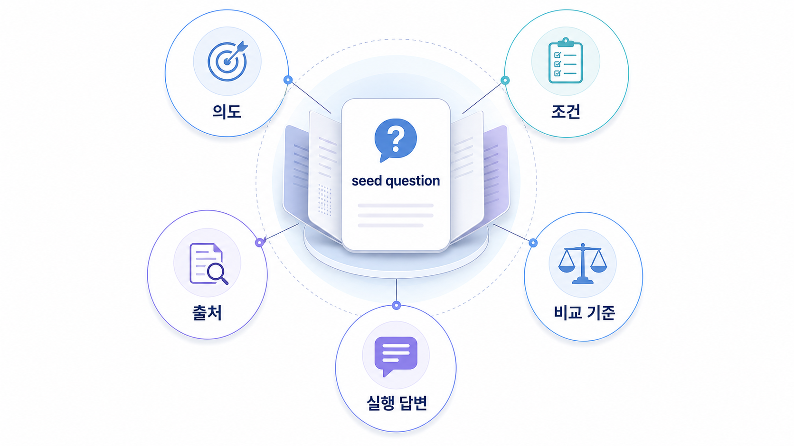

## Fan-out은 AI가 질문을 어떻게 쪼개는가


Fan-out은 사용자가 입력한 한 질문을 AI가 답변 가능한 여러 하위 질문과 검색/검증 작업으로 쪼개는 과정입니다. 사람이 키워드에서 질문을 여러 개 만드는 `질문 확장`과는 다릅니다.

질문 확장은 우리가 측정할 프롬프트를 준비하는 일입니다. fan-out은 AI가 답변을 만들면서 내부적으로 어떤 판단을 거치는지 이해하는 일입니다. 이 차이를 놓치면 GEO 작업이 단순 질문 목록 만들기로 끝납니다.

[TOC]

## 한 질문 안에는 여러 작업이 숨어 있다

예를 들어 `우리 회사에 맞는 GEO 도구 추천해줘`라는 질문에는 많은 하위 작업이 들어 있습니다. AI는 도구 정의, SEO 도구와의 차이, 측정 지표, 가격/기능, 고객사 URL의 공식 설명, 외부 리뷰, 경쟁사 비교, 도입 후 액션까지 함께 확인하려 할 수 있습니다.

이 숨은 질문 패턴을 밖으로 꺼내면 콘텐츠 갭이 보입니다. 우리 페이지가 기능 설명만 하고 있고, 가격/도입 조건/측정 방식/경쟁 비교가 없다면 AI가 답변을 만들 때 다른 출처를 찾아갈 가능성이 높습니다.

## fan-out 맵을 그리는 순서

처음부터 복잡한 그래프를 만들 필요는 없습니다. 한 질문을 기준으로 AI가 확인할 법한 하위 판단을 5~8개만 꺼내도 충분합니다.

1. 사용자가 실제로 물을 대표 질문을 고른다.
2. 답변을 만들려면 어떤 정보를 확인해야 하는지 적는다.
3. 각 하위 질문에 필요한 우리 URL과 외부 출처를 붙인다.
4. 이미 있는 콘텐츠와 비어 있는 콘텐츠를 표시한다.
5. 비어 있는 노드를 콘텐츠/출처/기술 액션으로 바꾼다.

| 하위 질문 | 필요한 근거 | 액션 |
|---|---|---|
| 이 도구는 무엇을 측정하나 | 제품 설명/지표 정의 | 지표 설명 페이지 보강 |
| 경쟁 도구와 무엇이 다른가 | 비교표/사례 | 비교 문서 작성 |
| 실제 리포트는 어떻게 생겼나 | 샘플 리포트 | 예시 화면/해석 문장 추가 |
| 도입 후 무엇을 하나 | 30일 운영 흐름 | 액션 플랜 페이지 연결 |

## 관찰할 때 조심할 점

AI가 실제 내부에서 어떤 검색을 했는지 완전히 볼 수 있는 것은 아닙니다. fan-out 맵은 확정된 내부 로그가 아니라 답변을 만들기 위해 필요했을 판단을 추정해 정리하는 운영 도구입니다.

그래서 과장하면 안 됩니다. “AI가 반드시 이렇게 생각한다”가 아니라 “이 답변을 만들려면 이런 근거가 필요하다”라고 읽어야 합니다.



*Fan-out 맵은 한 질문을 콘텐츠/출처/기술 액션으로 분해하는 도구다.*

## HaloX 검색 패턴으로 보는 이유

개념 정의는 HaloX의 [쿼리 팬아웃](https://haloxlabs.ai/ko/glossary/query-fan-out)을 확인합니다. 사용자 질문 확장의 단서로는 [PAA](https://haloxlabs.ai/ko/glossary/paa), Google 자동완성, 연관 검색, 고객 상담 질문을 함께 봅니다.

다만 PAA는 AI fan-out 자체가 아니라 사람들이 함께 묻는 질문의 공개 단서입니다. PAA를 그대로 fan-out이라고 부르면 GEO 분석이 흐려집니다. PAA는 질문 후보를 넓히는 데 쓰고, fan-out은 답변이 필요로 하는 근거 구조를 읽는 데 씁니다.

## 정리 양식

```text
대표 질문:
AI가 답하려면 확인할 하위 질문:
각 하위 질문에 필요한 근거:
우리 사이트에 있는 URL:
부족한 외부 출처:
기술/구조 점검 필요 여부:
이번 달 실행 과제:
```

## 흔한 질문

**fan-out은 실제 AI 내부 로그인가요?**

아닙니다. 일반 운영자가 볼 수 있는 것은 답변과 출처, 검색 결과, 반복 패턴입니다. fan-out 맵은 그 관찰값을 바탕으로 답변에 필요한 하위 판단을 정리한 작업 문서입니다.

**질문 확장과 fan-out을 왜 나누나요?**

질문 확장은 우리가 물을 질문을 만드는 일이고, fan-out은 AI가 답하기 위해 필요로 하는 근거 구조를 보는 일입니다. 앞은 측정 설계, 뒤는 개선 설계에 가깝습니다.

## 다음 흐름

이전 흐름은 [03. Query Fan-out: AI가 내부에서 확장하는 질문 패턴](https://wikidocs.net/346343)에서 확인할 수 있습니다. 다음은 [03-02. 사용자 질문셋과 AI 질문 패턴을 어떻게 분리할까](https://wikidocs.net/346345)에서 측정 질문셋과 fan-out 패턴을 나눠 설계합니다.
