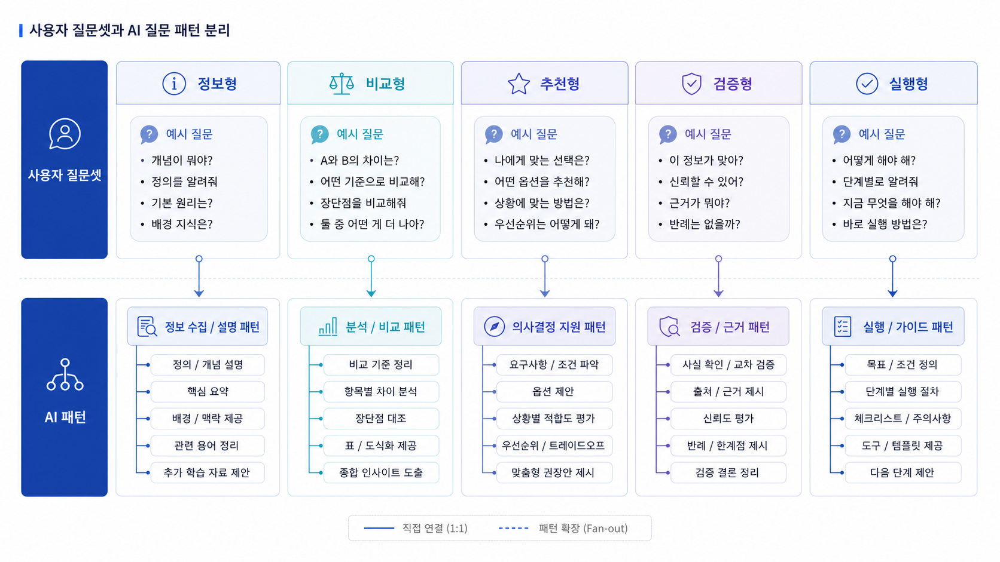

## GEO 질문셋과 AI 내부 질문 패턴 분리


GEO 질문 포트폴리오는 질문 유형을 골고루 섞은 표가 아닙니다. 먼저 `우리가 측정하기 위해 던질 사용자 질문셋`을 만들고, 그 질문에 대해 AI가 답변 중 어떤 하위 질문 패턴으로 fan-out하는지 따로 봐야 합니다.

이 구분이 없으면 사람이 만든 질문 목록과 AI가 실제로 확인하려는 질문 패턴이 섞입니다. 측정 질문은 사용자의 언어에 가깝고, fan-out 패턴은 답변을 만들기 위한 근거 구조에 가깝습니다.

[TOC]

## 두 층의 질문을 나눈다

사용자 질문셋은 우리가 직접 던지는 질문입니다. 예를 들어 “B2B SaaS용 GEO 도구 추천해줘”처럼 고객이 실제로 물을 법한 문장입니다.

AI fan-out 패턴은 그 질문에 답하기 위해 필요한 하위 판단입니다. 같은 예시라면 “B2B SaaS에 필요한 지표는 무엇인가”, “SEO 도구와 GEO 도구는 어떻게 다른가”, “리포트 예시가 있는가”, “가격과 도입 난이도는 어떤가” 같은 질문이 됩니다.

| 층 | 역할 | 산출물 |
|---|---|---|
| 사용자 질문셋 | 무엇을 측정할지 정한다 | 반복 측정 프롬프트 목록 |
| AI fan-out 패턴 | 왜 그런 답이 나왔는지 읽는다 | 콘텐츠/출처/기술 개선 과제 |

## 사용자 질문셋은 어디서 얻나

사용자 질문셋은 키워드 도구 하나에서 나오지 않습니다. SEO 키워드, 검색결과, 고객 상담, 영업 미팅, 커뮤니티 질문, 경쟁사 페이지를 함께 봐야 합니다.

처음에는 다섯 유형만 잡아도 충분합니다.

- 정의형: “GEO란 무엇인가”
- 비교형: “GEO와 SEO는 어디가 달라지는가”
- 추천형: “AI 검색 최적화 도구 추천해줘”
- 검증형: “이 솔루션을 믿어도 되나”
- 실행형: “우리 사이트에서 무엇부터 고칠까”

질문 수보다 중요한 것은 비중입니다. 추천형 질문만 많으면 구매 직전만 보고, 정의형 질문만 많으면 시장 진입부만 보게 됩니다.

## AI fan-out 패턴은 어떻게 관찰하나

AI fan-out 패턴은 답변을 반복해서 보며 추정합니다. 같은 질문에서 반복해서 등장하는 비교 기준, 출처 유형, 빠지는 정보, 경쟁 브랜드를 기록합니다.

예를 들어 추천형 질문에서 AI가 매번 `측정 지표`, `리포트 예시`, `경쟁 도구 비교`, `도입 난이도`를 언급한다면 이 네 가지가 fan-out 노드가 됩니다. 우리 콘텐츠가 이 노드 중 두 개만 답하고 있다면 나머지가 콘텐츠 갭입니다.



*사용자 질문셋은 측정의 언어이고, fan-out 패턴은 개선의 언어다.*

## 질문 포트폴리오 비중 잡기

처음에는 20개 질문으로 시작해도 됩니다. 브랜드 상황에 따라 비중을 바꿉니다.

| 유형 | 기본 비중 | 이런 때 늘린다 |
|---|---:|---|
| 정의형 | 20% | 카테고리 인지가 낮을 때 |
| 비교형 | 20% | 대체재/경쟁군이 헷갈릴 때 |
| 추천형 | 25% | 도입 검토 리드가 중요할 때 |
| 검증형 | 20% | 신뢰/리스크가 구매 장벽일 때 |
| 실행형 | 15% | 컨설팅/운영 상품으로 이어질 때 |

브랜드형 질문과 비브랜드형 질문도 나눕니다. 브랜드명을 넣은 질문은 정확성 점검에 가깝고, 브랜드명을 넣지 않은 질문은 시장 안에서의 발견 가능성 점검에 가깝습니다.

## 적용 예시

AcmeGEO가 첫 질문 포트폴리오를 만든다면 이렇게 시작할 수 있습니다.

```text
정의형: GEO 도구란 무엇인가
비교형: GEO 도구와 SEO 도구 차이
추천형: B2B SaaS용 AI 검색 최적화 도구 추천
검증형: AI 검색 브랜드 가시성 분석 도구를 고를 때 봐야 할 지표
실행형: 우리 회사 GEO 리포트를 만들려면 무엇부터 측정할까
```

이 다섯 질문을 반복 측정한 뒤, 답변에서 반복되는 하위 기준을 fan-out 노드로 정리합니다. 그다음 콘텐츠 갭은 03-03에서 찾습니다.

## 참고 링크

사용자 질문셋을 만들 때는 HaloX의 [SEO/GEO 키워드 전략 프레임워크](https://haloxlabs.ai/ko/blog/seo-geo-keyword-strategy-framework)를 참고합니다. PAA 개념은 [HaloX PAA glossary](https://haloxlabs.ai/ko/glossary/paa)에서 확인하고, fan-out 개념은 [쿼리 팬아웃](https://haloxlabs.ai/ko/glossary/query-fan-out)으로 분리해 봅니다.

## 흔한 질문

**질문은 몇 개부터 시작하면 되나요?**

처음에는 20개 안팎이면 충분합니다. 중요한 것은 질문 수가 아니라 같은 질문을 반복 측정할 수 있는 구조입니다.

**브랜드명을 넣은 질문도 필요한가요?**

필요합니다. 다만 브랜드 질문은 정확성 점검, 비브랜드 질문은 발견 가능성 점검으로 역할을 나눠야 합니다.

## 다음 흐름

이전: [03-01. Query Fan-out: AI 질문 확장의 구조](https://wikidocs.net/346344) / 다음: [03-03. GEO 콘텐츠 갭 분석: AI 질문 패턴 활용](https://wikidocs.net/346346)
