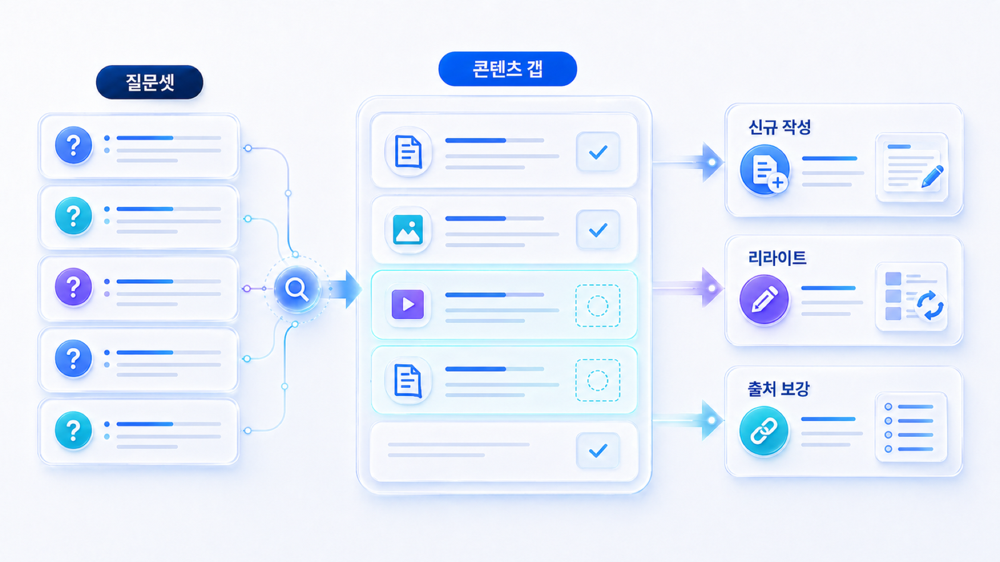
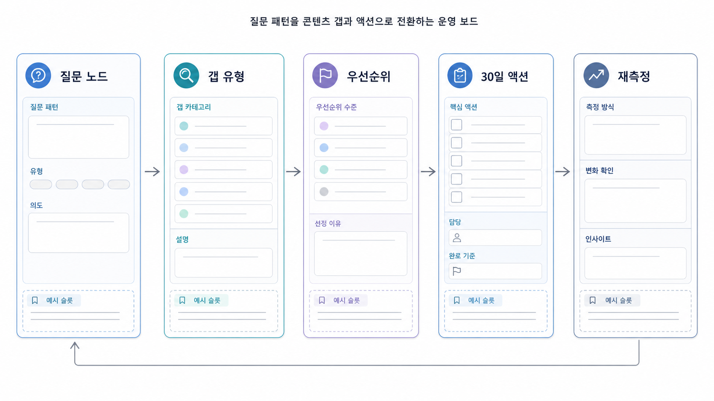

## AI 질문 패턴에서 콘텐츠 갭을 찾는 법

콘텐츠 갭은 `아직 안 쓴 글`이 아닙니다. AI가 한 질문에 답하기 위해 fan-out한 하위 판단 중에서 우리 콘텐츠, 공식 URL, 외부 출처, 기술 구조가 충분히 받쳐주지 못하는 빈칸입니다.

따라서 03-03의 출발점은 사람이 만든 질문 목록이 아니라 AI가 답변 중 수행한 질문 패턴입니다. `GEO 도구 추천` 답변에서 AI가 citation 추적을 비교 기준으로 보는데 우리 페이지에 그 설명이 없다면 콘텐츠 갭입니다. AI가 고객사 URL이나 공식 제품 페이지를 확인하려는데 해당 URL의 설명이 얕거나 오래됐다면 source/URL 갭입니다.

[TOC]

## 콘텐츠 갭을 fan-out 노드 기준으로 봐야 하는 이유

| 기존 방식 | 문제 | fan-out 기준 방식 |
|---|---|---|
| 키워드별 글이 있는지 확인 | 글은 있어도 AI가 필요한 판단 기준이 없을 수 있음 | AI가 확인한 하위 질문별 답변 재료를 확인 |
| 질문 목록을 많이 만든다 | 실행 우선순위가 흐려짐 | 하위 노드별 커버 상태와 영향도를 표시 |
| 블로그 글 추가로 끝낸다 | source/URL/기술 문제가 남음 | 콘텐츠/source/기술/메시지 갭으로 분리 |
| 발행 후 종료 | 실제 AI 답변 변화가 불명확 | 같은 질문으로 재측정 |

## 갭의 6가지 유형

| 갭 유형 | 판단 기준 | 예시 | 다음 액션 | 연결 장 |
|---|---|---|---|---|
| 콘텐츠 갭 | 하위 질문에 답할 본문이 없음 | `citation 추적이 왜 필요한가` 설명 없음 | 신규 작성 | 04장 |
| 구조 갭 | 답은 있지만 첫 답변/표/FAQ가 약함 | 비교 기준이 문단에 흩어짐 | Answer-first 리라이트 | 04장 |
| source 갭 | 설명은 있지만 근거가 약함 | 공식 문서/뉴스룸/외부 리뷰 부족 | source map 보강 | 05장 |
| URL 검증 갭 | 공식/고객사/사례 URL이 검증 후보로 약함 | URL은 있으나 제목/본문/날짜/설명이 불일치 | 대표 URL 정리, canonical/뉴스룸 보강 | 05장/06장 |
| 기술 갭 | 콘텐츠가 있어도 AI와 검색엔진이 읽기 어려움 | 렌더링, robots, sitemap, schema, 내부 링크 문제 | 기술 점검 | 06장 |
| 메시지 갭 | 기능은 있으나 선택 이유가 설명되지 않음 | 추천 목록에는 있으나 왜 맞는지 약함 | 대상 고객/제외 기준/비교 기준 정리 | 07장/09장 |

## 질문에서 갭을 찾는 순서

1. 02장 기준선에서 약한 사용자 질문 3~5개를 고릅니다.
2. 각 질문의 AI 답변을 저장하고 답변 구조를 읽습니다.
3. AI가 어떤 하위 판단으로 fan-out했는지 표시합니다.
4. 각 fan-out 노드에 필요한 답변 재료를 적습니다.
5. 현재 URL, 블로그, 제품 페이지, 뉴스룸, 외부 출처가 그 재료를 제공하는지 확인합니다.
6. 빈칸을 콘텐츠/구조/source/URL 검증/기술/메시지 갭으로 나눕니다.
7. 04장, 05장, 06장, 07장, 09장 중 어디로 넘길지 정합니다.
8. 수정 후 같은 질문셋으로 재측정합니다.

## 실행 과제로 이어지는 샘플

| 사용자 질문 | AI fan-out 노드 | 필요한 정보 | 현재 자산 | 갭 유형 | 액션 |
|---|---|---|---|---|---|
| GEO 도구를 고를 때 무엇을 봐야 하나? | 비교/추천/source | 질문셋 관리, mention/source/citation 분리, 리포트 신뢰도 | 일부 블로그 있음 | 구조 갭 + 메시지 갭 | 비교 기준표와 추천 조건 보강 |
| AI 검색에서 우리 브랜드가 왜 안 보이나? | 기준선/source/기술 | 질문셋, 경쟁사 언급, 답변 근거 후보, 크롤링 가능성 | 일부 있음 | 콘텐츠 갭 + 기술 갭 | 기준선 진단 가이드와 06장 점검 연결 |
| 이 고객사 사례 URL을 근거로 볼 수 있나? | URL 검증/source | 공식 사례 페이지, 날짜, 설명, canonical, 외부 언급 | URL은 있으나 설명 약함 | URL 검증 갭 | 사례 페이지 첫 문단/source 구조 보강 |
| Perplexity에는 인용되는데 ChatGPT 추천에는 약한 이유는? | citation/추천/경쟁 | 플랫폼별 source 차이, 추천 이유, 경쟁 문맥 | 일부 있음 | source 갭 + 메시지 갭 | 05장 source 전략과 09장 도구 비교 연결 |
| 병원 GEO에서 후기 표현은 어디까지 안전한가? | 리스크/검증/로컬 | 광고/후기 리스크, 안전한 문장, 리뷰 대응 기준 | 없음 | 콘텐츠 갭 + 리스크 갭 | 업종별 리스크 체크리스트 작성 |

## 현재 자산을 평가하는 기준

| 평가 항목 | 확인 질문 | 충분한 상태 |
|---|---|---|
| 첫 답변 | 페이지 첫 부분이 하위 질문에 바로 답하는가? | 2~4문단 안에 결론이 보임 |
| 비교 기준 | AI가 후보를 비교할 기준이 있는가? | 표/조건/장단점이 있음 |
| source | 주장 뒤에 근거가 붙어 있는가? | 공식 문서/사례/외부 출처가 연결됨 |
| URL 검증 | 대표 URL이 실제 검증 후보로 쓸 만한가? | 제목/본문/날짜/canonical/schema가 일관됨 |
| 구조 | AI가 문단/표/FAQ를 읽기 쉬운가? | H2, 표, FAQ, 내부 링크가 정리됨 |
| 최신성 | 오래된 정보가 답변에 남지 않는가? | 날짜/정책/가격/기능 변화가 관리됨 |
| 전환 행동 | 독자가 다음 행동을 알 수 있는가? | 체크리스트/문의/다운로드/실행 단계가 있음 |

Google의 [AI features and your website](https://developers.google.com/search/docs/appearance/ai-features)는 AI 기능과 사이트 콘텐츠의 관계를 볼 때 참고할 수 있습니다. [SEO Starter Guide](https://developers.google.com/search/docs/fundamentals/seo-starter-guide)는 검색엔진이 콘텐츠를 발견하고 이해하는 기본이고, [유용한 콘텐츠 만들기](https://developers.google.com/search/docs/fundamentals/creating-helpful-content)는 fan-out 노드에 답하는 내용이 실제 독자 문제를 해결하는지 점검하는 기준입니다.

## 좋은 갭 진단 문장과 나쁜 갭 진단 문장

| 구분 | 문장 | 문제/장점 |
|---|---|---|
| 나쁨 | GEO 글이 부족하다 | 어떤 fan-out 노드가 비었는지 알 수 없음 |
| 나쁨 | 블로그를 5개 더 쓴다 | 질문/지표/목표가 없음 |
| 좋음 | `GEO 도구 추천` 답변에서 AI가 citation 추적을 비교 기준으로 쓰지만 우리 페이지에는 source/citation 차이와 리포트 예시가 약하다 | 보강 위치와 이유가 보임 |
| 좋음 | `이 고객사 URL을 근거로 볼 수 있나` 질문에서 공식 사례 페이지의 첫 문단과 날짜 정보가 부족하다 | URL 검증 갭이 분명함 |
| 좋음 | `병원 GEO 추천` 질문에서 후기/효과 표현 리스크를 다루는 페이지가 없다 | 신규 작성과 리스크 보강 필요성이 분명함 |

## 실습 워크시트

| 입력 항목 | 작성 기준 |
|---|---|
| 사용자 질문 | 실제 측정한 프롬프트 |
| AI 답변 요약 | 답변이 어떤 구조로 나왔는지 |
| fan-out 노드 | 정의/비교/추천/검증/source/URL/실행/리스크 |
| 필요한 답변 재료 | 표/FAQ/공식 URL/사례/리뷰/source/기술 구조 |
| 현재 자산 | 충분/부분/없음 |
| 갭 유형 | 콘텐츠/구조/source/URL 검증/기술/메시지 |
| 보강 위치 | 기존 URL 또는 새 페이지 후보 |
| 담당 | 콘텐츠/PR/SEO/개발/제품 |
| 재측정 기준 | 같은 질문으로 다시 볼 지표 |

## 우선순위 점수로 갭을 정렬하는 법

fan-out 갭을 모두 고치려고 하면 실행이 느려집니다. 30일 안에 처리할 과제를 고르려면 영향도와 실행 가능성을 함께 봐야 합니다.

| 평가 기준 | 질문 | 점수 예시 |
|---|---|---|
| 검색/AI 수요 | 해당 query나 질문군의 노출/질문 빈도가 큰가? | 1~5 |
| 사업 영향 | 추천형/비교형/검증형처럼 전환에 가까운가? | 1~5 |
| 경쟁 격차 | 경쟁사는 답변/source/citation을 확보했는가? | 1~5 |
| 자산 준비도 | 기존 콘텐츠나 URL을 리라이트하면 해결되는가? | 1~5 |
| 기술 난이도 | 개발/스키마/canonical/렌더링 작업이 필요한가? | 1~5 |
| 재측정 가능성 | 같은 질문으로 다음 달 변화를 확인할 수 있는가? | 1~5 |

우선순위는 단순 합산보다 해석을 봐야 합니다. 검색 수요와 사업 영향이 높고 기존 자산을 조금 고치면 되는 과제는 먼저 처리합니다. 반대로 기술 난이도가 높고 재측정 조건이 불안정한 과제는 별도 티켓으로 분리합니다.

## AcmeGEO 예시: fan-out 갭을 30일 액션으로 바꾸기

AcmeGEO는 `B2B SaaS 팀이 쓸 GEO 도구를 추천해줘`라는 seed question에서 반복적으로 빠졌습니다. 답변을 분해해 보니 AI는 도구 정의, SEO 도구와의 차이, mention/source/citation 측정 방식, 리포트 예시, 가격/보안, 고객 사례를 함께 확인하고 있었습니다.

현재 사이트에는 개념 글은 있었지만 `GEO 도구 비교 기준`과 `리포트 샘플`, `보안/데이터 처리 FAQ`, `고객 사례 URL`이 약했습니다. 팀은 30일 액션을 네 가지로 정했습니다.

| fan-out 갭 | 30일 액션 | 연결 장 |
|---|---|---|
| 비교 기준 부족 | GEO 도구 비교표와 제외 기준 작성 | 04장 콘텐츠 구조 |
| source 부족 | 리포트 샘플과 고객 사례 공개 | 05장 출처 전략 |
| citation 후보 URL 약함 | 대표 URL canonical, title, 첫 문단 정리 | 06장 기술 점검 |
| 메시지 오류 | About/제품 설명의 카테고리 문장 통일 | 05장 엔티티/09장 리포트 |

이렇게 정리하면 “글을 더 쓰자”가 아니라 “AI가 추천을 만들 때 확인한 하위 판단 중 어떤 빈칸을 닫을 것인가”로 실행이 바뀝니다.

## 30일 실행으로 바꾸는 법

| 기간 | 할 일 | 산출물 |
|---|---|---|
| D+1~D+3 | 약한 사용자 질문 3~5개 선택 | 우선 질문 목록 |
| D+4~D+7 | AI 답변을 저장하고 fan-out 노드 추정 | 검색 패턴 표 |
| D+8~D+14 | 노드별 현재 자산/URL/source 확인 | 콘텐츠 갭 표 |
| D+15~D+21 | 상위 3개 갭 처리 | 수정된 페이지/새 페이지/source 후보 |
| D+22~D+30 | 같은 질문셋으로 재측정 | mention/source/citation/answer quality 변화 기록 |

## HaloX로 이어지는 지점

질문에서 발견한 빈칸을 실제 콘텐츠 구조로 바꿀 때는 HaloX의 [GEO 콘텐츠 구조화 가이드](https://haloxlabs.ai/ko/blog/geo-content-structure)를 함께 봅니다. Seed 질문을 더 잘 고르고 싶다면 [SEO/GEO 키워드 전략 프레임워크](https://haloxlabs.ai/ko/blog/seo-geo-keyword-strategy-framework)를 확인합니다. fan-out 개념 자체는 [쿼리 팬아웃](https://haloxlabs.ai/ko/glossary/query-fan-out)으로 따로 정리해 둡니다.

## 흔한 질문

**Q. 콘텐츠 갭과 source 갭은 어떻게 구분하나요?**

우리 페이지 안에 설명 자체가 없으면 콘텐츠 갭입니다. 설명은 있지만 믿을 근거나 외부 합의 신호가 부족하면 source 갭입니다. 공식 URL이나 고객사 사례 URL이 검증 후보로 약하면 URL 검증 갭으로 따로 봅니다.

**Q. 기술 점검은 왜 콘텐츠 갭에 포함하나요?**

내용이 있어도 렌더링, canonical, 내부 링크, schema, sitemap 문제로 AI와 검색엔진이 제대로 읽지 못하면 답변 재료가 되기 어렵습니다. 이 경우는 06장으로 넘깁니다.

**Q. AI의 내부 fan-out을 정확히 알 수 있나요?**

완전히 들여다볼 수는 없습니다. 그래서 답변 구조, 인용 URL, 검색 결과, PAA/연관 검색, 고객사 URL 검증 필요성을 함께 놓고 추정합니다. 중요한 것은 추정 자체보다 그 추정이 콘텐츠/source/기술 액션으로 이어지는지입니다.

## 다음 흐름

이전: [03-02. 사용자 질문셋과 AI 질문 패턴을 어떻게 분리할까](https://wikidocs.net/346345) / 다음: [04. AI가 읽기 좋은 콘텐츠 구조](https://wikidocs.net/346332)
