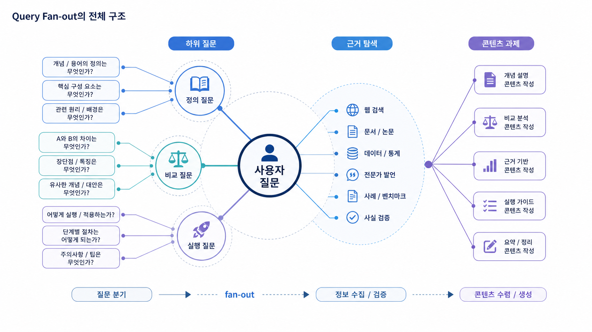

## Query Fan-out: AI가 내부에서 확장하는 질문 패턴


Query Fan-out은 사용자가 한 가지 질문을 던졌을 때 AI가 답변을 만들기 위해 그 질문을 여러 하위 질문, 검색 쿼리, 비교 기준, 검증 작업으로 나누는 과정입니다. 사용자가 `GEO 도구 추천해줘`라고 물어도 AI는 도구 이름만 나열하지 않습니다. GEO 도구의 정의, SEO 도구와의 차이, 측정 지표, 공식 URL, 실제 기능, 경쟁 제품과의 비교 근거를 함께 확인하려고 합니다.

그래서 03장은 “질문을 많이 만드는 법”만 다루지 않습니다. 01장에서 만든 사용자 질문셋과 02장에서 측정한 기준선을 바탕으로, AI가 실제 답변 중에 어떤 하위 질문 패턴으로 확장하는지 이해하고 그 패턴에 맞춰 콘텐츠와 출처를 준비하는 장입니다.

[TOC]

## 먼저 두 가지 질문을 분리한다

3장에서 가장 먼저 구분해야 할 것은 **사용자 질문 확장**과 **AI Query Fan-out**입니다. 둘은 연결되지만 같은 개념은 아닙니다.

사용자 질문 확장은 마케터와 콘텐츠팀이 고객 언어를 모아 측정용 질문셋을 만드는 작업입니다. Google PAA, 연관 검색, 자동완성, 고객 상담 질문, 세일즈 FAQ가 좋은 단서가 됩니다.

AI Query Fan-out은 AI가 답변을 만들면서 내부적으로 수행하는 하위 판단을 추정하는 작업입니다. AI 답변의 비교 기준, 인용 출처, 빠진 검증 항목, 경쟁사와 함께 묶이는 문맥을 보고 “AI가 이 질문을 어떤 조각으로 나눴는가”를 읽습니다.



PAA와 연관 검색은 사람들이 실제로 많이 묻는 질문의 단서입니다. 하지만 그것이 곧 GPT가 내부에서 확장하는 질문 전체는 아닙니다. AI fan-out은 공개된 검색 단서와 실제 AI 답변 관찰을 함께 놓고 추정해야 합니다.

## 왜 fan-out이 중요한가

기존 SEO에서는 사람이 검색창에 입력한 키워드와 SERP 상위 문서가 중요했습니다. GEO에서는 사용자가 입력한 문장 하나보다, AI가 답을 만들면서 내부적으로 수행하는 하위 질문 패턴이 더 중요해집니다.

예를 들어 `우리 브랜드가 추천형 질문에서 빠진다`는 문제는 단순히 글이 부족해서 생기지 않을 수 있습니다. AI가 비교 기준을 찾지 못했을 수도 있고, 공식 페이지와 외부 출처가 서로 다른 설명을 하고 있을 수도 있습니다. 또는 citation 후보 URL은 있지만 title과 첫 문단이 질문에 바로 답하지 못할 수도 있습니다.

이 장의 목적은 그 빈칸을 찾는 것입니다. AI가 확인하려는 질문 패턴을 알면, 새 글을 무작정 늘리지 않고 콘텐츠 갭, 답변 근거 갭, 기술 갭, 메시지 갭을 나눠 볼 수 있습니다.

## 03장이 맡는 역할

03장은 01장의 질문셋과 02장의 기준선을 04장 이후의 실행으로 바꾸는 번역 단계입니다.

```text
SEO 키워드/PAA/연관 검색/고객 질문
→ 측정용 사용자 질문셋 구성
→ AI 답변을 관찰하며 Query Fan-out 추정
→ fan-out 노드별 필요한 답변 재료 정리
→ 현재 URL/블로그/뉴스룸/외부 출처 커버리지 확인
→ 콘텐츠 갭/답변 근거 갭/기술 갭/메시지 갭 분리
→ 04장 리라이트/05장 출처 전략/06장 기술 점검으로 넘김
```

이 흐름이 없으면 GEO 실행은 “블로그 글을 더 쓰자”로 흐릅니다. 하지만 AI 검색 최적화에서 필요한 것은 글 수가 아니라 AI가 실제로 확인하려는 질문 패턴의 빈칸을 닫는 일입니다.

## fan-out을 관찰하는 네 가지 단서

| 단서 | 보여주는 것 | 실무 사용법 |
|---|---|---|
| PAA/연관 검색/자동완성 | 사람들이 자주 묻는 주변 질문 | 사용자 질문셋 초안 만들기 |
| AI 답변의 문장 구조 | AI가 어떤 기준으로 답을 합성했는지 | 하위 판단 기준 추정 |
| 답변 근거/화면 인용 URL | AI가 어떤 근거를 봤는지 | source/citation 갭 찾기 |
| 공식 URL과 브랜드 설명 | 검증 후보가 충분한지 | 제품 페이지/뉴스룸/팩트시트 점검 |

HaloX의 검색 패턴 분석은 이 네 가지를 함께 보는 일입니다. 단순히 프롬프트를 발견하는 것이 아니라, AI가 한 질문을 답하기 위해 어떤 하위 질문과 출처 검증을 거치는지 이해하는 것입니다.

## 앞 장에서 가져올 입력값

3장은 새로 시작하는 장이 아니라 앞 장의 산출물을 재해석하는 장입니다. 1장에서 만든 query와 검색 의도, 2장에서 측정한 브랜드 언급률/답변 근거/화면 인용 결과가 fan-out 분석의 입력값이 됩니다.

이 입력값을 함께 봐야 fan-out 분석이 추상적인 프롬프트 놀이로 흐르지 않습니다. 3장의 목적은 AI가 질문을 어떻게 쪼갤지 상상하는 것이 아니라, 실제 측정에서 약하게 나온 질문군을 어떤 하위 판단과 자산 부족으로 설명할 수 있는지 찾는 것입니다.

## 이 장을 읽는 순서

먼저 [03-01. Fan-out은 AI가 질문을 어떻게 쪼개는가](https://wikidocs.net/346344)에서 개념을 분리합니다. 그다음 [03-02. 사용자 질문셋과 AI 질문 패턴을 어떻게 분리할까](https://wikidocs.net/346345)에서 측정 질문셋과 AI 내부 질문 패턴을 따로 설계합니다.

마지막으로 [03-03. AI 질문 패턴에서 콘텐츠 갭을 찾는 법](https://wikidocs.net/346346)에서 fan-out 노드별 빈칸을 실행 과제로 바꿉니다. 이때 결과물은 콘텐츠 갭 목록에서 끝나지 않고, 04장 콘텐츠 리라이트, 05장 출처 전략, 06장 기술 점검으로 이어져야 합니다.

## 공식 기준과 HaloX 자료로 이어지는 지점

Google의 [AI features and your website](https://developers.google.com/search/docs/appearance/ai-features)는 Google AI 기능이 웹 콘텐츠를 어떻게 다룰 수 있는지 확인할 때 참고할 수 있습니다. [SEO Starter Guide](https://developers.google.com/search/docs/fundamentals/seo-starter-guide)는 여전히 콘텐츠 발견과 이해의 기본이고, [유용한 콘텐츠 만들기](https://developers.google.com/search/docs/fundamentals/creating-helpful-content)는 fan-out 질문에 답하는 콘텐츠가 실제 독자에게 도움이 되는지 점검하는 기준입니다.

HaloX 자료로는 [쿼리 팬아웃](https://haloxlabs.ai/ko/glossary/query-fan-out), [PAA](https://haloxlabs.ai/ko/glossary/paa), [SEO/GEO 키워드 전략 프레임워크](https://haloxlabs.ai/ko/blog/seo-geo-keyword-strategy-framework), [GEO 콘텐츠 구조화 가이드](https://haloxlabs.ai/ko/blog/geo-content-structure)를 함께 봅니다.

## 다음 흐름

03장에서 약한 질문군을 하위 판단으로 펼쳤다면, 다음은 그 빈칸을 실제 페이지와 출처로 채우는 일입니다. [04장 AI가 읽기 좋은 콘텐츠 구조](https://wikidocs.net/346332)에서는 답변형 콘텐츠로 바꾸고, [05장 답변 근거/화면 인용/엔티티 전략](https://wikidocs.net/346333)에서는 내부 콘텐츠 밖의 신뢰 신호를 설계합니다.
