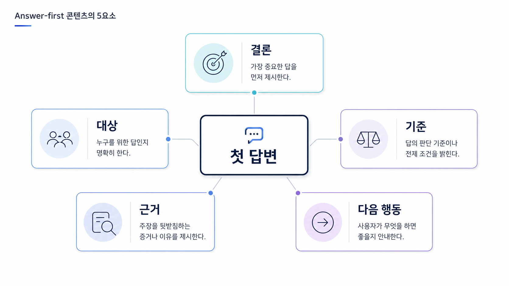

## AI가 인용하는 Answer-first 콘텐츠 작성 전략


Answer-first 콘텐츠는 첫 문단에서 질문의 답을 먼저 주고, 뒤에서 근거와 예외 조건을 보강하는 구조입니다. AI 검색에서는 긴 배경 설명보다 “이 페이지가 어떤 질문에 답하는지”가 먼저 보여야 합니다.

03장에서 만든 fan-out 노드는 여기서 문단 구조로 바뀝니다. AI가 답변을 만들 때 확인할 하위 질문을 첫 답변, 비교 기준, 근거, 예시, 다음 행동으로 옮기는 방식입니다.

[TOC]

## fan-out 노드를 첫 답변으로 바꾼다

`GEO 도구 추천`이라는 질문을 예로 들면 AI는 도구 정의, 측정 지표, 경쟁 도구와의 차이, 실제 리포트, 도입 후 행동을 함께 확인하려 합니다. Answer-first 페이지는 이 질문들을 본문 곳곳에 흩뿌리지 않고 첫 화면에서 방향을 잡아 줍니다.

첫 답변은 보통 네 문장 안에 끝납니다.

1. 질문에 대한 직접 답을 말한다.
2. 판단 기준을 2~3개 제시한다.
3. 오해하기 쉬운 지점을 바로잡는다.
4. 뒤에서 무엇을 확인할지 안내한다.

## 첫 답변에 들어갈 요소

| 요소 | 역할 |
|---|---|
| 결론 | 독자가 바로 가져갈 답 |
| 기준 | 어떤 조건에서 맞는 답인지 |
| 근거 | 왜 그렇게 판단하는지 |
| 예외 | 모든 상황에 적용되지 않는 부분 |
| 다음 행동 | 무엇을 고치거나 확인할지 |

이 다섯 요소를 모두 길게 쓸 필요는 없습니다. 첫 문단에서는 방향을 잡고, 뒤 섹션에서 근거를 펼칩니다.

## 나쁜 첫 문단과 좋은 첫 문단

나쁜 첫 문단은 주제를 소개만 하고 답을 미룹니다.

```text
최근 AI 검색이 확산되면서 GEO 콘텐츠 구조에 대한 관심이 커지고 있습니다.
이번 글에서는 Answer-first 콘텐츠가 무엇인지 살펴봅니다.
```

좋은 첫 문단은 질문에 답합니다.

```text
Answer-first 콘텐츠는 AI와 독자가 첫 화면에서 답을 확인할 수 있도록 결론, 판단 기준, 근거를 먼저 배치하는 구조입니다. GEO에서는 이 구조가 source/citation 후보 URL의 품질을 높입니다.
```

차이는 분명합니다. 앞 문장은 글의 주제를 말하고, 뒤 문장은 독자의 질문에 답합니다.



*첫 답변은 결론, 기준, 근거, 예외, 다음 행동을 짧게 묶는 구간이다.*

## 페이지 유형별로 다르게 쓴다

정의형 페이지는 뜻과 구분을 먼저 둡니다. 비교형 페이지는 기준표보다 “언제 무엇을 선택해야 하는지”를 먼저 말합니다. 리포트형 페이지는 지표보다 판단 문장을 앞에 둡니다. 제품 페이지는 기능 목록보다 사용자가 얻는 결과를 먼저 설명합니다.

형식은 달라도 원칙은 같습니다. 첫 화면에서 독자가 “내 질문의 답이 여기 있다”고 느껴야 합니다.

## 리라이트 순서

1. 페이지가 답해야 할 대표 질문을 하나 고른다.
2. 기존 첫 문단에서 답이 바로 보이는지 확인한다.
3. 결론/기준/근거/예외/다음 행동을 짧게 재배치한다.
4. 표는 첫 답변 뒤에서 보조 자료로 둔다.
5. source/citation 후보가 될 URL과 내부 링크를 연결한다.

## 정리 양식

```text
대표 질문:
첫 답변 결론:
판단 기준:
보강 근거:
예외 조건:
다음 행동:
연결할 source/citation 후보 URL:
```

## 다음 흐름

Answer-first 구조를 잡았다면 [FAQ/표/schema는 언제 쓰는가](https://wikidocs.net/346348)에서 보조 구조를 정합니다. 실제 글 전체를 고쳐야 한다면 [기존 글을 GEO 콘텐츠로 리라이트하는 체크리스트](https://wikidocs.net/346349)로 이어갑니다.
