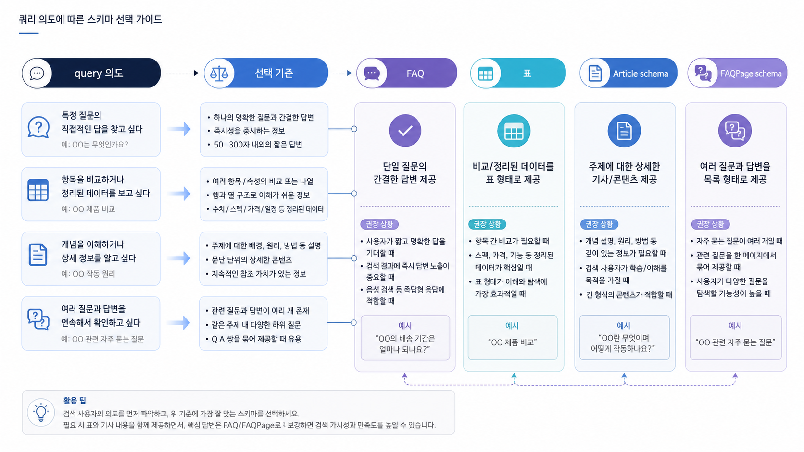

## FAQ/표/schema 활용 기준


FAQ, 표, schema는 콘텐츠를 있어 보이게 만드는 장식이 아닙니다. 독자와 AI가 페이지의 답변 단위를 더 쉽게 읽도록 돕는 구조화 도구입니다.

먼저 본문이 질문에 답해야 합니다. 그다음 FAQ는 남은 의문을 정리하고, 표는 비교를 빠르게 보여주고, schema는 검색엔진이 페이지의 구조를 이해하도록 돕습니다.

[TOC]

## 역할을 나눠서 쓴다

FAQ는 짧은 질문과 답에 적합합니다. 표는 조건, 비교, 우선순위처럼 여러 항목을 한눈에 봐야 할 때 적합합니다. schema는 본문에 이미 있는 정보를 기계가 읽을 수 있는 형식으로 보강할 때 씁니다.

| 도구 | 잘 맞는 상황 | 피할 상황 |
|---|---|---|
| FAQ | 반복 질문, 오해 정리 | 본문에 없는 내용을 FAQ에만 넣기 |
| 표 | 비교, 기준, 체크 항목 | 긴 설명을 억지로 칸에 넣기 |
| schema | 조직/상품/FAQ/글 구조 표시 | 화면에 없는 내용을 마크업으로만 넣기 |

표가 많다고 GEO가 좋아지는 것은 아닙니다. 표는 판단을 빠르게 돕는 도구이고, 설명은 여전히 문장으로 해야 합니다.

## FAQ는 마지막 의문을 닫는다

FAQ는 본문을 대신하지 않습니다. 본문에서 핵심 답을 준 뒤, 독자가 마지막으로 헷갈릴 만한 질문을 2~3개만 정리합니다.

좋은 FAQ는 짧고 구체적입니다.

```text
Q. FAQPage schema를 넣으면 바로 AI 답변에 인용되나요?
A. 아닙니다. schema는 구조 이해를 돕는 신호입니다. 본문 답변, 출처, 페이지 신뢰 신호가 함께 있어야 합니다.
```

## 표는 비교와 선택에 쓴다

표는 독자가 선택해야 할 때 강합니다. 예를 들어 FAQ/표/schema 중 무엇을 써야 할지 고르는 장면에서는 표가 좋습니다. 하지만 사례 설명, 판단 이유, 리스크 맥락은 표보다 문장이 낫습니다.

표를 쓸 때는 열을 줄입니다. 세 열 안에서 읽히지 않는 표는 본문 문단으로 푸는 편이 좋습니다.



*구조화 도구는 본문 답변을 대체하지 않고, 답변 단위를 더 잘 읽히게 만든다.*

## schema는 본문과 맞아야 한다

schema는 검색엔진을 속이는 장치가 아닙니다. 페이지에 실제로 보이는 조직 정보, 상품 정보, FAQ, 글 정보를 기계가 이해하기 쉽게 표시하는 방식입니다.

JSON-LD를 넣기 전에 먼저 확인합니다.

- 본문에 같은 정보가 보이는가
- 제목과 첫 문단이 schema의 주제와 맞는가
- FAQ 답변이 과장되거나 숨겨진 광고 문구가 아닌가
- Organization, Product, FAQPage 같은 타입이 페이지 목적과 맞는가

## 구조화 선택 순서

1. 첫 답변이 질문에 답하는지 확인한다.
2. 비교가 필요하면 표를 쓴다.
3. 반복 질문이 남으면 FAQ를 둔다.
4. 본문 정보와 맞는 schema만 적용한다.
5. Google Rich Results Test 같은 공식 도구로 오류를 확인한다.

## FAQ와 schema를 넣기 전에 볼 것

FAQ, 표, schema는 많이 넣을수록 좋은 장식이 아닙니다. 실제 질문을 더 잘 설명하거나, 비교 기준을 명확히 하거나, 검색엔진이 구조를 이해하는 데 도움이 될 때만 넣어야 합니다.

| 요소 | 쓸 때 | 피할 때 |
|---|---|---|
| FAQ | 독자가 실제로 묻는 하위 질문이 있을 때 | 키워드 반복용 질문을 억지로 만들 때 |
| 표 | 비교 기준이 2개 이상일 때 | 문장으로 충분한 내용을 표로 쪼갤 때 |
| schema | 페이지 유형과 정보 구조가 분명할 때 | 보이지 않는 내용을 구조화 데이터에만 넣을 때 |

콘텐츠를 수정한 뒤에는 같은 질문셋으로 source/citation 변화를 다시 봐야 합니다. 구조를 고쳤는데 답변 근거로 쓰이지 않는다면, 외부 source나 기술 조건이 함께 부족할 수 있습니다.

## 정리 양식

```text
대표 질문:
본문에서 먼저 답할 내용:
표가 필요한 비교 기준:
FAQ로 닫을 질문:
schema 후보 타입:
검증할 공식 도구:
```

## 다음 흐름

구조화 도구를 고른 뒤에는 [기존 글을 GEO 콘텐츠로 리라이트하는 체크리스트](https://wikidocs.net/346349)에서 실제 페이지 수정 순서로 옮깁니다. 기술 검증은 [테크니컬 GEO와 사이트 구조](https://wikidocs.net/346334)에서 더 깊게 다룹니다.
