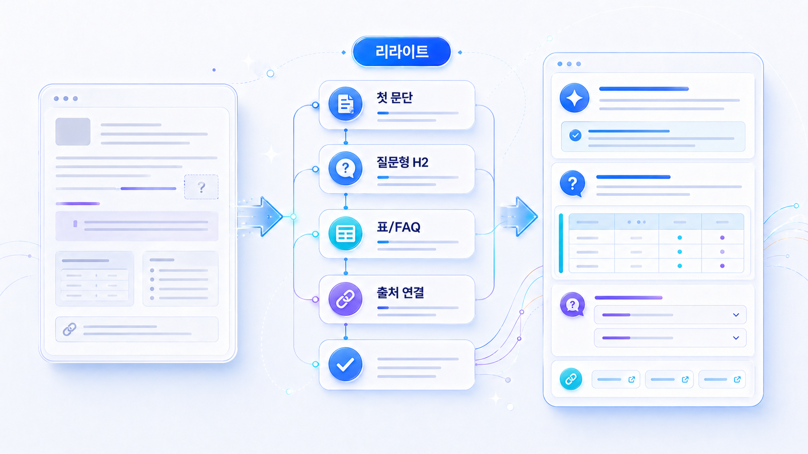
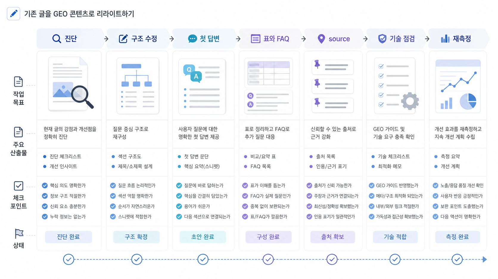

## 기존 글을 GEO 콘텐츠로 리라이트하는 체크리스트

GEO 리라이트는 새 글을 많이 쓰기 전에 기존 자산을 답변형 구조로 바꾸는 작업입니다. 첫 문단, H2, 표, FAQ, source 링크, 내부 링크, schema 후보, 업데이트 맥락을 순서대로 고치고, 수정 후 같은 질문셋으로 다시 측정합니다.

많은 팀이 새 글 발행부터 시작하지만 이미 가진 글의 구조가 약해서 AI 답변에 쓰이지 못하는 경우가 많습니다. 03장에서 찾은 콘텐츠 갭이 `리라이트`로 분류됐다면, 04-03에서는 그 갭을 구체적인 작업표로 바꿉니다.

[TOC]

## 리라이트는 문장 수정이 아니라 구조 수정이다

GEO 리라이트를 문장 다듬기로만 보면 4장의 핵심을 놓칩니다. 실제로는 AI가 페이지를 읽을 때 남는 텍스트 구조를 바꾸는 일입니다. 제목, H2, 첫 문단, 표, FAQ, 내부 링크, source, schema, 이미지 alt, 업데이트 날짜가 서로 같은 주제를 가리키게 만들어야 합니다.

| 리라이트 대상 | 문장 수정만 한 경우 | GEO 리라이트 기준 |
|---|---|---|
| 제목/H2 | 키워드만 추가 | 질문 의도와 답변 범위를 드러냄 |
| 첫 문단 | 자연스럽게 다듬음 | 정의/결론/적용 범위/다음 행동을 먼저 제시 |
| 본문 | 문단을 늘림 | 기준, 예외, 비교, 근거를 분리 |
| 표/FAQ | 보기 좋게 추가 | AI가 재사용할 질문/비교 단위로 정리 |
| source | 관련 링크만 붙임 | 주장마다 필요한 근거를 연결 |
| schema | 플러그인으로 자동 생성 | 본문 내용과 같은 사실만 구조화 |
| 내부 링크 | 관련 글을 하단에 나열 | 문맥 안에서 다음 질문으로 연결 |

## 리라이트 전에 먼저 볼 것

| 점검 항목 | 확인 질문 | 다음 액션 |
|---|---|---|
| 목표 질문 | 이 페이지가 답하는 핵심 질문은 무엇인가? | 질문을 한 문장으로 다시 쓴다 |
| 기준선 | 02장에서 어떤 지표가 약했는가? | mention/source/citation/answer quality 중 핵심 지표 선택 |
| 콘텐츠 갭 | 03장에서 어떤 빈칸으로 분류됐는가? | 신규 작성/리라이트/source 보강/기술 점검 분리 |
| 현재 자산 | 이미 답할 콘텐츠나 페이지가 있는가? | 기존 URL과 관련 페이지 정리 |
| 출처 | AI가 참고할 근거가 충분한가? | 내부 근거와 외부 근거를 분리 |
| 기술 전달 | 개발/SEO 점검이 필요한가? | schema/canonical/렌더링/sitemap 이슈를 06장으로 넘김 |

## 리라이트 우선순위를 정하는 기준

모든 글을 한 번에 고치면 실행이 느려집니다. 2장 측정과 3장 fan-out 갭을 기준으로 먼저 고칠 페이지를 정해야 합니다.

| 우선순위 신호 | 해석 | 먼저 할 작업 |
|---|---|---|
| GSC impressions는 있는데 CTR이 낮음 | 검색 수요는 있으나 검색결과 약속이 약함 | title/meta/첫 문단 재작성 |
| AI 답변에 mention은 있으나 citation 없음 | 브랜드는 알려졌지만 인용 후보 URL이 약함 | 첫 답변, 표, 내부 링크, canonical 점검 |
| 경쟁사 citation 반복 | 경쟁사 자산이 더 citation-ready함 | 비교표/FAQ/source 보강 |
| GA4 engagement가 낮음 | 클릭 이후 답변 만족도가 약함 | 첫 화면 답변, CTA, 내부 링크 개선 |
| answer quality 오류 반복 | 메시지나 최신 정보가 흔들림 | FAQ/About/제품 설명 업데이트 |
| fan-out 노드의 source 갭 | 본문보다 근거 자산이 부족함 | 05장 source/entity 과제로 넘김 |

AcmeGEO라면 `AI 검색 모니터링` 글보다 먼저 `GEO 도구 비교`와 `GEO 리포트 예시`를 고칠 수 있습니다. 추천형/검증형 질문에 더 가깝고, citation 후보 URL로 쓸 수 있으며, 리라이트 후 같은 질문으로 재측정하기 쉽기 때문입니다.

## 7단계 리라이트 프로세스

1. 기존 URL과 목표 질문을 정합니다.
2. 첫 문단이 답을 주는지 확인하고 Answer-first로 다시 씁니다.
3. H2를 질문형/판단형으로 바꿉니다.
4. 비교 기준, 조건, 예외를 표로 분리합니다.
5. 반복 질문 3~5개를 FAQ로 정리합니다.
6. 주장마다 내부 링크, 외부 공식 자료, HaloX 관련 글 등 source 후보를 붙입니다.
7. schema 후보와 기술 점검 항목을 표시하고 같은 질문셋으로 재측정합니다.

_리라이트는 문장 다듬기가 아니라 진단, 구조 수정, 첫 답변, 표와 FAQ, source, 재측정을 하나의 작업 보드로 관리하는 일입니다._

## Before/After 예시

| 항목 | 리라이트 전 | 리라이트 후 |
|---|---|---|
| 첫 문단 | AI 검색 시대에는 GEO가 중요합니다. 콘텐츠 전략이 바뀌고 있습니다. | GEO 리라이트는 기존 글을 AI 답변에 쓰일 수 있는 정보 단위로 바꾸는 작업입니다. 첫 답변, 비교 기준, FAQ, source, schema 후보를 정리하고 같은 질문으로 재측정합니다. |
| H2 | GEO의 중요성 | 기존 글이 어떤 질문에 답하지 못하는가 |
| 비교 정보 | 문단 안에 흩어져 있음 | 표로 기준/값/주의점 분리 |
| FAQ | 없음 또는 형식적 질문 | 실제 후속 질문 3~5개와 짧은 답변 |
| 출처 링크 | 내부 링크만 있음 | Google 공식 문서/HaloX 글/관련 장 링크 분리 |
| 기술 전달 | 개발팀에 요청할 내용 없음 | schema/내부 링크/렌더링 점검 항목을 06장으로 넘김 |
| 완료 기준 | 발행 완료 | 같은 질문셋에서 answer quality/source/citation 개선 확인 |

완료 기준은 `좋아 보이는 글`이 아니라, 02장에서 측정한 질문에 다시 넣었을 때 답변 근거와 화면 인용 후보가 더 분명해지는 것입니다.

## 페이지 유형별 리라이트 액션

| 페이지 유형 | 먼저 고칠 것 | 추가할 구조 | 재측정 질문 |
|---|---|---|---|
| 용어 설명 | 한 줄 정의와 오해 방지 | FAQ, 관련 용어 링크, Article schema 후보 | 이 개념은 무엇인가? |
| 도구/솔루션 비교 | 선택 기준과 제외 기준 | 비교표, 검증 질문, source 링크 | 어떤 도구를 골라야 하나? |
| How-to | 완료 목표와 순서 | 체크리스트, 실패 사례, FAQ | 무엇부터 하면 되나? |
| 뉴스룸/보도자료 | 핵심 팩트와 주체 | 날짜/인용문/관련 자료, Article 후보 | 이 브랜드를 믿을 수 있나? |
| 로컬/전문 서비스 | 지역/전문 분야/전환 행동 | 리뷰/FAQ/예약 링크/주의 문장 | 근처에서 어디를 선택해야 하나? |
| 커머스 | 상품명/가격/재고/정책 | 상품 정보표, FAQ, Product schema 후보 | 어떤 상품을 사야 하나? |

## 04장에서 끝내지 않고 05장으로 넘기는 기준

리라이트 후에도 다음 문제가 남으면 05장 출처/엔터티 작업으로 넘깁니다. 페이지 안의 구조만 고쳐서는 AI가 신뢰할 만한 근거망이 만들어지지 않는 경우입니다.

| 남은 문제 | 05장에서 볼 항목 | 다음 액션 |
|---|---|---|
| 답은 좋아졌지만 화면 인용이 약함 | source/citation 차이 | 답변 근거 후보 URL과 화면 인용 URL을 분리해 기록 |
| 브랜드가 다른 카테고리로 설명됨 | entity 합의 신호 | 공식 한 줄 정의와 외부 프로필 문장 정렬 |
| 외부 기사/리뷰가 오래된 설명을 반복 | 평판 리스크 | 팩트시트, 뉴스룸 FAQ, 수정 요청 후보 작성 |
| 비교 질문에서 경쟁사만 근거로 보임 | 오프사이트 source map | 경쟁사 source와 우리 source 후보 비교 |
| 고객사/파트너 URL 검증이 약함 | URL 검증 갭 | 사례 페이지, 파트너 페이지, canonical, 날짜 정보 점검 |

## 담당자별 작업 분리

| 담당 | 맡을 일 | 완료 기준 |
|---|---|---|
| 콘텐츠 | 첫 답변, H2, 표, FAQ 작성 | 목표 질문에 직접 답함 |
| 브랜드/PR | source 후보, 뉴스룸, 외부 신뢰 자료 정리 | 주장 뒤에 근거가 붙음 |
| SEO/개발 | schema, canonical, 렌더링, sitemap 점검 | 06장 기술 체크리스트로 확인 가능 |
| 제품/세일즈 | 기능 설명, 대상 고객, 제외 기준 정리 | 추천/비교 문맥에서 선택 이유가 보임 |
| 의사결정자 | 우선순위와 완료 기준 승인 | 재측정 날짜와 지표가 정해짐 |

## 실습 워크시트

| 입력 항목 | 작성 기준 |
|---|---|
| 기존 URL | 리라이트할 페이지 |
| 목표 질문 | 이 페이지가 답해야 할 질문 |
| 현재 문제 | 답이 늦음/근거 부족/비교 기준 없음/source 없음/기술 점검 필요 |
| 새 첫 답변 | 2~4문단 Answer-first |
| 추가 구조 | 표/FAQ/source/schema/internal link |
| 담당 | 콘텐츠/PR/SEO/개발/제품 |
| 재측정 질문 | 수정 후 다시 확인할 질문 |
| 완료 기준 | mention/source/citation/answer quality 변화 |

## HaloX로 이어지는 지점

리라이트의 목표가 단순한 문장 개선이 아니라 AI 답변의 근거가 되는 것이라면 HaloX의 [AI에게 인용되는 콘텐츠 가이드](https://haloxlabs.ai/ko/blog/how-to-get-cited-by-ai)를 함께 봅니다. 구조를 바꾸는 기준은 [GEO 콘텐츠 구조화 가이드](https://haloxlabs.ai/ko/blog/geo-content-structure)와도 연결됩니다.

리라이트 후 구조화 데이터까지 손볼 때는 Google의 [Article structured data](https://developers.google.com/search/docs/appearance/structured-data/article)와 [구조화 데이터 소개](https://developers.google.com/search/docs/appearance/structured-data/intro-structured-data)를 참고합니다. 단, schema는 본문에 실제로 있는 정보를 명확히 표현하는 보조 장치로만 써야 합니다.

## 흔한 질문

**Q. 새 글을 쓰는 것보다 기존 글 리라이트가 먼저인가요?**

기준선에서 이미 노출 후보가 있거나 기존 글이 부분적으로 답하고 있다면 리라이트가 먼저입니다. 답할 자산이 전혀 없다면 신규 작성이 맞습니다.

**Q. 리라이트 후 바로 AI 답변이 바뀌나요?**

보장할 수 없습니다. 다만 같은 질문셋으로 재측정하면 첫 답변, source, citation, 경쟁 문맥, 답변 품질이 어떻게 달라지는지 관찰할 수 있습니다.

**Q. schema까지 콘텐츠팀이 해야 하나요?**

콘텐츠팀은 어떤 정보가 본문에 있고 어떤 schema 후보가 맞는지 표시하면 됩니다. 실제 구현과 검증은 06장 기술 점검으로 넘기는 편이 안전합니다.

## 다음 흐름

이전: [04-02. FAQ/표/schema는 언제 쓰는가](https://wikidocs.net/346348) / 다음: [05. 답변 근거/source, 화면 인용/citation, 엔터티 전략](https://wikidocs.net/346333)
