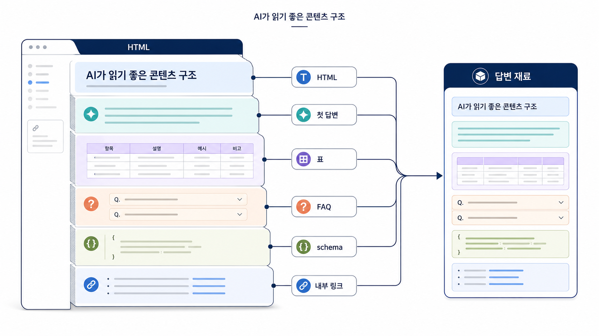

## AI 검색 최적화 콘텐츠 구조: Answer-first와 schema


04장은 03장에서 정리한 AI Query Fan-out 노드를 실제 문서 구조로 바꾸는 장입니다. 03장에서 AI가 정의, 비교, 검증, source, URL 확인, 실행, 리스크 같은 하위 질문으로 쪼갠다는 사실을 봤다면, 04장에서는 각 하위 질문에 답하는 문장, 표, FAQ, 내부 링크, schema 후보를 페이지 안에 배치합니다.

GEO에서 좋은 글은 단순히 문장이 자연스러운 글이 아닙니다. 독자와 AI가 동시에 `이 페이지가 어떤 질문에 답하는지`, `무엇을 근거로 판단해야 하는지`, `다음에 무엇을 해야 하는지`를 빠르게 이해할 수 있어야 합니다.

[TOC]

## 03장에서 04장으로 넘어오는 이유

03장에서 `GEO 도구 추천` 질문에서 비교 기준이 부족하다거나, `AI 검색 리포트` 질문에서 30일 액션이 약하다거나, `병원 GEO` 질문에서 후기/효과 표현 리스크가 비어 있다는 사실을 찾았다면 04장에서는 그 빈칸을 문서 구조로 바꿉니다.

```text
AI fan-out 노드에서 발견한 콘텐츠 갭
→ 목표 질문과 하위 판단 선택
→ 첫 답변 재작성
→ H2를 질문/판단 기준으로 정리
→ 표로 비교 기준 고정
→ FAQ로 후속 질문 보강
→ schema/source/internal link 점검
→ 같은 질문셋으로 재측정
```

이 흐름이 없으면 리라이트는 문장 다듬기에서 끝납니다. GEO 리라이트는 문체 교정이 아니라 **AI 답변에 재사용될 수 있는 정보 단위**를 만드는 일입니다.



_제목, 첫 답변, 표, FAQ, schema, 내부 링크가 같은 질문에 답하도록 정렬되는 흐름입니다._

## AI가 페이지를 읽는 과정을 먼저 이해한다

AI 검색과 검색엔진의 세부 구현은 플랫폼마다 다릅니다. 다만 콘텐츠를 설계할 때는 대략 아래 흐름으로 이해하면 실무 판단이 쉬워집니다.

먼저 URL이 발견되어야 합니다. 그다음 title, meta description, H1/H2, 앵커 텍스트를 통해 어떤 질문에 답하는 페이지인지 판단됩니다. 이후 HTML/DOM과 본문 텍스트가 수집되고, 문단, 표, 리스트, FAQ, 링크, schema 같은 정보 단위가 해석됩니다. 마지막으로 여러 출처의 정의, 비교 기준, 근거, 예외가 합쳐져 답변이 만들어집니다.

그래서 04장은 `무엇을 쓸 것인가`와 `어떤 구조로 남길 것인가`를 다룹니다. 06장은 이 구조가 실제 HTML, 렌더링, schema, canonical, robots, sitemap에서도 읽히는지 확인합니다.

## 04장과 05장의 역할 경계

04장과 05장은 둘 다 AI가 인용할 수 있는 상태를 다루지만 맡는 일이 다릅니다. 04장은 자사 페이지 안에서 답변 재료를 구조화하는 장이고, 05장은 그 페이지가 웹 전체의 source/citation/엔티티 신호와 연결되는지 보는 장입니다.

04장에서 첫 답변, H2, 표, FAQ, 내부 링크, schema 후보를 정리합니다. 05장에서는 이 페이지가 실제 답변 근거가 되는지, 어떤 외부 출처가 같은 설명을 반복하는지, Organization/Article/FAQ 신호가 브랜드 엔티티와 일치하는지 확인합니다.

## 1~3장 산출물을 페이지 구조로 바꾸는 법

4장은 새 글 작성법이 아니라 앞 장의 산출물을 페이지 안의 구조로 배치하는 단계입니다. 1장에서 찾은 query와 검색 의도, 2장에서 확인한 약한 mention/source/citation 지표, 3장에서 분해한 fan-out 노드를 한 페이지의 첫 문단, H2, 표, FAQ, schema 후보로 바꿉니다.

AcmeGEO라면 `GEO 도구 비교` query를 단순 블로그 제목으로 쓰지 않습니다. 첫 문단에서 선택 기준을 답하고, H2를 질문형으로 나누고, mention/source/citation 비교표를 넣고, FAQ에는 구매 전 검증 질문을 배치합니다. 이렇게 해야 4장의 리라이트가 2장의 측정 지표와 다시 연결됩니다.

Google의 [유용한 콘텐츠 만들기](https://developers.google.com/search/docs/fundamentals/creating-helpful-content)는 콘텐츠가 독자에게 실제로 도움이 되는지 묻습니다. 04장의 구조화도 같은 기준에서 봐야 합니다. AI가 읽기 좋은 글은 먼저 사람이 이해하기 좋아야 합니다.

## 이 장을 읽는 순서

먼저 [04-01. AI가 인용하는 Answer-first 콘텐츠 작성 전략](https://wikidocs.net/346347)를 읽고 첫 답변 구조를 고칩니다. FAQ/표/schema 판단이 필요하면 [04-02. FAQ/표/schema 활용 기준](https://wikidocs.net/346348)로 이동합니다. 기존 글을 실제 작업표로 바꾸려면 [04-03. GEO 콘텐츠 리라이트: 기존 글을 AI 답변 재료로 바꾸기](https://wikidocs.net/346349)를 봅니다.

## HaloX로 이어지는 지점

AI가 읽기 좋은 글 구조는 HaloX의 [GEO 콘텐츠 구조화 가이드](https://haloxlabs.ai/ko/blog/geo-content-structure), [AI에게 인용되는 콘텐츠 만드는 법](https://haloxlabs.ai/ko/blog/how-to-get-cited-by-ai), [AI 검색이 선택하는 콘텐츠의 5가지 공통점](https://haloxlabs.ai/ko/blog/ai-preferred-content-structure)과 함께 보면 좋습니다. 이 장은 WikiDocs 안에서 실습 기준을 잡고, HaloX 글은 실제 콘텐츠 운영 맥락을 더 넓게 설명하는 자료로 연결합니다.

## 다음 흐름

04장에서 자사 페이지 안의 답변 재료를 정리했다면 [05. 답변 근거, 화면 인용, 엔티티 전략](https://wikidocs.net/346333)으로 넘어갑니다. 05장에서는 그 답변 재료가 웹 전체의 신뢰 신호와 연결되는지 확인합니다.
