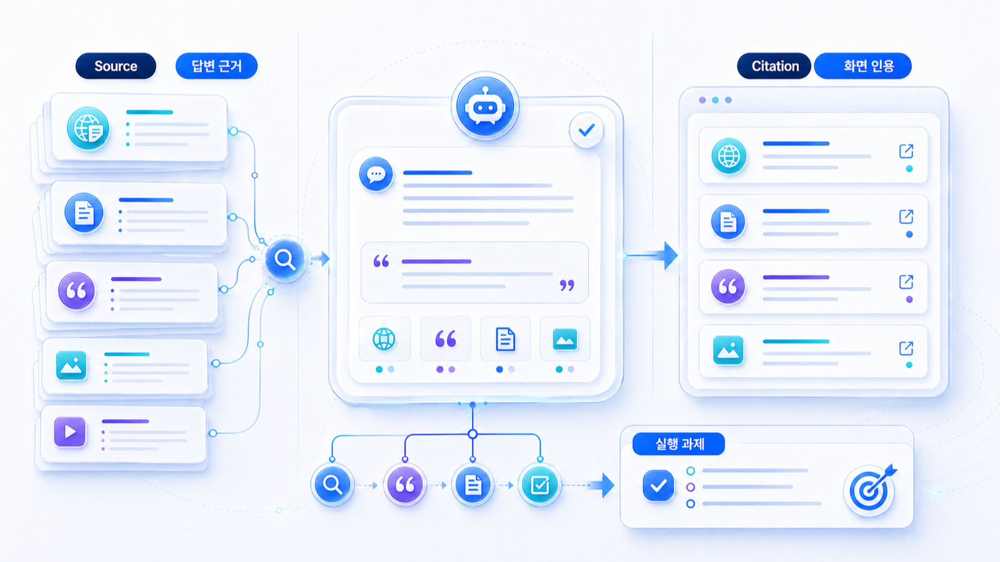
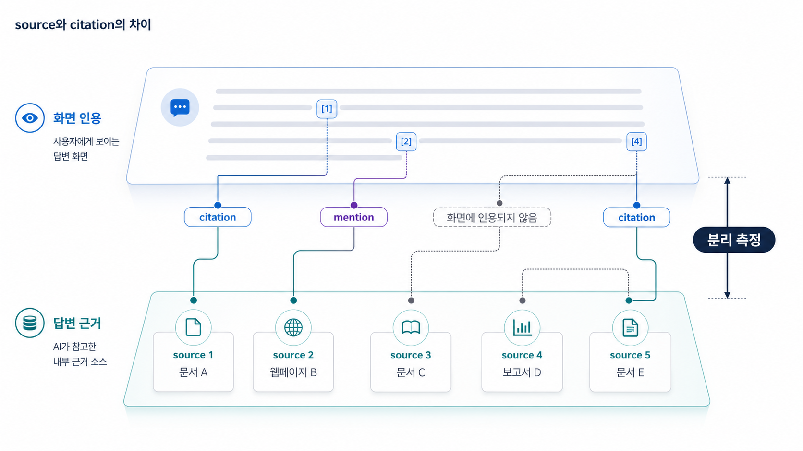

## 답변 근거(source)와 화면 인용(citation)은 무엇이 다른가



답변 근거(source)는 AI가 답변을 만들 때 참고한 정보 재료이고, 화면 인용(citation)은 사용자 화면에 보이는 인용 링크입니다. 둘을 분리해야 GEO 리포트가 실행 과제로 바뀝니다.

인용됐다는 말 하나로는 무엇을 고칠지 알 수 없습니다. 답변 근거가 약한지, 화면 인용이 약한지, 브랜드 entity 설명이 흔들리는지 나눠야 합니다. 특히 PR 캠페인, 뉴스룸, 제품 페이지, 외부 기사처럼 여러 URL이 함께 움직이는 경우에는 답변 근거(source)와 화면 인용(citation)을 한 줄로 합치면 원인을 놓칩니다.

[TOC]

## 04장의 콘텐츠와 05장의 source/citation 관계

04장에서 첫 답변과 표, FAQ를 잘 정리해도 그것이 곧 화면 인용으로 이어지지는 않습니다. 05-01에서는 그 페이지가 실제 답변 근거 후보인지, 사용자 화면에 citation으로 보이는지, 아니면 브랜드 설명만 간접적으로 바꾸는지 나눕니다.

| 04장에서 만든 자산 | 05-01에서 볼 질문 |
|---|---|
| 첫 답변 | AI 답변 문장에 같은 정의가 반영되는가 |
| 비교표 | 추천/비교 질문에서 비교 기준으로 쓰이는가 |
| FAQ | 후속 질문 답변에 짧은 문장으로 재사용되는가 |
| source 링크 | AI가 더 신뢰할 공식/외부 근거로 이어지는가 |
| schema 후보 | 화면 인용보다 페이지 이해 보조 신호로 작동하는가 |

## 왜 둘을 분리해야 하나

AI 답변에서는 세 가지 상황이 자주 생깁니다.

| 상황 | 의미 | 다음 액션 |
|---|---|---|
| 답변 근거로 보이지만 화면 인용은 없음 | AI가 참고했을 가능성은 있지만 사용자가 클릭할 근거로 보이지 않음 | 요약문/표/원문 근거/citation 친화 구조 보강 |
| 화면 인용은 있지만 브랜드 mention은 약함 | 링크는 보이지만 답변의 추천 이유가 약함 | 답변에 들어갈 차별 문장과 비교 기준 보강 |
| 경쟁사 화면 인용만 반복 | 같은 질문에서 경쟁사의 출처가 더 강함 | 경쟁사 답변 근거 맵 분석 후 외부 출처/뉴스룸 보강 |
| 오래된 답변 근거가 반복 | AI가 최신 설명보다 과거 자료를 더 신뢰함 | 최신 정책/팩트시트/정정 콘텐츠 발행 |

이 구분이 있어야 HaloX의 답변 근거(source)와 화면 인용(citation) 리포트가 단순 현황표가 아니라 실행 우선순위가 됩니다.


## 플랫폼별로 source와 citation은 다르게 보인다

source와 citation을 분리해야 하는 이유는 플랫폼마다 출처를 보여주는 방식이 다르기 때문입니다. 어떤 서비스는 답변 하단에 링크를 명확히 보여주고, 어떤 서비스는 본문 안에서만 출처를 암시하며, 어떤 서비스는 검색 결과와 AI 답변이 섞여 보입니다. 따라서 “링크가 보였는가”만 보면 실제 답변 재료를 놓칠 수 있습니다.

| 플랫폼/화면 | 확인할 것 | 리포트에서 주의할 점 |
|---|---|---|
| ChatGPT류 답변 | 브랜드가 어떤 문장으로 설명되는가 | 화면 citation이 없더라도 설명 품질과 근거 후보를 따로 본다 |
| Perplexity류 답변 | 본문 번호/출처 링크/도메인 반복성 | citation URL과 답변 문장 사이의 연결을 기록한다 |
| Google AI Overviews | 검색 결과 TOP10과 AI 답변 출처의 겹침 | 검색 노출과 AI citation을 같은 지표로 합치지 않는다 |
| 네이버/구글 검색 혼합 화면 | 일반 검색, 블로그, 뉴스, AI 요약의 위치 | 브랜드 언급과 클릭 가능한 출처를 분리한다 |
| 사내 리서치/브라우징 에이전트 | 어떤 URL을 열람하고 요약했는가 | 에이전트 로그와 최종 답변의 citation을 구분한다 |

핵심은 “화면에 링크가 없으면 영향이 없다”가 아니라 “어떤 답변 문장을 만들었고, 어떤 URL이 사용자에게 노출됐는지 따로 기록해야 한다”입니다. HaloX의 [AVI 점수 가이드](https://haloxlabs.ai/ko/blog/avi-score-explained)는 이런 차이를 점수와 리포트로 읽을 때 함께 참고할 수 있습니다.

## source/citation/mention/entity를 한 장으로 보면



_보이지 않는 source와 화면에 보이는 citation을 분리해서 추적해야 리포트 해석이 흔들리지 않습니다._


05장의 네 개념은 따로 놀지 않습니다. 하나의 질문에서 다음처럼 이어집니다.

| 구분 | 보는 질문 | 예시 |
|---|---|---|
| Mention | 브랜드가 답변에 등장했는가 | “추천 도구” 답변에 브랜드명이 포함됨 |
| Source | 답변 문장을 만든 근거 후보는 무엇인가 | 제품 페이지, 기사, 리뷰, 커뮤니티 글 |
| Citation | 사용자에게 보이는 링크는 무엇인가 | Perplexity 화면의 출처 URL |
| 엔티티 | 브랜드가 어떤 카테고리로 이해됐는가 | SEO 도구인지 GEO 분석 플랫폼인지 |
| Action | 무엇을 고칠 것인가 | 공식 문장, 외부 프로필, PR, 기술 접근성 |

이 모델이 있어야 “언급은 됐는데 왜 성과가 약한가”, “인용은 됐는데 왜 잘못 설명됐는가”, “검색에는 있는데 AI 답변에는 왜 빠지는가”를 분리할 수 있습니다.

## 실제 query에서 source와 citation을 분리하는 예

source와 citation은 query별로 다르게 해석해야 합니다. 같은 브랜드가 언급되더라도 질문 의도에 따라 필요한 근거와 화면 인용 후보가 달라집니다.

| 실제 query | 필요한 source | 좋은 citation 후보 | 다음 액션 |
|---|---|---|---|
| GEO 도구 비교 | 비교 기준, 리포트 지표, 제3자 평가 | 도구 비교 페이지, 리포트 샘플 | 비교표와 FAQ 보강 |
| ChatGPT 브랜드 노출 확인 | 기준선 측정 방법, 질문셋 템플릿 | 브랜드 노출 진단 가이드 | 측정 조건과 표본 수 명시 |
| GEO 대행사 제안서 검토 | 검증 기준, 리스크 문장, 증빙 자료 | 제안서 체크리스트, 뉴스룸 FAQ | 과장 표현과 증빙 기준 정리 |
| 병원 GEO 후기 리스크 | 법/정책 근거, 안전 문장 | 의료광고 리스크 가이드 | 법무 검토와 FAQ 연결 |
| AcmeGEO는 어떤 도구인가 | 공식 소개, 디렉터리, 파트너 설명 | About, 제품 페이지, 외부 프로필 | entity 문장 일치 |

이 표를 쓰면 “citation이 없다”는 진단이 더 구체화됩니다. 어떤 query에서 어떤 source가 부족한지, 어떤 URL을 citation 후보로 키울지, 어떤 외부 출처가 같은 메시지를 반복해야 하는지 보입니다.

## 사례로 이해하기

캠페인 URL 인용 추적 사례를 보면 차이가 분명합니다. 캠페인 랜딩 페이지가 검색 결과에는 있지만 AI 답변 화면 인용으로 보이지 않을 수 있습니다. 이 경우 문제는 “검색 노출”이 아니라 “AI 답변이 그 URL을 근거로 보여줄 만큼 구조화되어 있는가”입니다.

PR 에이전시형 사례에서도 “언급됐습니다”라고 말하는 것만으로는 부족합니다. 어떤 질문에서 어떤 답변 근거가 쓰였고, 어떤 URL이 화면 인용으로 드러났으며, 어느 질문에서는 경쟁사 URL만 보였는지를 나눠야 리포트가 판단 기준으로 작동합니다.

## 답변 근거와 화면 인용에서 먼저 볼 것

| 점검 항목 | 확인 질문 | 다음 액션 |
|---|---|---|
| 질문 | 어떤 질문에서 citation을 기대하는가 | 질문군 구성을 정보/비교/추천/검증으로 나눈다 |
| URL | 어떤 페이지가 답변 근거 후보인가 | 제품/블로그/뉴스룸/캠페인 URL을 분류한다 |
| 화면 | 실제 citation이 보이는가 | 플랫폼별 화면과 링크를 기록한다 |
| 문맥 | 답변에서 브랜드가 어떤 이유로 설명되는가 | answer quality와 co-mention을 함께 본다 |
| 반복성 | 같은 질문에서 다시 측정해도 유지되는가 | 7일/30일 재측정 기준을 정한다 |

## HaloX로 확인할 수 있는 지점

답변 근거/화면 인용 차이는 HaloX의 기능 설명과 바로 연결됩니다.

| 기능 흐름 | 설명 방식 |
|---|---|
| 답변 근거/화면 인용 맵 | 답변 재료와 화면 인용 링크를 분리해 보여준다 |
| Campaign URL tracking(캠페인 URL 인용 추적) | 특정 캠페인 URL이 어떤 질문에서 화면 인용되는지 추적한다 |
| Search TOP10 vs AI answer overlap | 검색에는 있는 URL이 AI 답변에는 빠지는지 비교한다 |
| Answer quality | 화면 인용이 있어도 추천 문맥이 약한지 확인한다 |
| 30일 재측정 | 보강 후 같은 질문셋으로 변화 여부를 본다 |


## HaloX 리포트로 읽는 예시 흐름

```text
질문: AI 검색 브랜드 가시성 분석 도구 추천해줘
브랜드 mention: 있음
답변 문장: SEO 순위 추적 도구에 가깝게 설명됨
source 후보: 오래된 블로그 소개문, 외부 디렉터리, 제품 페이지
화면 citation: 외부 디렉터리 1개, 공식 제품 페이지 없음
entity 문제: GEO 분석 플랫폼이 아니라 SEO 도구로 묶임
다음 액션: 제품 첫 문단/팩트시트/디렉터리 설명/PR 기고 보강
재측정: 30일 뒤 같은 질문셋으로 source와 citation 변화 확인
```

이 예시처럼 좋은 리포트는 “나왔다/안 나왔다”에서 끝나지 않습니다. 답변 문장, 근거 후보, 화면 링크, 엔티티 오해, 다음 액션이 한 줄로 연결되어야 합니다.

## 실습 워크시트

| 입력 항목 | 작성 기준 |
|---|---|
| 질문 | 측정 프롬프트 |
| 답변 근거 후보 | AI가 참고할 수 있는 페이지 |
| 화면 인용 여부 | 답변에 실제 링크/출처로 드러났는가 |
| 인용 문맥 | 브랜드 설명/비교/추천/주의 문맥 |
| 누락 이유 | 권위/구조/접근성/문맥 |
| 보강안 | 출처성 강화 액션 |

## 정리 양식

```text
질문 / 답변 근거 후보 URL / 화면 인용 여부 / 인용 문맥 / 빠진 이유 / 보강할 근거 / 다음 측정일
```

## 적용 예시

아래 예시는 가상의 B2B SaaS 브랜드에 source/citation 진단표를 적용한 형태입니다. 실제 운영에서는 자사 페이지, 외부 근거, 화면 인용 가능성을 따로 표시합니다.

| 입력 항목 | 적용 예시 |
|---|---|
| 질문 | AI 검색에서 우리 브랜드가 왜 출처로 안 잡히나? |
| 답변 근거 후보 | HaloX AVI 점수 가이드, GEO 콘텐츠 구조화 글 |
| 화면 인용 여부 | 답변 본문에는 언급되지만 링크 출처로는 드러나지 않음 |
| 인용 문맥 | GEO 측정 방법 설명에 참고된 것으로 보이나 추천 근거는 약함 |
| 누락 이유 | 페이지 안에 비교 기준과 원문 근거가 부족함 |
| 보강안 | 리포트 예시와 측정 기준 표를 추가한다 |

## 완료 기준

- 답변 근거(source)와 화면 인용(citation)을 같은 지표로 합치지 않았습니다.
- 질문별 URL, 인용 문맥, 반복 측정 기준이 보입니다.
- 다음 액션이 콘텐츠 구조, 외부 답변 근거, 기술 접근성 중 어디인지 나뉩니다.
- 읽고 난 뒤 산출물로 쓰거나 실습 노트로 옮겨도 설명이 부족하지 않습니다.

## 참고 링크 패키지

이 실습은 HaloX의 [AVI 점수 가이드](https://haloxlabs.ai/ko/blog/avi-score-explained)와 [AI에게 인용되는 콘텐츠 만드는 법](https://haloxlabs.ai/ko/blog/how-to-get-cited-by-ai)를 함께 보면 좋습니다. 캠페인 URL 사례는 [07-06. 캠페인 URL 인용 추적은 어떻게 설계할까](https://wikidocs.net/346390)와 연결해 읽습니다.

답변 근거(Source)와 화면 인용(Citation)을 분리해 보려면 링크가 실제로 크롤러에게 발견 가능한지도 확인해야 합니다. Google의 [크롤 가능한 링크 가이드](https://developers.google.com/search/docs/crawling-indexing/links-crawlable)를 함께 보면 화면 인용 후보 페이지의 기본 접근성을 점검할 수 있습니다.

## 흔한 질문

**Q. 화면 인용(Citation)이 없으면 답변 근거(Source)로도 쓰이지 않은 건가요?**

반드시 그렇지는 않습니다. AI가 답변을 만들 때 참고했더라도 화면 링크로 보여주지 않을 수 있습니다. 그래서 답변 근거 후보와 화면 인용 결과를 따로 기록해야 합니다.

**Q. 답변 근거/화면 인용을 수동으로 봐도 되나요?**

초기 기준선은 수동으로 봐도 됩니다. 다만 질문 수가 늘어나면 HaloX 같은 도구로 반복 측정과 URL별 추적을 자동화해야 리포트가 안정됩니다.

## 다음 흐름

이전: [05. 답변 근거, 화면 인용, 엔티티 전략](https://wikidocs.net/346333) / 다음: [05-02. 엔티티와 브랜드 합의 신호를 만드는 법](https://wikidocs.net/346351)
