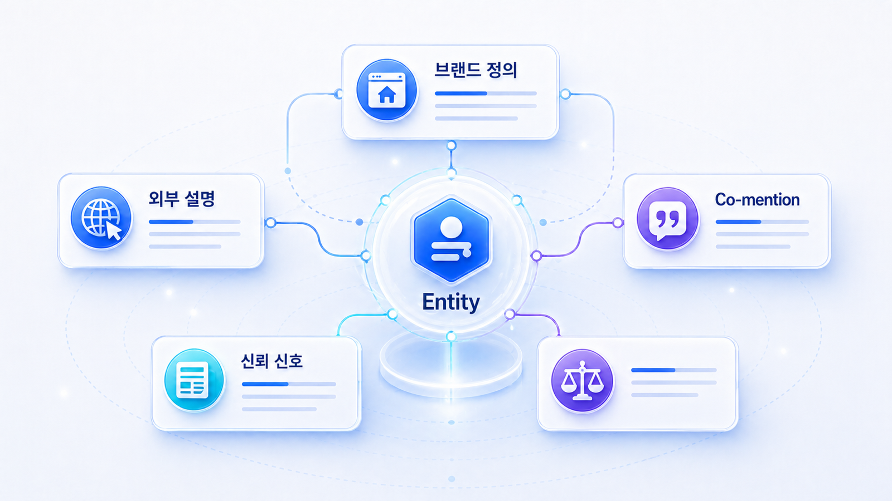
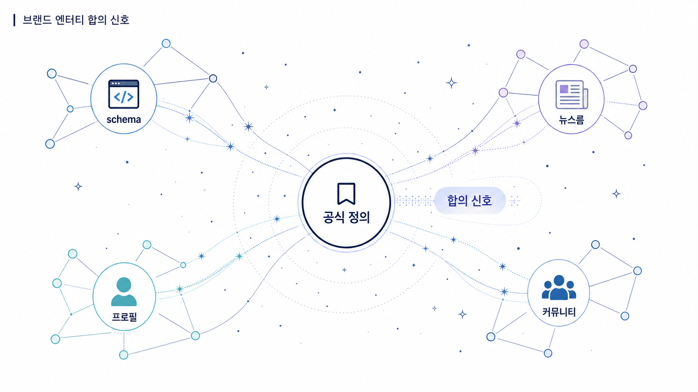

## Entity와 브랜드 합의 신호를 만드는 법



Entity 전략은 브랜드가 어떤 카테고리에서 어떤 문제를 해결하는지 웹 전체에서 일관되게 설명되도록 만드는 작업입니다. 자사 사이트와 외부 채널의 설명이 맞아야 AI도 브랜드를 안정적으로 이해합니다.

홈페이지, 블로그, PR, 리뷰, 디렉터리, 뉴스룸의 설명이 서로 다르면 AI는 브랜드를 추천할 문맥을 좁히기 어렵습니다. 반대로 회사 소개, 제품 설명, 외부 프로필, 기사, 리뷰가 같은 핵심 문장을 반복하면 AI는 브랜드를 더 명확한 entity로 묶을 수 있습니다.

[TOC]

## Entity는 04장의 문장과 외부 설명이 만나는 지점이다

04장에서 공식 페이지의 첫 문단을 고쳤다면 05-02에서는 그 문장이 외부 프로필, 기사, 리뷰, 디렉터리에서도 같은 방향으로 반복되는지 봅니다. 내부 콘텐츠만 정확하고 외부 설명이 오래되어 있으면 AI는 어느 설명을 기준으로 삼아야 할지 흔들릴 수 있습니다.

| 04장에서 정한 기준 | 05-02에서 맞출 외부 신호 |
|---|---|
| 공식 한 줄 정의 | 위키/디렉터리/언론/리뷰 프로필의 첫 설명 |
| 주 카테고리와 보조 카테고리 | 외부 사이트의 분류와 태그 |
| 대표 기능 3개 | 기사, 파트너 페이지, 리뷰의 기능 설명 |
| 쓰지 말아야 할 표현 | 오래된 카테고리, 과장 문구, 과거 제품명 |
| 대표 URL | 공식 사이트, 뉴스룸, 제품 페이지, sameAs 후보 |

## 브랜드 합의 신호란 무엇인가



_공식 정의와 외부 설명이 같은 방향으로 모일 때 브랜드 엔티티 합의 신호가 강해집니다._


브랜드 합의 신호는 웹에 흩어진 설명이 같은 방향을 가리키는 상태입니다. 이름만 같다고 충분하지 않습니다. 카테고리, 해결 문제, 대표 기능, 주요 고객, 비교 대상이 함께 맞아야 합니다.

| 항목 | 흔한 문제 | 맞춰야 할 기준 |
|---|---|---|
| 회사명/제품명 | 표기와 띄어쓰기가 제각각 | 공식 표기와 약칭 기준 |
| 카테고리 | SEO 도구/AI 마케팅 도구/GEO 도구가 섞임 | 주 카테고리와 보조 카테고리 분리 |
| 핵심 기능 | 기능명이 페이지마다 다름 | 3개 내외 대표 기능으로 반복 |
| 고객/업종 | 누구를 위한 제품인지 흐림 | ICP/업종/사용 장면 명시 |
| 비교 대상 | 경쟁사/대안이 임의로 묶임 | 비교 기준과 대안군 정리 |


## 합의 신호는 같은 문장 복사가 아니다

브랜드 합의 신호를 만든다고 해서 모든 채널에 같은 문장을 복사하라는 뜻은 아닙니다. 공식 사이트, 뉴스룸, 언론 기사, 위키성 자료, 리뷰 사이트, 커뮤니티는 역할이 다릅니다. 다만 서로 다른 문맥에서도 같은 카테고리, 같은 문제 정의, 같은 대표 기능을 가리켜야 합니다.

| 채널 | 문장 역할 | 일관되어야 할 것 |
|---|---|---|
| 공식 사이트 | 기준 정의 | 공식명, 카테고리, 대표 기능 |
| 뉴스룸 | 최신 공식 맥락 | 발표 내용, 수치, 팩트시트 |
| 언론/PR | 제3자 신뢰 | 시장 맥락, 검증 가능한 근거 |
| 위키/디렉터리 | 기본 엔티티 정보 | 이름, 공식 링크, 설립/제품 정보 |
| 리뷰/커뮤니티 | 실제 사용 맥락 | 장단점, 대안 비교, 문제 해결 상황 |
| 파트너 페이지 | 생태계 신호 | 연동, 도입 조건, 공동 사용 사례 |

좋은 합의 신호는 “AI 검색 브랜드 가시성 분석 플랫폼”이라는 의미가 여러 채널에서 반복되는 상태입니다. 나쁜 합의 신호는 공식 사이트는 GEO를 말하는데 외부 프로필은 SEO 순위 추적 도구, 언론 기사는 AI 마케팅 자동화 도구, 커뮤니티는 리포트 대행 서비스로 제각각 설명하는 상태입니다.

## 공식 사이트와 구조화 데이터에서 시작하기

엔티티 합의 신호는 외부 출처만의 문제가 아닙니다. 공식 사이트의 기준이 먼저 정리되어야 합니다. Google의 [Organization 구조화 데이터](https://developers.google.com/search/docs/appearance/structured-data/organization)와 schema.org의 [Organization](https://schema.org/Organization)은 조직명, URL, 로고, 연락처, `sameAs` 같은 필드를 제공합니다. GEO 관점에서는 이 필드를 외부 프로필과 맞춰야 할 기준표로 볼 수 있습니다.

| 기준 | 확인할 것 | 왜 중요한가 |
|---|---|---|
| name | 공식명과 약칭 | 다른 회사/제품과 혼동 방지 |
| url | 대표 도메인 | 오래된 URL citation 방지 |
| logo | 최신 로고 | 외부 프로필의 시각 식별 일치 |
| sameAs | 공식 SNS/위키/프로필 | 동일 엔티티 연결 신호 |
| description | 한 줄 정의 | AI 답변의 기본 설명 재료 |
| contactPoint | 문의/지원 채널 | 신뢰와 책임 주체 확인 |

05-06이 위키/디렉터리 실행법을 다룬다면, 이 페이지의 역할은 그 전에 “무엇을 기준으로 맞출 것인가”를 정하는 것입니다.

## 사례로 이해하기

엔터프라이즈 뉴스룸 사례에서는 콘텐츠가 많아도 entity가 흔들릴 수 있습니다. 회사 소개는 제조 기업처럼 보이고, 보도자료는 ESG 중심이며, 제품 페이지는 AI 솔루션을 말하고, 외부 기사는 과거 이슈를 반복한다면 AI는 회사를 한 문장으로 설명하기 어렵습니다.

금융/규제 산업 사례에서는 entity 합의 신호가 평판 관리와 바로 연결됩니다. 공식 정책 페이지는 최신인데 외부 글이 오래된 수수료나 과거 이슈를 반복하면 AI 답변도 그 문장을 가져올 수 있습니다. 이때는 외부 답변 근거를 억지로 밀어내는 것이 아니라, 공식 설명과 신뢰 가능한 외부 설명이 같은 방향으로 정렬되도록 해야 합니다.

## HaloX로 확인할 수 있는 지점

Entity 전략은 HaloX에서 다음 흐름으로 설명할 수 있습니다.

| 기능 흐름 | 설명 방식 |
|---|---|
| Entity consistency | AI 답변에서 브랜드 정의가 일관되는지 확인 |
| Co-mention map | 어떤 경쟁사/대안과 함께 묶이는지 확인 |
| 답변 근거 맵 | 어떤 출처가 브랜드 설명을 만들고 있는지 분리 |
| Answer quality | 틀린 설명, 오래된 설명, 약한 추천 이유를 찾는다 |
| Newsroom scoring | 뉴스룸/팩트시트/FAQ가 entity 신호를 강화하는지 본다 |

## 엔티티 합의 신호에서 먼저 볼 것

| 점검 항목 | 확인 질문 | 다음 액션 |
|---|---|---|
| 한 줄 정의 | AI가 우리 브랜드를 어떻게 설명하는가 | 현재 답변 원문을 모은다 |
| 공식 설명 | 자사 사이트의 핵심 문장이 일관되는가 | 홈페이지/제품/블로그 소개문 정리 |
| 외부 설명 | 외부 프로필과 기사 설명이 맞는가 | 수정 요청/기고/PR 보강 후보 분류 |
| 비교 문맥 | 어떤 경쟁사와 함께 묶이는가 | 비교 기준과 차별 문장 추가 |
| 리스크 문장 | 오래된 이슈나 틀린 정보가 반복되는가 | 최신 팩트시트와 정정 콘텐츠 설계 |


## entity 합의 신호 점검표

entity 합의 신호는 공식 사이트, schema, 뉴스룸, 디렉터리, 리뷰, 커뮤니티가 같은 브랜드를 같은 방식으로 설명하는지 보는 일입니다. 완전히 같은 문장을 복사하는 것이 아니라 이름, 카테고리, 대표 URL, 핵심 기능, 대상 고객, 근거 문장이 충돌하지 않아야 합니다.

| 필드 | 공식 기준 | 외부에서 확인할 것 | 실패 신호 |
|---|---|---|---|
| name | 공식 회사명/제품명 | 위키/디렉터리/리뷰 표기 | 약칭과 법인명이 뒤섞임 |
| category | 주 카테고리/보조 카테고리 | 언론/파트너 글의 분류 | SEO 도구/마케팅 자동화/GEO 도구가 혼재 |
| url | 대표 URL/canonical | 외부 링크와 프로필 URL | 오래된 캠페인 URL 반복 |
| sameAs | 공식 소셜/프로필 | Organization schema와 외부 식별자 | 다른 엔티티와 혼동 |
| proof | 고객 사례/리포트/뉴스룸 | 제3자 source의 근거 문장 | 주장만 있고 증빙 없음 |
| freshness | 업데이트 날짜/버전 | 오래된 기사와 디렉터리 설명 | 과거 기능이 현재처럼 설명됨 |

AcmeGEO의 메시지 하우스라면 한 문장 정의는 `AI 검색 모니터링과 GEO 리포트 도구`로 고정하고, 외부 프로필에서도 `SEO 순위 추적 도구`로만 설명되지 않게 정렬해야 합니다.

## 메시지 하우스 초안

엔티티 합의 신호를 만들려면 먼저 내부 기준표가 필요합니다. 아래 메시지 하우스는 외부 프로필 수정, PR 기고, 뉴스룸 FAQ, 파트너 소개문에 공통으로 쓰는 기준입니다.

```text
공식명 / 약칭 / 한 줄 정의 / 주 카테고리 / 보조 카테고리 / 대표 기능 3개 / 주요 고객군 / 비교 대상 / 쓰지 말아야 할 표현 / 공식 근거 URL
```

예를 들어 “AI 마케팅 도구”는 너무 넓고, “SEO 순위 추적 도구”는 기능을 축소할 수 있습니다. 반대로 “AI 검색에서 브랜드 가시성, 답변 근거(source), 화면 인용(citation)을 측정하는 GEO 분석 플랫폼”은 카테고리와 기능을 더 정확히 보여줍니다.

## 실습 워크시트

| 입력 항목 | 작성 기준 |
|---|---|
| Entity 항목 | 회사명/제품명/카테고리/핵심 기능 |
| 현재 표현 | 웹에 흩어진 설명 |
| 권장 표현 | 일관되게 쓸 문장 |
| 외부 위치 | 프로필/리뷰/파트너/PR |
| 리스크 문장 | 틀리거나 오래된 설명 |
| 정리 액션 | 수정 요청/신규 발행/팩트시트 작성 |

## 정리 양식

```text
브랜드 한 줄 정의 / 핵심 카테고리 / 비교 대상 / 외부 프로필 후보 / 고쳐야 할 표현 / 리스크 문장 / 배포 순서
```

## 작성 예시

아래 예시는 가상의 B2B SaaS 브랜드에 엔티티 합의 신호 워크시트를 적용한 형태입니다. 실제 운영에서는 자사 페이지, 외부 프로필, 기사, 리뷰, 커뮤니티의 표현을 함께 비교합니다.

| 입력 항목 | 작성 예시 |
|---|---|
| Entity 항목 | HaloX |
| 현재 표현 | AI 마케팅 도구 / GEO 도구 / SEO 분석 도구가 섞여 있음 |
| 권장 표현 | AI 검색에서 브랜드 가시성과 citation을 측정하는 GEO 분석 플랫폼 |
| 외부 위치 | 회사 소개, 프로필, 파트너 소개, 블로그 author bio |
| 리스크 문장 | 단순 SEO 순위 추적 도구로 설명되는 문장 |
| 정리 액션 | 핵심 소개 문장을 2개 버전으로 통일하고 외부 프로필부터 수정한다 |

## 완료 기준

- 브랜드 한 줄 정의와 카테고리가 정리되어 있습니다.
- 내부/외부 설명의 불일치가 보입니다.
- AI 답변에서 반복되는 리스크 문장을 기록했습니다.
- entity 보강 액션이 콘텐츠 수정, 외부 프로필, PR, 팩트시트로 나뉩니다.

## 참고 링크 패키지

이 실습은 HaloX의 [GEO 평판 관리와 브랜드 합의 신호](https://haloxlabs.ai/ko/blog/geo-reputation-brand-consensus), [GEO란? AI 검색 시대의 콘텐츠 전략 완전 가이드](https://haloxlabs.ai/ko/blog/what-is-geo-optimization), [GEO 콘텐츠 구조화 가이드](https://haloxlabs.ai/ko/blog/geo-content-structure)와 함께 보면 좋습니다.

엔티티 신호는 내부 페이지와 외부 출처가 서로 모순 없이 연결될 때 강해집니다. 기본적인 링크 발견성과 연결 구조는 Google의 [크롤 가능한 링크 가이드](https://developers.google.com/search/docs/crawling-indexing/links-crawlable)를 참고합니다.

## 흔한 질문

**Q. Entity 전략은 브랜드 소개문만 고치면 되나요?**

아닙니다. 소개문은 시작점입니다. 제품 페이지, 뉴스룸, 외부 프로필, 기사, 리뷰, 디렉터리까지 같은 설명을 반복해야 합의 신호가 생깁니다.

**Q. 외부 글을 모두 통제할 수 없는데 어떻게 하나요?**

모두 통제하려고 하면 실패합니다. 먼저 AI가 자주 참고하는 source를 찾고, 영향이 큰 출처부터 수정 요청, 기고, 팩트시트 배포, 공식 페이지 보강 순서로 접근합니다.

## 다음 흐름

이전: [05-01. 답변 근거(source)와 화면 인용(citation)은 무엇이 다른가](https://wikidocs.net/346350) / 다음: [05-03. 오프사이트 출처 후보 맵을 만드는 법](https://wikidocs.net/346352)
