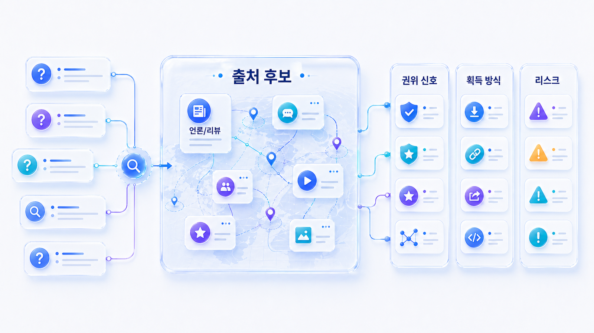
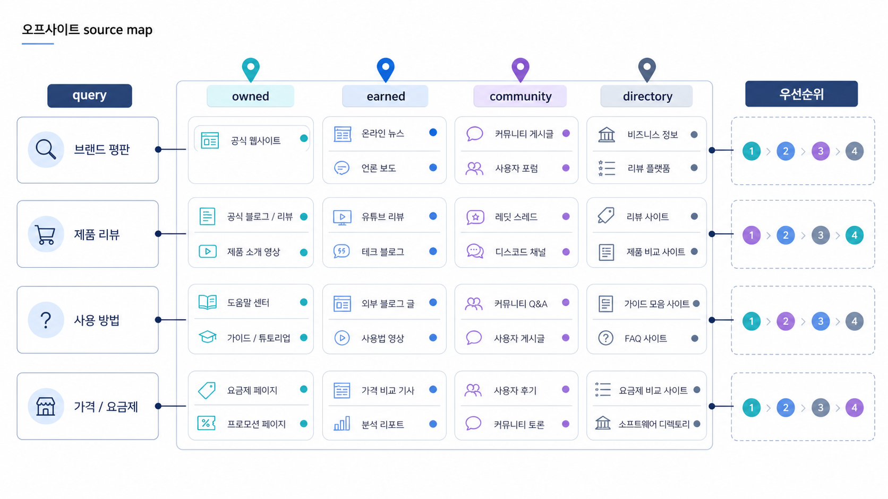

## 오프사이트 source map: 외부 출처 후보 설계



오프사이트 source map은 “백링크 받을 곳”을 적는 표가 아닙니다. AI 답변에서 특정 질문을 설명할 때 참고할 수 있는 외부 근거를 질문별로 정리하는 작업입니다.

03장에서 만든 Fan-out 질문과 04장에서 정리한 Answer-first 페이지를 기준으로, 어떤 질문에서 공식 근거가 부족하고 어떤 외부 출처가 보강되어야 하는지 봅니다.

[TOC]

## 질문 유형마다 필요한 외부 근거가 다르다

모든 채널에 같은 글을 배포하면 source 전략이 흐려집니다. 정의형 질문은 용어/개념 페이지가 강하고, 비교형 질문은 대안/리뷰/사례가 강합니다. 검증형 질문은 언론, 프로필, 고객 사례, 리포트 같은 신뢰 근거가 필요합니다.

| 질문 유형 | 필요한 source 후보 | 먼저 볼 신호 |
|---|---|---|
| 정의형 | 용어사전, 공식 가이드, 업계 해설 | 카테고리 설명이 일관적인가 |
| 비교형 | 비교 글, 리뷰, 대안 페이지 | 경쟁사 URL만 반복되는가 |
| 추천형 | 도구 목록, 사례, 리포트 예시 | 후보군에서 빠지는 이유가 보이는가 |
| 검증형 | 언론, 프로필, 인증, 고객 사례 | 신뢰 근거가 공식 URL과 연결되는가 |
| 리스크형 | 공식 입장, 정책, 업데이트 문서 | 오래된 외부 글이 반복되는가 |

## HaloX에서 source map을 만드는 순서

먼저 프롬프트 분석에서 source/citation이 약한 질문을 고릅니다. 모든 질문을 한 번에 다루지 말고, 비브랜드 비교 질문이나 구매 검토 질문처럼 실행 가치가 큰 질문부터 봅니다.

다음으로 인용 추적에서 반복 도메인을 확인합니다. 공식 URL이 빠지는지, 경쟁사 URL이 강한지, 외부 리뷰/언론/디렉터리가 답변 근거를 대신하는지 분리합니다.

마지막으로 전략맵에서 출처 보강을 콘텐츠/PR/디렉터리/기술 작업 중 어디로 넘길지 정합니다. source map은 조사표가 아니라 실행 우선순위 문서입니다.



*source map은 질문 유형, 공식 URL, 외부 출처, 경쟁 citation을 한 화면에서 연결하는 작업이다.*

## AcmeGEO 적용 예시

AcmeGEO는 “AI 검색 리포트 도구 추천” 질문에서 언급되지 않습니다. 인용 추적을 보니 경쟁사 비교 글과 외부 리뷰가 반복되고, 공식 리포트 예시 페이지는 citation으로 잡히지 않습니다.

이때 source map에는 세 가지 작업이 남습니다. 공식 리포트 예시를 더 명확히 만들고, 외부 블로그에는 비교 기준을 설명하게 하며, 디렉터리/프로필에는 카테고리와 대표 URL을 맞춥니다. 이후 같은 질문에서 공식 URL과 외부 근거가 함께 잡히는지 봅니다.

## 정리 양식

```text
우선 질문군:
현재 반복 source/citation:
빠져 있는 공식 URL:
경쟁사/대체재 URL:
필요한 외부 출처 유형:
보강할 채널:
담당자:
30일 뒤 재측정 질문:
```

## 다음 흐름

외부 출처 후보를 정했다면 각 채널이 맡을 역할을 나눠야 합니다. 이어서 [GEO 채널별 답변 근거 전략표 설계](https://wikidocs.net/346391)를 봅니다.
