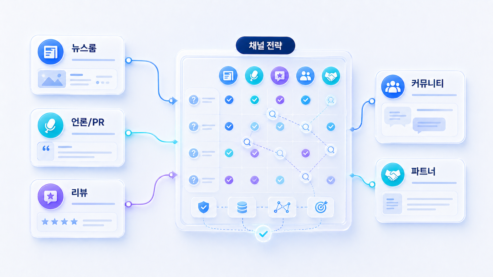
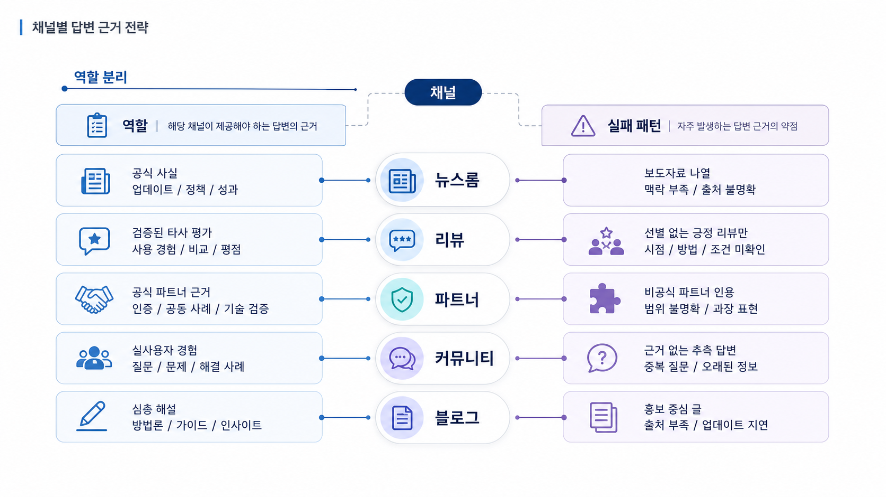

## GEO 채널별 답변 근거 전략표 설계



채널별 답변 근거 전략표는 모든 채널에 같은 메시지를 복사하기 위한 문서가 아닙니다. 공식 사이트, 뉴스룸, 언론, 커뮤니티, 디렉터리, 외부 블로그가 AI 답변에서 맡을 근거 역할을 나누는 표입니다.

GEO에서 채널 전략이 약하면 실행팀은 “블로그 더 쓰기”나 “보도자료 더 내기”로만 움직입니다. 하지만 질문마다 필요한 근거는 다릅니다. 채널별 역할을 나눠야 적은 작업으로도 source/citation 품질을 바꿀 수 있습니다.

`AcmeGEO`라는 이름은 설명을 위한 가상 기업명이며, 실제 고객 사례가 아닙니다.

[TOC]

## 채널은 역할이 다르다

공식 사이트는 기준 문장을 잡고, 뉴스룸은 공식 업데이트를 남기고, 언론/PR은 신뢰 맥락을 만들고, 커뮤니티는 실제 사용 맥락을 보여줍니다. 디렉터리는 엔티티 필드를 보강하고, 외부 블로그는 비교/해설/사례를 넓혀 줍니다.

| 채널 | 강한 역할 | 약해지는 경우 |
|---|---|---|
| 공식 사이트 | 정의, 기능, 가격, 리포트 예시 | 자기 주장만 있고 근거가 없음 |
| 뉴스룸 | 공식 발표, 자료실, 업데이트 | 소식만 있고 기준 문장이 없음 |
| 언론/PR | 신뢰, 사건, 인터뷰, 시장 맥락 | 홍보 문장만 반복됨 |
| 커뮤니티/후기 | 실제 사용 맥락, 비교, 불만 | 조작/광고처럼 보임 |
| 디렉터리/프로필 | 이름, URL, 카테고리, 조직 정보 | 오래된 정보가 남음 |
| 외부 블로그 | 해설, 비교, 사례 | 같은 글의 반복 배포로 보임 |

## 전략표는 질문군에서 출발한다

채널 전략은 채널 목록이 아니라 질문군에서 시작합니다. “GEO 리포트 도구 추천” 질문에서 빠지는 문제와 “AcmeGEO 가격” 질문의 설명이 부정확한 문제는 필요한 채널이 다릅니다.

프롬프트 분석에서 약한 질문군을 고른 뒤, 인용 추적에서 현재 반복되는 도메인을 봅니다. 그다음 채널별로 “수정할 공식 문서”, “확보할 외부 근거”, “정리할 엔티티 필드”를 나눕니다.



*채널 전략표는 채널별 할 일을 늘리는 문서가 아니라 질문군별 근거 역할을 나누는 문서다.*

## 가상 기업 AcmeGEO 예시

AcmeGEO는 비교 질문에서 경쟁사 리뷰가 강하고, 브랜드 질문에서는 오래된 디렉터리 설명이 citation으로 잡힙니다. 이때 공식 사이트에는 리포트 예시와 비교 기준을 보강하고, 디렉터리에는 카테고리/대표 URL을 수정합니다. 외부 블로그는 “SEO 도구 비교”가 아니라 “AI 검색 가시성 리포트 도구 비교” 맥락으로 재작성합니다.

## 정리 양식

```text
우선 질문군:
현재 강한 citation 채널:
공식 사이트에서 보강할 문서:
뉴스룸/자료실에서 보강할 근거:
PR/외부 블로그에서 맡을 역할:
디렉터리/프로필 수정 항목:
커뮤니티에서 관찰할 오해:
다음 리포트에서 확인할 변화:
```

## 다음 흐름

채널 역할을 나눴다면, 잘못된 설명이나 부정확한 비교가 반복될 때 어떻게 대응할지도 정해야 합니다. 이어서 [GEO 평판 리스크와 AI 답변 오해 관리](https://wikidocs.net/346392)를 봅니다.
