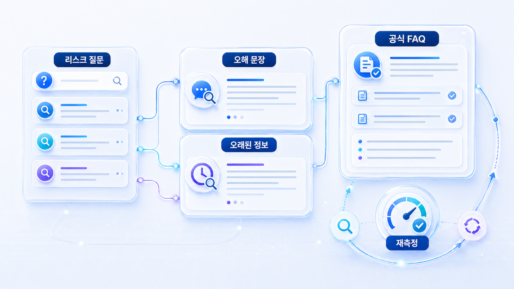
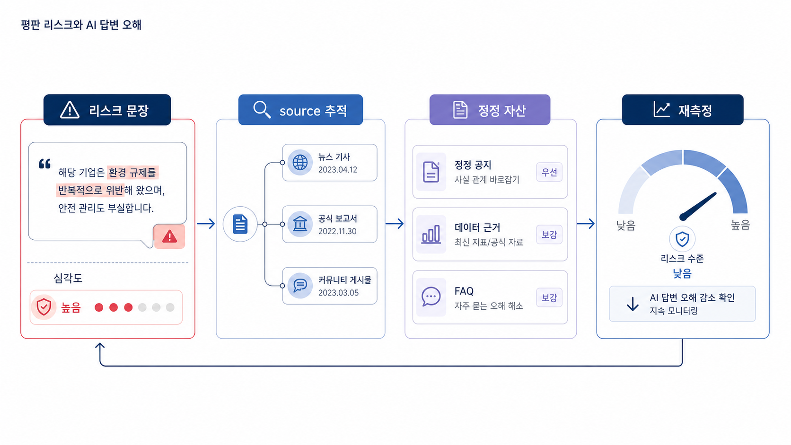

## 평판 리스크와 AI 답변 오해를 어떻게 줄일까



GEO는 노출을 늘리는 일만이 아닙니다. AI가 브랜드를 틀리게 설명하거나, 오래된 이슈를 반복하거나, 경쟁사보다 약한 신뢰 문맥으로 소개한다면 그것도 GEO 문제입니다.

평판 리스크 관점에서는 mention이 많아도 안심할 수 없습니다. 어떤 질문에서 어떤 source를 근거로 어떤 문장이 반복되는지 봐야 합니다. 특히 금융/규제 산업, 병원/전문 서비스, 엔터프라이즈 뉴스룸, PR 캠페인에서는 오해 문장을 줄이는 것이 노출 확대만큼 함께 봐야 합니다.

[TOC]

## 먼저 찾아야 할 리스크 문장

| 리스크 유형 | 예시 | 필요한 대응 |
|---|---|---|
| 오래된 정보 | 과거 가격/정책/제품 설명이 현재처럼 반복됨 | 최신 공식 페이지와 FAQ 보강 |
| 카테고리 오해 | 브랜드가 다른 카테고리 도구로 설명됨 | entity 정의와 외부 프로필 수정 |
| 이슈 편향 | 과거 이슈가 현재 평가의 중심이 됨 | 팩트시트, 최근 자료, 균형 잡힌 source 보강 |
| 경쟁사 대비 약한 설명 | 경쟁사는 장점이 구체적인데 우리는 일반 설명만 나옴 | 비교 기준과 차별 근거 작성 |
| 출처 불균형 | 비공식 글이나 오래된 글이 반복 source가 됨 | 공식 source 강화와 외부 정정 요청 |


## 리스크 심각도 분류

평판 리스크는 모두 같은 무게가 아닙니다. 먼저 심각도를 나눠야 대응 속도와 담당자를 정할 수 있습니다.

| 등급 | 리스크 유형 | 예시 | 대응 |
|---|---|---|---|
| P0 | 법적/규제/안전 오해 | 의료 효과 보장, 금융 수수료 오류, 인증 상태 오류 | 즉시 법무/정책 검토, 공식 FAQ/정정 source 발행 |
| P1 | 카테고리/기능 오해 | 현재 제품을 과거 제품으로 설명 | 제품 페이지, 외부 프로필, PR 문맥 수정 |
| P1 | 이슈 편향 | 과거 이슈만 현재 평가처럼 반복 | 팩트시트, 최신 자료, 균형 잡힌 외부 근거 보강 |
| P2 | 차별성 부족 | 경쟁사는 구체적인데 우리는 일반 설명 | 비교 기준, 고객 사례, 수치 보강 |
| P2 | 표현 약함 | 언급은 되지만 추천 이유가 약함 | answer-first 문장과 FAQ 리라이트 |

## 리스크 대응 원칙

1. 삭제보다 정정 근거를 먼저 만듭니다.
2. 반박보다 최신 공식 기준을 제공합니다.
3. 과장보다 투명성을 우선합니다.
4. 법무/정책 검토가 필요한 표현을 별도로 표시합니다.
5. AI 답변이 바뀌었는지 같은 질문으로 재측정합니다.

Google의 [유용한 콘텐츠 만들기](https://developers.google.com/search/docs/fundamentals/creating-helpful-content)는 독자에게 실제로 도움이 되는 콘텐츠와 신뢰 가능한 설명을 강조합니다. 평판 리스크 대응 콘텐츠도 방어문이 아니라 독자가 판단할 수 있는 최신 근거와 맥락이어야 합니다.

## 리스크 문장을 source/citation 관점으로 추적하기



_평판 리스크는 위험 문장 발견에서 끝나지 않고 source 추적과 정정 자산, 재측정으로 이어져야 합니다._


평판 리스크는 답변 문장만 보고 끝내면 안 됩니다. 그 문장이 어떤 source에서 반복되는지, 사용자 화면에 어떤 citation으로 보이는지, 공식 정정 근거가 있는지까지 따라가야 합니다.

| 리스크 문장 | 가능한 원인 source | 필요한 공식 대응 | 재측정 질문 |
|---|---|---|---|
| 오래된 가격이 현재 가격처럼 나옴 | 과거 보도자료/리뷰 | 가격/정책 FAQ, 변경 로그 | 현재 가격/요금제를 물어보는 질문 |
| 다른 카테고리 도구로 설명됨 | 디렉터리/파트너 글의 오래된 분류 | About, 제품 페이지, entity 문장 수정 | 브랜드 정의/비교 질문 |
| 경쟁사 대비 기능이 약하다고 나옴 | 오래된 비교 글 | 최신 비교표, 고객 사례 | 추천형/비교형 질문 |
| 의료/금융 효과를 과장해 설명 | 비공식 후기/커뮤니티 | 안전 문장, 정책 FAQ, 법무 검토 | 리스크형/검증형 질문 |
| 공식 URL이 아닌 복제본이 인용됨 | 신디케이션/canonical 문제 | 대표 URL, canonical, 내부 링크 정리 | citation 확인 질문 |

AcmeGEO가 `단순 SEO 순위 추적 도구`로 반복 설명된다면 이는 노출 문제가 아니라 포지셔닝 리스크입니다. 먼저 해당 설명이 어디서 반복되는지 찾고, 공식 문장과 외부 프로필을 함께 수정해야 합니다.

## 사례로 이해하기

금융/규제 산업 사례에서는 정책과 신뢰 정보가 조금만 틀려도 위험합니다. AI가 오래된 수수료, 과거 인증 상태, 부정확한 주의 문구를 반복하면 사용자는 클릭 전 단계에서 이미 불안감을 가질 수 있습니다.

엔터프라이즈 뉴스룸 사례에서는 회사 설명이 이슈 중심으로 기울 수 있습니다. 실제 사업 구조와 최근 메시지가 뉴스룸에 있어도 외부 답변 근거가 과거 이슈만 반복하면 AI 답변도 균형을 잃습니다.

로컬 병원/전문 서비스 사례에서는 후기, 가격, 시술 정보가 오해 문장이 되기 쉽습니다. 공식 FAQ와 지역/지점 정보가 약하면 AI가 외부 후기나 오래된 블로그를 더 많이 참고할 수 있습니다.

## HaloX로 확인할 수 있는 지점

평판 리스크 관리는 HaloX 기능을 방어적 지표로 설명하기 좋습니다.

| 기능 흐름 | 설명 방식 |
|---|---|
| Risk prompt set | 브랜드 신뢰/이슈/비교/주의 질문을 따로 측정 |
| Answer quality diff | 잘못된 문장, 빠진 근거, 오래된 설명을 추적 |
| 답변 근거 리스크 맵 | 리스크 문장을 만든 답변 근거를 분리 |
| 엔티티 일관성 | 공식 설명과 외부 설명의 불일치를 확인 |
| Re-measure report | 수정 후 같은 리스크 질문에서 답변이 바뀌었는지 본다 |


## 고위험 업종에서 더 조심할 것

금융, 의료, 규제 산업, 로컬 전문 서비스는 리스크 질문이 바로 신뢰와 전환에 영향을 줍니다. 이 분야에서는 “좋게 보이게 쓰기”보다 “틀리지 않게 쓰기”가 먼저입니다.

| 업종 | 자주 생기는 오해 | 필요한 source |
|---|---|---|
| 금융/핀테크 | 수수료, 인가, 리스크 고지, 과거 이슈 | 최신 정책 페이지, 공시, FAQ, 공식 입장 |
| 병원/의료 | 효과 보장, 후기, 가격, 전후 사진 | 의료광고 기준에 맞는 설명, 진료 범위, 주의 문구 |
| 로컬 전문 서비스 | 지점 위치, 운영 시간, 가격, 후기 | 지도 프로필, 지점 페이지, 지역 FAQ |
| 엔터프라이즈 | 조직 개편, 사업 영역, 과거 이슈 | 뉴스룸 팩트시트, IR/ESG/공식 입장 |
| 커머스 | 가격, 재고, 배송, 환불 정책 | 상품 데이터, merchant feed, 정책 페이지 |

이 표는 12장의 병원/오프라인 매장 SEO/GEO, 11장의 커머스 GEO와도 연결됩니다. 05-05에서는 업종별 세부 규정보다 “리스크 질문을 별도로 측정하고 공식 source를 먼저 만든다”는 운영 원칙을 잡습니다.

## 실습 워크시트

| 입력 항목 | 작성 기준 |
|---|---|
| 리스크 질문 | 안전한가/믿을 만한가/문제는 없나/대안은 무엇인가 |
| AI 답변 문장 | 실제로 반복되는 문장 |
| 근거 source | 해당 문장을 만든 것으로 보이는 출처 |
| 문제 유형 | 오래된 정보/오해/편향/누락/과장 |
| 대응 source | 공식 FAQ, 팩트시트, 뉴스룸, 외부 프로필, 정정 요청 |
| 재측정 기준 | 같은 질문에서 문장이 어떻게 바뀌어야 하는가 |

## 정리 양식

```text
리스크 질문 20개 / 반복 오해 문장 / 답변 근거 후보 / 문제 유형 / 대응 콘텐츠 / 외부 수정 요청 / 재측정 날짜
```

## 적용 예시

| 입력 항목 | 적용 예시 |
|---|---|
| 리스크 질문 | 이 서비스는 신뢰할 만한 GEO 분석 도구인가? |
| AI 답변 문장 | 단순 SEO 순위 추적 도구로 소개됨 |
| 근거 source | 오래된 블로그 소개문, 외부 프로필 |
| 문제 유형 | 카테고리 오해, 기능 누락 |
| 대응 source | 최신 제품 팩트시트, GEO 측정 FAQ, 외부 프로필 수정 |
| 재측정 기준 | AI 답변에 답변 근거(source)/화면 인용(citation) 분석과 AI 브리핑 모니터링이 포함되는지 확인 |

## 완료 기준

- 리스크 질문셋을 별도로 만들었습니다.
- AI 답변의 오해 문장을 원문으로 기록했습니다.
- 문제 source와 대응 답변 근거를 분리했습니다.
- 재측정 기준이 단순 노출이 아니라 문장 변화로 잡혀 있습니다.

## 참고 링크 패키지

평판 리스크 관리는 HaloX의 [AI 검색에서 GEO는 왜 평판 관리 문제가 되었을까?](https://haloxlabs.ai/ko/blog/geo-reputation-brand-consensus), [GEO vs SEO vs AEO](https://haloxlabs.ai/ko/blog/geo-vs-seo-vs-aeo), [AVI 점수란?](https://haloxlabs.ai/ko/blog/avi-score-explained)을 함께 보면 좋습니다.

평판 리스크 대응 콘텐츠는 과장보다 정확한 도움과 근거를 봐야 합니다. Google의 [유용한 콘텐츠 만들기](https://developers.google.com/search/docs/fundamentals/creating-helpful-content)를 함께 보면 방어성 문구가 아니라 독자가 판단할 수 있는 설명인지 점검할 수 있습니다.

## 흔한 질문

**Q. 부정확한 AI 답변은 바로 고칠 수 있나요?**

대부분 즉시 고치기 어렵습니다. 먼저 어떤 질문에서 어떤 문장이 반복되는지 기록하고, 그 문장을 만든 source 후보를 찾은 뒤 공식 FAQ, 팩트시트, 뉴스룸, 외부 프로필 수정으로 대응합니다.

**Q. 평판 리스크 대응은 부정 글을 없애는 일인가요?**

아닙니다. 삭제보다 중요한 것은 최신 공식 기준과 신뢰 가능한 외부 근거를 만드는 것입니다. 특히 금융, 의료, 규제 산업은 반박보다 정확성, 투명성, 법무 검토가 먼저입니다.

## 다음 흐름

평판 리스크까지 정리했다면 [05-06. 위키/디렉터리 엔티티 관리](https://wikidocs.net/346846)로 넘어가 외부 엔티티 신호의 기본 좌표를 맞춥니다.
