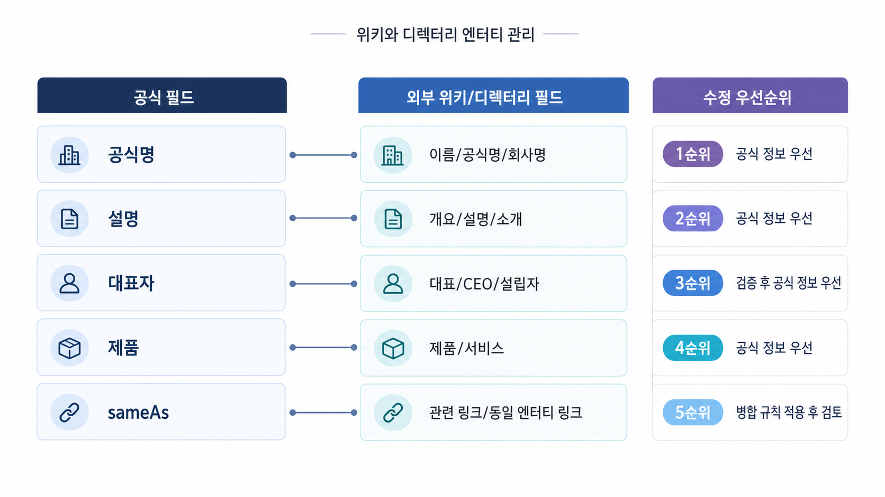

## 위키/디렉터리 엔티티 관리: 나무위키, 위키피디아, 프로필 사이트


위키와 디렉터리는 브랜드를 홍보하는 공간이 아니라 엔티티 정보를 확인하는 외부 참조 지점입니다. 이름, URL, 카테고리, 설립 정보, 대표 인물, 제품 설명이 일관되면 AI가 브랜드를 이해하는 데 보조 신호가 됩니다.

다만 위키를 마음대로 고치는 홍보 채널로 보면 안 됩니다. 각 플랫폼의 등재 기준, 이해상충 정책, 출처 요구를 먼저 존중해야 합니다. GEO 관점에서도 억지 편집보다 공식 기준 문장과 출처 정리가 먼저입니다.

[TOC]

## 먼저 공식 필드를 정한다

외부 페이지를 수정하기 전에 공식 사이트와 자료실의 기준 필드를 정리합니다. 이 기준이 없으면 디렉터리마다 다른 설명을 넣게 되고, AI 답변은 오래된 정보와 새 정보를 섞어 설명합니다.

| 필드 | 확인할 내용 | 예시 |
|---|---|---|
| 브랜드명 | 한글/영문 표기, 띄어쓰기 | HaloX / 헤일로X |
| 공식 URL | 대표 도메인, 국가/언어 URL | 공식 홈, 리포트 예시 |
| 카테고리 | 어떤 시장/문제와 연결되는지 | AI 검색 가시성 분석 |
| 설명 | 한 문장 소개와 긴 소개 | GEO 리포트/질문셋/source/citation |
| sameAs 후보 | 공식 SNS, GitHub, 디렉터리 | 실제 운영 채널만 연결 |

## 디렉터리는 citation보다 합의 신호에 가깝다

디렉터리 URL이 항상 AI 답변의 화면 citation으로 보이는 것은 아닙니다. 하지만 여러 프로필에서 같은 카테고리와 대표 URL이 반복되면 엔티티 합의 신호를 보강합니다.

반대로 오래된 회사명, 잘못된 URL, 과거 제품 설명이 남아 있으면 비브랜드 질문에서 브랜드가 엉뚱한 후보군으로 들어갈 수 있습니다. 디렉터리 정리는 작은 작업처럼 보이지만, source/citation 해석의 기초가 됩니다.



*위키/디렉터리 관리는 홍보 문구 작성이 아니라 이름, URL, 카테고리, 설명 필드를 맞추는 작업이다.*

## 가상 기업 AcmeGEO 예시

AcmeGEO는 공식 사이트에서 “AI 검색 브랜드 가시성 분석 도구”라고 설명하지만, 몇몇 프로필 사이트에는 “SEO 콘텐츠 자동 생성기”로 남아 있습니다. AI 답변도 일부 질문에서 AcmeGEO를 콘텐츠 생성 도구로 잘못 설명합니다.

먼저 공식 About과 리포트 예시 페이지의 기준 문장을 정리합니다. 그다음 수정 가능한 디렉터리에는 같은 카테고리와 대표 URL을 반영하고, 위키성 페이지는 정책에 맞는 공개 출처가 충분한 경우에만 접근합니다. 수정 뒤에는 브랜드 질문과 비브랜드 카테고리 질문을 다시 측정합니다.

## 정리 양식

```text
공식 브랜드명:
대표 URL:
핵심 카테고리:
짧은 설명:
긴 설명:
수정할 디렉터리/프로필:
주의할 플랫폼 정책:
재측정 질문:
```

## 다음 흐름

엔티티 필드가 정리되면 언론/PR 자산을 답변 근거로 어떻게 설계할지 봅니다. 이어서 [GEO 언론/PR 신뢰 신호](https://wikidocs.net/346847)를 읽어보세요.
