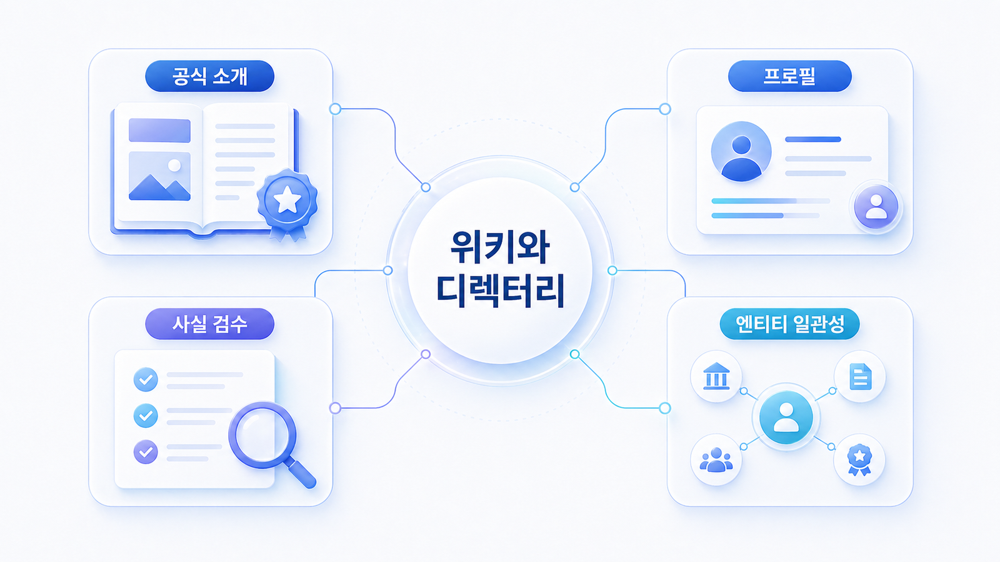

## 위키/디렉터리 엔티티 관리: 나무위키, 위키피디아, 프로필 사이트



위키/디렉터리 엔티티 관리는 브랜드를 홍보하는 작업이 아닙니다. AI 검색과 생성형 답변이 브랜드를 어떤 이름, 카테고리, 제품, 사람, 공식 링크와 연결해 이해하는지 정렬하는 작업입니다.

GEO에서 외부 사이트는 단순 백링크 채널이 아닙니다. 나무위키, 위키피디아, 위키데이터, 업계 디렉터리, 리뷰 프로필, 제품 소개 사이트는 브랜드의 기본 정보를 확인하는 외부 합의 신호가 될 수 있습니다. 그래서 이 페이지의 핵심 질문은 “어디에 우리 이름을 올릴까?”가 아니라 “AI가 우리 브랜드를 어떤 엔티티로 묶고 있는가?”입니다.

[TOC]

## 위키성 자료가 GEO에서 중요한 이유

AI는 브랜드를 하나의 URL만으로 이해하지 않습니다. 공식 홈페이지, 제품 페이지, 언론 기사, 위키성 자료, 리뷰 사이트, 커뮤니티, 파트너 페이지에 흩어진 설명을 함께 읽고 브랜드의 정체성을 추론합니다.

이때 위키성 자료와 디렉터리는 브랜드의 기본 좌표 역할을 합니다. 이름, 약칭, 창업자, 회사명, 제품명, 카테고리, 공식 사이트, 주요 기능, 경쟁 범주가 흔들리면 AI 답변도 흔들릴 수 있습니다.

| 항목 | 확인할 질문 | 관리 기준 |
|---|---|---|
| 이름 | 공식명/영문명/약칭이 일관적인가 | 자사 사이트와 외부 프로필의 표기를 맞춘다 |
| 카테고리 | 어떤 산업/제품군으로 분류되는가 | 주 카테고리와 보조 카테고리를 분리한다 |
| 핵심 설명 | 한 문장 정의가 같은 방향인가 | 홍보 문구보다 사실 중심 설명을 반복한다 |
| 공식 링크 | 홈페이지/문서/뉴스룸 링크가 맞는가 | 오래된 URL과 리디렉션 오류를 정리한다 |
| 인물/조직 | 창업자/대표/회사 정보가 최신인가 | 변경된 조직 정보와 과거 정보를 구분한다 |
| 출처 | 설명을 뒷받침할 공개 근거가 있는가 | 보도자료, 공식 문서, 신뢰 가능한 기사로 보강한다 |


## 공식 사이트에서 먼저 고정해야 하는 엔티티 필드

위키와 디렉터리를 보기 전에 공식 사이트가 기준점이 되어야 합니다. 외부 사이트의 설명을 아무리 고쳐도 공식 사이트의 회사 소개, 제품 페이지, 뉴스룸, 구조화 데이터가 서로 다르면 AI는 어느 설명을 기준으로 삼아야 할지 판단하기 어렵습니다.

Google Search Central의 [Organization 구조화 데이터 가이드](https://developers.google.com/search/docs/appearance/structured-data/organization)는 조직명, 로고, 공식 URL, 연락처, 소셜 프로필 같은 기본 정보를 명확히 제공하라고 설명합니다. schema.org의 [Organization 타입](https://schema.org/Organization)도 `name`, `url`, `logo`, `sameAs`, `founder`, `foundingDate`, `address`, `contactPoint` 같은 속성을 제공합니다. GEO 관점에서는 이 필드를 “검색엔진용 코드”가 아니라 외부 프로필과 맞춰야 할 엔티티 기준표로 봐야 합니다.

| 기준 필드 | 공식 사이트에서 정할 것 | 외부 사이트에서 맞출 것 |
|---|---|---|
| name | 공식 회사명/제품명 | 위키/디렉터리/리뷰 프로필의 표기 |
| alternateName | 약칭/한글명/영문명 | 독자가 쓰는 별칭과 혼동되는 이름 |
| url | 대표 도메인 | 오래된 랜딩 페이지나 리디렉션 URL 제거 |
| logo | 최신 로고 이미지 | 외부 프로필의 오래된 로고 교체 |
| sameAs | 공식 SNS/위키데이터/지식 패널 후보 | 동일 엔티티를 가리키는 외부 식별자 |
| founder/foundingDate | 창업자/설립일 | 인터뷰/기사/디렉터리의 기본 정보 |
| contactPoint | 대표 연락/지원 채널 | 고객지원/영업/언론 문의의 혼선 제거 |

Google의 [사이트 이름 가이드](https://developers.google.com/search/docs/appearance/site-names)도 사이트 이름을 판단할 때 웹사이트 콘텐츠, 구조화 데이터, `og:site_name` 등 여러 신호를 함께 본다고 설명합니다. 따라서 브랜드 표기는 제목 태그만 고치는 문제가 아니라 공식 사이트와 외부 출처의 반복 신호를 맞추는 문제입니다.

## AI가 위키/디렉터리에서 확인하는 합의 필드

위키/디렉터리 엔티티 관리는 “등록 여부”보다 “합의 필드의 정합성”이 중요합니다. AI가 브랜드를 한 문장으로 요약할 때 자주 필요한 필드는 대체로 반복됩니다.

| 합의 필드 | AI 답변에서 생기는 문제 | 점검 방법 |
|---|---|---|
| 브랜드 한 줄 정의 | 다른 카테고리 회사로 설명됨 | AI 답변/공식 소개/외부 프로필 첫 문단 비교 |
| 대표 제품/서비스 | 핵심 제품이 빠지거나 과거 제품만 나옴 | 제품 페이지와 디렉터리 목록 대조 |
| 산업/카테고리 | SEO 도구, 마케팅 도구, 분석 도구가 섞임 | 주 카테고리/보조 카테고리/사용 장면 분리 |
| 공식 링크 | 오래된 URL이 citation으로 노출됨 | 리디렉션, canonical, 사이트맵 확인 |
| 독립 출처 | 주장만 있고 검증 근거가 없음 | 언론/리포트/파트너 자료 연결 |
| 업데이트 시점 | 이전 가격/기능/조직 정보가 반복됨 | `dateModified`, 뉴스룸 업데이트, 외부 프로필 수정일 확인 |

HaloX의 [GEO 평판 관리와 브랜드 합의 신호](https://haloxlabs.ai/ko/blog/geo-reputation-brand-consensus) 관점으로 보면, 핵심은 외부 자료가 모두 같은 문장을 복사하는 것이 아닙니다. 서로 다른 출처가 브랜드의 이름, 카테고리, 문제 해결 방식, 신뢰 근거를 모순 없이 설명하는 상태를 만드는 것입니다.

## 나무위키/위키피디아/위키데이터를 다르게 봐야 한다

위키성 자료라고 해서 모두 같은 방식으로 다루면 안 됩니다. 나무위키는 국내 사용자 인식과 검색 노출에서 자주 보일 수 있고, 위키피디아와 위키데이터는 글로벌 엔티티 이해에서 더 중요할 수 있습니다. 업계 디렉터리와 제품 리뷰 사이트는 특정 카테고리 안에서 브랜드를 비교하는 근거가 됩니다.

| 채널 | GEO에서의 역할 | 주의할 점 |
|---|---|---|
| 나무위키 | 국내 사용자가 보는 요약/이슈/맥락 신호 | 홍보성 편집이나 논쟁적 서술 리스크를 조심한다 |
| 위키피디아 | 글로벌 기본 정보와 공신력 있는 출처 기반 설명 | 등재 기준과 독립 출처 요건을 지켜야 한다 |
| 위키데이터 | 이름/식별자/공식 링크/관계 정보의 구조화 | 사실 정보와 식별자 정확성이 중요하다 |
| 업계 디렉터리 | 카테고리/기능/대안군 분류 | 카테고리 오분류를 방치하지 않는다 |
| 리뷰 프로필 | 선택/비교 질문의 외부 근거 | 조작 리뷰나 과장된 설명은 장기 리스크가 된다 |
| 제품 소개 사이트 | 초기 사용자와 시장 반응 신호 | 포지셔닝 문장과 공식 설명을 맞춘다 |

## 위키를 홍보 채널로 쓰면 안 되는 이유

위키성 자료는 광고판이 아니라 외부 합의 신호입니다. 회사가 원하는 말을 그대로 넣는 곳이 아니라, 공개적으로 확인 가능한 사실을 정리하는 곳에 가깝습니다.

따라서 “우리 장점을 많이 넣자”보다 “틀린 분류, 오래된 정보, 부정확한 링크, 빠진 공식 근거를 줄이자”가 우선입니다. 특히 위키피디아처럼 독립 출처와 중립성이 중요한 채널에서는 직접 홍보 문장보다 언론 기사, 공식 발표, 산업 리포트처럼 검증 가능한 자료가 필요합니다.

## Wikipedia/Wikidata는 등재 기준과 이해상충을 먼저 봐야 한다

위키피디아와 위키데이터는 GEO에 유용할 수 있지만, 모든 브랜드가 바로 만들 수 있는 채널은 아닙니다. Wikipedia의 [조직/기업 등재 기준](https://en.wikipedia.org/wiki/Wikipedia:Notability_(organizations_and_companies))은 독립적이고 신뢰할 수 있는 2차 출처에서 조직이 유의미하게 다뤄져야 한다고 설명합니다. 자사 보도자료, 자기소개 페이지, 단순 프로필 등록만으로는 약합니다.

또한 Wikipedia의 [이해상충 가이드](https://en.wikipedia.org/wiki/Wikipedia:Conflict_of_interest)는 본인, 고용주, 고객, 관련 조직에 대한 직접 편집이 문제가 될 수 있음을 설명합니다. 기업이 위키를 마케팅 채널처럼 직접 편집하면 삭제, 되돌림, 평판 리스크가 생길 수 있습니다.

Wikidata도 [등재 기준](https://www.wikidata.org/wiki/Wikidata:Notability)과 [출처 도움말](https://www.wikidata.org/wiki/Help:Sources)을 갖고 있습니다. 설립일, 본사 위치, 창업자, 공식 웹사이트 같은 값은 출처와 함께 관리되어야 합니다. 값만 넣고 근거가 없으면 지식그래프 신호가 아니라 불안정한 데이터가 됩니다.

| 확인 항목 | 안전한 접근 | 위험한 접근 |
|---|---|---|
| 등재 가능성 | 독립 기사/리포트/공공 자료가 충분한지 확인 | 브랜드가 원한다고 문서 생성 |
| 편집 방식 | 토론 페이지와 근거 제시, 이해상충 공개 | 내부자가 홍보 문구 직접 삽입 |
| 출처 품질 | 편집 기준이 있는 독립 출처 사용 | 자사 블로그/보도자료만 반복 |
| 문장 톤 | 사실 중심, 중립적 설명 | “최고”, “혁신적”, “압도적” 같은 주장 |
| 유지 관리 | 변경된 사실을 근거와 함께 갱신 | 오래된 정보 방치 또는 과도한 삭제 |

## Knowledge Graph/지식 패널 관점에서 확인할 것

Google의 [Knowledge Graph Search API](https://developers.google.com/knowledge-graph)는 공개적으로 접근 가능한 엔티티 검색 API입니다. 브랜드명, 제품명, 대표자명이 지식그래프에서 어떤 타입과 설명으로 식별되는지 점검할 수 있습니다. Google의 [지식 패널 도움말](https://support.google.com/knowledgepanel/answer/9163198)은 지식 패널이 웹 전반의 정보와 Google의 이해를 바탕으로 자동 생성된다고 설명합니다.

실무에서는 다음을 확인합니다.

1. 브랜드명 검색 시 같은 이름의 다른 엔티티와 섞이지 않는가?
2. 조직, 제품, 인물, 장소 중 어떤 타입으로 이해되는가?
3. 지식 패널 또는 엔티티 설명에 오래된 정보가 있는가?
4. 공식 사이트와 외부 식별자가 같은 엔티티를 가리키는가?
5. `sameAs`로 연결한 외부 프로필이 실제 공식/신뢰 프로필인가?

이 점검은 “지식 패널을 만들자”가 아니라 “AI가 브랜드를 잘못된 엔티티와 섞지 않게 하자”에 가깝습니다.

## 위키/디렉터리 페이지를 citation-ready 자산으로 만드는 법

HaloX의 [AI에게 인용되는 콘텐츠 만드는 법](https://haloxlabs.ai/ko/blog/how-to-get-cited-by-ai)과 [GEO 콘텐츠 구조화 가이드](https://haloxlabs.ai/ko/blog/geo-content-structure)의 관점은 외부 프로필에도 적용됩니다. AI가 잘라서 답변에 넣어도 오해가 없는 문장과 구조가 필요합니다.

| 구성 요소 | 위키/디렉터리에서의 적용 |
|---|---|
| 첫 문단 정의 | 브랜드가 어떤 카테고리에서 어떤 문제를 해결하는지 사실 중심으로 설명 |
| 핵심 사실 표 | 설립, 본사, 대표 제품, 공식 링크, 주요 식별자 정리 |
| 독립 출처 | 언론, 리포트, 파트너 자료처럼 검증 가능한 근거 연결 |
| 공식 링크 | 홈페이지, 문서, 뉴스룸, 제품 페이지로 연결 |
| 업데이트 기준 | 변경된 제품명/조직/정책은 최신 기준으로 갱신 |
| 리스크 문장 | 과거 이슈나 오해 문장이 반복되는지 기록 |

## 가상의 점검 예시

B2B SaaS 브랜드가 AI 답변에서 “단순 SEO 순위 추적 도구”로 반복 설명된다고 가정해 봅니다. 실제 제품은 AI 검색 브랜드 가시성, source/citation 분석, 경쟁사 co-mention을 제공하지만 외부 디렉터리에는 과거 설명만 남아 있습니다.

이 경우 액션은 위키성 문서 작성이 아니라 다음 순서가 됩니다.

1. 공식 제품 페이지 첫 문단을 “AI 검색 브랜드 가시성 분석 플랫폼”으로 정리합니다.
2. Organization 구조화 데이터와 `sameAs` 외부 프로필을 정리합니다.
3. 오래된 디렉터리의 카테고리와 설명을 수정 요청합니다.
4. 언론/기고에서 “AI 검색 visibility/source/citation” 문맥을 보강합니다.
5. 한 달 뒤 같은 질문에서 AI가 여전히 SEO 순위 추적 도구로만 설명하는지 봅니다.

## 참고 링크 패키지

- HaloX: [GEO 평판 관리와 브랜드 합의 신호](https://haloxlabs.ai/ko/blog/geo-reputation-brand-consensus)
- HaloX: [AI에게 인용되는 콘텐츠 만드는 법](https://haloxlabs.ai/ko/blog/how-to-get-cited-by-ai)
- Google: [Organization 구조화 데이터](https://developers.google.com/search/docs/appearance/structured-data/organization)
- Google: [사이트 이름 가이드](https://developers.google.com/search/docs/appearance/site-names)
- schema.org: [Organization](https://schema.org/Organization)
- Wikipedia: [Notability for organizations and companies](https://en.wikipedia.org/wiki/Wikipedia:Notability_(organizations_and_companies))
- Wikipedia: [Conflict of interest](https://en.wikipedia.org/wiki/Wikipedia:Conflict_of_interest)
- Wikidata: [Notability](https://www.wikidata.org/wiki/Wikidata:Notability)

## 디렉터리 수정 우선순위를 정하는 법

모든 위키/디렉터리를 동시에 고치려고 하면 효율이 낮습니다. AI 답변에서 실제로 반복되는 source인지, 브랜드 정의에 영향을 주는지, 수정 가능성이 있는지를 기준으로 우선순위를 정합니다.

| 기준 | 높은 우선순위 | 낮은 우선순위 |
|---|---|---|
| AI 답변 반복성 | 여러 질문에서 source/citation으로 보임 | 거의 등장하지 않음 |
| 카테고리 영향 | 브랜드를 다른 업종으로 분류함 | 표현 차이만 있음 |
| 공식 URL 영향 | 오래된 URL이나 잘못된 canonical로 연결 | 보조 링크 오류 수준 |
| 수정 가능성 | 프로필 소유/수정 요청 가능 | 등재 기준상 수정 어려움 |
| 리스크 | 법적/신뢰 오해를 만들 수 있음 | 단순 문체 차이 |

AcmeGEO라면 먼저 `SEO 분석 도구`로 분류된 주요 디렉터리를 고치고, 그다음 뉴스룸과 About 페이지에서 같은 카테고리 문장을 반복합니다. 외부 프로필만 고치고 공식 사이트가 흔들리면 entity 합의 신호는 약해집니다.

## 실행 순서

1. 브랜드명, 제품명, 대표자명, 카테고리명을 기준으로 검색합니다.
2. AI 답변에서 반복되는 브랜드 정의와 외부 출처를 기록합니다.
3. 나무위키, 위키피디아, 위키데이터, 업계 디렉터리, 리뷰 프로필의 현재 설명을 비교합니다.
4. 공식 사이트의 한 줄 정의, 회사 소개, 제품 설명, 뉴스룸 팩트시트를 먼저 정리합니다.
5. 외부 프로필에서 틀린 정보, 오래된 링크, 카테고리 오분류를 수정 후보로 분리합니다.
6. 수정 가능한 곳은 직접 수정하거나 요청하고, 직접 수정하기 어려운 곳은 공식 근거와 PR 자료를 보강합니다.
7. 한 달 뒤 같은 질문셋으로 AI 답변의 브랜드 정의가 바뀌었는지 확인합니다.

## 실습 워크시트

| 입력 항목 | 작성 기준 |
|---|---|
| 엔티티명 | 회사명/제품명/대표 서비스명 |
| 현재 AI 설명 | ChatGPT/Perplexity/Google AI 답변의 한 문장 정의 |
| 공식 설명 | 홈페이지/회사 소개/제품 페이지의 기준 문장 |
| 외부 설명 | 위키/디렉터리/리뷰 프로필의 설명 |
| 불일치 | 카테고리, 기능, 링크, 인물, 시점 차이 |
| 보강 근거 | 보도자료, 공식 문서, 인터뷰, 팩트시트 |
| 다음 액션 | 수정 요청/프로필 갱신/공식 페이지 보강/재측정 |

## 정리 양식

```text
엔티티명 / 공식 표기 / 현재 AI 설명 / 위키성 자료 설명 / 디렉터리 분류 / 틀린 정보 / 보강 근거 / 수정 요청 대상 / 재측정 날짜
```

## 좋은 예와 나쁜 예

| 나쁜 예 | 좋은 예 |
|---|---|
| 위키에 장점과 홍보 문구를 많이 넣으려 한다 | 공식 사실, 카테고리, 출처, 링크를 정확히 맞춘다 |
| 자사 사이트 설명과 외부 프로필 설명이 다르다 | 모든 채널에서 같은 한 줄 정의를 반복한다 |
| 오래된 제품명과 현재 제품명을 섞어 둔다 | 과거 정보와 현재 정보를 구분해 설명한다 |
| 등재 기준을 무시하고 억지로 페이지를 만든다 | 먼저 독립 출처와 공식 팩트시트를 쌓는다 |

## 완료 기준

- 브랜드명/제품명/카테고리/공식 링크의 기준표가 있습니다.
- AI 답변의 현재 브랜드 정의를 원문으로 기록했습니다.
- 위키성 자료와 디렉터리의 불일치가 보입니다.
- 수정 요청, 공식 페이지 보강, PR 근거 확보가 분리되어 있습니다.
- 한 달 뒤 같은 질문으로 재측정할 기준이 있습니다.

## 흔한 질문

**Q. 나무위키나 위키피디아에 페이지를 만들면 GEO가 좋아지나요?**

그 자체가 목적은 아닙니다. 중요한 것은 위키성 자료가 브랜드를 정확한 카테고리와 사실로 설명하고, 그 설명을 뒷받침할 독립 출처와 공식 근거가 있는지입니다.

**Q. 위키성 자료를 직접 통제할 수 없으면 어떻게 하나요?**

직접 통제하려고 하면 위험합니다. 먼저 공식 팩트시트, 보도자료, 제품 설명, 신뢰 가능한 외부 기사처럼 참고 가능한 근거를 정리하고, 수정 가능한 프로필과 디렉터리부터 맞춥니다.

## 다음 흐름

위키/디렉터리에서 기본 엔티티 좌표를 맞췄다면 다음은 [05-07. 언론/PR 신뢰 신호 관리](https://wikidocs.net/346847)에서 외부 신뢰 근거를 설계합니다.
