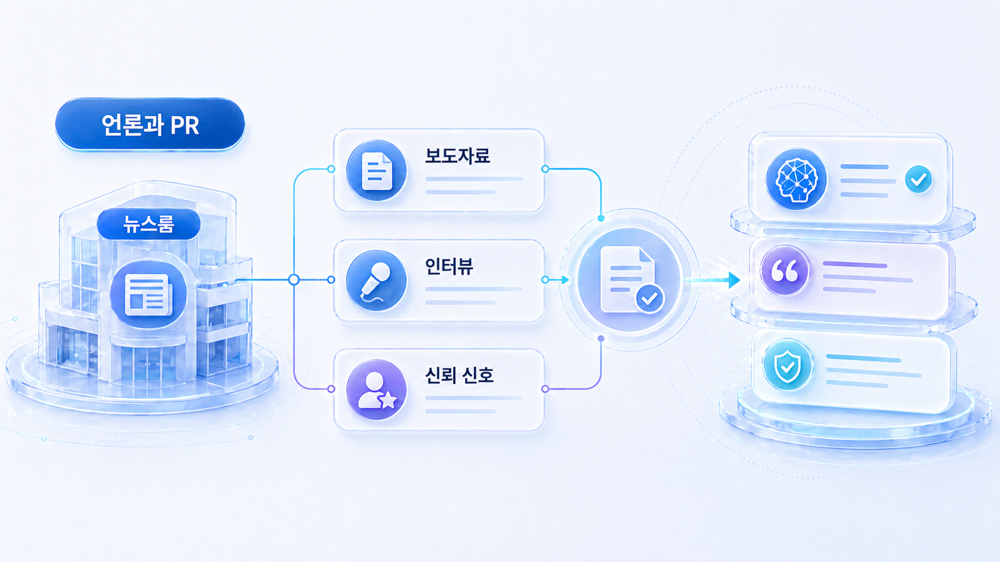
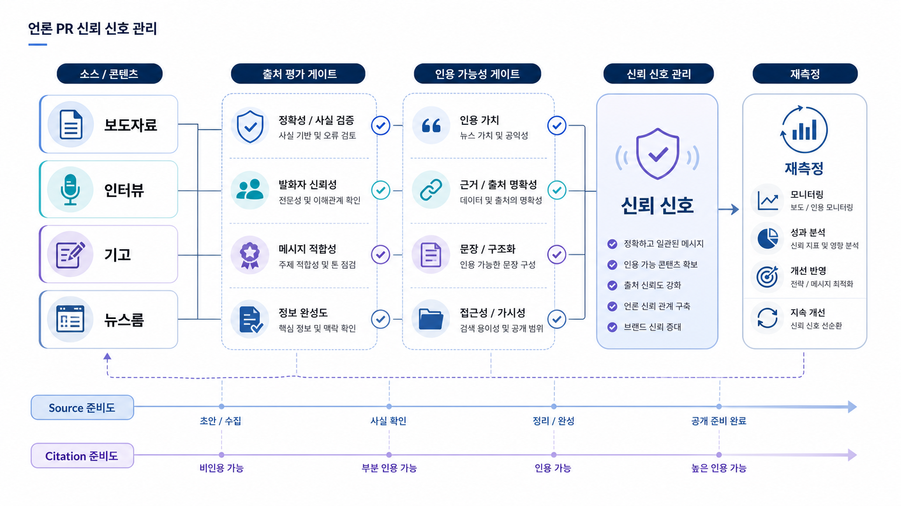

## GEO 언론/PR 신뢰 신호: 보도자료, 인터뷰, 뉴스룸



언론/PR 자산은 단기 노출만을 위한 자료가 아닙니다. GEO에서는 브랜드가 어떤 문제를 해결하는지, 어떤 근거로 신뢰할 수 있는지 보여주는 외부 신호가 됩니다.

하지만 보도자료를 많이 낸다고 source/citation 품질이 자동으로 좋아지지는 않습니다. AI 답변에 필요한 것은 “새 소식”만이 아니라 카테고리 설명, 대표 지표, 실제 사례, 공식 URL과 연결되는 신뢰 근거입니다.

[TOC]

## PR 자산은 역할별로 나눠야 한다

보도자료, 인터뷰, 기고, 뉴스룸은 서로 다른 역할을 합니다. 같은 문구를 반복하기보다 질문별 근거를 보강하도록 설계해야 합니다.

| 자산 | 강한 역할 | GEO에서 확인할 점 |
|---|---|---|
| 보도자료 | 출시, 기능, 투자, 파트너십 같은 사실 확인 | 공식 URL과 근거 문서가 연결되는가 |
| 인터뷰 | 문제의식, 전문성, 시장 해석 | 누가 왜 말할 자격이 있는가 |
| 기고 | 방법론과 관점 설명 | 독자가 실행 기준을 얻는가 |
| 뉴스룸 | 공식 업데이트와 사례 축적 | 오래 남을 citation 후보가 있는가 |
| 리포트/자료실 | 수치와 판단 근거 | AI 답변이 인용할 문장이 있는가 |

## HaloX 리포트와 PR을 연결하는 법

프롬프트 분석에서 검증형 질문을 먼저 봅니다. “이 브랜드를 믿을 수 있나”, “어떤 고객/사례가 있나”, “어떤 지표로 보고하나” 같은 질문은 PR/뉴스룸 신호가 영향을 주기 쉽습니다.

인용 추적에서는 언론 URL과 공식 뉴스룸 URL이 어떤 질문에서 잡히는지 분리합니다. 외부 기사만 잡히고 공식 자료실이 빠진다면, 보도자료보다 공식 근거 페이지의 구조를 먼저 봐야 합니다.

사이트 진단에서는 뉴스룸, 자료실, 리포트 예시 페이지의 sitemap, canonical, 메타, 내부 링크를 확인합니다. 좋은 PR 자산도 AI가 찾기 어려운 구조에 있으면 반복 citation으로 이어지기 어렵습니다.



*PR 자산은 언론 노출, 공식 뉴스룸, 리포트 예시, 재측정을 연결할 때 GEO 신호가 된다.*

## AcmeGEO 적용 예시

AcmeGEO가 신규 기능 보도자료를 냈지만, AI 답변은 기능명을 짧게 언급할 뿐 공식 리포트 예시를 citation으로 보여주지 않습니다. 보도자료는 있었지만, 그 기능이 어떤 질문의 어떤 문제를 해결하는지 연결된 공식 문서가 없었기 때문입니다.

이 경우 뉴스룸에는 출시 사실을 남기고, 제품/자료실에는 리포트 예시와 FAQ를 연결합니다. 인터뷰나 기고는 “왜 AI 검색 가시성을 측정해야 하는가”처럼 카테고리 질문을 보강하는 용도로 씁니다.

## 정리 양식

```text
검증형 질문:
현재 인용되는 언론/PR URL:
빠져 있는 공식 뉴스룸/자료실 URL:
보강할 보도자료/인터뷰/기고:
연결할 리포트 예시:
다음 주 확인할 citation 변화:
```

## 다음 흐름

공식/언론 신호만으로는 실제 사용 맥락을 모두 설명하기 어렵습니다. 이어서 [GEO 커뮤니티 신호](https://wikidocs.net/346848)에서 후기와 문제 해결 맥락을 다룹니다.
