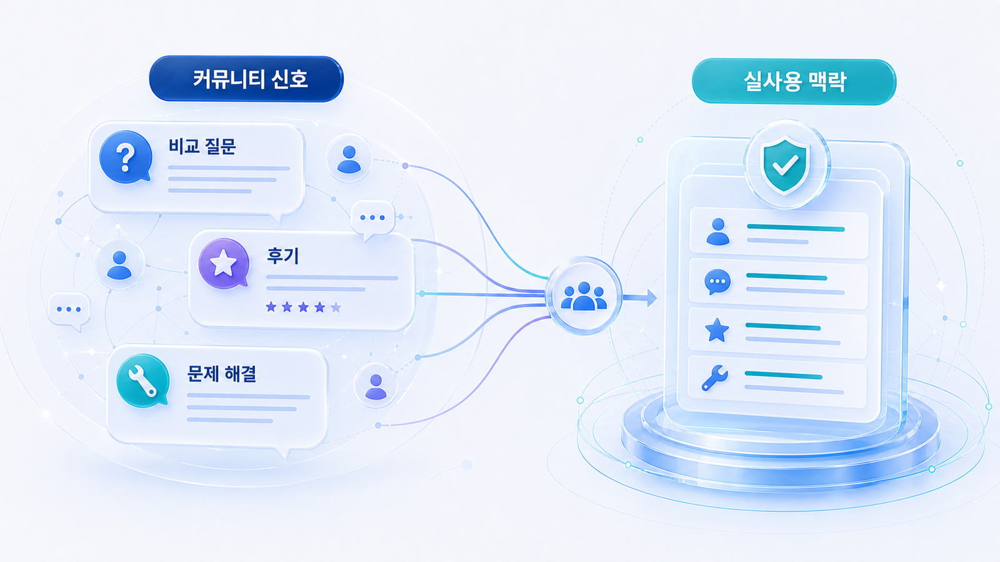
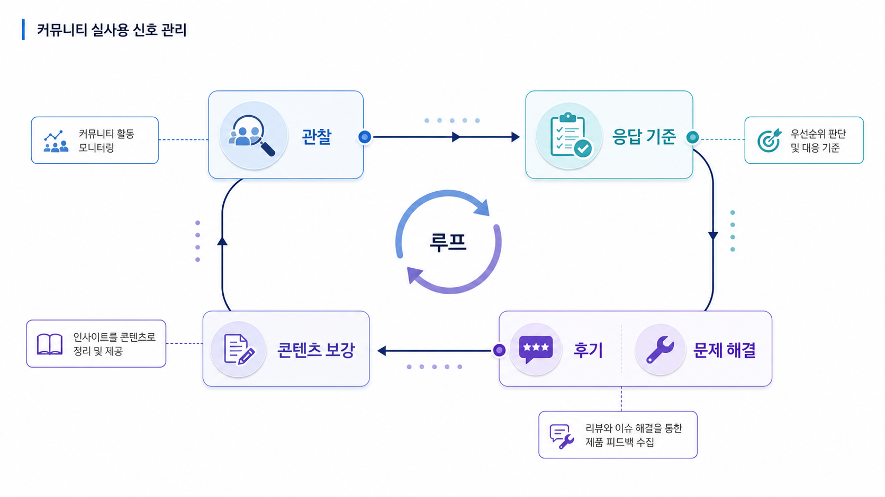

## Reddit/커뮤니티 실사용 신호 관리: 비교, 후기, 문제 해결 맥락



Reddit과 커뮤니티는 브랜드가 통제하기 어려운 공간입니다. 그래서 GEO에서는 홍보 채널이 아니라 실제 사용 맥락과 오해를 관찰하는 신호로 봐야 합니다.

AI 답변은 공식 설명만이 아니라 비교, 후기, 문제 해결 경험을 함께 참고할 수 있습니다. 커뮤니티에서 반복되는 질문과 불만은 콘텐츠와 제품 설명을 고치는 단서가 됩니다.

[TOC]

## 커뮤니티 신호를 나눠 읽는다

| 신호 | 의미 | 액션 |
|---|---|---|
| 비교 질문 | 대체재와 선택 기준이 헷갈림 | 비교 문서 보강 |
| 반복 불만 | 제품/가격/온보딩 설명이 부족함 | FAQ와 가이드 수정 |
| 사용 후기 | 실제 강점과 약점이 드러남 | 사례/리포트 문장 보강 |
| 오해 | 포지션이나 기능이 잘못 이해됨 | 공식 설명 정리 |

## 참여보다 관찰 기준이 먼저다

커뮤니티에 무리하게 개입하면 광고처럼 보일 수 있습니다. 먼저 관찰 기준을 세우고, 공개적으로 답해야 할 질문과 제품/콘텐츠로 되돌릴 질문을 나눕니다.

필요한 경우에는 투명하게 소속을 밝히고, 판매 문구보다 문제 해결 중심으로 답합니다.



*커뮤니티 신호는 통제 대상이 아니라 관찰, 응답, 콘텐츠 개선으로 이어지는 루프다.*

## 국내 커뮤니티와 Reddit을 다르게 본다

Reddit은 제품 비교와 실사용 토론이 강한 경우가 많고, 국내 커뮤니티는 업종별 맥락과 후기, 불만, 추천 질문이 다르게 나타납니다. 같은 기준표로 묶기보다 질문 유형과 플랫폼 문화를 함께 봅니다.

## 정리 양식

```text
관찰 커뮤니티:
반복 질문:
반복 불만/오해:
비교 대상:
공식 콘텐츠로 보강할 내용:
응답이 필요한 글:
재측정 질문:
```

## 다음 흐름

커뮤니티에서 얻은 질문과 오해는 [외부 블로그/신디케이터 전략](https://wikidocs.net/346849)에서 질문별 해설 콘텐츠로 확장할 수 있습니다.
