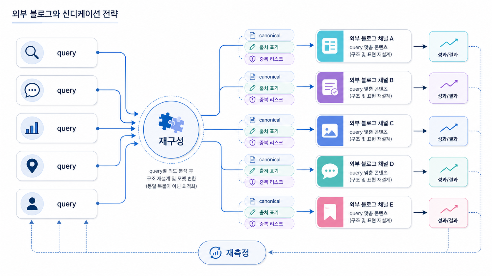

## GEO 외부 블로그/신디케이터 전략: 답변 근거 확장


외부 블로그와 신디케이션은 같은 글을 여러 곳에 복사하는 일이 아닙니다. GEO에서는 질문별로 다른 맥락을 가진 외부 답변 근거를 만드는 작업에 가깝습니다.

공식 사이트가 기준 문장을 잡는다면, 외부 블로그는 비교, 해설, 사례, 실행 맥락을 넓혀 줍니다.

[TOC]

## 복제가 아니라 질문별 재구성이다

같은 글을 그대로 배포하면 독자에게도 약하고 검색/AI 신호로도 약할 수 있습니다. 외부 글은 채널 독자와 질문 의도에 맞게 재구성해야 합니다.

| 질문 의도 | 외부 글 방향 |
|---|---|
| 정의형 | 용어와 오해 정리 |
| 비교형 | 선택 기준과 대안 비교 |
| 추천형 | 사용 상황별 후보군 설명 |
| 실행형 | 체크리스트와 운영 절차 |

## canonical과 출처 표기를 확인한다

외부 글을 운영할 때는 중복 리스크와 대표 URL을 함께 봅니다. 원문, 재발행 글, 요약 글, 파트너 글의 관계가 불분명하면 어떤 URL이 대표 근거인지 흐려질 수 있습니다.

대표성을 관리하려면 원문 URL, 출처 표기, 내부 링크, 업데이트 날짜를 일관되게 둡니다.



*외부 글은 같은 문장 복제가 아니라 질문별 근거를 분산해 쌓는 방식으로 설계한다.*

## 재측정 기준

외부 글을 발행한 뒤에는 링크 수가 아니라 질문군 변화를 봅니다. 비브랜드 추천형 질문에서 새로운 근거가 등장하는지, citation 후보 URL이 바뀌는지, 브랜드 설명이 더 정확해지는지 확인합니다.

## 정리 양식

```text
보강할 질문군:
공식 원문 URL:
외부 글 주제:
채널 독자:
반복할 핵심 기준:
출처/대표 URL 처리:
재측정 질문:
```

## 다음 흐름

외부 출처 운영을 월간 루프로 만들려면 [오프사이트 엔티티 운영표](https://wikidocs.net/346850)에서 30일 실행 흐름으로 정리합니다.
