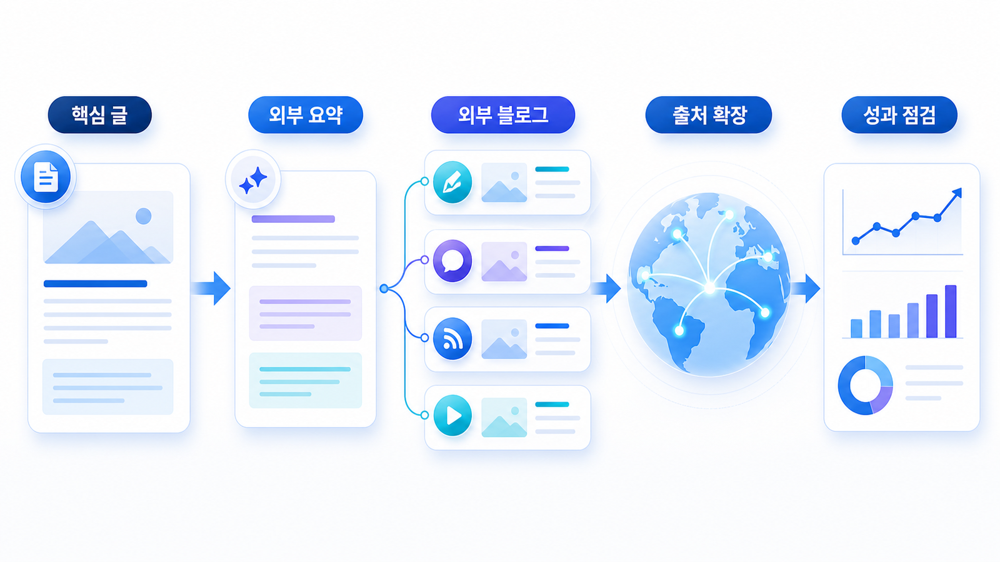

## GEO 외부 블로그/신디케이터 전략: 답변 근거 확장



외부 블로그와 신디케이션은 같은 글을 여러 곳에 복사하는 일이 아닙니다. GEO에서는 질문별로 다른 맥락을 가진 외부 답변 근거를 만드는 작업에 가깝습니다.

공식 사이트가 기준 문장을 잡는다면, 외부 블로그는 비교, 해설, 사례, 실행 맥락을 넓혀 줍니다. 다만 같은 글을 반복 배포하는 방식은 독자에게도 약하고 source 신호로도 약합니다. 채널 독자와 질문 의도에 맞게 다시 써야 합니다.

[TOC]

## 외부 글은 질문별로 재구성한다

외부 글은 공식 문서를 대체하면 안 됩니다. 공식 URL을 중심에 두고, 외부 글은 다른 독자 맥락에서 같은 기준을 설명해야 합니다. 예를 들어 공식 사이트가 GEO 리포트 기능을 설명한다면, 외부 글은 “고객 보고서에서 어떤 지표를 봐야 하는가”처럼 사용 장면을 풀어줄 수 있습니다.

| 질문 의도 | 외부 글 방향 | 연결할 공식 근거 |
|---|---|---|
| 정의형 | 용어와 오해 정리 | 용어사전/기본 가이드 |
| 비교형 | 선택 기준과 대안 비교 | 비교 페이지/리포트 예시 |
| 추천형 | 사용 상황별 후보군 설명 | 제품 소개/사례 |
| 실행형 | 체크리스트와 운영 절차 | 주간 리포트/콘텐츠 브리프 |
| 리스크형 | 주의할 표현과 한계 | FAQ/정책/공식 입장 |

## 리포트에서 먼저 확인할 기준

프롬프트 분석에서 빠지는 질문군을 고른 뒤, 그 질문에 공식 사이트가 답하고 있는지 먼저 봅니다. 공식 근거가 없는 상태에서 외부 글부터 늘리면 AI 답변은 외부 설명에 더 의존할 수 있습니다.

인용 추적에서는 외부 블로그가 어떤 질문에서 citation으로 잡히는지 봅니다. 외부 글이 공식 URL을 보강하는지, 아니면 오래된 표현으로 공식 설명과 충돌하는지 확인합니다.

사이트 진단은 공식 URL의 읽힘 상태를 확인하는 데 씁니다. 외부 글이 좋아도 공식 URL의 canonical, 메타, schema, 내부 링크가 약하면 최종 citation이 외부 글에만 머무를 수 있습니다.


*외부 블로그 전략은 같은 글을 복제하는 것이 아니라 질문 의도별 근거를 분기하는 작업이다.*

## 가상 기업 AcmeGEO 예시

AcmeGEO가 여러 외부 블로그에 같은 제품 소개 글을 배포했습니다. 하지만 AI 답변은 여전히 “SEO 순위 추적 도구”라고 설명합니다. 외부 글이 모두 같은 홍보 문장을 반복했고, GEO 리포트와 source/citation 차이를 설명하지 않았기 때문입니다.

수정 방향은 글 수를 늘리는 것이 아니라 역할을 나누는 것입니다. 한 글은 GEO/SEO 차이, 한 글은 리포트 예시, 한 글은 도구 비교, 한 글은 고객 보고 문장으로 나눕니다. 모든 글은 공식 리포트 예시와 기준 문장으로 연결합니다.

## 정리 양식

```text
우선 질문 의도:
공식 근거 URL:
외부 글 주제:
외부 글에서 설명할 사용 맥락:
피해야 할 반복 배포 문장:
연결할 공식 URL:
재측정 질문:
```

## 다음 흐름

외부 출처를 운영하려면 월간 점검표가 필요합니다. 이어서 [오프사이트 엔티티 30일 운영표](https://wikidocs.net/346850)에서 반복 운영으로 묶습니다.
