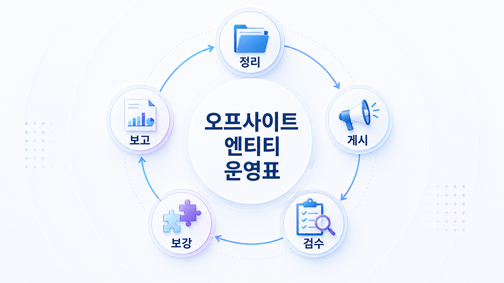
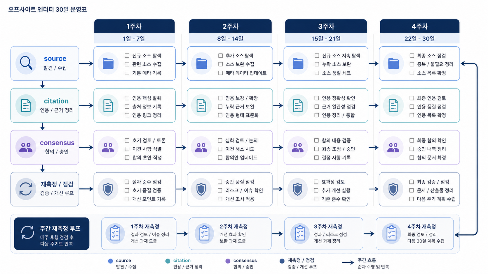

## 오프사이트 엔티티 30일 운영표



오프사이트 엔티티 운영은 한 번에 모든 채널을 정리하는 프로젝트가 아닙니다. 30일 단위로 질문, source, citation, 합의 신호를 점검하고 다음 액션을 정하는 반복 업무입니다.

이 페이지는 05장에서 다룬 source/citation, 엔티티, 오프사이트 출처, PR, 커뮤니티, 외부 블로그를 월간 운영표로 묶습니다. 목표는 채널 수를 늘리는 것이 아니라 AI 답변에서 브랜드가 더 정확한 근거로 설명되게 만드는 것입니다.

[TOC]

## 30일 운영은 기준선에서 시작한다

첫 주에는 고치기보다 현재 상태를 남깁니다. 질문셋, AI 답변 문장, mention/source/citation, 반복 URL, 리스크 문장을 같은 양식으로 기록해야 다음 달 변화가 보입니다.

| 주차 | 할 일 | 산출물 |
|---|---|---|
| 1주차 | 약한 질문군과 위험 문장 확인 | 질문/답변 진단표 |
| 2주차 | 공식 사이트와 엔티티 필드 정리 | 기준 문장과 수정 URL |
| 3주차 | 외부 출처/PR/커뮤니티 보강 | 채널별 액션 목록 |
| 4주차 | 같은 질문군 재측정 | 변화 리포트와 다음 과제 |

## HaloX 리포트로 운영표를 채운다

프롬프트 분석에서는 월간 고정 질문셋을 봅니다. 질문을 매번 바꾸면 개선인지 우연인지 알 수 없습니다.

인용 추적에서는 공식 도메인, 경쟁사, 외부 리뷰, 언론, 디렉터리의 citation 변화를 봅니다. 출처 가시성이 개선됐는지 보려면 도메인별 비중과 질문 유형을 함께 기록해야 합니다.

사이트 진단은 2주차 작업과 연결됩니다. 공식 URL이 citation 후보가 되려면 메타, canonical, robots, schema, 내부 링크가 안정적이어야 합니다. 4주차 리포트에서는 “어떤 URL을 고쳤고 어떤 질문에서 citation이 바뀌었는가”를 남깁니다.



*30일 운영표는 외부 채널 활동을 질문셋, citation, 공식 URL 수정, 재측정으로 묶는다.*

## AcmeGEO 월간 운영 예시

AcmeGEO는 “AI 검색 리포트 도구 추천” 질문에서 경쟁사 리뷰만 citation으로 잡힙니다. 1주차에는 질문과 반복 URL을 기록하고, 2주차에는 공식 리포트 예시와 About 문장을 고칩니다. 3주차에는 외부 블로그와 디렉터리 설명을 정리하고, 4주차에는 같은 질문으로 citation 변화를 확인합니다.

보고 문장은 “외부 글 5개 발행”이 아니라 “비브랜드 비교 질문 20개 중 공식 URL citation이 3개에서 7개로 늘었고, 오래된 외부 설명 2건을 수정 요청했다”처럼 남깁니다.

## 월간 운영 양식

```text
운영 월:
고정 질문셋:
가장 약한 질문군:
반복 source/citation URL:
공식 URL 수정 항목:
외부 출처 수정/보강 항목:
리스크 문장:
이번 달 변화:
다음 달 액션:
```

## 다음 흐름

오프사이트 신호를 정리한 뒤에는 공식 사이트가 AI와 검색엔진에게 안정적으로 읽히는지 확인해야 합니다. 이어서 [테크니컬 GEO와 사이트 구조](https://wikidocs.net/346334)로 넘어갑니다.
