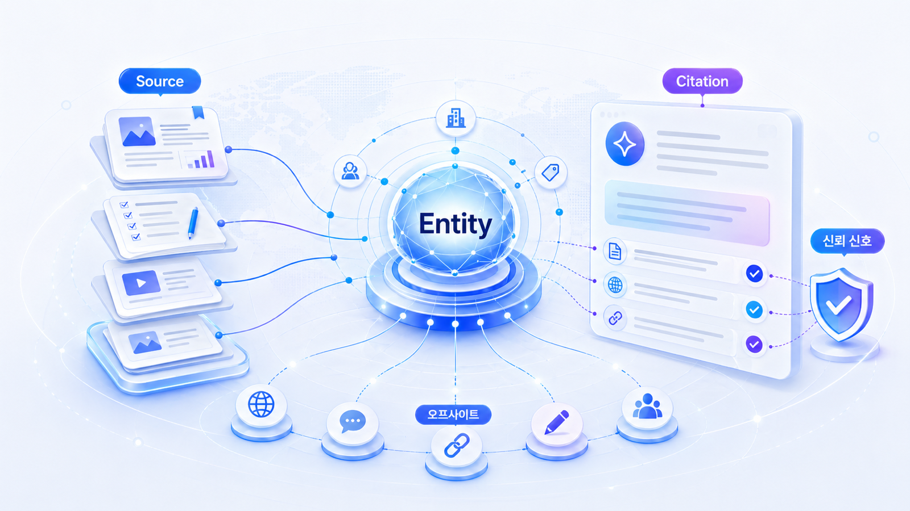

## 답변 근거/source, 화면 인용/citation, 엔터티 전략

GEO에서 출처 전략은 “백링크를 많이 만들자”가 아닙니다. AI가 답변을 만들 때 어떤 자료를 source로 참고하고, 사용자 화면에는 어떤 citation을 보여주며, 웹 전체에서 브랜드를 어떤 entity로 이해하는지를 설계하는 일입니다.

이 장은 4장에서 만든 AI 친화형 콘텐츠를 웹 전체의 신뢰 신호로 확장합니다. 자사 블로그, 뉴스룸, 제품 페이지, 언론, 리뷰, 커뮤니티, 디렉터리, 위키성 자료가 서로 다른 말을 하면 AI는 브랜드를 안정적으로 설명하기 어렵습니다. 반대로 여러 출처가 같은 카테고리와 문제 해결 맥락을 반복하면 AI 답변에서 브랜드의 위치가 더 또렷해집니다.

## 출처 설계 패키지

이 장의 흐름은 `답변 근거(source)와 화면 인용(citation)의 차이 → entity 합의 신호 → offsite 답변 근거 맵 → 채널별 source 전략 → 평판 리스크 관리 → 채널별 오프사이트 엔티티 운영`입니다. 먼저 내부 콘텐츠와 외부 출처를 분리하고, 이후 위키/디렉터리, 언론/PR, Reddit/커뮤니티, 외부 블로그/신디케이터 중 어떤 채널을 보강해야 AI 답변의 근거가 바뀌는지 정합니다.

| 단계 | 핵심 질문 | 연결되는 사례 |
|---|---|---|
| 답변 근거/화면 인용 | AI가 참고한 자료와 화면에 보이는 인용은 같은가 | 캠페인 URL 인용 추적, PR 리포트 |
| Entity | 웹 전체가 브랜드를 같은 카테고리로 설명하는가 | 엔터프라이즈 뉴스룸, 금융/규제 산업 |
| Offsite 답변 근거 맵 | 어떤 외부 채널이 질문별 근거가 되는가 | PR 에이전시, 로컬 병원/지점 |
| Channel strategy | 언론/위키/리뷰/커뮤니티/유튜브를 어떻게 나눌까 | 커머스/플랫폼, B2B SaaS |
| Reputation risk | AI가 오래된 이슈나 틀린 문장을 반복하는가 | 금융/규제 산업, 기업 뉴스룸 |
| Offsite entity operations | 위키/PR/커뮤니티/외부 블로그를 어떻게 운영할까 | 글로벌 GEO, 엔터프라이즈 뉴스룸 |

## 오프사이트 엔티티 전략의 판단 모델

오프사이트 엔티티 전략은 “외부 사이트에 우리 링크를 많이 만들자”가 아닙니다. AI가 브랜드를 이해하는 경로를 네 단계로 나누어 보는 일입니다.

| 단계 | 질문 | 대표 채널 | 실패하면 생기는 문제 |
|---|---|---|---|
| Identity | 우리는 어떤 이름/카테고리의 엔티티인가 | 공식 사이트, Organization schema, 위키데이터, 디렉터리 | 다른 회사/제품/카테고리와 섞임 |
| Evidence | 그 설명을 뒷받침할 독립 근거가 있는가 | 언론, 리포트, 인터뷰, 파트너 페이지 | 자사 주장처럼 보여 신뢰가 약함 |
| Usage context | 실제 사용자는 어떤 맥락에서 말하는가 | Reddit, 커뮤니티, 리뷰, Q&A | 추천/비교 답변에서 장단점이 빈약함 |
| Distribution | 같은 메시지가 다양한 질문 문맥에 배치되어 있는가 | 외부 블로그, 신디케이터, 업계 미디어 | 자사 블로그 밖에서는 근거가 부족함 |
| Operations | 매달 어떤 source/citation/consensus가 바뀌었는가 | HaloX 리포트, 월간 운영표 | 실행 없이 캡처와 감상으로 끝남 |

이 모델은 HaloX의 [GEO 평판 관리와 브랜드 합의 신호](https://haloxlabs.ai/ko/blog/geo-reputation-brand-consensus), [AI에게 인용되는 콘텐츠 만드는 법](https://haloxlabs.ai/ko/blog/how-to-get-cited-by-ai), [GEO 콘텐츠 구조화 가이드](https://haloxlabs.ai/ko/blog/geo-content-structure)와 연결됩니다. 외부 공식 근거로는 Google의 Organization/Article/Discussion forum 구조화 데이터, canonical 가이드, Wikipedia/Wikidata의 등재/출처/이해상충 기준을 함께 봅니다.

## 이 장에서 다루는 세부 페이지

- [05-01. 답변 근거(source)와 화면 인용(citation)은 무엇이 다른가](https://wikidocs.net/346350)
- [05-02. Entity와 브랜드 합의 신호를 만드는 법](https://wikidocs.net/346351)
- [05-03. 오프사이트 출처 후보 맵을 만드는 법](https://wikidocs.net/346352)
- [05-04. 채널별 답변 근거 전략표는 어떻게 만들까](https://wikidocs.net/346391)
- [05-05. 평판 리스크와 AI 답변 오해를 어떻게 줄일까](https://wikidocs.net/346392)
- [05-06. 위키/디렉터리 엔티티 관리: 나무위키, 위키피디아, 프로필 사이트](05-06-wiki-directory-entity-management.md)
- [05-07. 언론/PR 신뢰 신호 관리: 보도자료, 인터뷰, 기고, 뉴스룸](05-07-pr-media-trust-signal.md)
- [05-08. Reddit/커뮤니티 실사용 신호 관리: 비교, 후기, 문제 해결 맥락](05-08-reddit-community-usage-signal.md)
- [05-09. 외부 블로그/신디케이터 전략: 분산 콘텐츠로 답변 근거 넓히기](05-09-external-blog-syndication-strategy.md)
- [05-10. 오프사이트 엔티티 운영표: 30일 실행 체크리스트](05-10-offsite-entity-operations-checklist.md)

## 사례로 보는 출처 전략

PR 에이전시형 사례에서는 답변 근거(source)와 화면 인용(citation)을 분리한 1페이지 리포트가 핵심이 됩니다. “어디에 나왔습니다”가 아니라 “어떤 질문에서 어떤 출처가 답변 근거로 쓰였고, 어떤 출처는 화면 인용으로 보였는가”를 보여줘야 합니다.

엔터프라이즈 뉴스룸 사례에서는 출처 전략이 entity 전략으로 확장됩니다. 뉴스룸, 보도자료, 임원 소개, 제품 페이지, 외부 기사, 산업 리포트가 서로 다른 설명을 하면 AI 답변도 흔들립니다. 이때 필요한 것은 글 1개 추가가 아니라 브랜드 설명의 합의 신호를 맞추는 일입니다.

금융/규제 산업 사례에서는 평판 리스크가 중요합니다. 오래된 정책, 과거 이슈, 불완전한 외부 글이 AI 답변에 반복되면 citation 수가 많아도 좋은 상태가 아닙니다. 답변 근거/화면 인용/Entity는 노출 지표이면서 동시에 리스크 관리 지표입니다.

## HaloX 기능을 자연스럽게 붙이는 순서

출처 전략에서는 HaloX 기능을 다음 순서로 설명하면 좋습니다.

1. 질문셋별 답변 근거(source)와 화면 인용(citation)을 분리해 본다.
2. 반복 등장하는 출처를 답변 근거 맵으로 묶는다.
3. 브랜드 설명이 일관되는지 entity consistency를 본다.
4. 경쟁사와 함께 언급되는 co-mention 문맥을 확인한다.
5. 뉴스룸/언론/리뷰/커뮤니티/위키성 자료 중 어느 채널을 먼저 보강할지 정한다.
6. 외부 블로그/신디케이터와 파트너 페이지까지 포함해 오프사이트 엔티티 운영표를 만든다.
7. 30일 뒤 같은 질문셋으로 재측정한다.

이 흐름은 [02. AI 검색 모니터링: 브랜드 언급률, 답변 근거, 화면 인용 읽는 법](https://wikidocs.net/346342), [07. 산업별 GEO 전략](https://wikidocs.net/346335), [90. 산업별 GEO 케이스북](https://wikidocs.net/346381)과 함께 보면 더 잘 연결됩니다.

## 학습과 실무에서의 역할

| 사용 장면 | 이 장의 역할 | 산출물 |
|---|---|---|
| 실무 적용 | 답변 근거(source), 화면 인용(citation), 엔터티(entity) 차이를 사례로 이해 | 질문별 출처 진단표 |
| 실무 | 오프사이트와 PR 우선순위 결정 | 답변 근거 맵, 채널별 보강표 |
| 제품 설명 | HaloX 리포트를 실행 과제로 연결 | 답변 근거(source)/화면 인용(citation) map, entity consistency 리포트 |
| 책 | 산업별 출처 전략 실습 노트 | 채널표, 평판 리스크 체크리스트 |

## HaloX로 이어지는 지점

출처와 인용 전략은 HaloX의 [AI 인용을 얻는 방법](https://haloxlabs.ai/ko/blog/how-to-get-cited-by-ai)으로 이어집니다. 이 장이 답변 근거(source), 화면 인용(citation), 엔터티(entity)를 나누어 설명한다면, HaloX 글은 실제 인용 가능성을 높이는 실행 방향을 보완합니다. 출처 전략을 설계할 때는 크롤러가 실제로 링크를 발견할 수 있는지도 함께 봐야 합니다. Google의 [크롤 가능한 링크 가이드](https://developers.google.com/search/docs/crawling-indexing/links-crawlable)는 답변 근거(source)/화면 인용(citation) 후보 페이지를 점검할 때 기본 참고 자료로 쓸 수 있습니다.

## 다음 흐름

이 장은 앞선 [04. AI가 읽기 좋은 콘텐츠 구조](https://wikidocs.net/346332)의 흐름을 이어받습니다. 세부 페이지를 읽은 뒤에는 [06. 테크니컬 GEO와 사이트 구조](https://wikidocs.net/346334)로 넘어가 AI 크롤러가 실제로 콘텐츠와 출처를 읽을 수 있는지 점검합니다.
