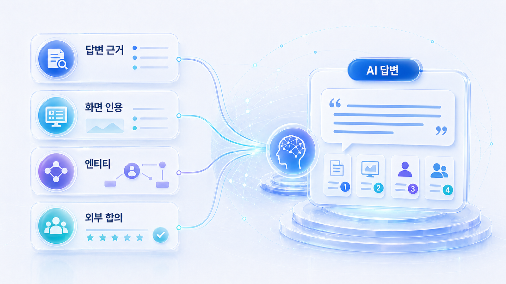
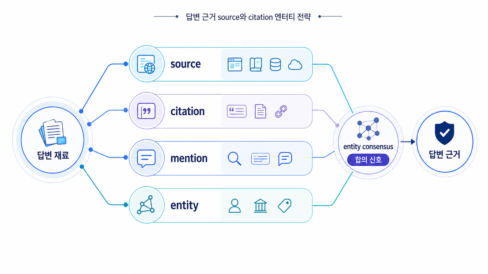

## 답변 근거/source, 화면 인용/citation, 엔티티 전략

GEO에서 출처 전략은 “백링크를 많이 만들자”가 아닙니다. 03장에서 AI가 질문을 여러 하위 판단으로 fan-out한다는 점을 봤고, 04장에서 그 하위 판단에 답하는 자사 콘텐츠 구조를 만들었습니다. 05장은 그 다음 질문을 다룹니다. `AI가 그 답변 재료를 실제 source로 믿을 수 있는가?`, `사용자 화면에는 어떤 citation으로 보이는가?`, `웹 전체에서는 브랜드를 어떤 entity로 이해하는가?`입니다.

이 장은 04장에서 만든 AI 친화형 콘텐츠를 웹 전체의 신뢰 신호로 확장합니다. 자사 블로그, 뉴스룸, 제품 페이지, 언론, 리뷰, 커뮤니티, 디렉터리, 위키성 자료가 서로 다른 말을 하면 AI는 브랜드를 안정적으로 설명하기 어렵습니다. 반대로 여러 출처가 같은 카테고리와 문제 해결 맥락을 반복하면 AI 답변에서 브랜드의 위치가 더 또렷해집니다.

[TOC]

## 04장에서 05장으로 넘어오는 이유

04장은 `owned content`, 즉 우리가 직접 고칠 수 있는 페이지의 구조를 다룹니다. 하지만 AI 답변은 자사 페이지 하나만 보고 만들어지지 않습니다. 특히 추천/비교/신뢰/리스크 질문에서는 외부 기사, 리뷰, 디렉터리, 커뮤니티, 파트너 페이지가 함께 등장합니다.

| 04장에서 만든 것 | 05장에서 검증할 것 | 실패 신호 |
|---|---|---|
| Answer-first 첫 문단 | 같은 설명이 외부 출처에서도 반복되는가 | AI가 브랜드를 다른 카테고리로 설명함 |
| 비교표/FAQ | 비교/추천 질문에서 source로 쓰일 수 있는가 | 경쟁사 source만 citation으로 보임 |
| schema 후보 | Organization/Article/FAQ 정보가 외부 프로필과 맞는가 | 이름/URL/대표 설명이 채널마다 다름 |
| 내부 링크 | 대표 source URL과 뉴스룸/팩트시트가 연결되는가 | AI가 오래된 글이나 복제본을 근거로 씀 |
| 재측정 질문 | source/citation/consensus가 바뀌는가 | 언급은 되지만 추천 이유나 인용 안정성이 약함 |

## 출처 설계 패키지

이 장의 흐름은 `답변 근거(source)와 화면 인용(citation)의 차이 → entity 합의 신호 → offsite 답변 근거 맵 → 채널별 source 전략 → 평판 리스크 관리 → 채널별 오프사이트 엔티티 운영`입니다. 먼저 내부 콘텐츠와 외부 출처를 분리하고, 이후 위키/디렉터리, 언론/PR, Reddit/커뮤니티, 외부 블로그/신디케이터 중 어떤 채널을 보강해야 AI 답변의 근거가 바뀌는지 정합니다.

| 단계 | 핵심 질문 | 연결되는 사례 |
|---|---|---|
| 답변 근거/화면 인용 | AI가 참고한 자료와 화면에 보이는 인용은 같은가 | 캠페인 URL 인용 추적, PR 리포트 |
| Entity | 웹 전체가 브랜드를 같은 카테고리로 설명하는가 | 엔터프라이즈 뉴스룸, 금융/규제 산업 |
| Offsite 답변 근거 맵 | 어떤 외부 채널이 질문별 근거가 되는가 | PR 에이전시, 로컬 병원/지점 |
| Channel strategy | 언론/위키/리뷰/커뮤니티/유튜브를 어떻게 나눌까 | 커머스/플랫폼, B2B SaaS |
| Reputation risk | AI가 오래된 이슈나 틀린 문장을 반복하는가 | 금융/규제 산업, 기업 뉴스룸 |
| Offsite entity operations | 위키/PR/커뮤니티/외부 블로그를 어떻게 운영할까 | 글로벌 GEO, 엔터프라이즈 뉴스룸 |

## E-E-A-T를 오프사이트 신호로 해석하기

E-E-A-T는 5장에서 추상적인 품질 구호가 아니라 외부 근거를 분류하는 기준으로 씁니다. Experience는 실제 사용 사례와 리뷰, Expertise는 전문 기고와 가이드, Authoritativeness는 언론/파트너/디렉터리의 반복 설명, Trustworthiness는 공식 팩트시트와 정책/FAQ의 일관성으로 확인합니다.

| E-E-A-T 요소 | 5장에서 볼 외부 신호 | 보강 자산 |
|---|---|---|
| Experience | 고객 사례, 리뷰, 커뮤니티 사용 맥락 | 사례 페이지, 후기 정책, 실사용 Q&A |
| Expertise | 전문 기고, 방법론 글, 기술 문서 | 가이드, 리포트, 웨비나/자료집 |
| Authoritativeness | 언론, 파트너, 디렉터리, 위키성 자료 | PR, 프로필 정리, source map |
| Trustworthiness | 공식 FAQ, 정책, 최신성, 정정 근거 | 뉴스룸 팩트시트, 변경 로그, 법무 검토 문장 |

## 오프사이트 엔티티 전략의 판단 모델

_source, citation, mention, entity를 한 장의 신호 레이어로 분리하면 05장의 역할이 더 선명해집니다._

오프사이트 엔티티 전략은 “외부 사이트에 우리 링크를 많이 만들자”가 아닙니다. AI가 브랜드를 이해하는 경로를 네 단계로 나누어 보는 일입니다.

| 단계 | 질문 | 대표 채널 | 실패하면 생기는 문제 |
|---|---|---|---|
| Identity | 우리는 어떤 이름/카테고리의 엔티티인가 | 공식 사이트, Organization schema, 위키데이터, 디렉터리 | 다른 회사/제품/카테고리와 섞임 |
| Evidence | 그 설명을 뒷받침할 독립 근거가 있는가 | 언론, 리포트, 인터뷰, 파트너 페이지 | 자사 주장처럼 보여 신뢰가 약함 |
| Usage context | 실제 사용자는 어떤 맥락에서 말하는가 | Reddit, 커뮤니티, 리뷰, Q&A | 추천/비교 답변에서 장단점이 빈약함 |
| Distribution | 같은 메시지가 다양한 질문 문맥에 배치되어 있는가 | 외부 블로그, 신디케이터, 업계 미디어 | 자사 블로그 밖에서는 근거가 부족함 |
| Operations | 매달 어떤 source/citation/consensus가 바뀌었는가 | HaloX 리포트, 월간 운영표 | 실행 없이 캡처와 감상으로 끝남 |

이 모델은 HaloX의 [GEO 평판 관리와 브랜드 합의 신호](https://haloxlabs.ai/ko/blog/geo-reputation-brand-consensus), [AI에게 인용되는 콘텐츠 만드는 법](https://haloxlabs.ai/ko/blog/how-to-get-cited-by-ai), [GEO 콘텐츠 구조화 가이드](https://haloxlabs.ai/ko/blog/geo-content-structure)와 연결됩니다. 외부 공식 근거로는 Google의 Organization/Article/Discussion forum 구조화 데이터, canonical 가이드, Wikipedia/Wikidata의 등재/출처/이해상충 기준을 함께 봅니다.

## 이 장에서 다루는 세부 페이지

- [05-01. 답변 근거(source)와 화면 인용(citation)은 무엇이 다른가](https://wikidocs.net/346350)
- [05-02. Entity와 브랜드 합의 신호를 만드는 법](https://wikidocs.net/346351)
- [05-03. 오프사이트 출처 후보 맵을 만드는 법](https://wikidocs.net/346352)
- [05-04. 채널별 답변 근거 전략표는 어떻게 만들까](https://wikidocs.net/346391)
- [05-05. 평판 리스크와 AI 답변 오해를 어떻게 줄일까](https://wikidocs.net/346392)
- [05-06. 위키/디렉터리 엔티티 관리: 나무위키, 위키피디아, 프로필 사이트](https://wikidocs.net/346846)
- [05-07. 언론/PR 신뢰 신호 관리: 보도자료, 인터뷰, 기고, 뉴스룸](https://wikidocs.net/346847)
- [05-08. Reddit/커뮤니티 실사용 신호 관리: 비교, 후기, 문제 해결 맥락](https://wikidocs.net/346848)
- [05-09. 외부 블로그/신디케이터 전략: 분산 콘텐츠로 답변 근거 넓히기](https://wikidocs.net/346849)
- [05-10. 오프사이트 엔티티 운영표: 30일 실행 체크리스트](https://wikidocs.net/346850)

## 2~4장 결과를 5장 출처 전략으로 바꾸는 법

5장은 외부 채널 운영 장이지만 출발점은 내부 측정 결과입니다. 2장에서 약한 source/citation 지표를 찾고, 3장에서 어떤 fan-out 노드가 비었는지 확인하고, 4장에서 자사 페이지를 citation-ready하게 만든 뒤, 5장에서 외부 source와 entity 합의 신호를 설계합니다.

| 이전 장의 신호 | 5장에서 할 일 | 대표 산출물 |
|---|---|---|
| mention 낮음 | 카테고리 설명과 외부 프로필을 보강 | entity 메시지 하우스 |
| source 약함 | 질문군별 외부 근거 후보를 찾음 | offsite source map |
| citation 약함 | 대표 URL과 외부 인용 경로를 정렬 | citation 후보 URL 목록 |
| answer quality 오류 | 오래된 설명과 리스크 문장을 정정 | 뉴스룸 FAQ/팩트시트 |
| 경쟁사 source 반복 | 경쟁사가 강한 채널을 분해 | 채널별 source 전략표 |
| 재측정 필요 | 같은 질문셋으로 변화 추적 | 30일 offsite 운영표 |

AcmeGEO가 추천형 질문에서 빠지는 이유가 `외부에서 GEO 리포트 도구로 설명되는 출처 부족`이라면, 5장의 액션은 링크 빌딩이 아닙니다. 공식 팩트시트, 디렉터리 프로필, 파트너 글, 비교 기고, 리포트 샘플을 같은 카테고리 문장으로 정렬하는 일입니다.

## 사례로 보는 출처 전략

PR 에이전시형 사례에서는 답변 근거(source)와 화면 인용(citation)을 분리한 1페이지 리포트가 핵심이 됩니다. “어디에 나왔습니다”가 아니라 “어떤 질문에서 어떤 출처가 답변 근거로 쓰였고, 어떤 출처는 화면 인용으로 보였는가”를 보여줘야 합니다.

엔터프라이즈 뉴스룸 사례에서는 출처 전략이 entity 전략으로 확장됩니다. 뉴스룸, 보도자료, 임원 소개, 제품 페이지, 외부 기사, 산업 리포트가 서로 다른 설명을 하면 AI 답변도 흔들립니다. 이때 필요한 것은 글 1개 추가가 아니라 브랜드 설명의 합의 신호를 맞추는 일입니다.

금융/규제 산업 사례에서는 평판 리스크가 중요합니다. 오래된 정책, 과거 이슈, 불완전한 외부 글이 AI 답변에 반복되면 citation 수가 많아도 좋은 상태가 아닙니다. 답변 근거/화면 인용/Entity는 노출 지표이면서 동시에 리스크 관리 지표입니다.

## HaloX 기능을 자연스럽게 붙이는 순서

출처 전략에서는 HaloX 기능을 다음 순서로 설명하면 좋습니다.

1. 질문셋별 답변 근거(source)와 화면 인용(citation)을 분리해 본다.
2. 반복 등장하는 출처를 답변 근거 맵으로 묶는다.
3. 브랜드 설명이 일관되는지 entity consistency를 본다.
4. 경쟁사와 함께 언급되는 co-mention 문맥을 확인한다.
5. 뉴스룸/언론/리뷰/커뮤니티/위키성 자료 중 어느 채널을 먼저 보강할지 정한다.
6. 외부 블로그/신디케이터와 파트너 페이지까지 포함해 오프사이트 엔티티 운영표를 만든다.
7. 30일 뒤 같은 질문셋으로 재측정한다.

이 흐름은 [02. AI 검색 모니터링: 브랜드 언급률, 답변 근거, 화면 인용 읽는 법](https://wikidocs.net/346342), [07. 산업별 GEO 전략](https://wikidocs.net/346335), [90. 산업별 GEO 케이스북](https://wikidocs.net/346381)과 함께 보면 더 잘 연결됩니다.

## 이 장을 읽고 남겨야 할 산출물

| 산출물 | 내용 | 다음 연결 |
|---|---|---|
| 질문별 source/citation 진단표 | 질문, 답변 문장, 답변 근거 후보, 화면 인용 URL, 누락 이유 | 05-01 |
| 엔티티 메시지 하우스 | 공식명, 한 줄 정의, 카테고리, 대표 기능, 쓰지 말아야 할 표현 | 05-02/05-06 |
| 오프사이트 source map | 언론, 리뷰, 커뮤니티, 디렉터리, 파트너 페이지별 역할과 우선순위 | 05-03/05-04 |
| 평판 리스크 목록 | 오래된 정보, 카테고리 오해, 이슈 편향, 위험 문장 | 05-05 |
| 30일 운영표 | 이번 달 보강할 채널, 담당, 완료 기준, 재측정 질문 | 05-10 |

## HaloX로 이어지는 지점

출처와 인용 전략은 HaloX의 [AI 인용을 얻는 방법](https://haloxlabs.ai/ko/blog/how-to-get-cited-by-ai)으로 이어집니다. 이 장이 답변 근거(source), 화면 인용(citation), 엔티티(entity)를 나누어 설명한다면, HaloX 글은 실제 인용 가능성을 높이는 실행 방향을 보완합니다. 출처 전략을 설계할 때는 크롤러가 실제로 링크를 발견할 수 있는지도 함께 봐야 합니다. Google의 [크롤 가능한 링크 가이드](https://developers.google.com/search/docs/crawling-indexing/links-crawlable)는 답변 근거(source)/화면 인용(citation) 후보 페이지를 점검할 때 기본 참고 자료로 쓸 수 있습니다.

## 다음 흐름

이 장은 앞선 [04. AI가 읽기 좋은 콘텐츠 구조](https://wikidocs.net/346332)의 흐름을 이어받습니다. 세부 페이지를 읽은 뒤에는 [06. 테크니컬 GEO와 사이트 구조](https://wikidocs.net/346334)로 넘어가 AI 크롤러가 실제로 콘텐츠와 출처를 읽을 수 있는지 점검합니다.
