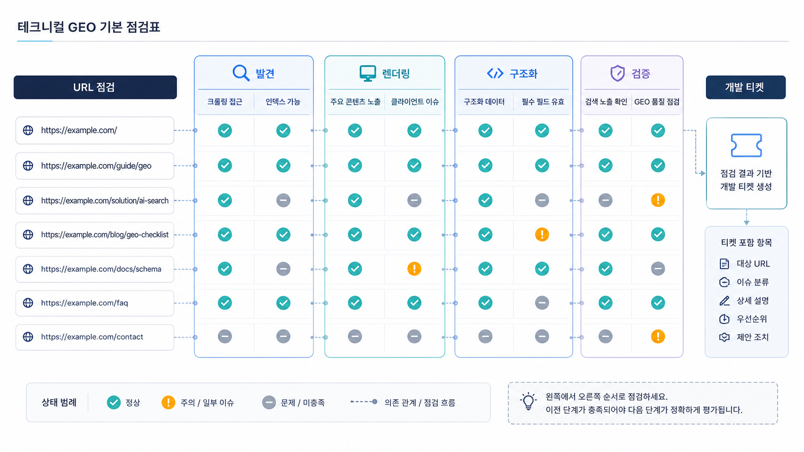

## 테크니컬 GEO 기본 점검표


테크니컬 GEO는 개발자가 보는 복잡한 기술 목록이 아닙니다. AI와 검색엔진이 핵심 페이지를 발견하고, 읽고, 해석하고, 답변 근거로 연결할 수 있는지 확인하는 작업입니다.

콘텐츠와 출처를 잘 만들어도 URL이 발견되지 않거나, 렌더링 뒤에야 본문이 보이거나, canonical과 sitemap이 엇갈리면 답변 근거(source)와 화면 인용(citation) 후보가 약해집니다.

[TOC]

## 네 층으로 본다

| 층 | 확인 질문 |
|---|---|
| 발견 | sitemap, 내부 링크, robots에서 핵심 URL을 찾을 수 있는가 |
| 읽기 | 초기 HTML 또는 렌더링 후 DOM에서 본문이 보이는가 |
| 해석 | title, heading, schema, 내부 링크가 같은 주제를 가리키는가 |
| 인용 | 질문에 대한 답과 근거가 URL 단위로 분명한가 |

이 네 층을 나누면 “기술 문제”라는 막연한 말이 실제 개발 티켓으로 바뀝니다.

## 먼저 볼 10분 점검

처음부터 모든 로그와 크롤링 데이터를 볼 필요는 없습니다. 핵심 URL 3~5개를 골라 아래 순서로 확인합니다.

1. URL이 sitemap에 들어 있는가
2. robots.txt가 핵심 경로를 막지 않는가
3. 페이지 첫 화면에 답변 문장이 보이는가
4. title/H1 또는 페이지 제목/H2가 질문과 맞는가
5. canonical이 자기 자신 또는 올바른 대표 URL을 가리키는가
6. 주요 내부 링크가 실제 href로 연결되는가
7. schema가 본문 정보와 충돌하지 않는가
8. 모바일/데스크톱에서 중요한 본문이 사라지지 않는가

## URL별 빠른 진단 예시

AcmeGEO의 리포트 예시 페이지가 citation 후보가 되지 않는다고 가정해 보겠습니다. 이때 “콘텐츠가 약하다”로 끝내지 말고 기술 조건을 같이 봅니다.

```text
URL: /ko/report-sample
문제 질문: AI 검색 브랜드 가시성 리포트 예시는?
sitemap: 있음
robots: 허용
초기 HTML: 핵심 리포트 설명이 없음
렌더링 후 DOM: 설명이 보임
canonical: /ko/report-sample
내부 링크: 제품 페이지에서 연결 약함
다음 액션: 핵심 설명을 초기 HTML에 포함하고 제품/가이드 페이지에서 내부 링크 연결
```



*기술 점검은 발견, 읽기, 해석, 인용 가능성을 나눠 보면 실행 과제가 분명해진다.*

## SEO 기술 점검과 GEO 기술 점검의 차이

SEO 기술 점검은 색인, 속도, 구조화 데이터, 모바일 사용성 같은 기본기를 봅니다. GEO 기술 점검은 그 위에 “AI가 답변 재료로 삼을 수 있는 URL인가”를 더 봅니다.

둘은 경쟁하지 않습니다. SEO 기본기가 약하면 GEO도 흔들립니다. 다만 GEO에서는 질문별 URL, 답변 문장, source/citation 연결까지 함께 읽어야 합니다.

## HaloX 사이트 진단과 연결하기

테크니컬 GEO는 개발 체크리스트가 아니라 “AI가 발견하고, 읽고, 해석하고, 인용할 수 있는가”를 확인하는 작업입니다. HaloX 기준으로는 `사이트 진단`에서 접근성/메타/schema/렌더링 이슈를 먼저 보고, `인용 추적`에서 실제 citation 후보 URL이 빠지는지 확인합니다.

| 점검 축 | 확인할 것 | 실행 티켓 예시 |
|---|---|---|
| 발견 | sitemap, robots, canonical, 상태 코드 | 핵심 URL 색인/접근성 점검 |
| 읽기 | 초기 HTML, 렌더링 후 DOM, 본문/표/FAQ 노출 | CSR 의존 구간 SSR/정적 본문 보강 |
| 해석 | title, meta, heading, schema, 내부 링크 | Organization/FAQ/Product schema 정리 |
| 인용 | citation 후보 URL의 대표성 | 중복 URL/리디렉션/canonical 정리 |

## 보고서에 남길 문장

```text
현재 문제는 콘텐츠 품질만의 문제가 아니라 AI와 검색엔진이 핵심 URL을 안정적으로 발견/해석하는 조건의 문제입니다. 사이트 진단 이슈를 먼저 닫은 뒤 같은 질문셋으로 citation 변화를 다시 봅니다.
```

## 정리 양식

```text
핵심 질문:
점검 URL:
sitemap 포함 여부:
robots 허용 여부:
초기 HTML 본문 확인:
렌더링 후 DOM 확인:
canonical:
내부 링크:
schema:
다음 개발/콘텐츠 액션:
```

## 다음 흐름

기본 점검 뒤에는 [CSR/SSR 렌더링은 GEO에서 왜 중요한가](https://wikidocs.net/346354)에서 실제 본문이 언제 보이는지 확인합니다.
